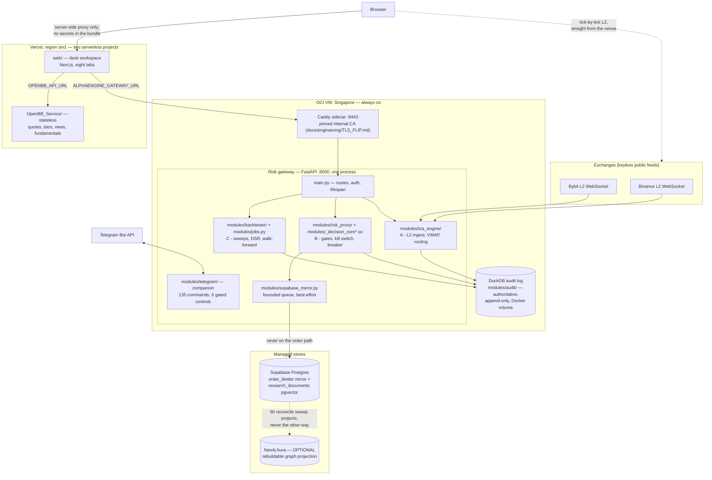
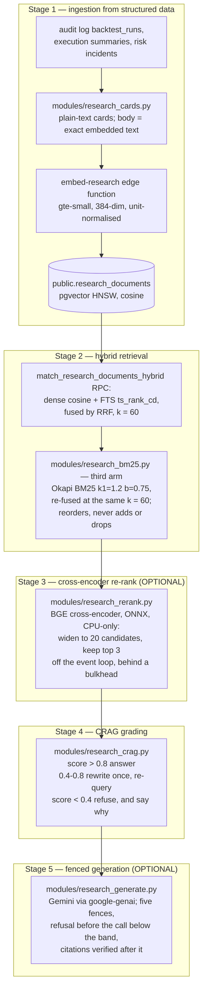

# AlphaEngine — system architecture

*As of 2026-08-22. Every figure here was read off the tree on that date, with the
file it came from named beside it. Where this document and
[`Part2_Infrastructure/README.md`](../../Part2_Infrastructure/README.md) disagree,
re-read the tree — both stamp their dates, and the tree is right.*

This is the map, not the territory: it says what the pieces are, where each one
runs, and why the seams sit where they do. The depth lives elsewhere and is
linked, not restated — the [feature tour](../product/FEATURE_TOUR.md) walks the product,
the [latency budget](LATENCY_BUDGET.md) defends every timing number, and the
README argues each module at length.

---

## The shape in one paragraph

Three independently deployable units share one append-only audit log. A stateful
FastAPI **risk gateway** on an always-on OCI VM (Singapore) owns everything that
must not be forked or forgotten: venue WebSocket subscriptions, the paper
position book, seventeen defined pre-trade gates (fifteen reachable by any
single order — README §4), the kill switch, and the DuckDB audit log on a Docker
volume. A serverless **Next.js desk workspace** on Vercel gives eight roles
eight tabs and holds no secrets in the browser bundle — its server-side proxy is
the only path to gateway credentials. A stateless **OpenBB research service**,
a second Vercel project, serves quotes, bars, news and fundamentals and can
scale without touching risk state. Supabase Postgres mirrors decisions and hosts
the research corpus; Neo4j, when present, is a rebuildable projection of graph
state Postgres already owns. A Telegram companion rides inside the gateway
process. Nothing optional is load-bearing: every absent credential degrades to a
named, reported state rather than a crash or a silent zero.

## Three deployment units, one audit log

Why three units and not one: the gateway needs a long-lived process because it
holds sockets and mutable risk state open; the workspace is serverless because a
research portal should scale to zero; the OpenBB service is separate so a slow
Yahoo fetch can never queue behind — or crash beside — the process deciding
orders. The full argument is README §“Three deployment units”. A fourth tracked
app, `developer-console/`, is experimental, deployed nowhere, and shares no code
or data with the three units — it is named so the tree and the docs agree.

The **audit log is the one shared truth**: DuckDB (SQLite fallback), append-only
by convention enforced in `modules/audit/` — nothing issues UPDATE or DELETE
against `orders`/`risk_events`, and the current session's paper book is rebuilt
by replaying accepted fills. Embedded on purpose: the desk must keep trading
when every network dependency is down. Everything downstream — the Supabase
mirror, the RAG corpus, the workspace's blotter — is a *view* of decisions this
log already recorded.

The web→gateway hop runs over the Caddy sidecar's pinned internal CA rather than
public PKI — a bare IP gets no public certificate, and one pinned client is a
stronger trust model than a public root for a single-client hop. Mechanics and
rollback: [`TLS_FLIP.md`](../engineering/TLS_FLIP.md).

## Three latency planes — never blended

The house rule ([`CLAUDE.md`](../../CLAUDE.md)) that most shapes how numbers are
presented: three planes, three units, and a figure never appears under another
plane's label. A tile that puts a nanosecond figure under a microsecond label is
the defect, not a rounding choice.

| Plane | Unit | What is timed | Where the figure lives |
|---|---|---|---|
| The whole risk decision | **µs** | tick → seventeen-gate verdict, under the lock | `RiskDecision.latency_ms`, the µs histogram, the header's DECISION P99 chip |
| The compiled core | **ns** | the C++ arithmetic battery alone (`native/decision_core/decision_core.cpp`) | timed inside the engine; the gateway self-measures it at startup on a synthetic two-venue book, so the figure exists before the first order |
| The network | **ms** | data age in, order transit out | the chip's title and the Reliability tab — never under the decision label |

The measured conclusion — ~12 µs decision, ~83 ns core on the dev Mac, ~70 ms
to the venue, compute at 0.02 % of the path — is argued end-to-end in
[`LATENCY_BUDGET.md`](LATENCY_BUDGET.md), which also keeps the two machines'
figures separate rather than merging them into one flattering number.

## The risk gateway, module by module

One process, one Uvicorn worker, **by design**: the gateway holds a mutable
consolidated book, a resting-order book, a token bucket and the kill switch. A
second worker would fork the book and localise the halt — the exact opposite of
what a kill switch is for.

`main.py` holds only what one file must: auth, lifespan, and the mounting of the
routers in `modules/api/` (`audit`, `data`, `meta`, `ml`, `research`, `risk`,
`tca`, `telegram`). The OpenAPI schema is a committed contract: **54 paths
carrying 56 operations** in `tools/openapi.json` (counted 2026-08-22), whose
SHA-256 the web build verifies at `prebuild` — two separately deployed units
asserting their contract before either ships.

The modules cluster into the three assessed capabilities plus their supports —
each argued in depth in README §3–§5, distilled here:

- **A · TCA** — `modules/tca_engine/`: venue L2 ingest, consolidated book
  state, VWAP/slippage, routing.
- **B · Risk** — `modules/risk_proxy/`: the gates, positions, resting book,
  drawdown breaker, kill switch, and the startup core self-measure.
  `modules/decision_core.py` selects the engine
  (`DECISION_CORE=auto|native|python`); the C++ core is held **bit-exact**
  against the Python reference by a twenty-scenario fixture
  (`web/tests/fixtures/gate-parity.json`) — tolerance is for the TypeScript
  side, not this one.
- **C · Research** — `modules/backtester/` (signals, engines, DSR/PSR,
  walk-forward), `modules/jobs.py` (in-process pool ⇄ Celery when `REDIS_URL`
  is set — same task callables either way), and the research plane described
  below.
- **Supports** — `modules/audit/` (the log), `modules/supabase_mirror.py` (the
  mirror), `modules/portfolio/`, `modules/quant_risk/`, the data-operations
  family (`data_ops_store.py`, `data_quality*.py`, `data_scheduler.py` — where
  their state lives is [`DATA_OPS_BACKEND.md`](DATA_OPS_BACKEND.md)),
  `modules/operations.py` and `modules/metrics/` for ops, and
  `modules/schemas.py` — one Pydantic contract shared by API, UI and bot.

The gateway's maths exists twice — Python as the reference, TypeScript for the
browser — because neither runtime can call the other; parity fixtures make a
one-sided formula change fail the other side's suite. The pre-trade arithmetic
exists a third time in C++. README §12 is the full parity argument.

Test truth, from `web/lib/test-counts.generated.ts` (generated 2026-08-21, the
only file allowed to carry these numbers): gateway **1,717 passed and exactly
one skipped** (the skip is the Postgres data-ops backend reporting no Supabase
credentials — expected; a *second* skip means the venv is the wrong Python, per
CLAUDE.md), web **3,883 tests across 838 suites**, service **14**.

## The desk workspace — eight tabs

One client workspace, eight role tabs, every subtab URL-addressable. The tab
order is the decision loop itself, and the [feature tour](../product/FEATURE_TOUR.md)
walks it tab by tab — 47 rail sections pinned to `web/lib/sections.ts` by
`tour-truth.test.ts`, so the tour cannot drift from the app silently. Ids are
deep links and never change, which is why three ids disagree with their labels.

| Tab | View id (`WorkspaceHeader.tsx`) | Role | The question it answers |
|---|---|---|---|
| Overview | `overview` | all roles | what is the state of the whole desk, now? |
| Research | `research` | quant researcher | is this strategy evidence, or noise that survived a search? |
| Execution | `live` | trader | can I send this, and what will it cost? |
| Portfolio | `portfolio` | PM | where am I exposed, and which limit binds first? |
| Risk | `risk` | risk manager | is the model right, and will the limits hold? |
| Data | `data` | data engineer | can I trust this data? |
| Reliability | `reliability` | SRE | is it healthy, and what do I do at 3am? |
| Developer | `developer` | quant developer | can I change this safely? |

The workspace ships on Next, React, `lucide-react`, `@supabase/supabase-js` and
`oracledb` — **no other npm dependencies**, enforced by test. Charts are
hand-rolled SVG; a chart library was the rejected alternative because it would
change the argument the project makes about itself. The other house rules that
shape every tab — null never coerced to zero, no colour-only meaning, empty
results reported rather than hidden — are in [`CLAUDE.md`](../../CLAUDE.md) and
enforced by the suites it names.

## Where Supabase and Neo4j sit

**Supabase is two things, neither authoritative.** First, the durable
**mirror**: every gateway decision streams into `public.order_blotter` through
`modules/supabase_mirror.py` — a bounded queue whose `enqueue` is `put_nowait`,
so it cannot block, cannot raise past its own frame, and on a full queue
*counts the drop* rather than waiting. A mirror that can slow an order down has
become load-bearing; this one is structurally incapable of it. Second, the
**RAG corpus**: `public.research_documents` under a 384-dim pgvector HNSW
cosine index, written through the same bounded-queue discipline. RLS is
deny-by-default, tables are append-only by trigger; the 32 ordered migrations
live in [`supabase/migrations/`](../../supabase/migrations/). With no
`SUPABASE_URL`/`SUPABASE_SERVICE_ROLE_KEY` configured every mirror method is a
no-op and every RAG route returns a typed `unavailable` — which is what keeps
the whole suite green with zero environment.

**Neo4j is a projection, never a second write path.** Postgres owns
`research_edges`; `modules/research_graph_projection.py` MERGEs that derived
state into Neo4j on a six-hourly sweep, and a daily sweep partitions the whole
corpus (Louvain, seeded) and writes community labels back, stamped with the
sweep that made them (`modules/research_schedule.py`,
`DEFAULT_RECONCILE_SCHEDULES`). A dual write was the rejected alternative: two
systems that must agree, with drift only detectable if somebody goes looking.
Projection makes divergence a non-event — if the graph is wrong, drop it and
re-project. Neo4j earns its place only for graph-algorithm workloads
(community detection, PageRank); depth-bounded traversal stays on a Postgres
recursive CTE (`modules/research_graph.py` — "without a graph database", per
its own docstring). **Absent** — unset `NEO4J_URI`, or the optional
`requirements-graph.txt` driver not installed — is the normal deployment: the
sweep reports a named reason, never an exception, and the whole test suite
passes without it.

## The research (RAG) pipeline — five stages as built

Semantic recall over what the desk already records: no new instrumentation, no
paid embedding API, and nothing generated presented as measured. Retrieval
triggers on a precisely-defined execution anomaly — a fill whose *realised*
slippage exceeds the pre-trade ceiling, a rejection citing slippage or
drawdown, the breaker engaging — not on vibes, not on every order.

Stage by stage, with what each refuses to do:

1. **Ingestion** (`modules/research_rag/writer.py`, cards from
   `modules/research_cards.py`): renders documents from structure the desk
   already records — completed backtests with DSR/PBO/`data_hash`, session
   execution summaries, risk incidents, and one document per chart described
   from the figures that drew it. `body` stores the exact embedded text, so a
   renderer change can never silently invalidate stored vectors. An embed
   outage stores `embedding_status='pending'` — **never a zero vector**, which
   is equidistant from everything and would rank as "similar" to any query.
2. **Hybrid retrieval** (`modules/research_rag/retrieval.py`): the
   `match_research_documents_hybrid` RPC fuses the dense arm and the Postgres FTS arm by
   Reciprocal Rank Fusion at `k = 60`
   (`supabase/migrations/20260810090000_hybrid_research_search.sql`); the BM25
   arm re-scores only the survivors and re-fuses at the same k, because a third
   arm joining on a different constant is a second fusion wearing the first
   one's name. BM25 replaces neither arm: dropping FTS would discard the GIN
   index that finds candidates at all.
3. **Re-rank** — *optional*: with `RERANK_MODEL_PATH` set, retrieval widens to
   20 candidates (`RERANK_CANDIDATES`) and the cross-encoder keeps the top 3.
   It runs through `asyncio.to_thread` behind a two-slot bulkhead
   (`modules/research_stages.py`) because this event loop also serves pre-trade
   risk, whose budget is microseconds.
4. **CRAG grading** (`modules/research_crag.py`, `ANSWER_BAND = 0.8`,
   `REFUSE_BAND = 0.4`): deterministic arithmetic over signals already in the
   retrieval row — not an LLM, which would make the grade a function of a model
   version. The rewrite is bounded to one retry *structurally* — straight-line
   code with one `if`, not a loop a third attempt could creep into.
5. **Generation** — *optional*: below the refuse band the model is never
   called; the context is closed to the supplied documents; figures are quoted,
   never computed; a citation not in the context refuses the whole answer; the
   call is wall-clock- and token-bounded. `corpus_silent` is a correct verdict,
   not an error. Every model call actually spent lands in the
   `research_generation` ledger, gated on `model_called` — a refusal that
   fired after the call still spent the money and still gets its row.

**Which stages are optional, and what absence looks like** — absence is a
state, not a failure, and each one names itself:

| Stage | Needs | When absent |
|---|---|---|
| 1 · Ingestion | `SUPABASE_URL` + service-role key | every write is a no-op; search returns typed `unavailable`, never `[]` — "could not search" and "found nothing" are different facts |
| 2 · Dense + FTS | the same Supabase | as above — one switch for the whole corpus |
| 2 · BM25 arm | nothing (in-tree, pure Python) | not optional; but when it cannot discriminate, the two-arm order stands unchanged and the report names the reason — declining is not failing |
| 3 · Re-rank | `RERANK_MODEL_PATH` + `requirements-rerank.txt` | RRF order passes through untouched, retrieval stays at 3 candidates, `rerank_state` says why |
| 4 · CRAG | nothing | always on — it is the policy over retrieval, not an extra |
| 5 · Generation | `GEMINI_API_KEY` + `requirements-genai.txt` | every answer reports `verdict: refused` with the reason; the desk runs exactly as before |

## The Telegram companion

Optional, and inside the gateway process — not a fourth deployment unit. It is
a phone-first read surface over the same read models the API serves: **135
registered commands** (`modules/telegram/registry.py`), of which exactly **6**
are in the Controls category — `/halt`, `/resume`, `/flatten`, `/reduceonly`,
`/resetbook`, `/replay` — each requiring membership of
`TELEGRAM_CONTROL_USER_IDS`, an allow-list separate from the read allow-list
and empty by default. The bootstrap fails closed: with no allow-list only the
identity commands answer. It cannot open a position; sixteen chart generators
(`modules/telegram_charts/`) draw what they were handed or return `None`, never
a placeholder captioned as data. The command tables in README §6 are generated
from the registry by `tools/telegram_catalogue.py` — never edited by hand — so
the counts above cannot drift from what the bot dispatches without a red check.

## Not built, and said plainly

- **Multimodal generation is NOT BUILT.** No image is embedded and there is no
  vision model anywhere in the research path: a chart document is retrievable
  by the text describing the figures that drew it, because the Edge runtime's
  embedding session takes no image.
- **Nothing reads Neo4j to answer a request today.** The projection exists for
  the community/centrality reports; the per-document traversal route runs on
  Postgres. Moving the read path is the deliberate stopping point, not an
  oversight.
- **Real order routing is NOT BUILT.** Orders are paper, capped by the
  gateway's own gates; README §9 ("What is deliberately missing") carries the
  full honesty ledger, including what is mocked versus implemented.
- **`developer-console/` is not deployed** and is not part of the assessed
  deliverable.

## Where to read next

| Question | Document |
|---|---|
| What does each tab actually show? | [`docs/product/FEATURE_TOUR.md`](../product/FEATURE_TOUR.md) |
| Why is the decision µs and the core ns? | [`docs/architecture/LATENCY_BUDGET.md`](LATENCY_BUDGET.md) |
| Where does data-ops state live? | [`docs/architecture/DATA_OPS_BACKEND.md`](DATA_OPS_BACKEND.md) |
| How does the TLS hop work? | [`docs/engineering/TLS_FLIP.md`](../engineering/TLS_FLIP.md) |
| Everything, at length | [`Part2_Infrastructure/README.md`](../../Part2_Infrastructure/README.md) |
| What agents get wrong | [`CLAUDE.md`](../../CLAUDE.md) |
| The workspace in detail | [`Part2_Infrastructure/web/README.md`](../../Part2_Infrastructure/web/README.md) |
| The stateless service | [`Part2_Infrastructure/OpenBB_Service/README.md`](../../Part2_Infrastructure/OpenBB_Service/README.md) |
