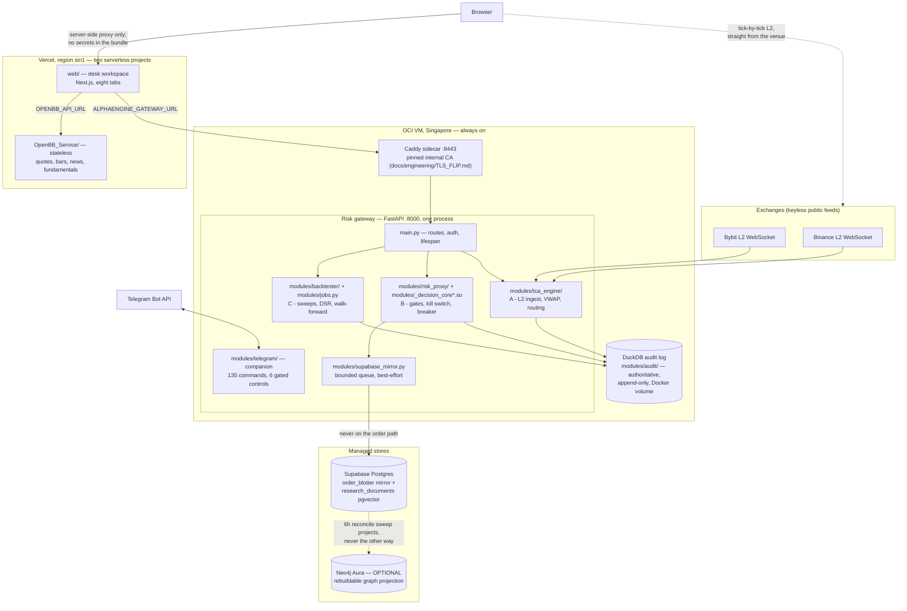
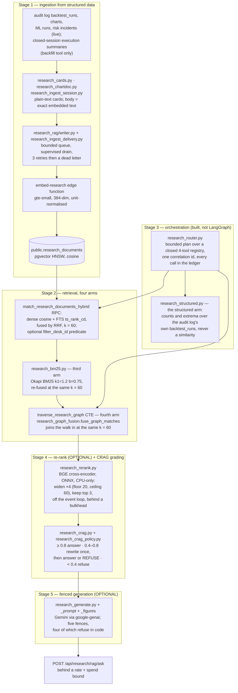

# AlphaEngine — system architecture

*As of 2026-08-22. Every figure here was read off the tree on that date, with the
file it came from named beside it. Where this document and
[`Part2_Infrastructure/README.md`](../../Part2_Infrastructure/README.md) disagree,
re-read the tree — both stamp their dates, and the tree is right.*

This is the map, not the territory: it says what the pieces are, where each one
runs, and why the seams sit where they do. The depth lives elsewhere and is
linked, not restated — the [feature tour](../product/FEATURE_TOUR.md) walks the product,
the [latency budget](LATENCY_BUDGET.md) defends every timing number, and the
README argues each module at length.

---

## The shape in one paragraph

Three independently deployable units share one append-only audit log. A stateful
FastAPI **risk gateway** on an always-on OCI VM (Singapore) owns everything that
must not be forked or forgotten: venue WebSocket subscriptions, the paper
position book, seventeen defined pre-trade gates (fifteen reachable by any
single order — README §4), the kill switch, and the DuckDB audit log on a Docker
volume. A serverless **Next.js desk workspace** on Vercel gives eight roles
eight tabs and holds no secrets in the browser bundle — its server-side proxy is
the only path to gateway credentials. A stateless **OpenBB research service**,
a second Vercel project, serves quotes, bars, news and fundamentals and can
scale without touching risk state. Supabase Postgres mirrors decisions and hosts
the research corpus; Neo4j, when present, is a rebuildable projection of graph
state Postgres already owns. A Telegram companion rides inside the gateway
process. Nothing optional is load-bearing: every absent credential degrades to a
named, reported state rather than a crash or a silent zero.

## Three deployment units, one audit log

Why three units and not one: the gateway needs a long-lived process because it
holds sockets and mutable risk state open; the workspace is serverless because a
research portal should scale to zero; the OpenBB service is separate so a slow
Yahoo fetch can never queue behind — or crash beside — the process deciding
orders. The full argument is README §“Three deployment units”. A fourth tracked
app, `developer-console/`, is experimental, deployed nowhere, and shares no code
or data with the three units — it is named so the tree and the docs agree.

The **audit log is the one shared truth**: DuckDB (SQLite fallback), append-only
by convention enforced in `modules/audit/` — nothing issues UPDATE or DELETE
against `orders`/`risk_events`, and the current session's paper book is rebuilt
by replaying accepted fills. Embedded on purpose: the desk must keep trading
when every network dependency is down. Everything downstream — the Supabase
mirror, the RAG corpus, the workspace's blotter — is a *view* of decisions this
log already recorded.

The web→gateway hop runs over the Caddy sidecar's pinned internal CA rather than
public PKI — a bare IP gets no public certificate, and one pinned client is a
stronger trust model than a public root for a single-client hop. Mechanics and
rollback: [`TLS_FLIP.md`](../engineering/TLS_FLIP.md).

## Three latency planes — never blended

The house rule ([`CLAUDE.md`](../../CLAUDE.md)) that most shapes how numbers are
presented: three planes, three units, and a figure never appears under another
plane's label. A tile that puts a nanosecond figure under a microsecond label is
the defect, not a rounding choice.

| Plane | Unit | What is timed | Where the figure lives |
|---|---|---|---|
| The whole risk decision | **µs** | tick → seventeen-gate verdict, under the lock | `RiskDecision.latency_ms`, the µs histogram, the header's DECISION P99 chip |
| The compiled core | **ns** | the C++ arithmetic battery alone (`native/decision_core/decision_core.cpp`) | timed inside the engine; the gateway self-measures it at startup on a synthetic two-venue book, so the figure exists before the first order |
| The network | **ms** | data age in, order transit out | the chip's title and the Reliability tab — never under the decision label |

The measured conclusion — ~12 µs decision, ~83 ns core on the dev Mac, ~70 ms
to the venue, compute at 0.02 % of the path — is argued end-to-end in
[`LATENCY_BUDGET.md`](LATENCY_BUDGET.md), which also keeps the two machines'
figures separate rather than merging them into one flattering number.

## The risk gateway, module by module

One process, one Uvicorn worker, **by design**: the gateway holds a mutable
consolidated book, a resting-order book, a token bucket and the kill switch. A
second worker would fork the book and localise the halt — the exact opposite of
what a kill switch is for.

`main.py` holds only what one file must: auth, lifespan, and the mounting of the
routers in `modules/api/` (`audit`, `data`, `meta`, `ml`, `research`, `risk`,
`tca`, `telegram`). The OpenAPI schema is a committed contract: **54 paths
carrying 56 operations** in `tools/openapi.json` (counted 2026-08-22), whose
SHA-256 the web build verifies at `prebuild` — two separately deployed units
asserting their contract before either ships.

The modules cluster into the three assessed capabilities plus their supports —
each argued in depth in README §3–§5, distilled here:

- **A · TCA** — `modules/tca_engine/`: venue L2 ingest, consolidated book
  state, VWAP/slippage, routing.
- **B · Risk** — `modules/risk_proxy/`: the gates, positions, resting book,
  drawdown breaker, kill switch, and the startup core self-measure.
  `modules/decision_core.py` selects the engine
  (`DECISION_CORE=auto|native|python`); the C++ core is held **bit-exact**
  against the Python reference by a twenty-scenario fixture
  (`web/tests/fixtures/gate-parity.json`) — tolerance is for the TypeScript
  side, not this one.
- **C · Research** — `modules/backtester/` (signals, engines, DSR/PSR,
  walk-forward), `modules/jobs.py` (in-process pool ⇄ Celery when `REDIS_URL`
  is set — same task callables either way), and the research plane described
  below.
- **Supports** — `modules/audit/` (the log), `modules/supabase_mirror.py` (the
  mirror), `modules/portfolio/`, `modules/quant_risk/`, the data-operations
  family (`data_ops_store.py`, `data_quality*.py`, `data_scheduler.py` — where
  their state lives is [`DATA_OPS_BACKEND.md`](DATA_OPS_BACKEND.md)),
  `modules/operations.py` and `modules/metrics/` for ops, and
  `modules/schemas.py` — one Pydantic contract shared by API, UI and bot.

The gateway's maths exists twice — Python as the reference, TypeScript for the
browser — because neither runtime can call the other; parity fixtures make a
one-sided formula change fail the other side's suite. The pre-trade arithmetic
exists a third time in C++. README §12 is the full parity argument.

Test truth, from `web/lib/test-counts.generated.ts` (generated 2026-08-21, the
only file allowed to carry these numbers): gateway **2,028 passed and exactly
one skipped** (the skip is the Postgres data-ops backend reporting no Supabase
credentials — expected; a *second* skip means the venv is the wrong Python, per
CLAUDE.md), web **3,900 tests across 839 suites**, service **14**.

## The desk workspace — eight tabs

One client workspace, eight role tabs, every subtab URL-addressable. The tab
order is the decision loop itself, and the [feature tour](../product/FEATURE_TOUR.md)
walks it tab by tab — 47 rail sections pinned to `web/lib/sections.ts` by
`tour-truth.test.ts`, so the tour cannot drift from the app silently. Ids are
deep links and never change, which is why three ids disagree with their labels.

| Tab | View id (`WorkspaceHeader.tsx`) | Role | The question it answers |
|---|---|---|---|
| Overview | `overview` | all roles | what is the state of the whole desk, now? |
| Research | `research` | quant researcher | is this strategy evidence, or noise that survived a search? |
| Execution | `live` | trader | can I send this, and what will it cost? |
| Portfolio | `portfolio` | PM | where am I exposed, and which limit binds first? |
| Risk | `risk` | risk manager | is the model right, and will the limits hold? |
| Data | `data` | data engineer | can I trust this data? |
| Reliability | `reliability` | SRE | is it healthy, and what do I do at 3am? |
| Developer | `developer` | quant developer | can I change this safely? |

The workspace ships on Next, React, `lucide-react`, `@supabase/supabase-js` and
`oracledb` — **no other npm dependencies**, enforced by test. Charts are
hand-rolled SVG; a chart library was the rejected alternative because it would
change the argument the project makes about itself. The other house rules that
shape every tab — null never coerced to zero, no colour-only meaning, empty
results reported rather than hidden — are in [`CLAUDE.md`](../../CLAUDE.md) and
enforced by the suites it names.

## Where Supabase and Neo4j sit

**Supabase is two things, neither authoritative.** First, the durable
**mirror**: every gateway decision streams into `public.order_blotter` through
`modules/supabase_mirror.py` — a bounded queue whose `enqueue` is `put_nowait`,
so it cannot block, cannot raise past its own frame, and on a full queue
*counts the drop* rather than waiting. A mirror that can slow an order down has
become load-bearing; this one is structurally incapable of it. Second, the
**RAG corpus**: `public.research_documents` under a 384-dim pgvector HNSW
cosine index, written through the same bounded-queue discipline **and now the
same delivery discipline**. The queue always matched the mirror's — `put_nowait`,
drop and count, never blocking a caller — but for a while only the queue did:
the drain made one delivery attempt and discarded, where the mirror retried
three times with backoff. `modules/research_ingest_delivery.py` closes that
with the mirror's own attempt count, curve and reason vocabulary
(`auth` / `rejected` / `timeout` / `unreachable` / `error`, with `auth` kept
apart because an expired service-role key is an operator's problem and a
rejected row is a developer's), and a document that never lands goes to a
bounded in-memory dead-letter book that reports its depth, its recent entries
and what it discarded when full through `status()`. It is a diagnosis, **not a
durable replay queue** — replaying a dead letter is still
`tools/backfill_research_rag.py`'s job. RLS on this corpus is **still
bypassed** (the gateway reads with the service-role key); what landed instead
is an optional `filter_desk_id` predicate on both retrieval RPCs, described
under the pipeline below. Tables are append-only by trigger; the 33 ordered
migrations live in [`supabase/migrations/`](../../supabase/migrations/). With no
`SUPABASE_URL`/`SUPABASE_SERVICE_ROLE_KEY` configured every mirror method is a
no-op and every RAG route returns a typed `unavailable` — which is what keeps
the whole suite green with zero environment.

**Neo4j is a projection, never a second write path.** Postgres owns
`research_edges`; `modules/research_graph_projection.py` MERGEs that derived
state into Neo4j on a six-hourly sweep, and a daily sweep partitions the whole
corpus and writes **both** label sets back off one read — Louvain communities
on a fixed seed, and PageRank centrality, each stamped with the sweep that made
them (`modules/research_schedule.py`, `DEFAULT_RECONCILE_SCHEDULES`). A dual
write was the rejected alternative: two systems that must agree, with drift only
detectable if somebody goes looking. Projection makes divergence a non-event —
if the graph is wrong, drop it and re-project.

**It is no longer write-only.** `modules/research_graph_read_model.py` reads
those labels and scores back, and the `/communities` and `/centrality` routes
try it first, falling back to the in-process networkx computation and marking
which one answered (`source: "neo4j" | "corpus"`, with the read model's refusal
carried whole so the reason is always readable). Nothing is invented on that
path: modularity, seed, resolution and damping are not in the graph, so they are
absent rather than restated, and a set of labels written by two different sweeps
refuses as "mid-rebuild" because community ids are comparable only within one
sweep. A writer may not read its own output — the sweep itself is forced onto
the corpus path, because a sweep that read its last partition back would be a
fixpoint. **Request-time traversal is still Postgres**: `/{document_id}` runs
the recursive CTE (`modules/research_graph.py` — "without a graph database",
per its own docstring), and no request path depends on Neo4j being up.
**Absent** — unset `NEO4J_URI`, or the optional `requirements-graph.txt` driver
not installed — is the normal deployment: both the sweep and the read model
report a named reason, never an exception, and the whole test suite passes
without either.

## The research (RAG) pipeline — five stages as built

Semantic recall over what the desk already records: no new instrumentation, no
paid embedding API, and nothing generated presented as measured. Retrieval
triggers on a precisely-defined execution anomaly — a fill whose *realised*
slippage exceeds the pre-trade ceiling, a rejection citing slippage or
drawdown, the breaker engaging — not on vibes, not on every order.

**The numbering below is the code's own** (`modules/research_generate.py` opens
"Stage 5") and matches [`PRD.md` §3](../planning/PRD.md) exactly. This document
used to number the cross-encoder "Stage 3" and CRAG "Stage 4" and to omit
orchestration altogether, which put two numberings on one pipeline and left the
router unnamed in the architecture map. There is one numbering now, and stage 3
is orchestration.

Stage by stage, with what each refuses to do:

1. **Ingestion** (`modules/research_rag/writer.py`, cards from
   `modules/research_cards.py`): renders documents from structure the desk
   already records — completed backtests with DSR/PBO/`data_hash`, one document
   per chart described from the figures that drew it, fitted ML runs, and risk
   incidents. `body` stores the exact embedded text, so a renderer change can
   never silently invalidate stored vectors. An embed outage stores
   `embedding_status='pending'` — **never a zero vector**, which is equidistant
   from everything and would rank as "similar" to any query. The drain is
   supervised: one document at a time inside a broad guard (so a poisoned
   response dead-letters that document instead of killing the loop), three
   delivery attempts on the mirror's backoff curve, a bounded dead-letter book
   for what never lands, and `_ensure_drain_alive()` on the submit path to
   recreate a task that ended anyway. **Session execution summaries have a
   producer at last** (`modules/research_ingest_session.py`) — figures read from
   `session_costs`, `equity_snapshots` and `orders`, only for sessions the
   desk's own `session_rollover` rows show as closed, every absent figure
   written "not recorded" rather than zero — but its only caller is
   `tools/backfill_research_rag.py`. **There is no in-process emission**: on a
   running desk the summaries appear when the backfill is run and not before.
2. **Retrieval** (`modules/research_rag/retrieval.py`): the
   `match_research_documents_hybrid` RPC fuses the dense arm and the Postgres FTS arm by
   Reciprocal Rank Fusion at `k = 60`
   (`supabase/migrations/20260810090000_hybrid_research_search.sql`); the BM25
   arm re-scores only the survivors and re-fuses at the same k, and the graph
   walk now joins as a **fourth arm** through
   `research_graph_fusion.fuse_graph_matches` at that same k — because an arm
   joining on a different constant is a second fusion wearing the first one's
   name. The graph rank is *position* in the traversal, not a function of depth:
   "a two-hop document is half as relevant" is a number nobody measured. Rows
   the walk did not reach carry `graph_rank: None`, never 0, which would read as
   better than first. BM25 replaces no arm: dropping FTS would discard the GIN
   index that finds candidates at all. Both RPCs accept an optional
   `filter_desk_id`, applied inside the candidate CTE **before** either ranking
   is taken, so a scoped rank is a rank among rows the caller was allowed rather
   than "rank 4 of everybody"; null means unscoped, never "rows whose owner is
   null".
3. **Orchestration** — *built, not LangGraph* (`modules/research_router.py`,
   `research_router_calls.py`, `research_router_exec.py`): a deterministic
   rule-based planner picks from a closed four-tool registry — `hybrid_search`,
   `graph_traverse`, `structured_runs`, `lexical_exact` — and the **router**, not
   the planner, enforces the four limits, so substituting a model-backed planner
   later cannot loosen them. The plan is bounded by `bound_calls`, which
   truncates from the tail of the speculative calls along a named priority
   ladder and lets the guaranteed `hybrid_search` take the last slot; it removes
   calls and never invents one. One correlation id stamps the `research_plan`
   row, every `research_tool_call` row and the `research_generation` row, and it
   spans both plans of a CRAG rewrite. Each call is wall-clock timed and records
   what was actually sent — the bare token for `lexical_exact`, which is not the
   caller's query. `structured_runs` is a real reader now: counts, extrema and
   means over the audit log's own `backtest_runs`, with NULL metrics excluded
   from extrema and means and the number excluded reported. Its rows carry **no**
   `similarity` and stay off the match list, because a required float would have
   to be written 0.0 — "not applicable" spelled as "worst possible".
4. **Re-rank** — *optional* — **and CRAG grading**. With `RERANK_MODEL_PATH`
   set, retrieval widens by a genuine multiple (`wide()`: ×4, floored at
   `RERANK_CANDIDATES` = 20 and ceilinged at 60, and never below what the caller
   asked for) and the cross-encoder keeps the top 3, through `asyncio.to_thread`
   behind a two-slot bulkhead (`modules/research_stages.py`) because this event
   loop also serves pre-trade risk, whose budget is microseconds. The graph arm
   has its **own** width now — nothing narrows it, so every row it asks for is a
   row the caller is served. Then `modules/research_crag.py` grades
   (`ANSWER_BAND = 0.8`, `REFUSE_BAND = 0.4`): deterministic arithmetic over
   signals already on the retrieval row — not an LLM, which would make the grade
   a function of a model version — with the cross-encoder's own logit folded in
   as a fifth signal at weight 0.25 when a re-ranker ran, and the score left
   untouched to the decimal when none did. All three bands decide: the rewrite is
   bounded to one retry *structurally* (straight-line code with one `if`, not a
   loop a third attempt could creep into), and a mid-band result that still does
   not clear `ANSWER_BAND` after it **refuses**. That is a behaviour change — it
   used to be served as `state: "ok"` — and it is what makes `ANSWER_BAND`
   load-bearing for the first time.
5. **Generation** — *optional*: below the refuse band the model is never
   called; the context is closed to the supplied documents and every document
   line is **quoted** as untrusted data, so a body containing this module's own
   markers arrives visibly quoted rather than as instructions, and an
   instruction-shaped override refuses **before** the call and spends nothing;
   figures are quoted, never computed, and that is now a *check* — every number
   the answer states, other than a citation id, a date or an ordinal, must
   appear character-for-character in a supplied document; a citation not in the
   context refuses the whole answer; the call is wall-clock- and token-bounded.
   `corpus_silent` is a correct verdict, not an error. Every model call actually
   spent lands in the **`research_generation`** ledger, gated on `model_called` —
   a refusal that fired after the call still spent the money and still gets its
   row.

**The bound in front of `/ask`** (`modules/research_quota.py`,
`research_quota_gate.py`): a token bucket — the gateway's own
`risk_proxy.rate_limit.TokenBucket`, imported rather than reinvented — plus a
rolling spend window priced from the token counts the SDK reports. Spend is
refused *before* a rate token is consumed, so a capped deployment does not also
drain its bucket. Refusals are typed (`rate_limited`, `spend_capped`,
`scope_unavailable`) on 429 with `Retry-After`, or 503 — never a bare 500, and
never confusable with the three refusals that mean the request *was* served
(`unavailable`, `refused`, `corpus_silent`). Two honesty limits are stated
rather than hidden: a call the provider reports no token counts for is recorded
as **unpriced** and the window's total is a floor (`state: "partial"`), never
filled with an invented average; and the cap **lags by one request**, because
token counts are only known after a call returns. With no `GEMINI_API_KEY` the
bound is inert by design — refusing a free query on the grounds that a paid one
would be expensive is not a bound, it is an outage.

**Which stages are optional, and what absence looks like** — absence is a
state, not a failure, and each one names itself:

| Stage | Needs | When absent |
|---|---|---|
| 1 · Ingestion | `SUPABASE_URL` + service-role key | every write is a no-op; search returns typed `unavailable`, never `[]` — "could not search" and "found nothing" are different facts |
| 2 · Dense + FTS | the same Supabase | as above — one switch for the whole corpus |
| 2 · BM25 arm | nothing (in-tree, pure Python) | not optional; but when it cannot discriminate, the two-arm order stands unchanged and the report names the reason — declining is not failing |
| 2 · Graph arm | nothing (Postgres CTE) | the fusion declines in the BM25 arm's report shape (`ranked: false` + a named reason) and the retrieved rows survive unchanged — a walk that returned rows and a walk whose rows were never ranked in stay distinguishable |
| 3 · Orchestration | nothing | always on; `structured_runs` reports `unavailable` with no audit store rather than answering zero |
| 4 · Re-rank | `RERANK_MODEL_PATH` + `requirements-rerank.txt` | RRF order passes through untouched, retrieval stays at the caller's width, `rerank_state` says why, and the grader's fifth signal is simply not read |
| 4 · CRAG | nothing | always on — it is the policy over retrieval, not an extra |
| 5 · Generation | `GEMINI_API_KEY` + `requirements-genai.txt` | every answer reports `verdict: refused` with the reason; the spend bound is inert; the desk runs exactly as before |

## The Telegram companion

Optional, and inside the gateway process — not a fourth deployment unit. It is
a phone-first read surface over the same read models the API serves: **135
registered commands** (`modules/telegram/registry.py`), of which exactly **6**
are in the Controls category — `/halt`, `/resume`, `/flatten`, `/reduceonly`,
`/resetbook`, `/replay` — each requiring membership of
`TELEGRAM_CONTROL_USER_IDS`, an allow-list separate from the read allow-list
and empty by default. The bootstrap fails closed: with no allow-list only the
identity commands answer. It cannot open a position; sixteen chart generators
(`modules/telegram_charts/`) draw what they were handed or return `None`, never
a placeholder captioned as data. The command tables in README §6 are generated
from the registry by `tools/telegram_catalogue.py` — never edited by hand — so
the counts above cannot drift from what the bot dispatches without a red check.

## Not built, and said plainly

- **Multimodal generation is NOT BUILT.** No image is embedded and there is no
  vision model anywhere in the research path: a chart document is retrievable
  by the text describing the figures that drew it, because the Edge runtime's
  embedding session takes no image.
- **The community and centrality reports now read Neo4j; nothing else does.**
  Those two routes try the projection first and fall back to the in-process
  networkx computation, saying which answered. Request-time *traversal* still
  runs on the Postgres recursive CTE, and no request path depends on the graph
  being up. The algorithms themselves are **not** run inside Neo4j: Louvain and
  PageRank live in the GDS library, which the Aura Free tier does not have and
  CI cannot install, so the read model serves what the sweep computed rather
  than computing genuinely different things under one field name.
- **`execution_summary` has no live producer.** The renderer, its figures and
  its document are built and tested, and `tools/backfill_research_rag.py` calls
  them — but nothing emits one in process, because that needs a hook at the
  session-rollover site in `modules/risk_proxy/`. On a running desk the
  summaries appear when the backfill is run and not before.
- **The re-ranker's ONNX weights do not run in CI.** `BAAI/bge-reranker-base`
  would have to be downloaded and this suite is network-free by construction
  (`tests/conftest.py` blanks `RERANK_MODEL_PATH` deliberately). What CI proves
  is the wiring and the arithmetic around the model, through a fake
  cross-encoder at the import seam — not the model.
- **RLS on the research corpus is still bypassed** and the tenant scope is
  per-desk, not per-user. The gateway reads with the service-role key and the
  writer sets no `user_id`; what landed is the `filter_desk_id` predicate the
  retrieval functions never had. One shared gateway token means there is no
  per-user identity to key on yet.
- **No UI consumes `POST /api/research/rag/ask`.** The workspace proxies
  `/search` (`web/app/api/gateway/research/rag/route.ts`) and the two graph
  reports; `/ask` is reachable over HTTP, pinned by the generated contract and
  covered by the auth matrix, but nothing in `web/` calls it. Named because a
  route with no consumer is the exact defect
  [`PLAN.md` §1](../planning/PLAN.md) records.
- **Real order routing is NOT BUILT.** Orders are paper, capped by the
  gateway's own gates; README §9 ("What is deliberately missing") carries the
  full honesty ledger, including what is mocked versus implemented.
- **`developer-console/` is not deployed** and is not part of the assessed
  deliverable.

## Where to read next

| Question | Document |
|---|---|
| What does each tab actually show? | [`docs/product/FEATURE_TOUR.md`](../product/FEATURE_TOUR.md) |
| Why is the decision µs and the core ns? | [`docs/architecture/LATENCY_BUDGET.md`](LATENCY_BUDGET.md) |
| Where does data-ops state live? | [`docs/architecture/DATA_OPS_BACKEND.md`](DATA_OPS_BACKEND.md) |
| How does the TLS hop work? | [`docs/engineering/TLS_FLIP.md`](../engineering/TLS_FLIP.md) |
| Everything, at length | [`Part2_Infrastructure/README.md`](../../Part2_Infrastructure/README.md) |
| What agents get wrong | [`CLAUDE.md`](../../CLAUDE.md) |
| The workspace in detail | [`Part2_Infrastructure/web/README.md`](../../Part2_Infrastructure/web/README.md) |
| The stateless service | [`Part2_Infrastructure/OpenBB_Service/README.md`](../../Part2_Infrastructure/OpenBB_Service/README.md) |
