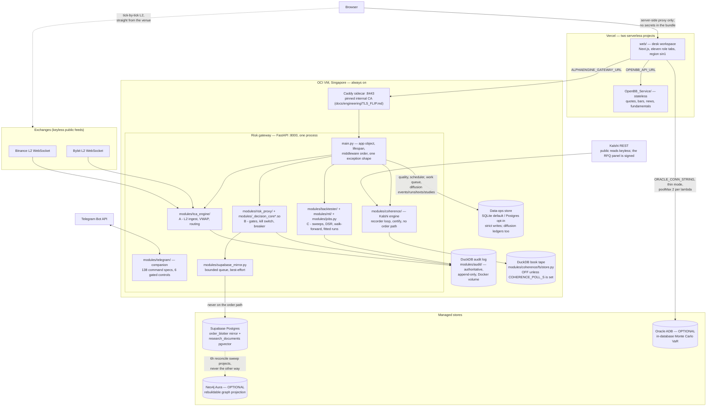

# AlphaEngine — system architecture

**Source/worktree audited: 2026-08-31.** Every current-tree figure here was read
off the tree on that date, with the file it came from named beside it. This is
not a fresh probe of an external deployment. Where this document and
[`Part2_Infrastructure/README.md`](../../Part2_Infrastructure/README.md) disagree,
re-read the tree — both stamp their dates, and the tree is right.

This is the map, not the territory: it says what the pieces are, where each one
runs, and why the seams sit where they do. The depth lives elsewhere and is
linked, not restated — the [feature tour](../product/FEATURE_TOUR.md) walks the product,
the [latency budget](LATENCY_BUDGET.md) defends every timing number, and the
README argues each module at length.

**On the numbers in this file.** Three counts in this repository are enforced by
CI and can be quoted: the web suite's test total
(`web/scripts/check-test-counts.mjs`), the canonical-JSON SHA-256 of the gateway
contract (`web/scripts/check-gateway-openapi-digest.mjs`), and the repository
manifest's file list (`web/scripts/generate-codebase-manifest.mjs --check`).
Everything else — route counts, section counts, module counts — is a reading
taken on the stamp date with the file it came from named beside it, so that a
reader who doubts one can re-take it in a single command. Where a figure moves
weekly, this document describes the **gate** instead of pinning the number.
The reproducible release snapshot for volatile counts and versions is
[`CURRENT_STATE.md`](../CURRENT_STATE.md); this document explains the topology
behind those figures rather than becoming a second current-state ledger.

---

## The shape in one paragraph

Three independently deployable units share one append-only audit log. A stateful
FastAPI **risk gateway** on an always-on OCI VM (Singapore) owns everything that
must not be forked or forgotten: venue WebSocket subscriptions, the paper
position book, seventeen defined pre-trade gates (fifteen reachable by any
single order — README §4), the kill switch, and the DuckDB audit log on a Docker
volume. A serverless **Next.js desk workspace** on Vercel gives eleven role tabs
and holds no secrets in the browser bundle — its server-side proxy is the only
path to gateway credentials. A stateless **OpenBB research service**, a second
Vercel project, serves quotes, bars, news and fundamentals and can scale without
touching risk state. Supabase Postgres mirrors decisions and hosts the research
corpus; Neo4j Aura, when present, is a rebuildable projection of graph state
Postgres already owns; an Oracle Autonomous Database answers one in-database VaR
question the workspace asks directly. A Telegram companion rides inside the
gateway process, and a Kalshi book recorder rides beside it writing a second,
separate DuckDB tape. Nothing optional is load-bearing: every absent credential
degrades to a named, reported state rather than a crash or a silent zero.

## Three deployment units, one audit log

Why three units and not one: the gateway needs a long-lived process because it
holds sockets and mutable risk state open; the workspace is serverless because a
research portal should scale to zero; the OpenBB service is separate so a slow
Yahoo fetch can never queue behind — or crash beside — the process deciding
orders. The full argument is README §“Three deployment units”.

**The three-unit rule is enforced in one file and says so about itself.**
[`.github/workflows/deploy.yml`](../../.github/workflows/deploy.yml) ships
exactly one of the three — the gateway — and its own header gives the reason:
the workspace and the OpenBB service are Vercel projects that deploy themselves
from git, so putting them here would deploy them twice. Its `push` trigger is
path-filtered to `Part2_Infrastructure/**` *minus* `web/**` and
`OpenBB_Service/**` for the same reason. The two Vercel projects declare their
own roots:
[`web/vercel.json`](../../Part2_Infrastructure/web/vercel.json) and
[`OpenBB_Service/vercel.json`](../../Part2_Infrastructure/OpenBB_Service/vercel.json).

A fourth tracked app, [`developer-console/`](../../Part2_Infrastructure/developer-console/),
is experimental, deployed nowhere, and shares no code or data with the three
units — it is named so the tree and the docs agree. Its own README is explicit
that the pipeline runs, code diffs and gateway contracts it renders are
illustrative fixtures labelled as such in the UI; nothing in it reads a live
system, and it is not part of the assessed deliverable.

The **audit log is the one shared truth**: DuckDB (SQLite fallback), append-only
by convention enforced in `modules/audit/` — nothing issues UPDATE or DELETE
against `orders`/`risk_events`, and the current session's paper book is rebuilt
by replaying accepted fills. Embedded on purpose: the desk must keep trading
when every network dependency is down. Everything downstream — the Supabase
mirror, the RAG corpus, the workspace's blotter — is a *view* of decisions this
log already recorded.

The web→gateway hop runs over the Caddy sidecar's pinned internal CA rather than
public PKI — a bare IP gets no public certificate, and one pinned client is a
stronger trust model than a public root for a single-client hop. Mechanics and
rollback: [`TLS_FLIP.md`](../engineering/TLS_FLIP.md).

## Three latency planes — never blended

The house rule ([`CLAUDE.md`](../../CLAUDE.md)) that most shapes how numbers are
presented: three planes, three units, and a figure never appears under another
plane's label. A tile that puts a nanosecond figure under a microsecond label is
the defect, not a rounding choice.

| Plane | Unit | What is timed | Where the figure lives |
|---|---|---|---|
| The whole risk decision | **µs** | tick → seventeen-gate verdict, under the lock | `RiskDecision.latency_ms`, the µs histogram, the header's DECISION P99 chip |
| The compiled core | **ns** | the C++ arithmetic battery alone (`native/decision_core/decision_core.cpp`) | timed inside the engine; the gateway self-measures it at startup on a synthetic two-venue book, so the figure exists before the first order |
| The network | **ms** | data age in, order transit out | the chip's title and the Reliability tab — never under the decision label |

The newest code-level qualification (2026-08-28) separates a 42/84 ns
canonical kernel, a 958/1,042 ns complete native operation and a
64.833/81.667 µs whole-gateway external wall; the last misses its 10/20 µs
target. The older production and venue observations keep their own dates.
[`LATENCY_BUDGET.md`](LATENCY_BUDGET.md) and
[`NATIVE_LATENCY_OPERABILITY.md`](../../Part2_Infrastructure/docs/NATIVE_LATENCY_OPERABILITY.md)
keep those populations separate rather than merging them into one flattering
number.

## The risk gateway, module by module

One process, one Uvicorn worker, **by design**: the gateway holds a mutable
consolidated book, a resting-order book, a token bucket and the kill switch. A
second worker would fork the book and localise the halt — the exact opposite of
what a kill switch is for.

`main.py` holds only what one file must: the application object, the lifespan
that fixes start-up and shutdown ordering, the middleware stack whose order is
load-bearing, the console template, and the exception handler that gives every
error one shape. It stays at *that* path deliberately — `docker/gateway.Dockerfile`
copies the root modules by name, so a route that moved into a new root package
would be missing from the image with nothing to catch it before a request
arrived.

Everything else is a router in [`modules/api/`](../../Part2_Infrastructure/modules/api/),
one per tag group: `audit`, `coherence`, `coherence_history`, `coherence_lab`,
`data`, `diffusion`, `meta`, `ml`, `research`, `risk`, `tca`, `telegram`. Read
off the tree on 2026-08-29 those carry **79 HTTP operation decorators** plus
**one WebSocket** (`/ws/book/{symbol}`, which OpenAPI does not describe), and
`main.py` adds three console aliases (`/`, `/app`, `/ui`) all marked
`include_in_schema=False`. Across application source that is **83 route
decorators**. The committed contract
[`tools/openapi.json`](../../Part2_Infrastructure/tools/openapi.json) therefore
holds **76 paths carrying 79 operations**, OpenAPI 3.1.0.

That contract is a **gate, not a note**. `python tools/export_openapi.py --check`
runs in CI's `gateway` job, and the web build's `prebuild` step recomputes a
SHA-256 over the contract's *canonical JSON with sorted keys* — not a file hash,
so a reformat is not a breach and a reordered key is not a false alarm — and
compares it against the literal in `web/lib/gateway-openapi-digest.generated.ts`
(`web/scripts/check-gateway-openapi-digest.mjs`). Two separately deployed units
assert their contract before either ships.

The modules cluster into the three assessed capabilities plus their supports —
each argued in depth in README §3–§5, distilled here:

- **A · TCA** — `modules/tca_engine/`: venue L2 ingest, consolidated book
  state, VWAP/slippage, routing.
- **B · Risk** — `modules/risk_proxy/`: the gates, positions, resting book,
  drawdown breaker, kill switch, and the startup core self-measure.
  `modules/decision_core.py` selects the engine
  (`DECISION_CORE=auto|native|python`, validated at import — anything else
  raises); the C++ core is held **bit-exact** against the Python reference by a
  twenty-scenario fixture (`web/tests/fixtures/gate-parity.json`) — tolerance is
  for the TypeScript side, not this one, and §"The two-implementation parity
  argument" below says exactly how much less the TypeScript side is held to.
  Which engine is live is published on `/health`, `/metrics` and the ops
  snapshot, so a build that fell back is visible on the desk rather than only in
  a log line. `deploy.yml` reads that field after the swap and raises a
  **warning, not a rollback** — and says why in the file: the Python engine is
  correct and at this book shape marginally faster end to end, so only the
  nanosecond core figure is missing from the desk, and "bricking a working
  gateway over a display detail would be the disproportionate response".
- **C · Research** — `modules/backtester/` (signals, engines, DSR/PSR,
  walk-forward), `modules/ml/` (the supervised runs: two engines behind one
  contract, purged and embargoed walk-forward splits, and a run that fell back
  recorded on `ml_runs.engine` rather than hidden), `modules/jobs.py`
  (in-process pool ⇄ Celery when `REDIS_URL` is set — same task callables
  either way), and the research plane described below.
- **The Kalshi coherence engine** — `modules/coherence/`: a fourth capability
  that shares the process and nothing else. It reads a prediction market, prices
  mutually exclusive families against the dollar they pay, certifies coherence
  failures, and records whole book ladders to **its own** DuckDB file. It has no
  order path at all — `modules/api/coherence.py` opens by saying every route in
  it is a GET and that this is the design, not a gap. See §"The coherence plane"
  below.
- **Supports** — `modules/audit/` (the log), `modules/supabase_mirror.py` (the
  mirror), `modules/portfolio/`, `modules/quant_risk/`, the data-operations
  family (`data_ops_store.py`, `data_quality*.py`, `data_scheduler.py` — where
  their state lives is [`DATA_OPS_BACKEND.md`](DATA_OPS_BACKEND.md)),
  `modules/operations.py` and `modules/metrics/` for ops,
  `modules/single_writer.py` (the `flock(2)` claim that stops a second gateway
  starting on the same state directory), and `modules/schemas.py` plus its
  `schemas_*.py` siblings — one Pydantic contract shared by API, UI and bot.

Test truth is deliberately **not** restated here. `web/lib/test-counts.generated.ts`
is the only file allowed to carry those numbers, and
[`TESTING.md` §"The counts, and why they are generated"](../testing/TESTING.md)
is the one document that explains them — including the three facts that make a
single figure misleading on its own: the gateway suite has two correct pass
counts depending on whether the cross-encoder weights are seeded; the committed
web figure is a dated measurement that goes stale the moment a suite is added;
and of the two lines in that generated file **only the web one is checked by
CI** (`web/scripts/check-test-counts.mjs` accepts `suite === "web"` and nothing
else), so the gateway line is a dated record rather than a gate. An architecture
document quoting a count is how five files drifted together last time, so this
one links instead. The discipline in one line: read the skip **reasons**, not
the pass count — [`WORKFLOW.md` §2](../planning/WORKFLOW.md) is the short
version.

## Every store, and what each is authoritative for

Six stores, six different jobs. The reason they are not one store is that they
have incompatible write contracts, and a store forced to serve two contracts
serves neither: a ledger must accept a write it can drop, a work queue must
raise when a write fails, and a market tape must refuse rather than fork.

| Store | Owner in code | Authoritative for | Contract when it will not open |
|---|---|---|---|
| **DuckDB — audit ledger** | [`modules/audit/store.py`](../../Part2_Infrastructure/modules/audit/store.py), assembled as `AuditLog` in `modules/audit/__init__.py` | every paper order and risk decision, TCA snapshots, OHLCV cache, `backtest_runs`, and the `research_plan` / `research_tool_call` / `research_generation` ledger | DuckDB genuinely unavailable → **SQLite fallback**, `backend: "sqlite"`, nothing lost but analytical SQL. Another live process holding the file → `AuditLedgerConflict`, **raised, never fallen back from** |
| **DuckDB — Kalshi book tape** | [`modules/coherence/fs/store.py`](../../Part2_Infrastructure/modules/coherence/fs/store.py) | whole bid ladders per poll, append-only, `COHERENCE_DB_PATH` or `${DATA_DIR}/coherence.duckdb` | a lock conflict is a **reported state, never a fallback** — a second store recording to a different file would split the tape in two and neither half would be complete |
| **SQLite / Postgres — data operations** | [`modules/data_ops_backend.py`](../../Part2_Infrastructure/modules/data_ops_backend.py), `data_ops_store.py`, `data_ops_postgrest.py` | quality findings, escalations, work items, schedule runs and four diffusion ledgers | writes **raise**; SQLite is complete and default. The current source and migration bundle give Postgres parity for all eight logical tables, including Diffusion runs/texts and the current study fields. Postgres mode requires a non-empty `SUPABASE_DESK_ID`; the store stamps and filters it on every operation, and never silently falls back. A live project has that contract only after the parity and desk-scope-guard migrations are applied — the exact rollout boundary is in `DATA_OPS_BACKEND.md` |
| **Supabase Postgres** | `modules/research_rag/`, `modules/supabase_mirror.py`, `modules/research_graph.py` | the research corpus and its edges; the `order_blotter` mirror of decisions the audit log already owns | unset credentials → every mirror method is a no-op and every retrieval route returns a typed `unavailable` **state**, never `[]` |
| **Neo4j Aura** | [`modules/research_graph_projection.py`](../../Part2_Infrastructure/modules/research_graph_projection.py) (write), `modules/research_graph_offload.py` → `research_graph_read_model.py` (read) | **nothing** — it is a one-way projection of `research_edges`, which Postgres owns | unset `NEO4J_URI` or no `requirements-graph.txt` driver → a named reason and `source: "corpus"`; three refusals stay distinguishable (not configured / sweep has not run / mid-rebuild). The projection and its Cypher reads are not desk-scoped. When `RESEARCH_SCOPE_TO_DESK=1`, the read model refuses Neo4j before opening the driver and both reports automatically use the desk-scoped corpus fallback; with the flag off, Neo4j is suitable only for a single desk or an isolated database |
| **Oracle Autonomous Database** | [`web/lib/oracle/client.ts`](../../Part2_Infrastructure/web/lib/oracle/client.ts), route `web/app/api/oracle/var/route.ts` | one in-database Monte Carlo VaR, surfaced on `#risk/oraclevar` | a typed result, never a throw; nine distinct failure codes from `oracle_not_configured` to `oracle_schema_missing`, none of which carries a credential, hostname or raw ORA text |

Two of those contracts deserve their argument spelled out, because they look
like inconsistencies and are not.

**The audit log's writers are fire-and-forget on purpose.** `_exec` swallows a
failed write and `query` returns `[]` — a lost TCA snapshot must never take the
order path down with it. That is the right contract for *evidence about
something that already happened* and the wrong one for state a person just
edited, which is exactly why the data-operations tables use a separate strict
store whose writes raise and whose UPDATE reports whether it hit a row. SQLite
is the default implementation; Postgres is the partial opt-in described above.
The choice is argued at the top of `modules/data_ops_store.py` and its consequences
are [`DATA_OPS_BACKEND.md`](DATA_OPS_BACKEND.md).

**A second live writer is prevented twice, and the two layers close different
holes.** [`modules/single_writer.py`](../../Part2_Infrastructure/modules/single_writer.py)
takes a POSIX advisory `flock(2)` claim on `data/gateway.writer.lock` in
`RiskGateway.start()` and holds it for the life of the process; `AuditStore`
raises `AuditLedgerConflict` on DuckDB's own lock message
(`_LOCK_CONFLICT_MARKERS = ("conflicting lock is held", "could not set lock on file")`)
for every *other* way an `AuditLog` gets opened — the Telegram bot, the job
runner, `tools/`, the tests. Neither makes the gateway multi-process, and
`single_writer.py` says so about itself rather than overstating: what changes is
that a second writer now refuses to start and says why, instead of running a
shadow desk whose kill switch is local, whose token bucket permits N × the
configured rate, and whose limits are computed against a fraction of the real
position.

## The desk workspace — eleven tabs, 70 rail sections

One client workspace, eleven role tabs. The first eight follow the desk's
decision loop; Markets reads prediction-market prices, Proofs tests what follows
from them, and Diffusion studies how new information reaches those prices. The
[feature tour](../product/FEATURE_TOUR.md) walks the same order.

The tab rail is data in
[`web/lib/workspace-nav.ts`](../../Part2_Infrastructure/web/lib/workspace-nav.ts),
and the section rails have one definition in
[`web/lib/sections.ts`](../../Part2_Infrastructure/web/lib/sections.ts). The
latter holds **70 sections**: 48 across the original eight workspaces, 8 in
Markets, 7 in Proofs and 7 in Diffusion (read 2026-08-29). The production sweep
mirrors that topology in `web/scripts/desk-sweep-plan.mjs` and asserts
`EXPECTED_SECTIONS = 70`.

Sections are not the bottom of the address any more. The optional third hash
segment is defined by
[`web/lib/section-views.ts`](../../Part2_Infrastructure/web/lib/section-views.ts):
the default view keeps the canonical two-segment URL, while every non-default
view has a stable `#tab/section/view` address. The sweep carries **43 non-default
view cells** (`EXPECTED_VIEW_CELLS = 43`) in addition to the 70 rail landings.
`workspace-hash.ts` owns parsing, history correction and the 11 legacy
cross-tab relocations; individual panes no longer own an unreachable `useState`
for a view that the URL needs to open.

| Tab | View id | Role | The question it answers |
|---|---|---|---|
| Overview | `overview` | all roles | what is the state of the whole desk, now? |
| Research | `research` | quant researcher | is this strategy evidence, or noise that survived a search? |
| Execution | `live` | trader | can I send this, and what will it cost? |
| Portfolio | `portfolio` | PM | where am I exposed, and which limit binds first? |
| Risk | `risk` | risk manager | is the model right, and will the limits hold? |
| Data | `data` | data engineer | can I trust this data? |
| Reliability | `reliability` | SRE | is it healthy, and what do I do at 3am? |
| Developer | `developer` | quant developer | can I change this safely? |
| Markets | `markets` | quant researcher | what is this exchange quoting, and what does a dollar of it cost? |
| Proofs | `coherence` | quant researcher | do those prices admit a probability at all? |
| Diffusion | `diffusion` | quant researcher | how long does information take to finish moving the price? |

The runtime dependency allowlist is ten packages: `next`, `react`, `react-dom`,
`lucide-react`, `@supabase/supabase-js`, `oracledb`, and the exact
`radix-ui`, `class-variance-authority`, `clsx`, `tailwind-merge` set used by
source-owned shadcn primitives. Quantitative charts and proof objects remain
domain-owned SVG and exact-value tables. The accepted implementation boundary,
including the two browser-test-only packages and rollback gates, is
[`ADR_2026-08-27_SHADCN_SOURCE_PRIMITIVES.md`](ADR_2026-08-27_SHADCN_SOURCE_PRIMITIVES.md).
`web/tests/dependency-policy.test.ts` pins the full manifests and audited
override, so the exception cannot grow silently.

The other house rules that shape every tab — null never coerced to zero, no
colour-only meaning, empty results reported rather than hidden — are in
[`CLAUDE.md`](../../CLAUDE.md) and enforced by the suites it names. §"The honesty
doctrine is architecture, not styling" below shows where.

## Prediction-market architecture — three tabs, two data families, no order path

Markets and Proofs are two readings of the Kalshi coherence engine. Markets
owns the venue observations; Proofs owns the certificates, baskets, bounds,
index and settled score. Diffusion is a separate research tab over recorded
announcement windows and coherence episodes. It shares components and some
read models, but its `/api/research/diffusion/*` endpoints and strict data-ops
event/run/text/study rows are not the live Kalshi book tape. SQLite is the
complete default for those rows. The current source and generated migration
bundle provide Postgres parity for all four Diffusion ledgers; live availability
still depends on applying the parity and desk-scope-guard migrations described
in [`DATA_OPS_BACKEND.md`](DATA_OPS_BACKEND.md).

The coherence side may claim only what its code does: read live books, price
mutually exclusive families against the dollar they pay, record full ladders,
and produce a certificate when the quoted prices admit no probability measure.
All **18** `/api/coherence/*` operations are GETs and no order-send path exists:
`modules/api/coherence.py` owns 5 current reads,
`coherence_history.py` owns 5 historical reads, and `coherence_lab.py` owns 8
derived/lab reads. `modules/api/diffusion.py` adds four research operations,
including the one POST that records a measured stage; it does not trade.

Three properties keep this plane separate from the trading ledger:

- **Its own tape and failure contract.** `modules/coherence/fs/store.py` writes
  whole ladders to a separate DuckDB file. Sharing the audit ledger lock would
  make a recorder stall indistinguishable from an order-audit failure.
- **Explicit opt-in recording.** The recorder declines unless both
  `COHERENCE_SERIES` and `COHERENCE_POLL_S` are configured; `POLL_SECONDS = 0`
  is the safe default.
- **Typed absence.** Routes return `state` discriminators. Unconfigured,
  unavailable, empty and coherent are different answers and never collapse to
  an unexplained empty array.

### Twenty-two sections over three rails

Each console renders exactly one `<WorkspaceSubtabs>` rail. A section-local
view switcher never mounts another rail, so it cannot contend for the global
`--rail-h` publisher. Its selected view is nevertheless addressable through
the third hash segment described above.

Components are relative to `Part2_Infrastructure/web/components/`; labels below
were read from `lib/section-views.ts` on 2026-08-29.

| Tab | Section | Owning component | Views |
|---|---|---|---|
| Markets | `universe` | `coherence/UniverseSection.tsx` | Baskets · Families |
| Markets | `settlement` | `coherence/SettlementSection.tsx` | Index · Formation · Pending |
| Markets | `books` | `coherence/BooksSection.tsx` | Ladder · Identity · History |
| Markets | `dispersion` (Makers) | `coherence/MakersSection.tsx` | Dispersion · Channel |
| Markets | `lattice` | `coherence/SurfacePane.tsx` | Survival · Mass · Moments |
| Markets | `stake` | `coherence/StakePane.tsx` | Plan · Capital · Method · All outcomes |
| Markets | `fees` | `coherence/FeesSection.tsx` | Worked example · Cost shape · Ablation · Replay table |
| Markets | `shell` | `coherence/ShellPane.tsx` | Map · Browse |
| Proofs | `certificate` | `coherence/CertificatePane.tsx` | Verdict · Proof · Prices |
| Proofs | `portfolio` (Basket) | `coherence/BasketSection.tsx` | Cover · Basket · Size |
| Proofs | `combos` (Parlays) | `coherence/CombosSection.tsx` | Bands · Comparison · Parlays · Legs · Bounds |
| Proofs | `index` | `coherence/IndexSection.tsx` | By poll · By family |
| Proofs | `calibration` (Scorecard) | `coherence/CalibrationPane.tsx` | Overview · Decomposition · Measures · Reliability · Bands |
| Proofs | `corpus` | `coherence/CorpusSection.tsx` | Composition · Score trend |
| Proofs | `lessons` | `coherence/LessonsPane.tsx` | Quotes · Structure · Bounds · Record · Coverage · Episode states |
| Diffusion | `arm` | `coherence/diffusion/ArmSection.tsx` | Absorption · Control · Clocks |
| Diffusion | `meetings` | `coherence/diffusion/MeetingsSection.tsx` | Meeting by meeting · Calendar · Mechanism |
| Diffusion | `episodes` | `coherence/diffusion/EpisodesSection.tsx` | Survival · Episodes |
| Diffusion | `model` | `coherence/diffusion/ModelSection.tsx` | Measurement |
| Diffusion | `instrument` | `coherence/diffusion/InstrumentSection.tsx` | Instrument |
| Diffusion | `sandbox` | `coherence/diffusion/SandboxSection.tsx` | Half-life · Simulator · Spectrum |
| Diffusion | `findings` | `coherence/diffusion/FindingsSection.tsx` | Effect plot · Findings table · Instrument |

The four lesson groups and fourteen shipped lessons are data in
`web/lib/coherence/lessons.ts`; all fourteen correspond to notebooks under
`notebooks/coherence_lab/`. The `shipped` flag means the lesson is rendered and
pinned to its implementation, not that every optional backend is configured.

Reads are gated first by the visible tab, then by their owning section, and
where useful by the owning view. The universe payload is shared across Markets
`universe`, `lattice` and `stake`, and Proofs `certificate` and `portfolio`, via
one URL-keyed cache. Markets' signed RFQ read is not warmed; the 20,000-row
replay runs only for Fees' Ablation and Replay-table views; book history runs
only for the selected ticker's History view. Diffusion reads absorption for
`arm`/`meetings`, the episode/status/index trio for `episodes`, and findings for
`findings`; its model, instrument and sandbox compute in the browser. The 25 s
server, 28 s live-browser and 9 s tape-browser budgets remain declarations, not
new measurements; their measured ancestry stays in
[`LATENCY_BUDGET.md`](LATENCY_BUDGET.md).

### The diffusion study, and why its headline is a null

`#diffusion/arm` surfaces
[`modules/coherence/diffusion/`](../../Part2_Infrastructure/modules/coherence/diffusion/)
(29 Python modules, read 2026-08-29), which measures how fast an FOMC statement
is absorbed into price and asks whether the *text* of the statement predicts
that speed.

The verdict is now scored **out of sample** by
`modules/coherence/diffusion/skill.py`, covered by
`tests/test_diffusion_skill.py`. It replaced a criterion built on the largest of
eight in-sample univariate |t| values against `half_life_s` — a target fitted
only where the move cleared two sigma, which is 26 of 62 release meetings. Four
changes, each argued in the module docstring as *not* a choice of answer: the
target became `residence_time`, the area above the absorption curve, which for
an exponential approach **is** the time constant and needs no signal gate, so it
is defined 62 of 62 per stage; the hard two-sigma cut became a precision weight;
the two stages are pooled with a call indicator and the policy move enters as a
**control**, not a rival; and scoring is leave-one-**meeting**-out, because
folding by row leaks — both stages share a statement.

State the result exactly this way. The absorption clock **is** predictable —
out-of-sample **R² +0.144** from stage and rate move alone, with the press
conference about **7.0 minutes slower** than the statement — but adding the text
changes that by **−0.343** (shuffled **p 0.875**). Over a declared **3×3 grid**
of specifications the gain was negative in **all nine cells**, including the one
with the largest in-sample |t| of 2.85. The headline is therefore a **null**,
and a stronger one than the version it replaced: the clock has real structure,
and the statement's information spectrum is not part of it.

The instrument ladder renders the target's own row **above** the predictor's
(`web/components/coherence/diffusion/InstrumentFit.tsx`) — "The clock is
predictable at all" first, "The text predicts it" second — for the reason that
ordering exists: if the first fails, the second means nothing.

## The two-implementation parity argument

This is the idea most worth understanding about the codebase, because it is why
so much of it exists twice.

**The premise.** Three runtimes serve one desk and none of them can call the
others. The gateway is a Python process holding sockets and mutable risk state;
the workspace is a serverless TypeScript function and a browser bundle; the
Telegram companion is inside the Python process but rendering to a phone. So a
quantity a trader reads on a screen and the same quantity read on a phone are
computed by two different programs, and the expensive failure is not a crash —
it is two plausible numbers that disagree, with nothing flagged.

**The response.** Python is the reference. A tool records its answers into a
committed fixture, and the other implementation's suite replays that fixture. A
one-sided formula change then fails the *other* side's tests, which is the only
mechanism that has ever kept two hand-maintained mirrors in step.

| What exists twice | Reference | Fixture | The suite that replays it |
|---|---|---|---|
| The seventeen pre-trade gates | `modules/risk_proxy/` (Python) | `web/tests/fixtures/gate-parity.json` — **20 scenarios**, `version: 1`, written by `tools/make_gate_fixture.py` | `tests/test_gate_parity.py` (the live Python gateway), `tests/test_decision_core_native.py` (the C++ core), `web/tests/gate-parity.test.ts` (the browser sandbox) |
| The backtest engine | `modules/backtester/` `NumpyEngine` | `web/tests/fixtures/parity.json` — 48 cases over real Binance bars, written by `tools/make_parity_fixture.py` | `web/tests/parity.test.ts` against `web/lib/engine` |
| The portfolio risk engine | `modules/quant_risk/` | `web/tests/fixtures/risk-parity.json`, written by `tools/make_risk_fixture.py` | `web/tests/risk-parity.test.ts` against `web/lib/portfolio-risk/` |
| The fill tolerance | `modules/tca_engine/` | *none* — the suite reads **both sources** | `web/tests/venues-parity.test.ts` compares `web/lib/venues`' `FILL_TOLERANCE` against the whole gateway-side package, concatenated |
| One Monte Carlo simulation | the committed reference itself | `web/lib/mc-parity-reference.generated.ts` — canonical JSON plus its own SHA-256 | `web/tests/mc-parity.test.ts` runs it in Node **and** executes the browser worker's own stringified source |
| The OHLCV bar contract | `modules/data_jobs.py::check_bars_rows` (backfilled bars) | `web/tests/fixtures/bars-contract-parity.json` — case name, requested count, bars, verdict and the **check ids** | **both** sides read the one fixture: `tests/test_data_jobs.py` on the Python half and `web/tests/contracts-bars.test.ts` on `web/lib/providers/contracts`' `checkBars` — "the discipline `gate-parity.json` applies to the pre-trade arithmetic, applied to the data contract" |
| The dark palette | — | — | `web/tests/theme-palette-parity.test.ts` pins `@media (prefers-color-scheme: dark)` against `:root[data-theme="dark"]`, two declaration blocks holding one palette |

**The gate battery is the sharpest case, because it exists three times.**
`GATE_ORDER` in
[`modules/risk_proxy/gates.py`](../../Part2_Infrastructure/modules/risk_proxy/gates.py)
declares seventeen names in evaluation order: `kill_switch`, `symbol_halt`,
`symbol_whitelist`, `paper_execution_model`, `reference_freshness`,
`duplicate_order`, `rate_limit`, `price_available`, `order_sized`,
`max_order_notional`, `symbol_concentration`, `gross_exposure`, `price_band`,
`working_book`, `daily_drawdown`, `reduce_only`, `est_slippage`. The Python
reference and the compiled C++ core are held to the fixture **bit-exactly** —
same accept/reject, same gate order, same `observed` and `limit` floats, with a
divergence naming the gate and the delta.

The TypeScript half is held to **less, deliberately, and the suite says which
less.** `web/tests/gate-parity.test.ts` asserts that the browser sandbox's
`judge()` (`web/lib/blotter/sandbox-desk.ts`) walks the same gate names in the
same order — a cross-language contract — and explicitly does *not* assert the
numbers, because the sandbox has no ladder (its slippage is a synthesised
function of size, seeded by a PRNG), reads its caps off the book rather than
settings, and has no paper equity or per-venue routing. Those scenarios are
structurally inexpressible in it, and pretending otherwise would be "a looser
test wearing a stricter name". Naming the boundary is the point: a parity claim
that quietly covers less than it sounds like is worse than no parity claim.

**The same instinct outside the fixtures.** `POST /api/oracle/var` exists to be
a *second opinion* on a VaR the workspace already computes client-side, and its
route file says so — "two independent implementations of the same quantity is
the only cheap check on either — the same reason the repo carries a
Python/TypeScript engine parity suite", with the warning that the two numbers
are **not** interchangeable (a terminal-value GBM VaR over a horizon against a
one-day parametric VaR on the current book) and must never be presented as one
figure with two sources. Where the shapes genuinely cannot be compared, the doc
says so instead of merging them.

Where a mirror is *not* worth maintaining, the code says that too:
`modules/ml/selection.py` **delegates** deflated-Sharpe and PBO to
`modules.backtester.overfitting_probability` rather than defining a second
implementation, on the ground that a research plane with two definitions of
"deflated Sharpe" has none. Parity is the answer when two runtimes make one
implementation impossible; it is not an excuse for a second copy inside one.

## The honesty doctrine is architecture, not styling

Three rules recur through this tree, and they are load-bearing in the same sense
a lock is: each one exists because its violation is *invisible* — it type-checks,
it renders, and it changes the number somebody decides on.

**1 · Null is never coerced to zero.** [`CLAUDE.md`](../../CLAUDE.md) states it
as the doctrine this codebase is most alert to: `?? 0` on a nullable metric
turns "we do not know" into "it is fine". A missing measurement renders as a
dash and says *why* it is missing.

Enforcement is a suite, not a convention:
[`web/tests/null-honesty.test.ts`](../../Part2_Infrastructure/web/tests/null-honesty.test.ts)
scans named components for the specific coercions that already shipped once —
a beta of 0.00 that invents an exposure (`portfolio/StressTest.tsx` must match
`p.beta == null ? "β —"`), a p99 of 0 ms that tells a screen reader the system is
instant (`systems/LatencyTrend.tsx` must say "currently not measured"), and
`$0` of depth that invents an empty book where there is only an unread one
(`execution/LiquidityBook.tsx` must match `depthUsdBid == null ? "—"`). It
strips comments before scanning, because a scan that cannot tell a comment from
code reads the explanation of the trap as the offence.

The gateway half is the same rule in a different shape. An embed that fails
stores `embedding_status='pending'` and **never a zero vector** — a zero vector
is equidistant from everything and would be returned as "similar" to any query
(`modules/research_rag/retrieval.py`). A document the graph walk did not reach
carries `graph_rank: None`, never 0, which would read as better than first. A
row only the image arm found carries `similarity: None`, not 0.0, because it has
no gte-small similarity to this query and a 0 would read as "measured, and
terrible". `structured_runs` rows carry **no** `similarity` field at all and
stay off the match list, because a required float would have to be written 0.0 —
"not applicable" spelled as "worst possible".

**2 · A withheld value is dashed, with its floor named.** The negative half of
the rule is not enough on its own: a chart that simply disappears is an absence
reported as a *state* rather than as a reason, which the doctrine forbids just
as firmly. So `components/portfolio/RiskEngine.tsx` must not only decline to
draw a VaR series it cannot compute — `rollingVarSeries` returns null below
`window + 20` aligned bars — it must name the floor, and the suite asserts the
prose: `needs 80 daily bars`, split as `60 to fit the first sigma and 20 more to
score`, "without the split the 80 is a magic number the reader cannot check".

The same shape governs a request that got no answer. `OrderTicket.tsx` carries
`AbortSignal.timeout(ORDER_TIMEOUT_MS)`, and the suite asserts that the
browser's deadline **outlasts** the server's `DEFAULT_TIMEOUT_MS` in
`web/lib/gateway.ts` — if the browser gave up first, a slow-but-real verdict
would be discarded and reported as a transport failure. On timeout it must say
the order "may still have been decided" and "Check the blotter before
resubmitting", because an abort cannot prove the request failed to arrive and
claiming otherwise invites a blind resubmit.

**3 · A sample floor is a refusal with a denominator, not a silence.** Where a
statistic is only meaningful above some n, the floor is a named constant and the
report says which one it missed:
`modules/coherence/diffusion/skill.py` defines `MIN_MEETINGS = 20` ("out-of-sample
R² over fewer than this is dominated by which meetings happened to land in the
fit") and `SKILL_FLOOR = 0.0` ("zero is the honest threshold and the only one
that is not a choice: below it the text makes predictions worse than not having
read the text"). CRAG's refusal names the `corpus_size` denominator it was
refusing against. `RAG_MIN_SIMILARITY = 0.76` is documented as *measured*
against gte-small's compressed range — and deliberately **not** applied to the
CLIP arm, because inventing a CLIP number would be exactly the unmeasured
constant this tree refuses.

**The general form: absence is a state, with a named reason and a typed
carrier.** `modules/research_graph_projection.py` set the pattern and
`research_rerank.py`, `research_image.py`, `research_communities.py` and
`research_graph_read_model.py` all cite it by name — `ranked: False` + `reason`,
`reranked: False` + `state` + `model`, `detected: False`, `source: "corpus"` —
never an exception and never a silent success. `web/lib/gateway.ts` is the same
discipline on the TypeScript side: three ways a gateway URL can be wrong are
three different statements (`absent`, `invalid`, `loopback`), because conflating
them is how a typo gets reported as an outage. When this document describes an
optional capability, it names the refusal shape in the same sentence — that is
the doctrine made checkable.

## Where Supabase and Neo4j sit

**Supabase is two things, neither authoritative.** First, the durable
**mirror**: every gateway decision streams into `public.order_blotter` through
`modules/supabase_mirror.py` — a bounded queue whose `enqueue` is `put_nowait`,
so it cannot block, cannot raise past its own frame, and on a full queue
*counts the drop* rather than waiting. A mirror that can slow an order down has
become load-bearing; this one is structurally incapable of it. Second, the
**RAG corpus**: `public.research_documents` under a 384-dim pgvector HNSW
cosine index — plus, on a deployment that has opted in, a second 512-dim
`image_embedding` column carrying a chart's *pixels* through CLIP, and a
`research_chart_images` side table holding the PNG itself so the generator can
show it to the model after the process that drew it is gone. The side table
exists rather than a column precisely so no retrieval projection can ever name
those bytes, and so a deployment that has not run the migration answers 404 to
the image write and nowhere else. The corpus is written through the same
bounded-queue discipline **and now the same delivery discipline**. The queue always matched the mirror's — `put_nowait`,
drop and count, never blocking a caller — but for a while only the queue did:
the drain made one delivery attempt and discarded, where the mirror retried
three times with backoff. `modules/research_ingest_delivery.py` closes that
with the mirror's own attempt count, curve and reason vocabulary
(`auth` / `rejected` / `timeout` / `unreachable` / `error`, with `auth` kept
apart because an expired service-role key is an operator's problem and a
rejected row is a developer's), and a document that never lands goes to a
bounded in-memory dead-letter book that reports its depth, its recent entries
and what it discarded when full through `status()`. It is a diagnosis, **not a
durable replay queue** — replaying a dead letter is still
`tools/backfill_research_rag.py`'s job. RLS on this corpus is **still
bypassed** (the gateway reads with the service-role key); what landed instead
is an optional `filter_desk_id` predicate on both similarity RPCs and graph
traversal, described under the pipeline below. The current ordered migration
set lives in
[`supabase/migrations/`](../../supabase/migrations/) (audited 2026-08-31; its
latest rollout sequence includes `20260831120000_diffusion_postgrest_parity.sql`,
`20260831121000_data_ops_desk_scope_guard.sql` and
`20260831130000_research_graph_desk_scope.sql`, followed by the bundled
`20260831131000_research_chunk_replace.sql`; none is claimed applied live here).
The latter migration is a rollout prerequisite for the new chunked ingest
path: `modules/research_rag/replacement.py` prepares all physical chunks, and
the RPC replaces stale siblings only when every text embedding is ready. An
incomplete proposal stays non-retrievable and leaves the previous complete
generation intact. [`supabase/functions/`](../../supabase/functions/) then
holds two edge functions,
`embed-research` and `evaluate-order`. `supabase/apply_all.generated.sql` is the
paste-the-bundle equivalent and carries the same current set; it is regenerated by
`python3 tools/bundle_migrations.py` and
[`.github/workflows/schema.yml`](../../.github/workflows/schema.yml) applies DDL
on `workflow_dispatch` **only** — deliberately never on a code deploy, because
"DDL that rides a code deploy is how a table gets altered by someone who was
shipping a CSS change". With no
`SUPABASE_URL`/`SUPABASE_SERVICE_ROLE_KEY` configured every mirror method is a
no-op and every RAG route returns a typed `unavailable` — which is what keeps
the whole suite green with zero environment.

**Neo4j is a projection, never a second write path.** Postgres owns
`research_edges`; `modules/research_graph_projection.py` MERGEs that derived
state into Neo4j on a six-hourly sweep, and a daily sweep partitions the whole
corpus and writes **both** label sets back off one read — Louvain communities
on a fixed seed, and PageRank centrality, each stamped with the sweep that made
them (`modules/research_schedule.py`, `DEFAULT_RECONCILE_SCHEDULES`). A dual
write was the rejected alternative: two systems that must agree, with drift only
detectable if somebody goes looking. Projection makes divergence a non-event —
if the graph is wrong, drop it and re-project. That is the source contract; this
2026-08-31 audit did not probe a live Aura instance.

**In source it is no longer write-only.** `modules/research_graph_read_model.py` reads
those labels and scores back. The `/communities` and `/centrality` routes await
`modules/research_graph_offload.py`, which puts that synchronous Aura driver on
`asyncio.to_thread` behind a two-slot bulkhead, then try its answer first and
fall back to the in-process networkx computation, marking
which one answered (`source: "neo4j" | "corpus"`, with the read model's refusal
carried whole so the reason is always readable). Nothing is invented on that
path: modularity, seed, resolution and damping are not in the graph, so they are
absent rather than restated, and a set of labels written by two different sweeps
refuses as "mid-rebuild" because community ids are comparable only within one
sweep. A writer may not read its own output — the sweep itself is forced onto
the corpus path, because a sweep that read its last partition back would be a
fixpoint. **Request-time traversal is still Postgres**: `/{document_id}` runs
the recursive CTE (`modules/research_graph.py` — "without a graph database",
per its own docstring), and no request path depends on Neo4j being up.
**Absent** — unset `NEO4J_URI`, or the optional `requirements-graph.txt` driver
not installed — is the normal deployment: both the sweep and the read model
report a named reason, never an exception, and the whole test suite passes
without either.

The read model has a tenancy boundary that must not be hidden: neither the
projection nor the community/centrality Cypher reads carry `desk_id`. The
source guard refuses that global projection whenever
`RESEARCH_SCOPE_TO_DESK=1`, before it opens the Neo4j driver, so both reports
automatically run against the desk-scoped Postgres corpus instead. With the
flag off, Neo4j is safe only for one desk or a per-desk database until the
projection schema and every Cypher query are desk-qualified.

## The research (RAG) pipeline — five stages as built

Semantic recall over what the desk already records: no new instrumentation, no
paid embedding API, and nothing generated presented as measured. Retrieval
triggers on a precisely-defined execution anomaly — a fill whose *realised*
slippage exceeds the pre-trade ceiling, a rejection citing slippage or
drawdown, the breaker engaging — not on vibes, not on every order.

**The numbering below is the code's own** (`modules/research_generate.py` opens
"Stage 5") and matches [`PRD.md` §3](../planning/PRD.md) exactly. This document
used to number the cross-encoder "Stage 3" and CRAG "Stage 4" and to omit
orchestration altogether, which put two numberings on one pipeline and left the
router unnamed in the architecture map. There is one numbering now, and stage 3
is orchestration.

```mermaid
flowchart TB
    subgraph s1["Stage 1 — ingestion from structured data"]
        sources["audit log backtest_runs, charts,<br/>ML runs, risk incidents;<br/>closed-session execution summaries<br/>(in-process + backfill)"]
        cards["research_cards.py · research_chartdoc.py<br/>research_ingest_session.py<br/>plain-text cards; body = exact embedded text"]
        writer["research_rag/writer.py + replacement.py<br/>prepare the complete physical chunk set;<br/>3 delivery attempts then a dead letter"]
        embed["embed-research edge function<br/>gte-small, 384-dim, unit-normalised"]
        replace["replace_research_document_chunks RPC<br/>commit a complete generation atomically;<br/>retain the prior one if any chunk is pending"]
        corpus[("public.research_documents<br/>pgvector HNSW, cosine")]
        sources --> cards --> writer --> embed --> replace --> corpus
    end

    subgraph s2["Stage 2 — retrieval, five arms at one k"]
        rpc["match_research_documents_hybrid RPC:<br/>dense cosine + FTS ts_rank_cd,<br/>fused by RRF, k = 60;<br/>optional filter_desk_id predicate"]
        bm25["research_bm25.py — third arm<br/>Okapi BM25 k1=1.2 b=0.75,<br/>re-fused at the same k = 60"]
        imgarm["research_image_arm.py — fourth arm, OPTIONAL<br/>match_research_document_images over<br/>CLIP image_embedding; can ADD a document"]
        gwalk["traverse_research_graph CTE — fifth arm,<br/>joined in stage 3 by<br/>research_graph_fusion.fuse_graph_matches"]
        rpc --> bm25 --> imgarm --> gwalk
    end

    subgraph s3["Stage 3 — orchestration (built, not LangGraph)"]
        router["research_router.py<br/>bounded plan over a closed 4-tool registry,<br/>one correlation id, every call in the ledger"]
        struct["research_structured.py — the structured arm:<br/>counts and extrema over the audit log's<br/>own backtest_runs, never a similarity"]
    end

    subgraph s4["Stage 4 — re-rank (OPTIONAL) + CRAG grading"]
        rerank["research_rerank.py<br/>BGE cross-encoder, ONNX, CPU-only:<br/>widen ×4 (floor 20, ceiling 60), keep top 3,<br/>off the loop behind a ONE-slot bulkhead"]
        grade["research_crag.py + research_crag_policy.py<br/>≥ 0.8 answer · 0.4–0.8 rewrite once,<br/>then answer or REFUSE · < 0.4 refuse"]
        rerank --> grade
    end

    subgraph s5["Stage 5 — fenced generation (OPTIONAL)"]
        generate["research_generate.py + _prompt + _figures<br/>Gemini via google-genai; five fences,<br/>four of which refuse in code"]
        vision["research_generate_vision.py + research_image_store<br/>the chart PNG attached as EVIDENCE, never a source;<br/>45 s budget, ≤2 images, every absence a named state"]
        generate --- vision
    end

    corpus --> rpc
    router --> rpc
    router --> gwalk
    router --> struct
    gwalk --> rerank
    grade --> generate
    generate --> ask["POST /api/research/rag/ask<br/>behind a rate + spend bound"]
```

Stage by stage, with what each refuses to do:

1. **Ingestion** (`modules/research_rag/writer.py`, cards from
   `modules/research_cards.py`): renders documents from structure the desk
   already records — completed backtests with DSR/PBO/`data_hash`, one document
   per chart described from the figures that drew it, fitted ML runs, and risk
   incidents. `body` stores the exact embedded text, so a renderer change can
   never silently invalidate stored vectors. An embed outage stores
   `embedding_status='pending'` — **never a zero vector**, which is equidistant
   from everything and would rank as "similar" to any query. On an
   indexed generation, `modules/research_rag/replacement.py` prepares every
   physical chunk before the one `replace_research_document_chunks` RPC.
   Migration `20260831131000` must be applied before this new chunked ingest
   path is deployed. Postgres removes stale siblings only when every incoming
   text embedding is ready; otherwise the proposed generation stays wholly
   non-retrievable and the previous complete generation remains available. On an
   image-configured deployment the same pass embeds the sweep's PNGs: the
   `equity_curve` chart document gets `equity_curve_png`, the *run card* gets
   `heatmap_png` (no `ChartDoc` describes a Sharpe surface, so the picture is
   the only thing that can answer "a broad stable plateau or one lucky cell"),
   and the drawdown, walk-forward and gate-ladder documents get **nothing**
   rather than being pointed at a picture that is not of them. Indexing never
   fails the thing it indexes: every way an image can be missing, malformed or
   unembeddable is a named state on the row, and the sweep is filed regardless.
   The drain is
   supervised: one document at a time inside a broad guard (so a poisoned
   response dead-letters that document instead of killing the loop), three
   delivery attempts on the mirror's backoff curve, a bounded dead-letter book
   for what never lands, and `_ensure_drain_alive()` on the submit path to
   recreate a task that ended anyway. **Session execution summaries have a
   producer** (`modules/research_ingest_session.py`) — figures read from
   `session_costs`, `equity_snapshots` and `orders`, only for sessions the
   desk's own `session_rollover` rows show as closed, every absent figure
   written "not recorded" rather than zero. The risk monitor calls
   `research_rag/session.py` at the UTC rollover; it defers the audit read off
   the trading lock and queues the card after the settle window. The backfill
   remains the history and recovery path.
2. **Retrieval** (`modules/research_rag/retrieval.py`): the
   `match_research_documents_hybrid` RPC fuses the dense arm and the Postgres FTS arm by
   Reciprocal Rank Fusion at `k = 60`
   (`supabase/migrations/20260810090000_hybrid_research_search.sql`); the BM25
   arm re-scores only the survivors and re-fuses at the same k, and the graph
   walk joins as a **fifth ranking** — one stage later than the four inside
   `search`, in the router's execution — through
   `research_graph_fusion.fuse_graph_matches`, at that same k, because an arm
   joining on a different constant is a second fusion wearing the first one's
   name. The graph rank is *position* in the traversal, not a function of depth:
   "a two-hop document is half as relevant" is a number nobody measured. Rows
   the walk did not reach carry `graph_rank: None`, never 0, which would read as
   better than first. BM25 replaces no arm: dropping FTS would discard the GIN
   index that finds candidates at all. Both RPCs accept an optional
   `filter_desk_id`, applied inside the candidate CTE **before** either ranking
   is taken, so a scoped rank is a rank among rows the caller was allowed rather
   than "rank 4 of everybody"; null means unscoped, never "rows whose owner is
   null".

   The **image arm** (`modules/research_image_arm.py`) is the fourth ranking
   inside `search` itself and is *optional*: with `RESEARCH_IMAGE_MODEL_PATH`
   set, the question is embedded by the **text** half of the CLIP pair —
   deliberately not by gte-small, because handing a 384-dim vector to a 512-dim
   column would either error or, far worse, rank by an accident of two unrelated
   coordinate systems — and `match_research_document_images` ranks the
   `image_embedding` column. It joins at the same k = 60 and it is the one arm
   that can **add** a document rather than only reorder: a row only the picture
   found is appended carrying `image_rank` and `image_similarity`, with
   `similarity` left `None` rather than 0, because it has no gte-small
   similarity to this query and a 0 would read as "measured, and terrible".
   There is deliberately no similarity floor on it — `RAG_MIN_SIMILARITY` = 0.76
   was measured against gte-small's compressed range, CLIP cosines live far
   lower, and inventing a CLIP number would be exactly the unmeasured constant
   this tree refuses. The **graph walk** is the fifth ranking and joins one stage
   later, in the router's execution, at that same k.
3. **Orchestration** — *built, not LangGraph* (`modules/research_router.py`,
   `research_router_calls.py`, `research_router_exec.py`): a deterministic
   rule-based planner picks from a closed four-tool registry — `hybrid_search`,
   `graph_traverse`, `structured_runs`, `lexical_exact` — and the **router**, not
   the planner, enforces the four limits, so substituting a model-backed planner
   later cannot loosen them. The plan is bounded by `bound_calls`, which
   truncates from the tail of the speculative calls along a named priority
   ladder and lets the guaranteed `hybrid_search` take the last slot; it removes
   calls and never invents one. One correlation id stamps the `research_plan`
   row, every `research_tool_call` row and the `research_generation` row, and it
   spans both plans of a CRAG rewrite. Each call is wall-clock timed and records
   what was actually sent — the bare token for `lexical_exact`, which is not the
   caller's query. `structured_runs` is a real reader now: counts, extrema and
   means over the audit log's own `backtest_runs`, with NULL metrics excluded
   from extrema and means and the number excluded reported. Its rows carry **no**
   `similarity` and stay off the match list, because a required float would have
   to be written 0.0 — "not applicable" spelled as "worst possible".
4. **Re-rank** — *optional* — **and CRAG grading**. With `RERANK_MODEL_PATH`
   set, retrieval widens by a genuine multiple (`wide()`: ×4, floored at
   `RERANK_CANDIDATES` = 20 and ceilinged at 60, and never below what the caller
   asked for) and the cross-encoder keeps the top 3, through `asyncio.to_thread`
   behind a **one-slot** bulkhead (`modules/research_stages.py`) because this
   event loop also serves pre-trade risk, whose budget is microseconds. One slot,
   not two, and the number is measured rather than argued: `asyncio.to_thread`
   occupies one thread, but onnxruntime's intra-op pool then spreads that single
   re-rank across ~9 of an 18-core box, so an executor *worker* was never the
   scarce resource. Two simultaneous re-ranks measured 1.30–1.37× the throughput
   for 1.46–1.54× the latency on **every** request and double the CPU claim
   against the plane that may not wait; on a deployment container of a handful of
   vCPUs the second slot buys nothing at all. The module states the real lever it
   is not taking — `TextCrossEncoder(threads=…)`, which halved CPU for no
   wall-clock cost on one machine and is therefore owed on the deployment box
   rather than guessed in the tree. The graph arm
   has its **own** width now — nothing narrows it, so every row it asks for is a
   row the caller is served. Then `modules/research_crag.py` grades
   (`ANSWER_BAND = 0.8`, `REFUSE_BAND = 0.4`): deterministic arithmetic over
   signals already on the retrieval row — not an LLM, which would make the grade
   a function of a model version — with the cross-encoder's own logit folded in
   as a fifth signal at weight 0.25 when a re-ranker ran, and the score left
   untouched to the decimal when none did. All three bands decide: the rewrite is
   bounded to one retry *structurally* (straight-line code with one `if`, not a
   loop a third attempt could creep into), and a mid-band result that still does
   not clear `ANSWER_BAND` after it **refuses**. That is a behaviour change — it
   used to be served as `state: "ok"` — and it is what makes `ANSWER_BAND`
   load-bearing for the first time.
5. **Generation** — *optional*: below the refuse band the model is never
   called; the context is closed to the supplied documents and every document
   line is **quoted** as untrusted data, so a body containing this module's own
   markers arrives visibly quoted rather than as instructions, and an
   instruction-shaped override refuses **before** the call and spends nothing;
   figures are quoted, never computed, and that is now a *check* — every number
   the answer states, other than a citation id, a date or an ordinal, must
   appear character-for-character in a supplied document; a citation not in the
   context refuses the whole answer; the call is wall-clock- and token-bounded.
   `corpus_silent` is a correct verdict, not an error. Every model call actually
   spent lands in the **`research_generation`** ledger, gated on `model_called` —
   a refusal that fired after the call still spent the money and still gets its
   row.

   **The chart now reaches the model** (`modules/research_generate_vision.py`).
   `settings.gemini_model` is `gemini-2.5-flash`, which is natively multimodal,
   so a chart document's PNG is attached beside the document it belongs to. An
   image is **evidence, never a source**: the document text is still the thing
   that gets cited, the image is named to the model by that document's id
   through a `[chart:<id>]` protocol, and `research_generate_figures` refuses a
   marker naming a document whose image was not actually sent — without that
   check the marker would be a way to buy an exemption from the figure fence by
   labelling an invented number. At most two images travel with one call, each
   under a 2 MB ceiling; the text budget stays 20 s and a call carrying images
   gets 45 s, because that is what it measured (two live calls at 20.6 s and
   29.9 s with `thinking_budget=0`). Every way this can end in "no image" is a
   **named state** rather than a silent text-only call — `chart_not_rendered` is
   a gap in what the desk draws, `job_not_retained` a restart,
   `image_too_large` a bound, `model_declines_images` configuration — because a
   reader cannot tell from the prose whether "the chart shows" was written over
   a call that carried a chart.

**The bound in front of `/ask`** (`modules/research_quota.py`,
`research_quota_gate.py`): a token bucket — the gateway's own
`risk_proxy.rate_limit.TokenBucket`, imported rather than reinvented — plus a
rolling spend window priced from the token counts the SDK reports. Spend is
refused *before* a rate token is consumed, so a capped deployment does not also
drain its bucket. Refusals are typed (`rate_limited`, `spend_capped`,
`scope_unavailable`) on 429 with `Retry-After`, or 503 — never a bare 500, and
never confusable with the three refusals that mean the request *was* served
(`unavailable`, `refused`, `corpus_silent`). Two honesty limits are stated
rather than hidden: a call the provider reports no token counts for is recorded
as **unpriced** and the window's total is a floor (`state: "partial"`), never
filled with an invented average; and the cap **lags by one request**, because
token counts are only known after a call returns. With no `GEMINI_API_KEY` the
bound is inert by design — refusing a free query on the grounds that a paid one
would be expensive is not a bound, it is an outage.

**Which stages are optional, and what absence looks like** — absence is a
state, not a failure, and each one names itself:

| Stage | Needs | When absent |
|---|---|---|
| 1 · Ingestion | `SUPABASE_URL` + service-role key | every write is a no-op; search returns typed `unavailable`, never `[]` — "could not search" and "found nothing" are different facts |
| 2 · Dense + FTS | the same Supabase | as above — one switch for the whole corpus |
| 2 · BM25 arm | nothing (in-tree, pure Python) | not optional; but when it cannot discriminate, the two-arm order stands unchanged and the report names the reason — declining is not failing |
| 2 · Image arm | `RESEARCH_IMAGE_MODEL_PATH` + the CLIP pair on disk (~0.6 GB) + migration `20260822100000` | the arm does not run and `search`'s `image` report says why; the three-arm ordering is byte-for-byte what it was, because this arm only ever adds |
| 2 · Graph arm | nothing (Postgres CTE) | the fusion declines in the BM25 arm's report shape (`ranked: false` + a named reason) and the retrieved rows survive unchanged — a walk that returned rows and a walk whose rows were never ranked in stay distinguishable |
| 3 · Orchestration | nothing | always on; `structured_runs` reports `unavailable` with no audit store rather than answering zero |
| 4 · Re-rank | `RERANK_MODEL_PATH` + `requirements-rerank.txt` | RRF order passes through untouched, retrieval stays at the caller's width, `rerank_state` says why, and the grader's fifth signal is simply not read |
| 4 · CRAG | nothing | always on — it is the policy over retrieval, not an extra |
| 5 · Generation | `GEMINI_API_KEY` + `requirements-genai.txt` | every answer reports `verdict: refused` with the reason; the spend bound is inert; the desk runs exactly as before |
| 5 · Chart attachment | a chart document whose PNG is reachable — the job record in this process, the in-process LRU, or the `research_chart_images` row from migration `20260822110000` | the answer is generated from text alone and the report carries the named reason the image was absent; no answer ever claims to have seen a chart it was not sent |

## The Telegram companion

Optional, and inside the gateway process — not a fourth deployment unit. It is
a phone-first read surface over the same read models the API serves: **138
command specs** in `COMMAND_SPECS` (`modules/telegram/registry.py`, counted
2026-08-29; 100 of them carry `in_menu=True` because Telegram's own `/` menu caps
at 100, and every spec dispatches either way), of which exactly **6** are in the
Controls category — `/halt`, `/resume`, `/flatten`, `/reduceonly`,
`/resetbook`, `/replay` — each requiring membership of
`TELEGRAM_CONTROL_USER_IDS`, an allow-list separate from the read allow-list
and empty by default. The bootstrap fails closed: with no allow-list only the
identity commands answer. It cannot open a position; sixteen chart generators
(`modules/telegram_charts/`) draw what they were handed or return `None`, never
a placeholder captioned as data. The command tables in README §6 are generated
from the registry by `tools/telegram_catalogue.py` — never edited by hand — so
the counts above cannot drift from what the bot dispatches without a red check.

## Not built, and said plainly — and the entries that stopped being true

This list's whole job is that a gap is never rounded up to "planned"; the mirror
of that rule is that a gap which has been *closed* is never left standing
because the sentence still reads well. **Three entries flipped in this pass**
and each is kept in place with its own history rather than quietly deleted: the
multimodal one (below), `execution_summary`, which now has an in-process
producer, and the CLIP model path, which `tests/conftest.py` now blanks. A
fourth correction is a deletion rather than a flip — the claim that
`supabase/apply_all.generated.sql` did not yet carry migration `20260822110000`
was true when written and is not now, so it is gone.

- **Multimodal is now BUILT, in both halves, and both are OFF by default.**
  This entry read "NOT BUILT" until 2026-08-22 and the correction is a change to
  the tree, not a softening of the prose. Two different capabilities were being
  conflated under one word, which is how the whole thing stayed written off:
  - *Embedding* a chart's pixels so a query can retrieve it. The **Edge runtime
    constraint still stands** — `Supabase.ai.Session` exposes `gte-small` and
    nothing in its inference API takes an image — so this does not run in the
    edge function. It runs **in the gateway**: `modules/research_image.py` holds
    the CLIP `ViT-B/32` pair, `research_image_ingest.py` embeds a chart's PNG at
    ingest into a 512-dim `image_embedding` column
    (`20260822100000_research_image_embedding.sql`), and
    `research_image_arm.py` ranks it as the fourth arm above.
  - *Generation* over the chart — showing the model the picture while it answers
    — was never blocked by anything and simply was not wired.
    `research_generate_vision.py` wires it, and it was measured against the real
    key on an equity curve with a −34 % drawdown injected at bars 220–300: the
    model read the injection back off the pixels rather than off any sentence.
- **The image arm does not beat the description arm, and that is measured, not
  hedged.** `tools/bench_image_retrieval.py` — seven charts drawn by the desk's
  own `modules/backtester/plots.py`, nine queries, six corpus draws, macOS
  arm64, fastembed 0.7.4, 2026-08-22 — puts CLIP alone at nDCG@3 0.671 against
  the description arm's 0.687, inside the noise between two draws of one corpus.
  **Fused** it is worth +0.06 nDCG@3 over descriptions (0.747), ahead of both
  arms on five draws of six. It is also confidently wrong in a named way: it
  ranks the *same* Sharpe heatmap first for both "broad plateau" and "isolated
  peak", the two queries it should have been best at. So the default stays off,
  ~0.6 GB of weights and a forward pass per chart are not bought by +0.06 on a
  seven-document corpus, and `modules/research_chartdoc.py`'s argument — a
  computed sentence is *exact* where a vision model is approximate — is
  unweakened. What the picture genuinely earns is questions about a curve's
  **shape or scale**, and nothing else. The bench is **not wired into CI**:
  `.github/workflows/ci.yml` already caches weights for `tools/bench_rerank.py`
  and this bench wants the same treatment, which nobody has added yet.
- **The durable chart store has one blocking call, written down rather than
  hidden.** Until 2026-08-22 the vision path resolved a chart's bytes only
  through the finished `JobRecord` in *this* process, so with `REDIS_URL` set,
  after a restart, or on a replica that did not serve the sweep, it answered
  `job_not_retained` — the feature worked on a laptop and was absent on every
  deployment that scales. `research_chart_images` (migration
  `20260822110000`) closes that with a side table, read in the order in-process
  LRU → `JobRecord` → one PostgREST GET. That GET is synchronous and runs on the
  event loop's thread, because `resolve` is synchronous and the only place that
  could await a hydration step is `research_generate.generate`. The end state is
  one line there (`documents = await hydrate(documents)`) and it is **owed**;
  meanwhile the stall is bounded on three sides (a 1,200 ms timeout that 0
  disables outright, an LRU so it is paid once per chart per process, and the
  write path warming that LRU so an ingesting gateway never fetches at all).
  One gap remains and one has closed. Still open: rows written before the
  migration report `image_not_stored` with re-indexing the run named as the fix,
  because no backfill tool was written for them. **Closed since 2026-08-22:**
  `supabase/apply_all.generated.sql` now carries `20260822110000`; bundle
  completeness is pinned against the current migration directory, so the
  sentence that said it did not has been removed rather than left standing.
- **The community and centrality reports can read Neo4j; nothing else does.**
  Those two routes try the projection first and fall back to the in-process
  networkx computation, saying which answered. Request-time *traversal* still
  runs on the Postgres recursive CTE, and no request path depends on the graph
  being up. The source path was audited; no live Aura read was made. The
  Neo4j projection/read model is not desk-scoped. When
  `RESEARCH_SCOPE_TO_DESK=1`, its source guard refuses Neo4j and the reports
  automatically use the desk-scoped corpus computation; with the flag off,
  Neo4j must be isolated per desk on a multi-desk deployment. The algorithms themselves
  are **not** run inside Neo4j: Louvain and
  PageRank live in the GDS library, which the Aura Free tier does not have and
  CI cannot install, so the read model serves what the sweep computed rather
  than computing genuinely different things under one field name.
- **`execution_summary` now HAS a live producer — this entry has flipped, and
  the flip is a change to the tree, not a softening of the prose.** It read "no
  live producer" until this pass. `modules/research_rag/session.py` is the
  in-process caller: the risk monitor's UTC rollover
  (`modules/risk_proxy/monitor.py`) hands it the session it has just closed, and
  the document leaves through the **same** bounded queue every other kind uses —
  there is no second write path. Three details are the design rather than
  incidental. The work is *deferred*, because `_roll_session_if_needed` is also
  called from `submit` with the gateway's lock held, and `session_figures` runs
  four aggregate queries over a whole UTC day of `orders`: doing it at the call
  site would put a table scan inside the trading lock and charge it to whichever
  order happened to be first of a new session. It waits
  `SESSION_SUMMARY_SETTLE_S` (5 s, `RESEARCH_SESSION_SETTLE_S`) because
  `research_documents` carries `unique (desk_id, kind, source_ref)` and delivery
  posts `Prefer: resolution=ignore-duplicates`, so the *first* writer wins and
  an early summary is a permanent one — a wrong summary is worse than a late
  one, and the ceiling on "late" is the next boundary. And a failure is
  **logged with the session named, never raised**: the rollover is a
  trading-state transition, the corpus is an observer, and an operator who knows
  which session did not file can still run the backfill for it.
  `tools/backfill_research_rag.py` remains the tool for history.
- **The re-ranker's ONNX weights do not run in CI — but the opt-in is real and
  has been run.** `BAAI/bge-reranker-base` would have to be downloaded and this
  suite is network-free by construction (`tests/conftest.py` blanks
  `RERANK_MODEL_PATH` by *assignment*, so an exported shell variable cannot
  smuggle it in). What CI proves is the wiring and the arithmetic around the
  model, through a fake cross-encoder at the import seam. Seed the weights with
  `tools/bench_rerank.py --seed --model-path DIR` (1.05 GiB) and
  `tests/test_research_rerank_real.py` runs **eight cases green** against the
  real cross-encoder — verified, not theoretical. **The equivalent hole one arm
  along has since been closed:** `tests/conftest.py` now blanks
  `RESEARCH_IMAGE_MODEL_PATH` by assignment beside `RERANK_MODEL_PATH`, so a
  developer who has seeded the ~0.6 GB CLIP pair can no longer have unrelated
  suites load it through `search`. The sentence saying otherwise has been
  removed.
- **RLS on the research corpus is still bypassed** and the available tenant
  scope is per-desk, not per-user. The gateway reads with the service-role key
  and the writer sets no `user_id`; what landed is the optional
  `filter_desk_id` predicate the retrieval functions never had. It is off by
  default. Once migration `20260831130000` is deployed, enabling it makes
  `/search`, `/ask` and `/graph/{document_id}` carry one desk through similarity
  and graph retrieval. A missing desk or a callee that cannot carry the scope
  produces typed `scope_unavailable` before retrieval; an unscoped fallback is
  deliberately forbidden. One shared gateway token means there is no per-user
  identity to key on.
- **No UI consumes `POST /api/research/rag/ask`.** The workspace proxies
  `/search` (`web/app/api/gateway/research/rag/route.ts`) and the two graph
  reports; `/ask` is reachable over HTTP, pinned by the generated contract and
  covered by the auth matrix, but nothing in `web/` calls it. Named because a
  route with no consumer is the exact defect
  [`PLAN.md` §1](../planning/PLAN.md) records.
- **The coherence engine sends nothing, and that is the design.** It sizes
  orders and renders an order plan; there is no send path in this version.
  `COHERENCE_DRY_RUN` defaults on and is read and reported so the surface can
  state it, but turning it off would not be sufficient to trade — the code that
  would place an order does not exist. Every route in `modules/api/coherence.py`
  is a GET.
- **The information-diffusion study's headline is a NULL, and must not be
  reported otherwise.** The absorption clock *is* predictable out of sample
  (R² +0.144 from stage and rate move alone, the press conference about 7.0
  minutes slower than the statement), and adding the statement's information
  spectrum changes that by −0.343 with a shuffled p of 0.875 — negative in all
  nine cells of a declared 3×3 grid, including the cell with the largest
  in-sample |t|. The finding is that the clock has structure and the text is not
  part of it.
- **Real order routing is NOT BUILT.** Orders are paper, capped by the
  gateway's own gates; README §9 ("What is deliberately missing") carries the
  full honesty ledger, including what is mocked versus implemented.
- **`developer-console/` is not deployed** and is not part of the assessed
  deliverable.

## Where to read next

| Question | Document |
|---|---|
| What does each tab actually show? | [`docs/product/FEATURE_TOUR.md`](../product/FEATURE_TOUR.md) |
| What does a request actually touch, hop by hop? | [`docs/architecture/DATA_PROCESSING_FLOW.md`](DATA_PROCESSING_FLOW.md) |
| The classes and the RAG sequence, drawn | [`docs/architecture/UML_DIAGRAMS.md`](UML_DIAGRAMS.md) |
| Why is the decision µs and the core ns? | [`docs/architecture/LATENCY_BUDGET.md`](LATENCY_BUDGET.md) |
| Where does data-ops state live? | [`docs/architecture/DATA_OPS_BACKEND.md`](DATA_OPS_BACKEND.md) |
| Which library, which version, and what it unlocks | [`docs/planning/TECH_STACK.md`](../planning/TECH_STACK.md) |
| What the suites actually assert, and their counts | [`docs/testing/TESTING.md`](../testing/TESTING.md) |
| How does the TLS hop work? | [`docs/engineering/TLS_FLIP.md`](../engineering/TLS_FLIP.md) |
| The institutional argument, end to end | [`docs/whitepaper/`](../whitepaper/) — Typst source, compiled to PDF; it replaces the legacy `AlphaEngine_Project_Explainer.pdf` |
| Everything, at length | [`Part2_Infrastructure/README.md`](../../Part2_Infrastructure/README.md) |
| What agents get wrong | [`CLAUDE.md`](../../CLAUDE.md) |
| The workspace in detail | [`Part2_Infrastructure/web/README.md`](../../Part2_Infrastructure/web/README.md) |
| The stateless service | [`Part2_Infrastructure/OpenBB_Service/README.md`](../../Part2_Infrastructure/OpenBB_Service/README.md) |
