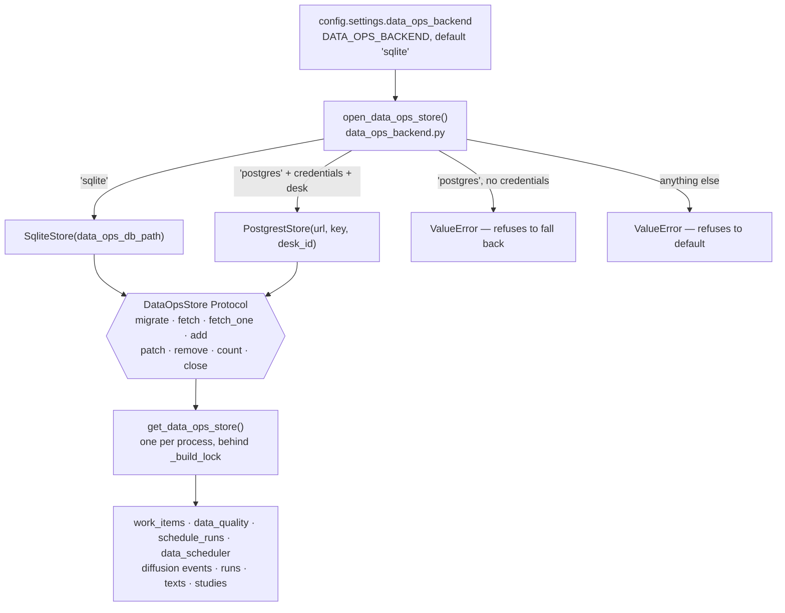

# The data-operations backend

**Last verified: 2026-09-02.** Every claim below names the module
or migration that makes it checkable; where a figure could not be re-measured
offline, it says so rather than being restated.

Eight logical tables now use the strict data-operations store. The original
four hold operational state the gateway must not forget across a restart:
`data_quality_findings`, `data_quality_escalations`, `data_schedule_runs` and
`data_work_items`. Four more hold the information-diffusion record:
`diffusion_events`, `diffusion_runs`, `diffusion_texts` and
`diffusion_studies`. `DATA_OPS_BACKEND` selects one store for all of them. The
successor migrations now cover the same logical schema on Postgres. Deployment
remains a separate manual operation; schema run `33633200876` applied and
verified the live project on 2026-09-02.

| | `sqlite` (default) | `postgres` |
|---|---|---|
| Storage | one file on the mounted data volume | Supabase, over PostgREST |
| Owner | [`modules/data_ops_store.py`](../../Part2_Infrastructure/modules/data_ops_store.py) — `SqliteStore` | [`modules/data_ops_postgrest.py`](../../Part2_Infrastructure/modules/data_ops_postgrest.py) — `PostgrestStore` |
| Needs | nothing | `SUPABASE_URL`, `SUPABASE_SERVICE_ROLE_KEY`, `SUPABASE_DESK_ID`, migrations applied |
| Id allocation | `MAX(...) + 1` inside a transaction, plus a counter table | a real sequence, via the `next_work_item_id` RPC |
| Versioned edit | `BEGIN IMMEDIATE` then `WHERE version=?` | `PATCH ?id=eq.X&version=eq.N` |
| Aggregates | `GROUP BY` in the query | the `data_quality_rollup` RPC, one round trip |

| Logical table/family | SQLite DDL in code | Postgres migration as of 2026-08-31 |
|---|---|---|
| quality findings and escalations | yes | yes — `20260820100000`, `20260820100100` |
| schedule runs | yes | yes — `20260820100200` |
| work items | yes | yes — `20260820100300` plus `next_work_item_id` |
| diffusion events | yes | yes — `20260823120000` plus parity migration `20260831120000` |
| diffusion studies | yes, including five `skill_*` columns | yes — `20260823130000` plus parity migration `20260831120000` |
| diffusion runs | yes | yes — `20260831120000` |
| diffusion texts | yes, including `vote_line` | yes — `20260831120000` |

There is a **ninth physical** table, and it exists on one side only:
`data_work_item_ids` (`modules/work_items.py:122`) is a `prefix → n` counter
that SQLite needs because it has no sequences. `_next_id` explains why it is not
just `MAX + 1`: the floor is the highest id still in the table, the counter is
the highest ever minted, and a delete lowers the first without lowering the
second — so an id a deleted row carried stays retired and an audit line naming
it keeps naming one thing. Postgres gets that property from the sequence for
free, which is why the counter table has no Postgres migration.

`DATA_OPS_BACKEND=postgres` is therefore complete in committed source for all
eight logical tables. `PostgrestStore.count()` projects the shared `desk_id`
column, and the store stamps its configured desk last on filters, inserts and
patches so a caller cannot replace the tenant boundary. Until the migrations
are applied, missing live relations still produce an honest error rather than
a silent SQLite fallback.

## The factory, and the bug that produced it

`modules/data_ops_backend.py` opens with the reason it exists, and it is worth
repeating because it is the failure this whole page guards against: the factory
used to live in `data_ops_store.py`, the config field existed, the tests passed
— and `grep -rn open_data_ops_store modules/ main.py` returned nothing but the
definition. Every production site constructed `SqliteStore` directly through the
`str` path argument, so **`DATA_OPS_BACKEND=postgres` selected a backend nothing
ever asked for**, and a commit message claimed the setting had "stopped being
inert" while it was still inert everywhere it mattered.

Three things came out of that, and each is held by a test in
[`tests/test_data_ops_backend.py`](../../Part2_Infrastructure/tests/test_data_ops_backend.py):



- **A Protocol, not a base class.** The two stores share no implementation — one
  wraps a `sqlite3` connection, the other an `httpx.Client` — so a common
  ancestor would be either an empty ABC or a place for one backend's assumptions
  to leak into the other. What they share is a shape.
  `test_both_backends_satisfy_the_declared_protocol` checks both structurally,
  so a method added to one and forgotten on the other fails in CI rather than on
  whichever deployment opted in. The raw-SQL helpers on `SqliteStore` are
  deliberately **absent** from the Protocol: they are the SQLite-only escape
  hatch for the quality ledger's aggregates, and declaring them would announce
  an interface PostgREST cannot honour.
- **One store per process.** `get_data_ops_store()` caches because the quality,
  work-item, scheduler and four diffusion stores all share it, and under
  Postgres each construction is an `httpx.Client` with
  its own pool — `data_scheduler._record_outcome` built a fresh store on *every
  job completion* and dropped it. `test_the_store_is_shared_rather_than_rebuilt`
  and `test_each_singleton_builds_through_the_configured_backend` hold it.
- **The build is serialised.** `_build_lock` exists because two threads that
  both find `_shared` unbuilt each construct a store, and two first-opens of one
  SQLite file at the same instant is a race SQLite answers with `database is
  locked` rather than waiting out. Double-checked locking, so the fast path
  costs one read.

## Why this state is not in the audit log

The audit log is DuckDB and its write helpers are **fire-and-forget by design**:
`_exec` swallows a failed write and `query` returns `[]`, because a lost TCA
snapshot must never take the order path down with it. `data_ops_store.py`'s
header states the corollary — that is the right contract for evidence and the
wrong one for *a work item a person just edited or a quality finding another
instance is about to read*. Those need a write that **raises** when it fails and
an UPDATE that reports whether it hit a row. Two stores, two failure contracts,
neither borrowed from the other.

Two SQLite constants carry measurements rather than defaults, and both are
argued in place:

- **`BUSY_TIMEOUT_S = 30.0`** (`PRAGMA busy_timeout=30000`). Python's default is
  five, and that was a CI flake: `PRAGMA journal_mode=WAL` is the first
  statement on every fresh connection and has to read the file; a WAL reader
  never waits for a WAL writer, but it does wait for the EXCLUSIVE lock the last
  connection takes as it closes to checkpoint the WAL — and on a loaded runner
  that checkpoint outlasted five seconds.
- **`_OPEN_LOCK`, one open at a time process-wide.** The busy timeout covers a
  lock another connection *holds*. It does not cover two connections in one
  process opening the same file at the same instant: measured on a fresh file
  with six threads released by a barrier, **2 of 240 opens failed at once** with
  `database is locked`, in 0.00 s, the busy handler never consulted.

## What the backend switch changes, and what it does not

For all eight logical tables, it removes the **storage** half of the
single-container boundary. Once the committed migrations are deployed, a
redeploy or a second container reads the same desk-scoped rows.

It does **not** make a second gateway process possible. The position book, the
resting-order book, the token bucket and the kill switch are process-local
mutable state, and
[`tests/test_container_contract.py`](../../Part2_Infrastructure/tests/test_container_contract.py)
fails the build on `--workers` or `gunicorn` with the reason inline: *"a second
worker forks the in-memory book and localises the kill switch."* That boundary
is a design decision with a test behind it, not an oversight.

## Turning it on

1. Apply the migrations. Either paste
   [`supabase/apply_all.generated.sql`](../../supabase/apply_all.generated.sql)
   into the Supabase SQL editor, or
   `supabase link --project-ref <ref> && supabase db push`. Alongside the seven
   original data-ops migrations, this requires Diffusion parity migration
   `20260831120000` and desk-scope guard `20260831121000`. The guard stops with
   an actionable error if any legacy row still carries the ambiguous
   `desk_id='default'`; map those rows deliberately, then rerun. Its exclusive
   lock and permanent check constraints also keep an old concurrent writer from
   recreating the sentinel during or after the transition.
2. Set `SUPABASE_URL`, `SUPABASE_SERVICE_ROLE_KEY` and `SUPABASE_DESK_ID`.
3. Set `DATA_OPS_BACKEND=postgres`.

Those steps enable all four operational families and all four Diffusion
ledgers. The opt-in live contract test must reach all eight before rollout is
called complete.

Step 2 is not optional and is not defaulted: selecting `postgres` without
credentials **raises at startup rather than falling back to SQLite**. A
fall-back would leave a deployment reporting one backend and using another, and
the `backend` field on `DataQualityView` and `WorkItemsResponse` would say
`sqlite` while somebody believed otherwise — a field nobody reads twice.

An unknown value — `DATA_OPS_BACKEND=postgress` — is refused for the same
reason, rather than defaulted to `sqlite`.

**The grants migration is part of the set, not an extra.**
`20260820100600_data_ops_grants.sql` revokes `execute` on
`data_quality_rollup` and `data_quality_provider_stats` from `public`, `anon`
and `authenticated` — they answered for anyone holding the anon key — and does
the same for `next_work_item_id`, which is worse in kind because it is not a
read: an anonymous caller could consume the id sequence, and the migration
records that two calls made while probing the project's schema did exactly
that. Its third section re-seeds the sequences, but **only on an empty table** —
`create sequence if not exists` cannot correct one that already exists, so a
burned number stays burned.

## Verifying it

`backend` is on the wire, typed `Literal["sqlite", "postgres"]` on both
`DataQualityView` (`modules/data_quality_models.py:114`) and `WorkItemsResponse`
(`modules/work_items.py:83`), and is read off the store rather than written as a
literal:

```bash
curl -s $GATEWAY/api/data-quality/view  | jq .backend
curl -s $GATEWAY/api/data/work-items    | jq .backend
```

Both models declare **every** field as required, for the reason
`DataQualityView`'s docstring gives: a response field with a default publishes
itself as optional in the OpenAPI contract, and a generated client would then
hedge against an absence that cannot happen.

Do not confuse this `backend` with the one on `DataJobAccepted` and
`DataJobsResponse` (`modules/schemas_data.py:51,65`). Those name the **job
queue's** executor — in-process or Celery — and are a different plane with a
different vocabulary. Same word, two questions.

## Every read and write is desk-scoped

`PostgrestStore` stamps `desk_id` on inserts and filters every read by it
without the caller asking — `test_every_read_is_desk_scoped_without_the_caller_saying_so`
and `test_insert_stamps_the_desk_and_asks_for_nothing_back_by_default` pin that.
The same predicate is inside the aggregate: `test_the_rollup_is_scoped_by_desk`
reads `20260820100400_data_quality_rollup.sql` for `desk_id = p_desk_id`,
because an unscoped rollup would aggregate every desk's findings into one desk's
panel.

The factory trims and requires `settings.supabase_desk_id`, passes it to
`PostgrestStore`, and refuses to build an unscoped Postgres store. The adapter
also requires an explicit desk when constructed directly. Migration
`20260831121000` refuses ambiguous legacy `desk_id='default'` rows before
dropping every unsafe desk default. It holds all eight tables through that
transition and adds `desk_id <> 'default'` constraints, so a rollout cannot
silently hide or race those rows.

## What the tests do and do not prove

[`tests/test_data_ops_postgrest.py`](../../Part2_Infrastructure/tests/test_data_ops_postgrest.py)
asserts the **request** this store builds — the `Prefer` headers, the filter
grammar, the conflict target — against `httpx.MockTransport`. That is where the
SQLite-to-PostgREST translation lives, and a test that only checked the parsed
response would pass with `Prefer` missing entirely. The request-construction
and refusal cases run everywhere, offline, with no credentials; re-run the file
rather than pinning a count that changes as contracts are added. They cover the
request it builds (`TestTheRequestItBuilds`) and how it refuses
(`TestItRefusesQuietly` — a 4xx raises rather than reading as no rows, the error
text never carries the key or the URL, a non-JSON 2xx raises rather than
returning nothing, and `migrate` issues no DDL).

The opt-in local live pass reaches all eight logical tables and skips with a
stated reason unless URL, service-role key and desk id are exported. The core
CI job remains network-free by design, so its green result proves request construction and
schema contracts; the explicit skip says it has not proved deployment state.

[`tests/test_data_quality_rollup.py`](../../Part2_Infrastructure/tests/test_data_quality_rollup.py)
pins `_AGGREGATE` in Python and `data_quality_rollup` in SQL to the same six
figures — `evaluated`, `passed`, `fatal`, `warn`, `drift`, `not_evaluated`
(`data_quality_read.py::_counts`). If one moves without the other, both backends
answer, neither errors, and they disagree about how many checks a provider
failed. It is the same shape as the gate-parity fixtures — mirrored maths,
asserted to stay mirrored — one level cheaper, because it compares **column
names** rather than results. Comparing results needs a live Postgres, which
network-free CI does not have. The file also guards its own reader: it asserts
that query text was recovered at all, so a scan that found nothing cannot read
as a clean bill of health.

## Boundaries still named rather than hidden

- **No live-Postgres result comparison in CI.** The rollup pair is pinned by
  column name only, for the reason above. Closing it needs a Postgres in the
  job, which is a different piece of work from a different budget.
- **No migration for `data_work_item_ids`.** It is deliberately SQLite-only; the
  Postgres side uses a sequence. A migration would create a table nothing reads.
- **The read path's SQL helpers are not in the Protocol**, so the quality
  ledger's aggregate path is genuinely two implementations rather than one
  interface with two drivers. That is why `test_data_quality_rollup.py` exists
  at all.

*Related: [`DATA_PROCESSING_FLOW.md`](DATA_PROCESSING_FLOW.md) for where these
tables sit in the data plane; [`TESTING.md`](../testing/TESTING.md) for the
opt-in skip and the trap that turns it into eighty 401s;
[`ARCHITECTURE.md`](ARCHITECTURE.md) for the single-writer boundary this page
only half-removes.*
