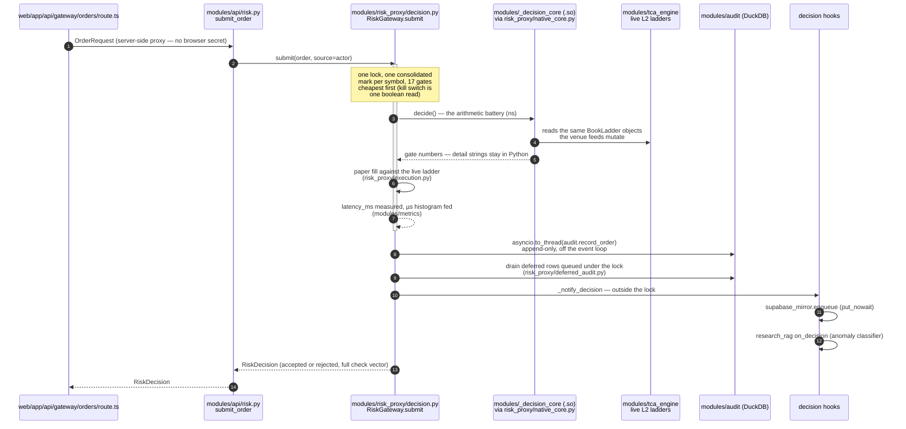
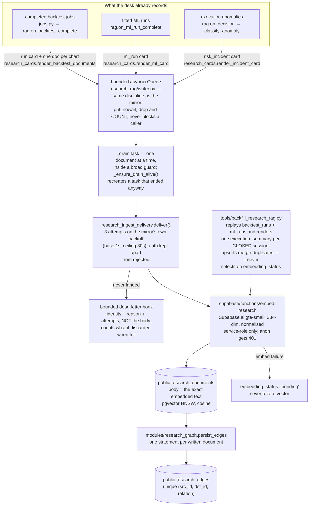

# Data processing flow — end to end

*Walked against the tree on 2026-08-22. Module paths are relative to
[`Part2_Infrastructure/`](../../Part2_Infrastructure/) unless they start with
`web/` or `supabase/`. This document names the hops; the arguments behind each
one live in [`Part2_Infrastructure/README.md`](../../Part2_Infrastructure/README.md)
(§2 Architecture, §3 Module A, §4 Module B, §RAG & ML) and the measured numbers
in [`LATENCY_BUDGET.md`](LATENCY_BUDGET.md). Where those documents argue a
point at length, this one states the conclusion and links.*

Four planes, deliberately kept apart:

| Plane | Cadence | Authoritative store | What breaks if it is absent |
|---|---|---|---|
| Market data in | streaming (100 ms venue ticks) | in-memory book ladders | synthetic fallback, labelled `synthetic: true` |
| Pre-trade decision | per order, µs | DuckDB audit log | nothing — this plane has no optional dependency |
| Corpus write (RAG) | per completed run / per anomaly | Supabase `research_documents` | the write path is a no-op; retrieval reports `unavailable` |
| Graph maintenance | 6 h sweep, daily partition | Postgres `research_edges` | Neo4j projection reports a named reason and the sweep carries on |

The separations are the design. The mirror cannot slow an order because its
enqueue is `put_nowait`; the corpus cannot slow an order because it hangs off
the same post-decision hook; the graph cannot corrupt the corpus because Neo4j
is a projection nothing reads to answer a request today.

---

## 1. Market data in

### Gateway side — two keyless venue WebSockets

[`modules/tca_engine/`](../../Part2_Infrastructure/modules/tca_engine/) owns
ingest. Both feeds are public and keyless — consolidated L2 depth needs no
credential:

- **Binance** ([`tca_engine/binance.py`](../../Part2_Infrastructure/modules/tca_engine/binance.py)) —
  `wss://stream.binance.com:9443/stream` (`BINANCE_WS_URL` in
  [`config.py`](../../Part2_Infrastructure/config.py)), consumed as
  `<symbol>@depth20@100ms`: a self-contained top-20 snapshot every 100 ms. The
  diff stream was rejected deliberately — it needs a REST snapshot plus
  buffered-delta reconciliation that silently corrupts the book if one message
  drops, and for a 20-level paper-desk probe the partial stream is strictly
  more robust.
- **Bybit** ([`tca_engine/bybit.py`](../../Part2_Infrastructure/modules/tca_engine/bybit.py)) —
  `wss://stream.bybit.com/v5/public/spot`, `orderbook.50` as snapshot + delta,
  because Bybit sequence-tags it: `u` increments by exactly 1 per delta, and
  any other step is a gap that forces a resubscribe rather than a quietly
  wrong ladder.

Supervision, reconnection with exponential backoff and heartbeats live in
[`tca_engine/supervision.py`](../../Part2_Infrastructure/modules/tca_engine/supervision.py)
and [`feed.py`](../../Part2_Infrastructure/modules/tca_engine/feed.py); the
ladder itself in [`book.py`](../../Part2_Infrastructure/modules/tca_engine/book.py).
When every feed is unreachable (an offline demo), a synthetic random-walk book
keeps the system demonstrable — and every payload derived from it carries
`synthetic: true`, because a demo that presents generated numbers as measured
ones is the failure this codebase is most alert to. A venue going dark is also
broadcast as an alert, not just logged: quotes from a stale book are not safe
to size against.

### Web side — the provider registry

The workspace's serverless routes never fetch from the browser; routing lives
in [`web/lib/marketdata.ts`](../../Part2_Infrastructure/web/lib/marketdata.ts)
and the registry in
[`web/lib/providers/registry.ts`](../../Part2_Infrastructure/web/lib/providers/registry.ts).
The roster in [`web/lib/providers/adapters.ts`](../../Part2_Infrastructure/web/lib/providers/adapters.ts)
is, in ranked order: `bybit`, `binance`, `fmp`, `tiingo`, `massive`,
`alphavantage`, `firecrawl`, `openbb` — seven external vendors plus the desk's
own stateless [`OpenBB_Service/`](../../Part2_Infrastructure/OpenBB_Service/),
which is why the registry's own prose says "one façade over seven vendors"
while the array holds eight adapters. Crypto pairs go keyless to venue klines;
equities and FX go through the keyed vendors with quota, breaker and failover
policy applied per attempt (`runtime.ts`, `dispatch.ts`). When nothing can
answer, a deterministic seeded synthetic series keeps the research workflow
demonstrable, and every response names its source — the alternative, an
unlabelled fallback, would let a synthetic bar masquerade as a real close.

`consensusQuote` (`providers/consensus.ts`) exists because this is a trading
tool: the expensive failure is not an outage (outages are loud) but one feed
going stale while still returning HTTP 200 with a plausible price. One source
cannot detect that about itself; two can.

---

## 2. The pre-trade path: intent to audit row

The only way an order reaches a venue is `POST /api/orders`
([`modules/api/risk.py`](../../Part2_Infrastructure/modules/api/risk.py)
`submit_order`), whether the intent came from the workspace's server-side
proxy ([`web/app/api/gateway/orders/route.ts`](../../Part2_Infrastructure/web/app/api/gateway/orders/route.ts)),
the Telegram companion, or curl. A rejection is a result, not an error — the
full check vector comes back either way.



The hops, and why they sit where they do:

- **Gates** — one function in
  [`modules/risk_proxy/decision.py`](../../Part2_Infrastructure/modules/risk_proxy/decision.py),
  deliberately: every gate reads state the previous one may have derived, the
  battery runs under one lock, and the budget is sub-millisecond, so a call
  boundary between two gates would be paid on every order for a tidier file.
  Seventeen gates are defined in
  [`risk_proxy/gates.py`](../../Part2_Infrastructure/modules/risk_proxy/gates.py);
  deny-by-default on ambiguity (no live mark → reject, never guess).
- **The C++ core** —
  [`native/decision_core/decision_core.cpp`](../../Part2_Infrastructure/native/decision_core/decision_core.cpp),
  built into `modules/_decision_core*.so` and selected by
  [`modules/decision_core.py`](../../Part2_Infrastructure/modules/decision_core.py)
  (`DECISION_CORE=auto|native|python`; Python is the reference and the
  twenty-scenario parity fixture pins both to bit-exact decisions). Only the
  numbers come from C++; control flow and every `add("<name>", ...)` literal
  stay in Python, which is what the mirror's enum mapping test harvests.
  Which engine is live is published on `/health`, `/metrics` and the ops
  snapshot — a build that fell back is visible on the desk, not only in a log.
- **Three latency planes, never blended** — the whole decision in µs
  (`latency_ms` on the decision is that order's single sample; the histogram
  is where the tail lives), the core battery in ns (self-measured at startup
  on a synthetic two-venue book, so the figure exists before the first order),
  the network in ms. Measured values and methods:
  [`LATENCY_BUDGET.md`](LATENCY_BUDGET.md) — decision ~12 µs p50 compiled
  on the dev Mac, core 83 ns there and ~320 ns on the production VM, as of the
  dates that document states.
- **Audit** — [`modules/audit/`](../../Part2_Infrastructure/modules/audit/):
  DuckDB, append-only by convention that nothing violates (no UPDATE or
  DELETE against `orders`/`risk_events`), SQLite fallback when DuckDB is
  genuinely unavailable — but a *second live process* on the same file raises
  `AuditLedgerConflict` instead of silently forking the ledger
  ([`audit/store.py`](../../Part2_Infrastructure/modules/audit/store.py)).
  Writers are best-effort: an audit outage must never be the reason an order
  does not go out. Rows produced while the lock is held are queued and drained
  after release ([`risk_proxy/deferred_audit.py`](../../Part2_Infrastructure/modules/risk_proxy/deferred_audit.py)).
  A resting order gets no `orders` row until it terminates — that table is one
  row per order, written once, at the terminal state; the acceptance is
  already in `order_events`.
- **The Supabase mirror** —
  [`modules/supabase_mirror.py`](../../Part2_Infrastructure/modules/supabase_mirror.py),
  registered in [`main.py`](../../Part2_Infrastructure/main.py) as a
  post-decision hook. Structurally incapable of touching the order path:
  `enqueue` is `put_nowait` into a bounded queue
  (`SUPABASE_MIRROR_QUEUE_MAX`, default 1000); a full queue **counts the
  drop** instead of waiting. A single drain task batches rows to PostgREST's
  `/rest/v1/rpc/record_alphaengine_decision`, landing in
  `public.order_blotter` with `decided_by` provenance, measured `latency_ms`
  and the full check vector. Failures retry with capped backoff, then give up
  into a counter — never let mirror failures break trading, and count what was
  lost rather than pretending it arrived. `supabase-py` was rejected for plain
  `httpx` to keep CI's import graph network-free. **Absent** `SUPABASE_URL` /
  `SUPABASE_SERVICE_ROLE_KEY`, every method is a no-op — the designed default,
  and what keeps the suite green with zero environment.

---

## 3. The research corpus write path

Semantic recall over what the desk already records — no new instrumentation.
The write path is **off by default**: it needs `RESEARCH_RAG_ENABLED=1` *and*
the Supabase credentials ([`config.py`](../../Part2_Infrastructure/config.py));
unconfigured, [`modules/research_rag/writer.py`](../../Part2_Infrastructure/modules/research_rag/writer.py)
is a no-op and retrieval reports `unavailable` — never `[]`, because "searched,
found nothing" is a different fact from "could not search".



The rules that make the corpus trustworthy, each with its reason:

- **The anomaly trigger is precise, not vibes** — an *accepted* fill whose
  realised `slippage_bps` exceeds the pre-trade ceiling
  (`max_est_slippage_bps` — the estimate was wrong, the interesting case), a
  rejection citing `est_slippage` or `daily_drawdown`, or the drawdown breaker
  engaging. Defined in `classify_anomaly`
  ([`modules/research_cards.py`](../../Part2_Infrastructure/modules/research_cards.py)).
- **`body` stores the exact text that was embedded**, so a renderer change can
  never silently invalidate stored vectors.
- **An embed outage stores `embedding_status='pending'` — never a zero
  vector**, which is equidistant from everything and would rank as "similar"
  to any query. **The backfill tool does not sweep those rows.** It never
  selects on `embedding_status`; it re-derives every source row it can reach
  and upserts `merge-duplicates`, so a pending document is rewritten with a
  fresh embedding as a *side effect* of its source row being re-rendered. A
  pending document whose source row falls outside `--limit` — or whose kind the
  backfill does not emit, which is every `chart` — is not repaired by it. A
  query that selects the pending rows and re-embeds only those does not exist.
- **A document that cannot be delivered is dead-lettered, not discarded.** The
  drain retries three times on the same backoff curve
  [`modules/supabase_mirror.py`](../../Part2_Infrastructure/modules/supabase_mirror.py)
  uses and keeps its closed reason vocabulary — `auth` deliberately apart from
  `rejected`, because an expired service-role key is an operator's problem and a
  rejected row is a developer's. What still never lands goes into a bounded
  in-memory book that records the failure's *identity* (kind, source_ref,
  reason, detail, attempts, at) rather than its body — the body is the embedded
  text and can be kilobytes — and counts what it discarded when full, since a
  bounded buffer that forgets silently is the same defect as the counter it
  replaced. `status()` reports the depth, the discards and the recent entries.
  It is a **diagnosis, not a durable replay queue**: replaying a dead letter is
  still the backfill tool's job, and nothing re-submits automatically.
- **The drain supervises itself, weakly and on purpose.** It processes one
  document at a time inside a broad `except Exception` (re-raising
  `CancelledError` so `stop()` still works), because the fault that once killed
  the task was an HTML 502 served as a 200: `embed_many` caught only
  `httpx.HTTPError` while `response.json()` raised a `ValueError`. And
  `_ensure_drain_alive()` recreates a task that ended anyway — but only on the
  submit path, so a drain that dies while the queue is idle is revived by the
  next submission rather than immediately. A watchdog loop was the rejected
  alternative: a second task to watch the first is one more thing that can die
  quietly.
- **Charts become text documents** — one per chart, with kind `chart` and
  `source_ref` `<job_id>:<chart>`, described from the figures the desk
  computed in order to draw them. No image is embedded: the Edge runtime's
  gte-small session takes no image, so a chart is retrievable by what it says.
- **Document kinds** — the enum
  ([`supabase/migrations/20260808120400_pgvector_research_documents.sql`](../../supabase/migrations/20260808120400_pgvector_research_documents.sql)
  and its successors) carries `backtest_run`, `chart`, `execution_summary`,
  `ml_run`, `risk_incident`. **Honest status:** `execution_summary` now has a
  producer — [`modules/research_ingest_session.py`](../../Part2_Infrastructure/modules/research_ingest_session.py)
  renders one card per closed UTC session from figures that already exist
  (`session_costs` for fills, notional, fees and realised slippage cost;
  `equity_history` for the closing book; three grouped selects over `orders` for
  the decision counts, the strategies traded and the venue mix), with every
  absent figure written "not recorded" and an unpriced fill turning the slippage
  cost into an explicit lower bound rather than a number. Closure is read from
  the desk's **own** record: consecutive `session_rollover` rows in
  `risk_events` bracket exactly one session, so the current session is never
  summarised and a desk that was down over a boundary is handled for free.
  **But its only caller is `tools/backfill_research_rag.py`.** Nothing emits one
  in process — that needs a hook at the rollover site in
  `modules/risk_proxy/` — so on a running desk the summaries appear when the
  backfill is run and not before. The diagram above shows it on the backfill
  arm for that reason, not on the live one.

Retrieval (three fused arms — pgvector, Postgres FTS, Okapi BM25 in
[`modules/research_bm25.py`](../../Part2_Infrastructure/modules/research_bm25.py) —
then the optional ONNX cross-encoder re-ranker and the optional Gemini
generation stage) is the README's subject, not this document's: see
[§RAG & ML](../../Part2_Infrastructure/README.md#rag--ml). The absence
behaviour is the part that belongs here: no `RERANK_MODEL_PATH` means the RRF
order stands and `rerank_state` says why; no `GEMINI_API_KEY` means every
`/api/research/rag/ask` answers `verdict: refused` with the reason, and the
desk runs exactly as before. The surfaces are
`POST /api/research/rag/search`, `POST /api/research/rag/ask`,
`GET /api/research/rag/status`, `GET /api/research/graph/communities` and
`GET /api/research/graph/centrality`
([`modules/api/research.py`](../../Part2_Infrastructure/modules/api/research.py)).

---

## 4. The derived-edge reconcile sweep (6 h) and its Neo4j projection

`persist_edges` runs as each document is written, over the candidates that
existed *at that moment* — so a backtest filed on Monday is never joined to
the incident that arrives on Friday. Nothing event-driven looks back;
[`modules/research_reconcile.py`](../../Part2_Infrastructure/modules/research_reconcile.py)
does, on a bounded budget, through the **same linker** — `derive_edges` is
never called there, because a sweep that normalised edge direction even
slightly differently from the write path would write the reverse of an
existing edge and the unique constraint would not catch it.

The schedule is [`modules/research_schedule.py`](../../Part2_Infrastructure/modules/research_schedule.py),
started from `main.py` beside the data scheduler. Its defaults:

```
reconcile:graph@every=6h          # backlog accumulates at the rate documents
reconcile:communities@every=1d    # are written out of order, not per clock tick
```

Not Celery beat, deliberately: `celery_tasks` is imported only when a broker
is configured, so a beat reconciler would not exist on the default deployment
— and reconciliation that runs only on the scaled topology is not
reconciliation. Each 6 h tick sweeps at most `RECONCILE_BATCH = 200`
documents, carries a cursor in the job params and nothing module-level, defers
with doubling backoff when a dependency is unreachable, and **never deletes**:
a relation that stopped being derivable keeps its row, because a pruning rule
that separates "no longer true" from "not re-derived because the window moved"
is not written yet.

Each tick then projects the edges it touched into **Neo4j** via
[`modules/research_graph_projection.py`](../../Part2_Infrastructure/modules/research_graph_projection.py).
Postgres stays authoritative; the projection MERGEs, is idempotent, and
nothing else writes to the graph — so drift is a non-event: drop the graph and
re-project. A dual write was rejected because two writers are two systems that
must agree, and drift between an authoritative store and a copy is only
detectable if somebody goes looking.

**Two routes now read it back.** `GET /api/research/graph/communities` and
`/centrality` try
[`modules/research_graph_read_model.py`](../../Part2_Infrastructure/modules/research_graph_read_model.py)
first and fall back to the in-process networkx computation, marking
`source: "neo4j" | "corpus"` and carrying the read model's refusal whole so the
reason is always readable. Nothing is invented there: modularity, seed,
resolution and damping are not stored in the graph and are absent rather than
restated, and labels from two different sweeps refuse as "mid-rebuild", because
community ids are comparable only within one sweep and a half-finished re-label
is otherwise indistinguishable from a good partition. A writer may not read its
own output — the sweep itself is forced onto the corpus path, since a sweep that
read its last partition back would be a fixpoint. **Request-time traversal is
still Postgres**: `/{document_id}` runs the recursive CTE, and no request path
depends on the graph being up. **Absent** `NEO4J_URI`, or with the optional
driver
(`requirements-graph.txt`) uninstalled, the projection reports a named reason
in the sweep report — never an exception, never a silent success — and the
sweep carries on: "could not project" and "there was nothing to project" stay
distinguishable at the call site.

A third scope, `reconcile:chart_docs`, is declared in the vocabulary but is
**unscheduled and unimplemented**: `research_schedule.py` names its entry
points and stamps its report "stale text not assessable" every time, but no
`reconcile_chart_docs` exists on `research_reconcile`, so a cadence today would
file a failed job each tick. The stale-text half is honest by design — a chart
document's metrics are overwritten at write time, so the figures behind the
sentence are discarded and cannot be re-checked.

---

## 5. The daily whole-corpus community sweep

`reconcile:communities@every=1d` resolves to `reconcile_communities`
([`modules/research_graph_reads.py`](../../Part2_Infrastructure/modules/research_graph_reads.py),
re-exported by `research_reconcile` for the scheduler's name resolution, and
deliberately *not* defined there — a reconciliation tick carries one window's
edges, and the fence keeps the whole-corpus partition from ever looking like a
passenger on the 6 h tick).

The partition itself is
[`modules/research_communities.py`](../../Part2_Infrastructure/modules/research_communities.py):
seeded Louvain over the same derived edges, in-process via networkx — not
Neo4j GDS, because Louvain and PageRank live in an Enterprise library the Aura
Free tier does not have, and the obvious next commit after a projection lands
is one that assumes it does.

**Louvain is seeded; PageRank is not, and that is not an omission.** Louvain
visits nodes in a shuffled order and the partition it settles on depends on that
order, so an unseeded run makes "cluster 3" mean nothing a week later — the seed
is what buys a citable id. `nx.pagerank` takes no seed at all: it is a
power-iteration on a fixed matrix, deterministic by construction, and its
reproducibility comes from the canonical node insertion order plus pinned
`MAX_ITER` and `TOLERANCE`. Documentation that called it "seeded PageRank" was
describing an argument the function does not accept. Determinism is pinned on
both (fixed seed where one exists, canonical insertion order, communities
numbered largest-first) because a community id gets cited — though only for a
fixed edge set: adding one document can legitimately renumber clusters, so cite
a community by its members or by (sweep, id), never the bare integer.

The sweep writes **both** label sets back off the same whole-corpus read — the
community labels and the centrality scores, each stamped with the job id that
made them — because without a centrality writer the centrality read path could
never succeed. The GET routes fix `project=False`, because a read that writes
would let any crawler, prefetch or retry repartition the desk's graph; the
corollary is that the sweep is also barred from *reading*, since a sweep that
read its last partition back would be a fixpoint. **Absent** networkx
(`requirements-communities.txt`, optional — the normal deployment), the report
names the reason; an empty edge list is *not* that — it is a successful
partition of nothing, `detected: True` with zero communities.

---

## 6. Not built, and absences by design — the summary table

| Thing | Status |
|---|---|
| `execution_summary` documents | **Built, backfill-only** — the producer (`research_ingest_session.py`) is real, tested and called by `tools/backfill_research_rag.py`; **no in-process emission**, because that needs a hook at the session-rollover site in `modules/risk_proxy/`. On a running desk they appear when the backfill is run |
| Re-embedding the `pending` rows | **NOT BUILT** — nothing selects on `embedding_status`; the backfill repairs a pending row only as a side effect of re-deriving its source row |
| Automatic replay of a dead-lettered document | **NOT BUILT** — the book is in-memory, bounded and inspectable through `status()`; nothing re-submits from it |
| Edge pruning in the reconcile sweep | **NOT BUILT** — rows are never deleted; the rule distinguishing "no longer true" from "not re-derived" is unwritten |
| `chart_docs` reconcile scope | declared, **unscheduled and unimplemented** — no entry point exists on `research_reconcile`; stale chart text is honestly not assessable |
| Multimodal / image embedding | **NOT BUILT** — charts are embedded as the text of their own figures; there is no vision model in this path |
| Neo4j on the request path | **partly** — `/communities` and `/centrality` read the sweep's labels back and fall back to the in-process computation, saying which answered (`source`); request-time *traversal* is still the Postgres CTE, and no request path depends on the graph being up. The algorithms are not run inside Neo4j: GDS is not on Aura Free and cannot be installed in CI |
| `/api/research/rag/ask` in the UI | **no consumer** — the workspace proxies `/search` only; `/ask` is reachable, contract-pinned and auth-covered, but nothing in `web/` calls it |
| RLS on `research_documents` | **still bypassed** — the gateway reads with the service-role key and the writer sets no `user_id`. What landed is an optional `filter_desk_id` predicate on both retrieval RPCs, off by default, refusing rather than reading wide when it is on and cannot be applied |
| The re-ranker's real ONNX weights in CI | **NOT RUN** — they would have to be downloaded and this suite is network-free by construction; the ONNX path is exercised through a fake cross-encoder at the import seam |
| Supabase absent | mirror and corpus writes are no-ops; retrieval returns typed `unavailable`, never `[]` |
| Gemini absent | `/api/research/rag/ask` answers `verdict: refused` with the reason |
| Re-ranker absent | RRF order stands; `rerank_state` says why |
| Neo4j / networkx absent | sweep reports the named reason and keeps ticking |

Related reading: [`FEATURE_TOUR.md`](../product/FEATURE_TOUR.md) for the same system
walked as the desk's decision loop, [`DATA_OPS_BACKEND.md`](DATA_OPS_BACKEND.md)
for the four data-operations tables and their storage choice, and
[`TLS_FLIP.md`](../engineering/TLS_FLIP.md) for how the mirror's host is reached without
the token crossing the internet in cleartext.
