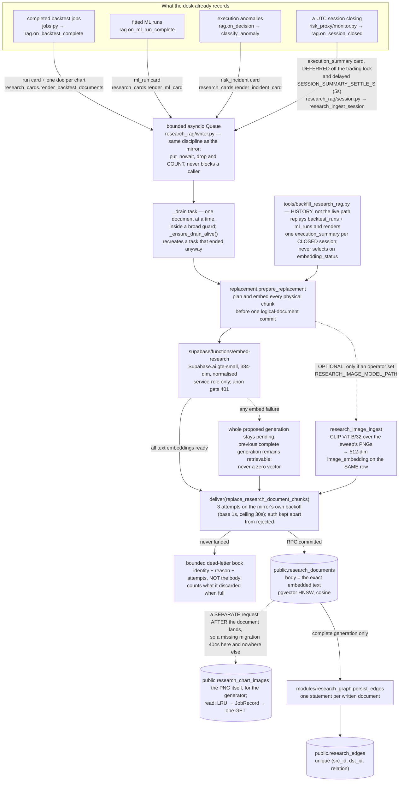

# Data processing flow — end to end

**Source/worktree and release evidence audited: 2026-09-02.** Module paths are relative to
[`Part2_Infrastructure/`](../../Part2_Infrastructure/) unless they start with
`web/` or `supabase/`. This document names the hops; the arguments behind each
one live in [`Part2_Infrastructure/README.md`](../../Part2_Infrastructure/README.md)
(§2 Architecture, §3 Module A, §4 Module B, §RAG & ML) and the measured numbers
in [`LATENCY_BUDGET.md`](LATENCY_BUDGET.md). Where those documents argue a
point at length, this one states the conclusion and links. The audit describes
source, bundled schema and the named September 2 deployment/E2E runs.
[`ARCHITECTURE.md`](ARCHITECTURE.md) is the map — what the pieces are and where
they run. This is the territory: what one request actually touches.*

**Read §2 first if you read only one section.** It follows a single order from a
button in a browser to a row in DuckDB and back, naming every file it passes
through and every way it can degrade. Everything else here is a variation on
that shape.

Seven planes, deliberately kept apart:

| Plane | Cadence | Authoritative store | What happens if its dependency is absent |
|---|---|---|---|
| Market data in | streaming (100 ms venue ticks) | in-memory book ladders | synthetic fallback, labelled `synthetic: true` |
| Pre-trade decision | per order, µs | DuckDB audit log | nothing — this plane has no optional dependency |
| Corpus write (RAG) | per completed run / per anomaly / per closed session | Supabase `research_documents` | the write path is a no-op; retrieval reports `unavailable` |
| Graph maintenance | 6 h sweep, daily partition | Postgres `research_edges` | Neo4j projection reports a named reason and the sweep carries on |
| Kalshi book tape | one poll every `COHERENCE_POLL_S`, off by default | its **own** DuckDB file (`coherence.duckdb`) | the recorder does not start; every coherence route still answers with a `state` discriminator saying which part is missing |
| Diffusion measurement ledger | per event, fetched text, measured stage and study run | strict data-ops store: SQLite by default; Postgres after the parity and desk-scope-guard migrations are deployed | routes report `unavailable`/`unreadable`; a writer raises. The current source and generated bundle cover runs, texts, current study columns and the shared `desk_id` count path. Live parity still depends on applying those migrations and setting `SUPABASE_DESK_ID` — `DATA_OPS_BACKEND.md` owns that rollout boundary |
| In-database VaR | on demand, from the workspace | Oracle Autonomous Database | a typed `oracle_not_configured`; the client-side VaR on the same tab is unaffected |

The separations are the design. The mirror cannot slow an order because its
enqueue is `put_nowait`; the corpus cannot slow an order because it hangs off
the same post-decision hook — and where it hangs off a *trading-state
transition* instead, as the session summary does, the work is deferred onto a
worker thread precisely so a table scan never lands inside the trading lock
(§3); the Kalshi tape cannot stall the ledger because it is a different DuckDB
file with a different write contract; the graph cannot corrupt the corpus
because Neo4j is a **projection** — Postgres owns `research_edges`, the sweep
only MERGEs derived state in, and drop-and-re-project is the repair. This line used to end
"a projection nothing reads to answer a request", and that is no longer true:
`/communities` and `/centrality` read the sweep's labels back (§4). The
separation survives the change intact, because those two try the projection and
**fall back to the in-process computation**, saying which answered — so no
request path depends on the graph being up, and request-time traversal is still
the Postgres CTE.

That optional read-back is not a multi-tenant boundary: projected Neo4j nodes
and the community/centrality Cypher reads do not carry `desk_id`. When
`RESEARCH_SCOPE_TO_DESK=1`, the source read-model guard refuses Neo4j before
opening its driver and both reports automatically use the desk-scoped Postgres
corpus fallback. With the flag off, use Neo4j only for one desk or an isolated
database. E2E run `33633746350` verified the live projection with 15 documents,
48 edges and 2 communities.

---

## 1. Market data in

### Gateway side — two keyless venue WebSockets

[`modules/tca_engine/`](../../Part2_Infrastructure/modules/tca_engine/) owns
ingest. Both feeds are public and keyless — consolidated L2 depth needs no
credential:

- **Binance** ([`tca_engine/binance.py`](../../Part2_Infrastructure/modules/tca_engine/binance.py)) —
  `wss://stream.binance.com:9443/stream` (`BINANCE_WS_URL` in
  [`config.py`](../../Part2_Infrastructure/config.py)), consumed as
  `<symbol>@depth20@100ms`: a self-contained top-20 snapshot every 100 ms. The
  diff stream was rejected deliberately — it needs a REST snapshot plus
  buffered-delta reconciliation that silently corrupts the book if one message
  drops, and for a 20-level paper-desk probe the partial stream is strictly
  more robust.
- **Bybit** ([`tca_engine/bybit.py`](../../Part2_Infrastructure/modules/tca_engine/bybit.py)) —
  `wss://stream.bybit.com/v5/public/spot`, `orderbook.50` as snapshot + delta,
  because Bybit sequence-tags it: `u` increments by exactly 1 per delta, and
  any other step is a gap that forces a resubscribe rather than a quietly
  wrong ladder.

Supervision, reconnection with exponential backoff and heartbeats live in
[`tca_engine/supervision.py`](../../Part2_Infrastructure/modules/tca_engine/supervision.py)
and [`feed.py`](../../Part2_Infrastructure/modules/tca_engine/feed.py); the
ladder itself in [`book.py`](../../Part2_Infrastructure/modules/tca_engine/book.py).
When every feed is unreachable (an offline demo), a synthetic random-walk book
keeps the system demonstrable — and every payload derived from it carries
`synthetic: true`, because a demo that presents generated numbers as measured
ones is the failure this codebase is most alert to. A venue going dark is also
broadcast as an alert, not just logged: quotes from a stale book are not safe
to size against.

### Web side — the provider registry

The workspace's serverless routes never fetch from the browser; routing lives
in [`web/lib/marketdata.ts`](../../Part2_Infrastructure/web/lib/marketdata.ts)
and the registry in
[`web/lib/providers/registry.ts`](../../Part2_Infrastructure/web/lib/providers/registry.ts).
The roster in [`web/lib/providers/adapters.ts`](../../Part2_Infrastructure/web/lib/providers/adapters.ts)
is, in ranked order: `bybit`, `binance`, `fmp`, `tiingo`, `massive`,
`alphavantage`, `firecrawl`, `openbb` — seven external vendors plus the desk's
own stateless [`OpenBB_Service/`](../../Part2_Infrastructure/OpenBB_Service/),
which is why the registry's own prose says "one façade over seven vendors"
while the array holds eight adapters. Crypto pairs go keyless to venue klines;
equities and FX go through the keyed vendors with quota, breaker and failover
policy applied per attempt (`runtime.ts`, `dispatch.ts`). When nothing can
answer, a deterministic seeded synthetic series keeps the research workflow
demonstrable, and every response names its source — the alternative, an
unlabelled fallback, would let a synthetic bar masquerade as a real close.

`consensusQuote` (`providers/consensus.ts`) exists because this is a trading
tool: the expensive failure is not an outage (outages are loud) but one feed
going stale while still returning HTTP 200 with a plausible price. One source
cannot detect that about itself; two can.

---

## 2. The pre-trade path, end to end: a button to a DuckDB row and back

This is the path worth reading in full, because every other flow in this
document is a variation on it. One order, traced concretely: what arrives, what
it touches, what it writes, what it returns, and every place it can degrade.

The only way an order reaches a venue is `POST /api/orders`
([`modules/api/risk.py`](../../Part2_Infrastructure/modules/api/risk.py)
`submit_order`), whether the intent came from the workspace's server-side
proxy ([`web/app/api/gateway/orders/route.ts`](../../Part2_Infrastructure/web/app/api/gateway/orders/route.ts)),
the Telegram companion, or curl. A rejection is a result, not an error — the
full check vector comes back either way.

```mermaid
sequenceDiagram
    autonumber
    participant T as components/execution/OrderTicket.tsx
    participant W as web/app/api/gateway/orders/route.ts
    participant G as web/lib/gateway.ts<br/>callGateway
    participant API as modules/api/risk.py<br/>submit_order
    participant D as modules/risk_proxy/decision.py<br/>RiskGateway.submit
    participant C as modules/_decision_core (.so)<br/>via risk_proxy/native_core.py
    participant B as modules/tca_engine<br/>live L2 ladders
    participant A as modules/audit (DuckDB)
    participant H as decision hooks

    T->>W: POST /api/gateway/orders, AbortSignal.timeout(ORDER_TIMEOUT_MS)<br/>same origin, no credential in the bundle
    W->>W: operator guard, then parseOrder — every field validated<br/>and REJECTED, never coerced (400)
    opt equity symbol
        W->>W: provider quote on the trusted server →<br/>paper_execution reference; no quote is a 503, never a guessed fill
    end
    W->>G: callGateway("/api/orders"), 8 s deadline
    G->>API: OrderRequest + ALPHAENGINE_GATEWAY_TOKEN (server-side only)
    API->>D: submit(order, source=actor)
    activate D
    Note over D: one lock, one consolidated<br/>mark per symbol, 17 gates<br/>cheapest first (kill switch is<br/>one boolean read)
    D->>C: decide() — the arithmetic battery (ns)
    C->>B: reads the same BookLadder objects<br/>the venue feeds mutate
    C-->>D: gate numbers — detail strings stay in Python
    D->>D: paper fill against the live ladder<br/>(risk_proxy/execution.py)
    D-->>D: latency_ns measured, µs histogram fed<br/>(modules/metrics/decision_latency.py)
    deactivate D
    D->>A: asyncio.to_thread(audit.record_order) — ONLY if status != WORKING;<br/>a resting order's acceptance is already in order_events
    D->>A: drain deferred rows queued under the lock<br/>(risk_proxy/deferred_audit.py)
    D->>H: _notify_decision — outside the lock
    H->>H: supabase_mirror.enqueue (put_nowait, drop and COUNT)
    H->>H: research_rag on_decision (anomaly classifier)
    D-->>API: RiskDecision (accepted or rejected, full check vector)
    API-->>G: RiskDecision
    G-->>W: GatewayResult — ok, or a CLASSIFIED failure (never a relayed 401)
    W-->>T: HTTP 200 either way; a rejection is the check vector, not an error page
```

### The nine hops, named

1. **The browser posts to its own origin.** `components/execution/OrderTicket.tsx`
   sends to `/api/gateway/orders` with `AbortSignal.timeout(ORDER_TIMEOUT_MS)`.
   It never holds a gateway credential and never learns the gateway's address.
   Its deadline is deliberately *longer* than the server's, so a slow-but-real
   verdict is not discarded and misreported as a transport failure — pinned by
   `web/tests/null-honesty.test.ts`.
2. **The proxy checks the operator gate before it checks anything else.**
   `web/app/api/gateway/orders/route.ts` runs `guardMode()` / `authorisePaperOrder`
   (`web/lib/operator.ts`). Reaching the gateway and being allowed to *move*
   something are separate questions. When the guard is `locked` **because no
   operator token exists**, the rejection carries a `blockers` array naming every
   missing dependency at once — including `ALPHAENGINE_GATEWAY_URL` if that is
   absent too — because one rejection should name every blocker it knows rather
   than revealing them one round trip at a time.
3. **Every field is validated and rejected, never coerced.** `parseOrder` bounds
   the symbol to `/^[A-Z0-9.\-]{1,20}$/`, the side to `BUY|SELL`, the type to
   `MARKET|LIMIT`, and the notional to `MAX_NOTIONAL = 100_000_000`. A notional
   arriving as `"1e9"` or a side of `SIDEWAYS` is a **400**; silently
   substituting a default would mean the trader's screen and the audit log
   disagree about what was asked for.
4. **An equity order acquires its mark on the trusted server.** The gateway has
   Binance/Bybit L2 and no equities, so for `classify(symbol) === "equity"` the
   proxy fetches a provider quote and attaches
   `buildPaperExecutionReference(...)`. `parseOrder` deliberately ignored any
   browser-supplied field of that name, so a caller cannot choose its own mark
   or its own provenance. No quote → **503 `equity_quote_unavailable`**, and the
   order is not sent: a provider outage never becomes a guessed fill.
5. **One hop crosses the network, with the credential attached server-side.**
   `callGateway` (`web/lib/gateway.ts`) resolves the base URL, attaches
   `ALPHAENGINE_GATEWAY_TOKEN`, bounds the wait at `DEFAULT_TIMEOUT_MS = 8_000`,
   and validates that the 200 it got back actually has an `accepted` key before
   the app renders it.
6. **The gateway decides under one lock.** `submit_order` hands straight to
   `RiskGateway.submit` (`modules/risk_proxy/decision.py`, 349 lines, of which
   `submit` is deliberately **one** function — every gate reads state the
   previous one may have just derived, and the module docstring says a split
   putting a call boundary, an allocation or an attribute indirection between
   two gates would be paid on every order for a tidier file). Inside `async with self._lock` it memoises one consolidated
   mark per symbol for the life of the decision, then walks the seventeen gates
   cheapest-first — `kill_switch` is a single boolean read and is always first.
   The compiled core owns the numbers; the control flow, the detail strings and
   every `add("<name>", ...)` literal stay in Python, which is what
   `modules/risk_proxy/gates.py` declares and `tests/test_supabase_schema.py`
   harvests.
7. **The verdict is assembled, and the clock is read before anything is
   written.** `latency_ns = time.perf_counter_ns() - t0` and
   `observe_decision_latency(latency_ns / 1000.0)` feed the **microsecond**
   histogram; the `latency_ms` field on the decision is that one order's single
   sample and always will be. `status` is one of `FILLED`, `WORKING`, `EXPIRED`
   or `REJECTED` — and `EXPIRED` exists because an accepted IOC limit with
   nothing to be immediate against passed every gate and is still dead on
   arrival, "and saying so costs no machinery at all". A marketable order fills
   against the live ladder, applies to `PositionState`, and syncs the book.
8. **Writes happen outside the lock, and one of them is deliberately skipped.**
   `await asyncio.to_thread(self.audit.record_order, ...)` puts the DuckDB write
   on a worker thread — but only `if status != "WORKING"`, because the `orders`
   table is one row per order written once at its terminal state, and a resting
   order's acceptance is already in `order_events`. Rows produced while the lock
   was held are then drained (`modules/risk_proxy/deferred_audit.py`). Only
   after that does `_notify_decision` fire the post-decision hooks: the Supabase
   mirror's `put_nowait`, and the RAG anomaly classifier.
9. **The answer goes back as data, not as an error page.** The gateway returns
   a `RiskDecision` with the full check vector for accepted *and* rejected
   orders. The proxy re-emits it as **HTTP 200 either way** —
   `{ ok: true, submitted, decision }` — with a comment saying why: the check
   vector is the answer. Only transport and configuration failures are errors at
   this layer.

### Where this path degrades, and what the caller sees

Every row here is a *named, typed* outcome. None of them is a silent zero.

| What is wrong | Where it is detected | What the caller gets |
|---|---|---|
| No `ALPHAENGINE_GATEWAY_URL` | `gatewayState()` → `absent` | `gateway_not_configured` — the deployed workspace's normal state, which the desk renders as the sandbox tier with `cause: "not-configured"`, not as an incident |
| A URL that can never resolve from a lambda (loopback/private) | `gatewayState()` → `loopback` | `gateway_misconfigured` (503) with the fix in the hint — kept apart from "absent" and from "down" because a typo reported as an outage costs a day; this exact mistake shipped once |
| A URL that is not http(s) | `gatewayState()` → `invalid` | `gateway_misconfigured` (503) |
| Gateway reachable, credential wrong | upstream 401 | `gateway_auth_failed` — translated, never relayed, because a relayed 401 makes the browser prompt for the wrong credential entirely |
| Nothing listening, DNS gone, no route, TLS wrong | `transportCause()` reads `error.cause.code` | `gateway_unreachable` plus a hint keyed on the stable OS code (`ECONNREFUSED`, `ENOTFOUND`, `EAI_AGAIN`, `EHOSTUNREACH`, `ERR_SSL_WRONG_VERSION_NUMBER`, `CERT_HAS_EXPIRED` …), phrased as the next action rather than a restatement of the code. An unmapped code still reports itself |
| Slower than 8 s | `callGateway` deadline | `gateway_timeout`; the browser's own longer deadline means a verdict that lands at 8.5 s is still a verdict |
| Browser aborted first | `OrderTicket.tsx` | "may still have been decided … check the blotter before resubmitting" — an abort cannot prove the request never arrived, and claiming otherwise invites a blind resubmit |
| Equity quote unavailable | the proxy, before the hop | 503 `equity_quote_unavailable`; the gateway is never asked to price something it cannot see |
| A gate rejected the order | the gateway | **HTTP 200**, `accepted: false`, `rejected_by`, and a `reason` built from every failed check's own detail string |
| No live mark for the symbol | the `price_available` gate | rejection, never a guess — deny-by-default on ambiguity |
| DuckDB will not open (not installed) | `AuditStore._connect` | SQLite fallback, `backend: "sqlite"` on `/health`; the order path is unaffected |
| **Another live process holds the ledger** | `_is_lock_conflict` | `AuditLedgerConflict`, **raised** — a forking append-only ledger is the worst thing this subsystem can do, and the bare `except Exception` that used to hide it is why it was silent |
| An audit write fails | `AuditStore._exec` | swallowed and counted; an audit outage must never be the reason an order does not go out |
| Supabase mirror queue full | `enqueue` | the drop is **counted**, never waited on; a mirror that can slow an order has become load-bearing |
| Native core missing | `modules/decision_core.py` | `DECISION_CORE=auto` falls back to the Python reference and publishes `decision_engine: python` on `/health`, `/metrics` and the ops snapshot; `deploy.yml` raises a **warning** on that, deliberately not a rollback, because the Python engine is correct and only the nanosecond core figure is lost. `DECISION_CORE=native` refuses to start instead, which is the setting for a deploy that must not degrade quietly |

### Why the seams sit where they do

The list above says what happens. These are the four decisions that shaped it,
each of which was argued in code before it was described here.

- **Gates** — one function in
  [`modules/risk_proxy/decision.py`](../../Part2_Infrastructure/modules/risk_proxy/decision.py),
  deliberately: every gate reads state the previous one may have derived, the
  battery runs under one lock, and the budget is sub-millisecond, so a call
  boundary between two gates would be paid on every order for a tidier file.
  Seventeen gates are defined in
  [`risk_proxy/gates.py`](../../Part2_Infrastructure/modules/risk_proxy/gates.py);
  deny-by-default on ambiguity (no live mark → reject, never guess).
- **The C++ core** —
  [`native/decision_core/decision_core.cpp`](../../Part2_Infrastructure/native/decision_core/decision_core.cpp),
  built into `modules/_decision_core*.so` and selected by
  [`modules/decision_core.py`](../../Part2_Infrastructure/modules/decision_core.py)
  (`DECISION_CORE=auto|native|python`; Python is the reference and the
  twenty-scenario parity fixture pins both to bit-exact decisions). Only the
  numbers come from C++; control flow and every `add("<name>", ...)` literal
  stay in Python, which is what the mirror's enum mapping test harvests.
  Which engine is live is published on `/health`, `/metrics` and the ops
  snapshot — a build that fell back is visible on the desk, not only in a log.
- **Three latency planes, never blended** — the whole decision in µs
  (`latency_ms` on the decision is that order's single sample; the histogram
  is where the tail lives), the core battery in ns (self-measured at startup
  on a synthetic two-venue book, so the figure exists before the first order),
  the network in ms. Measured values and methods:
  [`LATENCY_BUDGET.md`](LATENCY_BUDGET.md) — decision ~12 µs p50 compiled
  on the dev Mac, core 83 ns there and ~320 ns on the production VM, as of the
  dates that document states.
- **Audit** — [`modules/audit/`](../../Part2_Infrastructure/modules/audit/):
  DuckDB, append-only by convention that nothing violates (no UPDATE or
  DELETE against `orders`/`risk_events`). Two failures that look like one are
  kept apart in [`audit/store.py`](../../Part2_Infrastructure/modules/audit/store.py):
  DuckDB unavailable is a **SQLite fallback**, and a *second live process* on
  the same file is an `AuditLedgerConflict` that is **raised**. That split
  exists because the merged version shipped — a second gateway did not fail, it
  opened a private ledger at a different path and began writing a divergent
  history while `/health` reported `backend: sqlite` as though somebody had
  chosen it. Defence in depth sits in front of it:
  [`modules/single_writer.py`](../../Part2_Infrastructure/modules/single_writer.py)
  takes a `flock(2)` claim on `data/gateway.writer.lock` in `RiskGateway.start()`,
  covering the gateway itself, while the raise covers every other way an
  `AuditLog` gets opened — the bot, the job runner, `tools/`, the tests.
  Writers are otherwise best-effort: an audit outage must never be the reason an
  order does not go out. Rows produced while the lock is held are queued and
  drained after release ([`risk_proxy/deferred_audit.py`](../../Part2_Infrastructure/modules/risk_proxy/deferred_audit.py)).
- **The Supabase mirror** —
  [`modules/supabase_mirror.py`](../../Part2_Infrastructure/modules/supabase_mirror.py),
  registered in [`main.py`](../../Part2_Infrastructure/main.py) as a
  post-decision hook. Structurally incapable of touching the order path:
  `enqueue` is `put_nowait` into a bounded queue
  (`SUPABASE_MIRROR_QUEUE_MAX`, default 1000); a full queue **counts the
  drop** instead of waiting. A single drain task batches rows to PostgREST's
  `/rest/v1/rpc/record_alphaengine_decision`, landing in
  `public.order_blotter` with `decided_by` provenance, measured `latency_ms`
  and the full check vector. Failures retry with capped backoff, then give up
  into a counter — never let mirror failures break trading, and count what was
  lost rather than pretending it arrived. `supabase-py` was rejected for plain
  `httpx` to keep CI's import graph network-free. **Absent** `SUPABASE_URL` /
  `SUPABASE_SERVICE_ROLE_KEY`, every method is a no-op — the designed default,
  and what keeps the suite green with zero environment.

---

## 3. The research corpus write path

Semantic recall over what the desk already records — no new instrumentation.
The write path is **off by default**: it needs `RESEARCH_RAG_ENABLED=1` *and*
the Supabase credentials ([`config.py`](../../Part2_Infrastructure/config.py));
unconfigured, [`modules/research_rag/writer.py`](../../Part2_Infrastructure/modules/research_rag/writer.py)
is a no-op and retrieval reports `unavailable` — never `[]`, because "searched,
found nothing" is a different fact from "could not search".



The rules that make the corpus trustworthy, each with its reason:

- **The anomaly trigger is precise, not vibes** — an *accepted* fill whose
  realised `slippage_bps` exceeds the pre-trade ceiling
  (`max_est_slippage_bps` — the estimate was wrong, the interesting case), a
  rejection citing `est_slippage` or `daily_drawdown`, or the drawdown breaker
  engaging. Defined in `classify_anomaly`
  ([`modules/research_cards.py`](../../Part2_Infrastructure/modules/research_cards.py)).
- **`body` stores the exact text that was embedded**, so a renderer change can
  never silently invalidate stored vectors.
- **Logical-document replacement is failure-atomic.**
  `modules/research_rag/replacement.py` prepares every physical chunk before
  calling the `replace_research_document_chunks` RPC from migration
  `20260831131000`. Postgres removes stale siblings only when every incoming
  text embedding is ready. If any is pending, the whole proposal stays out of
  retrieval and the previous complete generation remains intact. Apply that
  migration before deploying the new chunked ingest path; its presence in the
  worktree and bundle is not evidence that a live project has applied it.
- **Indexing may never fail the thing it indexes**, and the image path is
  arranged twice over to guarantee it. The CLIP columns sit *on*
  `research_documents`, so that half gates itself on an operator having set
  `RESEARCH_IMAGE_MODEL_PATH` and otherwise sends no image keys at all — not
  even nulls, because PostgREST answers 400 to a payload naming a column the
  deployed schema has not got, and `deliver` would then dead-letter **every**
  document on a deployment that asked for no image search. The PNG bytes go to a
  *separate table* in a *separate request* after the document has landed, so a
  deployment without migration `20260822110000` answers 404 there and nowhere
  else. Nothing on either path raises: a sweep that finished is filed as a sweep
  that finished, and each way an image can be missing, malformed or
  unembeddable is a named state on the row.
- **An embed outage stores `embedding_status='pending'` — never a zero
  vector**, which is equidistant from everything and would rank as "similar"
  to any query. **The backfill tool does not sweep those rows.** It never
  selects on `embedding_status`; it re-derives every source row it can reach
  through the same replacement RPC, so a pending document is repaired with a
  fresh embedding as a *side effect* of its source row being re-rendered. A
  pending document whose source row falls outside `--limit` — or whose kind the
  backfill does not emit, which is every `chart` — is not repaired by it. A
  query that selects the pending rows and re-embeds only those does not exist.
- **A document that cannot be delivered is dead-lettered, not discarded.** The
  drain retries three times on the same backoff curve
  [`modules/supabase_mirror.py`](../../Part2_Infrastructure/modules/supabase_mirror.py)
  uses and keeps its closed reason vocabulary — `auth` deliberately apart from
  `rejected`, because an expired service-role key is an operator's problem and a
  rejected row is a developer's. What still never lands goes into a bounded
  in-memory book that records the failure's *identity* (kind, source_ref,
  reason, detail, attempts, at) rather than its body — the body is the embedded
  text and can be kilobytes — and counts what it discarded when full, since a
  bounded buffer that forgets silently is the same defect as the counter it
  replaced. `status()` reports the depth, the discards and the recent entries.
  It is a **diagnosis, not a durable replay queue**: replaying a dead letter is
  still the backfill tool's job, and nothing re-submits automatically.
- **The drain supervises itself, weakly and on purpose.** It processes one
  document at a time inside a broad `except Exception` (re-raising
  `CancelledError` so `stop()` still works), because the fault that once killed
  the task was an HTML 502 served as a 200: `embed_many` caught only
  `httpx.HTTPError` while `response.json()` raised a `ValueError`. And
  `_ensure_drain_alive()` recreates a task that ended anyway — but only on the
  submit path, so a drain that dies while the queue is idle is revived by the
  next submission rather than immediately. A watchdog loop was the rejected
  alternative: a second task to watch the first is one more thing that can die
  quietly.
- **Charts become text documents** — one per chart, with kind `chart` and
  `source_ref` `<job_id>:<chart>`, described from the figures the desk
  computed in order to draw them. No image is embedded: the Edge runtime's
  gte-small session takes no image, so a chart is retrievable by what it says.
- **Document kinds** — the enum
  ([`supabase/migrations/20260808120400_pgvector_research_documents.sql`](../../supabase/migrations/20260808120400_pgvector_research_documents.sql)
  and its successors) carries `backtest_run`, `chart`, `execution_summary`,
  `ml_run`, `risk_incident`. **Honest status:** `execution_summary` now has a
  producer — [`modules/research_ingest_session.py`](../../Part2_Infrastructure/modules/research_ingest_session.py)
  renders one card per closed UTC session from figures that already exist
  (`session_costs` for fills, notional, fees and realised slippage cost;
  `equity_history` for the closing book; three grouped selects over `orders` for
  the decision counts, the strategies traded and the venue mix), with every
  absent figure written "not recorded" and an unpriced fill turning the slippage
  cost into an explicit lower bound rather than a number. Closure is read from
  the desk's **own** record: consecutive `session_rollover` rows in
  `risk_events` bracket exactly one session, so the backfill never summarises
  the current session and a desk that was down over a boundary is handled for
  free.

  **This entry has changed, and the change is in the tree.** It used to end
  "its only caller is `tools/backfill_research_rag.py`; nothing emits one in
  process". There is now an in-process emitter:
  [`modules/research_rag/session.py`](../../Part2_Infrastructure/modules/research_rag/session.py),
  a mixin on the same `ResearchRag` class the read half lives on, called from
  `modules/risk_proxy/monitor.py` when the risk monitor crosses a UTC boundary.
  A running desk does not have to *infer* which session closed — it is the thing
  that closed it — so this path skips the scan and goes straight to
  `session_figures` for the one session named. Everything else is shared: the
  same renderer, the same bounded queue, the same delivery. There is no second
  write path.

  Three properties of that hook are load-bearing rather than incidental.
  **It is deferred**, because `_roll_session_if_needed` is also called from
  `submit` with the gateway's lock *held* — inside the region `submit` times to
  produce the `latency_ms` it records on the order — and `session_figures` runs
  four aggregate queries over a whole UTC day of the `orders` table. Doing it at
  the call site would put a table scan inside the trading lock and charge it to
  whichever order happened to be first of a new session; it is pushed off the
  loop rather than merely off the lock, because a scan that blocks the event
  loop still stalls the breaker, the venue feeds and every open request.
  **It waits `SESSION_SUMMARY_SETTLE_S`** (5 s, `RESEARCH_SESSION_SETTLE_S`, and
  `0` files on the next loop turn) because `research_documents` carries
  `unique (desk_id, kind, source_ref)` and delivery posts
  `Prefer: resolution=ignore-duplicates`: the *first* writer wins, so an early
  summary is a permanent one. Polling `gateway._deferred_audit` for emptiness
  was the rejected alternative — `_drain_deferred_audit` pops the whole list
  into a local before its first `await`, so the list reads empty while the
  INSERTs are still in flight, and a check that is wrong exactly when it is
  load-bearing is worse than a wait that is honest about being one.
  **A failure is logged with the session named, never raised** — the rollover is
  a trading-state transition and the corpus is an observer, so a corpus fault
  must not leave `session_date` on yesterday and make the monitor re-bank the
  carry on its next tick. An operator who knows which session did not file can
  still run the backfill for it.

Retrieval — up to **five** fused arms, all at RRF k = 60: pgvector, Postgres
FTS, Okapi BM25 in
[`modules/research_bm25.py`](../../Part2_Infrastructure/modules/research_bm25.py),
the optional CLIP image arm in
[`modules/research_image_arm.py`](../../Part2_Infrastructure/modules/research_image_arm.py),
and the graph walk fused one stage later in the router's execution — then the
optional ONNX cross-encoder re-ranker and the optional Gemini generation stage.
The mechanism is the README's subject, not this document's: see
[§RAG & ML](../../Part2_Infrastructure/README.md#rag--ml). The absence behaviour
is the part that belongs here, and every one of these is a *named* state rather
than a silence: no `RERANK_MODEL_PATH` means the RRF order stands and
`rerank_state` says why; no `RESEARCH_IMAGE_MODEL_PATH` means the image arm does
not run, `search`'s `image` report says why, and the ordering is byte-for-byte
the three-arm ordering, because that arm only ever *adds* a document; no
`GEMINI_API_KEY` means every `/api/research/rag/ask` answers `verdict: refused`
with the reason, and the desk runs exactly as before. A chart the generator
cannot reach the pixels of is likewise a named state — `image_absent`,
`job_not_retained`, `image_not_stored`, `image_store_unreachable` — never an
answer that quietly claims to have seen a chart it was not sent. The surfaces are
`POST /api/research/rag/search`, `POST /api/research/rag/ask`,
`GET /api/research/rag/status`, `GET /api/research/graph/communities` and
`GET /api/research/graph/centrality`
([`modules/api/research.py`](../../Part2_Infrastructure/modules/api/research.py)).
Route-level desk scoping is deliberately staged: with
`RESEARCH_SCOPE_TO_DESK=0` (the default), no desk predicate is added. After
migration `20260831130000` is deployed, setting the flag to `1` makes `/search`,
`/ask` and `/graph/{document_id}` carry `SUPABASE_DESK_ID` through the entire
similarity/graph call chain or return typed `scope_unavailable` before retrieval.

---

## 4. The derived-edge reconcile sweep (6 h) and its Neo4j projection

`persist_edges` runs as each document is written, over the candidates that
existed *at that moment* — so a backtest filed on Monday is never joined to
the incident that arrives on Friday. Nothing event-driven looks back;
[`modules/research_reconcile.py`](../../Part2_Infrastructure/modules/research_reconcile.py)
does, on a bounded budget, through the **same linker** — `derive_edges` is
never called there, because a sweep that normalised edge direction even
slightly differently from the write path would write the reverse of an
existing edge and the unique constraint would not catch it.

The schedule is [`modules/research_schedule.py`](../../Part2_Infrastructure/modules/research_schedule.py),
started from `main.py` beside the data scheduler. Its defaults:

```
reconcile:graph@every=6h          # backlog accumulates at the rate documents
reconcile:communities@every=1d    # are written out of order, not per clock tick
```

Not Celery beat, deliberately: `celery_tasks` is imported only when a broker
is configured, so a beat reconciler would not exist on the default deployment
— and reconciliation that runs only on the scaled topology is not
reconciliation. Each 6 h tick sweeps at most `RECONCILE_BATCH = 200`
documents, carries a cursor in the job params and nothing module-level, defers
with doubling backoff when a dependency is unreachable, and **never deletes**:
a relation that stopped being derivable keeps its row, because a pruning rule
that separates "no longer true" from "not re-derived because the window moved"
is not written yet.

Each tick then projects the edges it touched into **Neo4j** via
[`modules/research_graph_projection.py`](../../Part2_Infrastructure/modules/research_graph_projection.py).
Postgres stays authoritative; the projection MERGEs, is idempotent, and
nothing else writes to the graph — so drift is a non-event: drop the graph and
re-project. A dual write was rejected because two writers are two systems that
must agree, and drift between an authoritative store and a copy is only
detectable if somebody goes looking.

The current projection does not include `desk_id`, and its read-model queries
match document ids without a desk predicate. It is therefore a single-desk (or
per-desk-database) option, not a tenant boundary. The desk-scoped Postgres corpus
path remains the safe fallback for a shared multi-desk deployment.

**Two routes now read it back.** `GET /api/research/graph/communities` and
`/centrality` try
[`modules/research_graph_read_model.py`](../../Part2_Infrastructure/modules/research_graph_read_model.py)
first, through the async boundary in
[`modules/research_graph_offload.py`](../../Part2_Infrastructure/modules/research_graph_offload.py).
The wrapper runs the synchronous Aura driver with `asyncio.to_thread` behind a
two-slot bulkhead so a graph socket cannot occupy the gateway event loop. The
routes fall back to the in-process networkx computation, marking
`source: "neo4j" | "corpus"` and carrying the read model's refusal whole so the
reason is always readable. Nothing is invented there: modularity, seed,
resolution and damping are not stored in the graph and are absent rather than
restated, and labels from two different sweeps refuse as "mid-rebuild", because
community ids are comparable only within one sweep and a half-finished re-label
is otherwise indistinguishable from a good partition. A writer may not read its
own output — the sweep itself is forced onto the corpus path, since a sweep that
read its last partition back would be a fixpoint. **Request-time traversal is
still Postgres**: `/{document_id}` runs the recursive CTE, and no request path
depends on the graph being up. **Absent** `NEO4J_URI`, or with the optional
driver
(`requirements-graph.txt`) uninstalled, the projection reports a named reason
in the sweep report — never an exception, never a silent success — and the
sweep carries on: "could not project" and "there was nothing to project" stay
distinguishable at the call site.

A third scope, `reconcile:chart_docs`, is declared in the vocabulary but is
**unscheduled and unimplemented**: `research_schedule.py` names its entry
points and stamps its report "stale text not assessable" every time, but no
`reconcile_chart_docs` exists on `research_reconcile`, so a cadence today would
file a failed job each tick. The stale-text half is honest by design — a chart
document's metrics are overwritten at write time, so the figures behind the
sentence are discarded and cannot be re-checked.

---

## 5. The daily whole-corpus community sweep

`reconcile:communities@every=1d` resolves to `reconcile_communities`
([`modules/research_graph_reads.py`](../../Part2_Infrastructure/modules/research_graph_reads.py),
re-exported by `research_reconcile` for the scheduler's name resolution, and
deliberately *not* defined there — a reconciliation tick carries one window's
edges, and the fence keeps the whole-corpus partition from ever looking like a
passenger on the 6 h tick).

The partition itself is
[`modules/research_communities.py`](../../Part2_Infrastructure/modules/research_communities.py):
seeded Louvain over the same derived edges, in-process via networkx — not
Neo4j GDS, because Louvain and PageRank live in an Enterprise library the Aura
Free tier does not have, and the obvious next commit after a projection lands
is one that assumes it does.

**Louvain is seeded; PageRank is not, and that is not an omission.** Louvain
visits nodes in a shuffled order and the partition it settles on depends on that
order, so an unseeded run makes "cluster 3" mean nothing a week later — the seed
is what buys a citable id. `nx.pagerank` takes no seed at all: it is a
power-iteration on a fixed matrix, deterministic by construction, and its
reproducibility comes from the canonical node insertion order plus pinned
`MAX_ITER` and `TOLERANCE`. Documentation that called it "seeded PageRank" was
describing an argument the function does not accept. Determinism is pinned on
both (fixed seed where one exists, canonical insertion order, communities
numbered largest-first) because a community id gets cited — though only for a
fixed edge set: adding one document can legitimately renumber clusters, so cite
a community by its members or by (sweep, id), never the bare integer.

The sweep writes **both** label sets back off the same whole-corpus read — the
community labels and the centrality scores, each stamped with the job id that
made them — because without a centrality writer the centrality read path could
never succeed. The GET routes fix `project=False`, because a read that writes
would let any crawler, prefetch or retry repartition the desk's graph; the
corollary is that the sweep is also barred from *reading*, since a sweep that
read its last partition back would be a fixpoint. **Absent** networkx
(`requirements-communities.txt`, optional — the normal deployment), the report
names the reason; an empty edge list is *not* that — it is a successful
partition of nothing, `detected: True` with zero communities.

---

## 6. The Kalshi tape and its browser reads, end to end

The coherence engine — the Markets and Proofs tabs — is a second data plane
inside the same process. Diffusion is a related but separate research tab over
recorded announcement windows and coherence episodes; it does not read the live
Kalshi book tape as its primary dataset. The live-book split is worth tracing
because it degrades differently from everything above: it depends
on a **third-party exchange answering right now**, and no fallback can invent
what it would have said.

### The write side — the recorder

[`modules/coherence/recorder.py`](../../Part2_Infrastructure/modules/coherence/recorder.py)
is started by `main.py`'s lifespan as the task `coherence-recorder`, and then
declines to do anything unless **both** `COHERENCE_SERIES` and
`COHERENCE_POLL_S` are set (`modules/coherence/tunables.py`; `POLL_SECONDS = 0`
keeps it off). That default is deliberate: "a process that starts hitting an
exchange the moment it boots is not something to enable by accident."

When it is on, each tick reads the watchlist, prices each mutually exclusive
family, and writes **whole bid ladders** — not prices — to its own DuckDB file
through `modules/coherence/fs/store.py`. The loop is shaped after
`modules/tca_engine/supervision.py`: sleep the interval, do the work, hand every
disk write to a thread so the event loop is never held by DuckDB, re-raise
`CancelledError` and log anything else without stopping. A failing exchange
backs off (`BACKOFF_BASE_S = 2.0`) rather than becoming a hot loop, "because the
recorder's job is to be running in an hour, not to retry quickly."

Two bounds are the interesting part. `MAX_EVENTS_PER_SERIES` defaults to **2**
because the tape is what needs bounding: measured on the live exchange, `KXBTCD`
alone carries three open events totalling 318 markets, and recording all of them
every twenty-six seconds writes about **1.2 GB a day** — a deployed gateway on a
modest volume fills up in six weeks and the failure looks like a disk problem
rather than a configuration choice nobody made. And the read budget takes a
quarter of Kalshi's smallest published tier (`READ_TOKENS_PER_S = 50` against a
default cost of 10 per request, about five requests a second), "because guessing
high on someone else's infrastructure is not our risk to take."

### The read side — `#markets/universe`, traced

1. `web/components/MarketsConsole.tsx` calls `useCoherenceRead` for
   `universeRoute()`, gated on `active` **and** on the open section being
   `universe`, `lattice` or `stake`; `CoherenceConsole.tsx` asks for the same
   URL on `certificate` or `portfolio`. A visited tab stays mounted behind
   `hidden`, so an
   ungated loop would keep reading Kalshi for a reader three tabs away. The URL
   is built in `web/lib/coherence/routes.ts` and nowhere else — see step 2b for
   what depends on that.
2. `web/lib/coherence/use-coherence.ts` polls on `COHERENCE_POLL_MS = 20_000` —
   "slow by choice: the exchange publishes no budget for keyless traffic, and
   the questions this tab asks are about seconds, not milliseconds" — through
   `lib/polling.ts`, not a hand-rolled `setInterval`. Its deadline is **per
   read**: `LIVE_READ_DEADLINE_MS = 28_000` for `universe` and `certify`, which
   go to the exchange, and `DEADLINE_MS = 9_000` for anything served from the
   recorded tape. One deadline for both meant the browser gave up on the slow
   ones while the gateway was still doing exactly what it was asked to.
2b. The read goes through `web/lib/coherence/read-cache.ts`, which holds one
   answer per URL and JOINS a read already in flight. Five sections across two
   tabs share this URL; before the shared cache, independently mounted readers
   could each hold their own in-flight latch, so opening
   the tab could put three identical live reads on the token bucket above at
   once. `use-section-warming.ts` also sweeps the rest of the rail on
   `requestIdleCallback`, one URL every 600 ms — inside the ~5 requests/second
   the gateway budgets itself — so a section paints on arrival rather than on
   its first answer. A warmed payload paints only while it is under 100 s old.
3. `web/app/api/gateway/coherence/universe/route.ts` forwards only `series` and
   `max_events`, raises `callGateway`'s timeout to **25 s** for this route
   specifically, validates the shape with `isCoherenceUniverse`, and answers
   `Cache-Control: no-store` — "a cached order book is a wrong order book".
4. `modules/api/coherence.py::coherence_universe` reads each watched series
   through `observe_series` and returns a `CoherenceUniverse` carrying a
   **`state`** discriminator, a de-duplicated `notes` list and a
   **`categories`** map — Kalshi's own `category` per series ticker, which the
   Universe section's asset filter groups by. `modules/coherence/series_meta.py`
   reads that once per series for the life of the process: a category is a
   property of what a contract is about rather than of its state, so re-reading
   it every twenty seconds would spend a request per series per poll to
   re-learn a string that cannot have changed. A series the exchange will not
   categorise is ABSENT from the map and named in `notes`, never defaulted.

### What comes back when something is missing

| Condition | What the caller gets |
|---|---|
| No watchlist configured | `state: "unconfigured"`, empty `watchlist`, and the note `no series is being watched; set COHERENCE_SERIES or pass ?series=` |
| Kalshi refused one series | that series contributes `"<TICKER> could not be read: <reason>"` to `notes`; other series still return |
| Every series failed | `state: "unavailable"` — not an empty list |
| Read fine, nothing open | `state: "empty"` |
| The tape file is locked by another process | `TapeUnavailable` — a **reported state, never a fallback**, because a second store recording to a different file would split the tape in two and neither half would be complete |
| The browser's deadline expires | `no answer within 28s` — told apart from `the desk could not reach its own gateway`, because an abort and a dead network read the same to a user and differently to an operator |

The three states in the first four rows are the whole reason the routes carry a
discriminator: "the watchlist is empty", "Kalshi refused us" and "every basket
is coherent" are three different answers, and a caller that cannot distinguish
them cannot respond to any of them.

### Where the diffusion study's data comes from

`modules/api/diffusion.py` serves four routes —
`GET /api/research/diffusion/events`, `/findings`, `/absorption` and
`POST /api/research/diffusion/events/{source_ref}/stage`. Their stores compose
over `DataOpsStore`: SQLite DDL lives beside the implementations in
`modules/coherence/diffusion/`. Postgres starts with the event/study migrations
(`20260823120000`, `20260823130000`); successor migration `20260831120000`
adds runs and texts, `vote_line`, the current five `skill_*` columns and
desk-qualified keys. The shared adapter now counts via `desk_id`, stamps its
configured desk last on filters and payloads, and requires an explicit desk.
Migration `20260831121000` refuses ambiguous legacy `desk_id='default'` rows
under an exclusive eight-table lock, then drops unsafe defaults and installs
constraints that permanently reject the sentinel. That is the current source/bundle contract,
not a claim that the live project has applied it; [`DATA_OPS_BACKEND.md`](DATA_OPS_BACKEND.md)
owns the deployment matrix. The analysis is `modules/coherence/diffusion/`. The
workspace exposes it under the dedicated `#diffusion/*` tab:
`DiffusionConsole.tsx` reads absorption for `arm` and
`meetings`, the episode/status/index trio for `episodes`, and findings for
`findings`; `model`, `instrument` and `sandbox` compute locally from the
TypeScript parity implementation. Two facts belong in a data-flow document:

- The study's verdict is computed **out of sample** by
  `modules/coherence/diffusion/skill.py`, on a target (`residence_time`, the area
  above the absorption curve) that is a path integral rather than a fit — so it
  is defined for every measured path, 62 of 62 per stage, where the old
  half-life target existed for 26 of 62 release meetings. Scoring folds by
  **meeting**, not by row, because both stages share a statement and folding by
  row leaks.
- Adding five `skill_*` fields to `DiffusionStudy` in `modules/schemas_diffusion.py`
  is the worked example of the **three-artefact cascade** every schema change
  triggers: `tools/openapi.json` (regenerate with `python tools/export_openapi.py`;
  CI gates it with `--check`), then
  `web/lib/gateway-openapi-digest.generated.ts` (a canonical-JSON SHA-256 with
  sorted keys, **not** a file hash — the web `prebuild` refuses otherwise), then
  `web/lib/gateway-contract.generated.ts` (`node --import tsx scripts/generate-gateway-client.ts`).
  A field added to a Pydantic model and nowhere else fails the web build, which
  is the point.

---

## 7. Not built, and absences by design — the summary table

| Thing | Status |
|---|---|
| `execution_summary` documents | **Built, and now emitted live** — this row previously read "backfill-only" and the correction is a change to the tree. `modules/research_rag/session.py` files one when `modules/risk_proxy/monitor.py` crosses a UTC boundary: deferred off the trading lock, delayed 5 s so a fill still in the thread pool is counted, failures logged with the session named rather than raised. `tools/backfill_research_rag.py` remains the tool for history |
| Re-embedding the `pending` rows | **NOT BUILT** — nothing selects on `embedding_status`; the backfill repairs a pending row only as a side effect of re-deriving its source row |
| Automatic replay of a dead-lettered document | **NOT BUILT** — the book is in-memory, bounded and inspectable through `status()`; nothing re-submits from it |
| Edge pruning in the reconcile sweep | **NOT BUILT** — rows are never deleted; the rule distinguishing "no longer true" from "not re-derived" is unwritten |
| `chart_docs` reconcile scope | declared, **unscheduled and unimplemented** — no entry point exists on `research_reconcile`; stale chart text is honestly not assessable |
| Multimodal / image embedding | **Built, optional, off by default.** A chart's PNG is embedded by a local CLIP `ViT-B/32` pair into a 512-dim `image_embedding` column and ranked as a fourth arm; the computed-description index is unchanged and remains the default, because the arm measured 0.671 nDCG@3 alone against descriptions' 0.687 and only earns its keep in fusion (+0.06). Needs `RESEARCH_IMAGE_MODEL_PATH` and migration `20260822100000`; unset, the write path sends the row it sent before the module existed |
| Multimodal generation (the chart shown to the model) | **Built, optional.** `research_generate_vision.py` attaches a chart document's PNG to the Gemini call as evidence, never a source; ≤2 images, ≤2 MB each, 45 s budget against text's 20 s. Every "no image" outcome is a named state |
| Durable home for the chart pixels | **Built, with one debt.** `research_chart_images` (migration `20260822110000`) means a chart survives a restart, a Celery worker and a second replica, where the path used to answer `job_not_retained`. The debt: its PostgREST GET is synchronous and runs on the event loop's thread, bounded at 1,200 ms behind an LRU the write path warms — the one owed line is `documents = await hydrate(documents)` in `research_generate.generate`. (`supabase/apply_all.generated.sql` carries that migration and is checked against the current migration directory.) |
| A backfill for pre-migration chart rows | **NOT BUILT** — rows written before `20260822110000` report `image_not_stored` with re-indexing the run named as the fix; no tool re-stores them |
| Neo4j on the request path | **built, optional and live-verified** — `/communities` and `/centrality` read the sweep's labels back and fall back to the in-process computation, saying which answered (`source`); request-time *traversal* remains the Postgres CTE, and no request path depends on the graph being up. E2E run `33633746350` read 15 documents, 48 edges and 2 communities from Aura. The projection/read model is not desk-scoped, so its source guard refuses Neo4j whenever `RESEARCH_SCOPE_TO_DESK=1` and the reports use the desk-filtered corpus; with the flag off, Neo4j is single-desk/per-database only. GDS is not on Aura Free, so the algorithms run in-process |
| `/api/research/rag/ask` in the UI | **no consumer** — the workspace proxies `/search` only; `/ask` is reachable, contract-pinned and auth-covered, but nothing in `web/` calls it |
| RLS on `research_documents` | **still bypassed** — the gateway reads with the service-role key and the writer sets no `user_id`. The service-role query boundary now has optional `filter_desk_id` on both similarity RPCs and graph traversal. Route scoping stays off by default; when enabled, `/search`, `/ask` and `/graph/{document_id}` carry it through the whole pipeline or return typed `scope_unavailable`, never an unscoped fallback. The anomaly writer always scopes its immediate neighbour read to the desk it just wrote |
| The re-ranker's real ONNX weights in CI | **RUN on every `main` push and dispatch** in isolated `rerank-real`; labelled PRs can run it too. A cached setup step seeds the weights, then eight cases run offline and fail on any skip. The default gateway suite remains network-free and exercises the import seam with a fake scorer |
| The image arm's retrieval bench in CI | **NOT WIRED** — `tools/bench_image_retrieval.py` is an executable entry point with its corpus, answer key, metrics and degrade paths under test, and nothing runs it on a push; it wants the `rerank-real` treatment |
| Supabase absent | mirror and corpus writes are no-ops; retrieval returns typed `unavailable`, never `[]` |
| Gemini absent | `/api/research/rag/ask` answers `verdict: refused` with the reason |
| Re-ranker absent | RRF order stands; `rerank_state` says why |
| Neo4j / networkx absent | sweep reports the named reason and keeps ticking |
| An order path in the Coherence engine | **NOT BUILT, and deliberately.** Every route in `modules/api/coherence.py` is a GET; `COHERENCE_DRY_RUN` defaults on and is reported so the surface can state it, but turning it off would not be sufficient to trade — the send path does not exist. The tab's own header metric reads `Order path — none` |
| The Kalshi recorder on a fresh deployment | **off** — it needs both `COHERENCE_SERIES` and `COHERENCE_POLL_S`; `POLL_SECONDS = 0` is the default and every coherence route still answers with a `state` saying which part is missing |
| The information-diffusion verdict | **Built, and the headline is a NULL.** The absorption clock is predictable out of sample (R² +0.144 from stage and rate move alone; the press conference about 7.0 minutes slower than the statement), and adding the statement's information spectrum changes that by −0.343, shuffled p 0.875 — negative in all nine cells of a declared 3×3 grid. Reported as a null, never softened |

Related reading: [`ARCHITECTURE.md`](ARCHITECTURE.md) for what the pieces are and
where each one runs, [`UML_DIAGRAMS.md`](UML_DIAGRAMS.md) for the same research
plane drawn as classes and one sequence,
[`FEATURE_TOUR.md`](../product/FEATURE_TOUR.md) for the same system walked as the
desk's decision loop, [`DATA_OPS_BACKEND.md`](DATA_OPS_BACKEND.md) for the eight
logical data-operations tables, their storage choice and the current Postgres
coverage boundary, and
[`TLS_FLIP.md`](../engineering/TLS_FLIP.md) for how the mirror's host is reached without
the token crossing the internet in cleartext.
