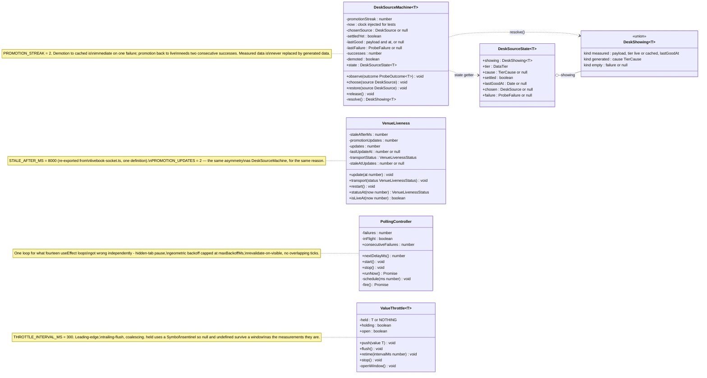
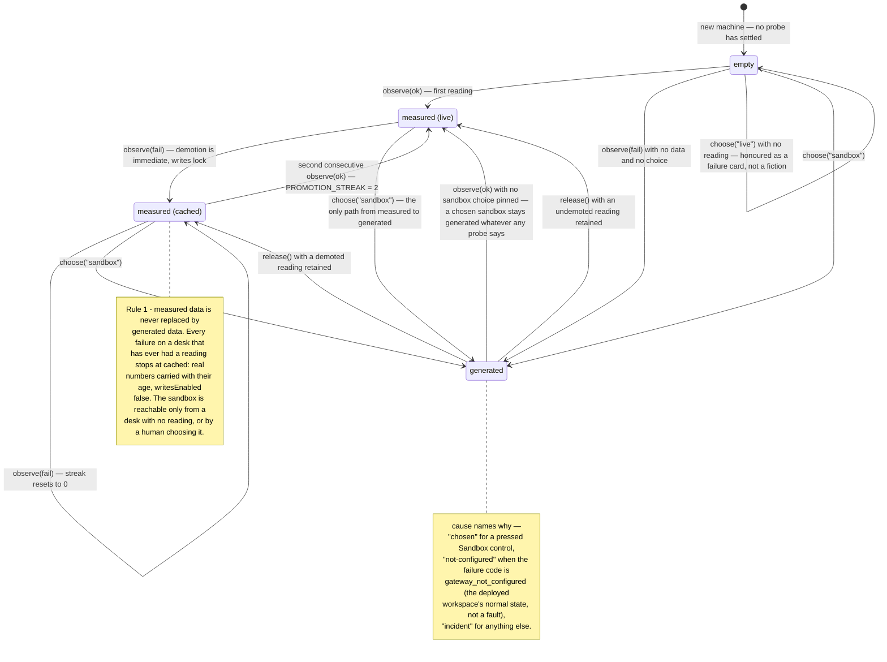

# UML diagrams — the anti-twitch machinery and the research pipeline

*Drawn from the tree as of 22 August 2026. Every class, member and constant here
exists in the named source file; if a diagram disagrees with the code, the code
is right and this file is stale — fix it here.*

This document is four diagrams and the minimum prose to read them. The
arguments behind each design live where they always have:
[`Part2_Infrastructure/README.md`](../../Part2_Infrastructure/README.md)
(§2 Architecture, §Tech Stack → RAG & ML) is authoritative on the system,
[`docs/product/FEATURE_TOUR.md`](../product/FEATURE_TOUR.md) walks the surfaces,
[`docs/architecture/LATENCY_BUDGET.md`](LATENCY_BUDGET.md) owns the three-plane latency
discipline, and the module docstrings — which argue *why* and name rejected
alternatives — are the primary source for everything summarised here.

---

## 1. The anti-twitch machinery — class diagram

Four classes in `web/lib` — sources
[`desk-source.ts`](../../Part2_Infrastructure/web/lib/desk-source.ts),
[`venue-liveness.ts`](../../Part2_Infrastructure/web/lib/venue-liveness.ts),
[`polling.ts`](../../Part2_Infrastructure/web/lib/polling.ts) and
[`use-throttled-value.ts`](../../Part2_Infrastructure/web/lib/use-throttled-value.ts)
— all deliberately **not hooks**, and all four for the same reason their
docstrings state: a class can be driven by a fake clock and a scripted sequence
of outcomes with no DOM and no renderer, and every one of the defects these
classes exist to prevent was unreachable by the unit suite while the decision
lived inside a component. The React wrappers are thin — `useDeskSource`,
`usePolling`, `useThrottledValue` — and
[`livebook.ts`](../../Part2_Infrastructure/web/lib/livebook.ts) constructs one
`VenueLiveness` per venue.



The four are one family, and each docstring cross-cites the others.
`VenueLiveness` refuses to let transport states pretend to be liveness:
`connecting` and `error` pass straight through `statusAt`, and the class
decides only between `live` and `stale`, only once a venue has ever sent a
book. `PROMOTION_STREAK` and `PROMOTION_UPDATES` are both two because two is
the smallest number a single late packet cannot satisfy; the constants' own
comments argue why higher would be worse.

---

## 2. `DeskShowing` transitions — state diagram

`DeskShowing` is a derived value: `resolve()` computes it from the machine's
fields on every `state` read. The diagram below is therefore the resolved value
as it moves under probe outcomes and human choices — the events are
`observe(ok)`, `observe(fail)`, `choose()`, `release()`.



Two readings worth making explicit. First, no arrow leaves a measured state for
`generated` except `choose("sandbox")` — that absence is the module's whole
point, and the cockpit oscillation its docstring reproduces is unrepresentable
here. Second, a gateway alternating success and failure settles at `cached` and
stays there, because each failure resets the streak — the honest description of
a gateway reachable half the time. The flat `tier` field reports `"sandbox"`
for an `empty` desk: the safe reading, not an accurate one; anything that needs
"nothing yet" reads `showing.kind` or `settled` instead.

---

## 3. `POST /api/research/rag/ask` — sequence diagram

The corrective path: route, retrieve wide, narrow, grade, rewrite once, then
answer or refuse. Declared in
[`modules/api/research.py`](../../Part2_Infrastructure/modules/api/research.py)
and orchestrated by `answer_from_corpus` in
[`modules/research_crag.py`](../../Part2_Infrastructure/modules/research_crag.py).
The bands are `ANSWER_BAND = 0.8` and `REFUSE_BAND = 0.4`, defined once in
`research_crag` and imported back by `research_generate` so the two fences
cannot drift apart.

```mermaid
sequenceDiagram
    autonumber
    participant W as caller
    participant API as modules.api.research<br>research_rag_ask
    participant CRAG as research_crag<br>answer_from_corpus
    participant R as research_router<br>ResearchRouter
    participant RAG as research_rag<br>ResearchRag.search / connected
    participant B as research_bm25
    participant S as research_stages
    participant RR as research_rerank
    participant G as research_generate
    participant A as AuditLog (DuckDB)

    W->>API: POST /api/research/rag/ask
    API->>API: research_quota.check() — spend BEFORE a rate token,<br>so a capped desk does not also drain its bucket
    alt bound refuses
        API-->>W: 429 rate_limited / spend_capped (Retry-After), or 503 scope_unavailable<br>— typed, never a bare 500, never confusable with "served and found nothing"
    end
    API->>CRAG: answer_from_corpus(get_rag(), query, audit=get_audit())
    CRAG->>R: plan(query) — RuleBasedPlanner, then bound_calls():<br>the ROUTER enforces max_calls, not the planner's own slice
    R->>A: research_plan row, stamped with the correlation id<br>every later row of this request also carries
    R-->>CRAG: Plan (hybrid_search always present — fallback plan if the planner misbehaved)
    CRAG->>R: execute(plan, rag, match_count=research_stages.wide(n))

    loop each ToolCall — graph_traverse always moved last
        alt structured_runs
            R->>A: read backtest_runs — counts, extrema, means over the ledger it already writes to
            R-->>R: ToolResult ok — NULL metrics excluded from extrema/means and the count of them reported;<br>rows carry NO similarity and stay off matches (a required float would have to be 0.0).<br>With no audit store: unavailable, and the query still succeeds
        else hybrid_search / lexical_exact
            R->>RAG: search(text, match_count)
            RAG->>RAG: embed via /functions/v1/embed-research (gte-small, 384-dim)
            alt embed returned None
                RAG-->>R: state embed_failed — never a zero vector
            else
                RAG->>RAG: rpc match_research_documents_hybrid — dense + lexical arms, RRF k=60, similarity floor 0.76
                RAG->>B: apply_bm25 → rank_candidates + fuse at RRF_K — the third arm, reorders but never adds or drops
                RAG-->>R: state ok, matches + bm25 report (or unavailable, typed, never an empty list)
            end
        else graph_traverse
            R->>RAG: connected(seed id from earlier matches, width = research_stages.graph_width(n))<br>via traverse_research_graph — nothing narrows this arm
            RAG-->>R: state ok + connected rows, or skipped when nothing was retrieved to walk from
            R->>R: fuse_graph_matches — the walk joins as the FOURTH arm at the same RRF k=60;<br>graph_rank is POSITION in the traversal, never a function of depth;<br>rows the walk did not reach carry null, never 0
        end
        R->>A: research_tool_call row per invocation — wall-clock timed, recording the text<br>ACTUALLY sent (the bare token for lexical_exact, not the query), the width and the kind
    end

    alt run.state is not ok, or no matches
        CRAG-->>API: ResearchAnswer state unavailable / embed_failed, or ok with no rows — ungraded, and NOT a refusal
    else rows came back
        CRAG->>S: narrow(query, matches, n)
        S->>RR: asyncio.to_thread(rerank) under _RERANK_BULKHEAD Semaphore(2)
        RR-->>S: report — reranked, or unconfigured / unavailable / failed / empty with the fused order kept
        CRAG->>CRAG: ContextGrader.grade — 0.40 agreement + 0.25 similarity + 0.25 overlap + 0.10 recency,<br>then research_crag_signals.cross_encoder folds the re-ranker's own logit at weight 0.25<br>via sigmoid (its training objective). Absent / null / non-finite: the score does not move<br>by a decimal and no reason line claims a signal that was not read

        opt band rewrite (0.4 – 0.8) — research_crag_policy.rewrite_once
            CRAG->>CRAG: grader.rewrite — appends the best match's symbol / strategy, never an LLM call
            CRAG->>CRAG: nothing to add? return the first round untouched — no round trip is spent
            CRAG->>R: otherwise plan + execute the rewrite, ONCE — straight-line code, no loop for a third attempt
            CRAG->>S: narrow again — same scale, or the score comparison is meaningless
            CRAG->>CRAG: grade the retry — keep whichever round scored higher
        end

        alt score below 0.4 — refused
            CRAG-->>API: state refused — refusal names the corpus_size denominator — matches emptied, generation None (never attempted)
        else still below 0.8 after the rewrite — refused (BEHAVIOUR CHANGE)
            CRAG-->>API: state refused, band "rewrite" — this used to be served as state ok.<br>ANSWER_BAND is load-bearing at last; the refusal names the 0.40–0.80 band and either<br>quotes the rewrite it spent or says no rewrite was spent, and why
        else answerable
            CRAG->>S: synthesise(answered query, matches, kept score, router)
            S->>G: generate(query, documents, crag_score)
            alt precheck fence fires
                G-->>S: verdict refused — no documents, an unciteable id, ungraded context, the refuse band,<br>or an instruction-shaped OVERRIDE inside a retrieved document — the model is never called<br>and nothing is spent, so no ledger row is written
            else SDK absent
                G-->>S: verdict refused — GEMINI_API_KEY unset or google-genai not installed — a normal deployment, reported not raised
            else model called
                G->>G: Gemini generate_content — TIMEOUT_MS 20000, MAX_OUTPUT_TOKENS 1024, TEMPERATURE 0.0
                alt reply starts CORPUS_SILENT
                    G-->>S: verdict corpus_silent — a correct answer, not a failure
                else a citation is fabricated, or none given
                    G-->>S: verdict refused — the whole answer, never flagged and returned
                else a figure appears in no supplied document
                    G-->>S: verdict refused — its own reason, deliberately a DIFFERENT sentence from the<br>citation one; the call was spent, so the ledger row is still written
                else
                    G-->>S: verdict answered + verified [doc:id] citations
                end
            end
            S->>R: record_generation — research_generation ledger row, gated on model_called, never on generated
            CRAG-->>API: state ok — generation report carried separately, never flattened into state
        end
    end
    API-->>W: ResearchAnswer
```

The response model (`ResearchAnswer`) keeps the outcomes that must never
collapse into one another as distinct states: `ok`, `refused`, `unavailable`,
`embed_failed` — and `ok` with an empty `matches` list is "searched, found
nothing", a fifth fact distinct from all four. CRAG refuses on retrieval
relevance; generation refuses on a grounding fence; `generation` is a separate
field precisely so one value can never claim to say which fired. The bound in
front of the route is a **sixth** fact and does not use this model at all: a
`ResearchBoundRefusal` on 429/503 means the request was never served, where all
five states above mean it was. Both `/ask` and `/search` return
`X-Research-Correlation-Id`, and it is the id the `research_plan`,
`research_tool_call`, `research_search` and `research_generation` rows carry —
so a refusal a caller saw can be joined to the ledger rows that produced it.

**No UI calls this sequence.** `/ask` is reachable over HTTP, pinned by the
generated contract and covered by the auth matrix, but the workspace proxies
`/search` only. Recorded here because a route with no consumer is the defect
[`PLAN.md` §1](../planning/PLAN.md) exists to catch.

---

## 4. The research pipeline modules — class diagram of who imports whom

Every arrow below is a verified `import` in the named module, except where the
label says otherwise: `research_stages` defers its `research_generate` import
into `synthesise()`, `modules.api.research` defers `centrality_report` into its
route, and the router still never imports `research_rag` **for retrieval** — it
calls whatever `rag` object it is handed. It does now take one deferred import
from that package, inside `_fuse()`: `fuse_graph_matches`, which
`research_rag.retrieval` re-exports from `research_graph_fusion` so the four
arms are named in one place. The import is inside the function and typed on
failure — an unimportable primitive reports `{"state": "unavailable", …}` and
the retrieved rows survive — so it is a decoration the arm can lose, not a
dependency it needs. Only the research plane's own modules are drawn; the files
each stage was split into to stay under the 400-line ceiling
(`research_router_calls` / `_exec`, `research_crag_policy` / `_signals`,
`research_generate_prompt` / `_figures`, `research_ingest_delivery` /
`_session`, `research_structured` / `_reads`, `research_graph_read_model`) are
named on their parent's box rather than given one each. Sources under
[`Part2_Infrastructure/modules/`](../../Part2_Infrastructure/modules/).

```mermaid
classDiagram
    direction TB

    class api_research["modules.api.research"] {
        research_rag_search()
        research_rag_ask()
        research_graph_communities()
        research_graph_centrality()
    }
    class research_crag {
        ContextGrader / Grade / ResearchAnswer
        answer_from_corpus()
        rewrite_once() : research_crag_policy
        cross_encoder() : research_crag_signals
        ANSWER_BAND : 0.8 (now decides)
        REFUSE_BAND : 0.4
    }
    class research_router {
        ResearchRouter
        RuleBasedPlanner
        bound_calls() : research_router_calls
        four_arms() : research_router_exec
        TOOLS : hybrid graph runs lexical
    }
    class research_structured {
        answer() : over backtest_runs
        counts / extrema / means
        states ok / empty / unavailable / skipped
    }
    class research_graph_fusion {
        fuse_graph_matches()
        RRF_K : 60 imported from research_bm25
    }
    class research_quota {
        check() / price() / snapshot()
        TokenBucket : risk_proxy.rate_limit
        rate_limited / spend_capped
    }
    class research_stages {
        wide()
        narrow()
        synthesise()
        _RERANK_BULKHEAD : Semaphore(2)
    }
    class research_rerank {
        rerank()
        configured()
        RERANK_CANDIDATES : 20
        RERANK_MODEL : bge-reranker-base
    }
    class research_generate {
        generate() / _precheck() / _verify()
        render() : research_generate_prompt
        figure_refusal() : research_generate_figures
        verdicts answered / corpus_silent / refused
    }
    class research_bm25 {
        rank_candidates()
        fuse()
        tokenise()
        RRF_K : 60
    }
    class research_rag["modules.research_rag (package)"] {
        ResearchRag / get_rag()
        _RetrievalMixin.search()
        _RetrievalMixin.connected()
        apply_bm25()
        RAG_MIN_SIMILARITY : 0.76
    }
    class research_graph_reads {
        read_all_edges()
        detect_corpus_communities()
        community_report()
        centrality_report()
        reconcile_communities()
    }
    class research_communities {
        detect_communities()
        rank_documents()
        SEED : 20260821
    }
    class research_graph_projection {
        project()
        project_communities()
        project_centrality()
        configured()
    }
    class research_graph_read_model {
        community_labels()
        centrality_scores()
        source : neo4j
    }
    class research_reconcile {
        re-exports reconcile_communities
    }

    api_research ..> research_crag : answer_from_corpus
    api_research ..> research_stages : wide / narrow
    api_research ..> research_rag : get_rag
    api_research ..> research_graph_reads : community_report, centrality_report
    api_research ..> research_quota : the rate and spend bound on /ask

    research_crag ..> research_router : plan / execute
    research_crag ..> research_stages : wide / narrow / synthesise
    research_stages ..> research_rerank : rerank via to_thread
    research_stages ..> research_generate : deferred import inside synthesise()
    research_generate ..> research_crag : ANSWER_BAND, REFUSE_BAND — the one deliberate cycle
    research_router ..> research_rag : duck-typed rag.search / rag.connected at runtime — no import
    research_router ..> research_structured : the structured_runs arm
    research_router ..> research_graph_fusion : fuse_graph_matches, deferred via research_rag.retrieval
    research_graph_fusion ..> research_bm25 : RRF_K and _fusion_order — one fusion, not two
    research_graph_reads ..> research_graph_read_model : try Neo4j first, fall back to the corpus

    research_rag ..> research_bm25 : rank_candidates / fuse
    research_graph_reads ..> research_communities : detect_communities, rank_documents
    research_graph_reads ..> research_graph_projection : project_communities
    research_reconcile ..> research_graph_reads : scheduler name resolution

    note for research_stages "The seam. research_generate reads the bands\nfrom research_crag so one definition of the\nrelevance floor exists - which makes a module-level\nimport back impossible; synthesise() defers it.\nRestating the numbers was the rejected alternative."
    note for research_router "The ROUTER enforces the bound, not the planner:\nbound_calls() truncates from the tail of the\nspeculative calls and lets the guaranteed\nhybrid_search take the last slot, so a substituted\nplanner cannot drop it. One correlation id stamps\nthe plan, every tool call and the generation row."
    note for research_graph_projection "Neo4j, optional (requirements-graph.txt).\nUnconfigured reports a named reason, never an\nexception. Postgres stays authoritative - drop\nthe graph and re-project."
    note for research_communities "networkx, optional (requirements-communities.txt).\nAbsent reports unavailable with the reason.\nLouvain IS seeded - one partition per edge set,\nnot one per run. PageRank takes NO seed and cannot:\nit is deterministic by construction, reproducible\nfrom the canonical node order plus pinned\nMAX_ITER / TOLERANCE."
    note for research_graph_read_model "Binds _driver at IMPORT deliberately, so the\nprojection suites patching research_graph_projection._driver\n(to prove a GET never WRITES) cannot silently\nredirect the read path. Every refusal falls back\nto the in-process computation and says so."
    note for research_quota "Inert with no GEMINI_API_KEY: a desk that cannot\nreach a model cannot spend, and refusing a free\nquery because a paid one would be expensive is an\noutage, not a bound. A call with no token counts is\nrecorded UNPRICED and the window total is a floor -\nnever an invented average price."
```



### What happens when an optional piece is absent

The pipeline's most distinctive property, stated per module because each module
states it about itself:

| Piece | Absent when | Designed behaviour when absent |
|---|---|---|
| Re-ranker (`research_rerank`) | `RERANK_MODEL_PATH` unset (the default), or `fastembed` not installed (`requirements-rerank.txt`) | With the path unset, `configured()` is false and `research_stages.wide` never widens — retrieval stays at the caller's `match_count` and `rerank_state` says `unconfigured`. With the path set but `fastembed` missing, retrieval does widen and `rerank` hands the fused order back truncated, `rerank_state` `unavailable`. Either way the RRF order stands — never an error, never an empty list. |
| Generation (`research_generate`) | `GEMINI_API_KEY` unset, or `google-genai` not installed (`requirements-genai.txt`) | `generate` returns `verdict: refused` with the named reason; the whole test suite passes with neither present. The report's `model_called` flag stays false, so no ledger row claims spend that never happened. |
| Neo4j (`research_graph_projection`, `research_graph_read_model`) | `requirements-graph.txt` not installed, or the driver unconfigured | `project` / `project_communities` / `project_centrality` return a named-reason report; the read model passes the same reason through (so it still names `requirements-graph.txt`) and the route falls back to the in-process computation, marking `source: "corpus"`. The GET routes fix `project=False` anyway, because a GET must not write. A partially re-labelled graph refuses as "mid-rebuild" rather than serving a half-finished partition that looks like a good one. |
| networkx (`research_communities`) | `requirements-communities.txt` not installed | `detect_communities` and `rank_documents` return `unavailable` with the reason; `modularity` is additionally *absent* — not null, not 0.0 — when the graph has no tie to measure. |
| Supabase corpus (`research_rag`) | `SUPABASE_URL` / service key unset | `search` and `connected` return a typed `unavailable` state, never `[]`; a failed embed returns `None`, never a zero vector. |
| `structured_runs` tool (`research_structured`) | No audit store is handed to the router | **Built** — it answers counts, extrema and means from the audit log's own `backtest_runs`. Four states, never a zero standing in for any of them: `ok`, `empty` (searched, nothing matched — including a `data_hash` no run carries, which is named rather than silently widened into a count of everything), `unavailable` (no readable store), `skipped` (an extremum with no metric named — skipped rather than guessed). NULL metrics are excluded from extrema and means and the number excluded is reported. `modules/ml/store.py`'s `ml_runs` is deliberately **not** reached: it is async PostgREST behind Supabase, and reaching it would put a network call in the test suite. |
| The graph arm's fusion (`research_graph_fusion`) | Nothing to join — no neighbours, rows without ids, or a dense-only path with no ranks to rebuild from | Five named refusals in the BM25 arm's report shape (`ranked: false` + `reason` + `detail`), each returning the caller's rows **untouched**. A walk that returned rows and a walk whose rows were never ranked in stay distinguishable, on the tool call's own detail. |
| The `/ask` bound (`research_quota`) | `GEMINI_API_KEY` unset | Inert by design, and that is what keeps an offline suite from being rate-limited by a cap written for a deployment that would spend. `/search` is not rate-limited at all: it cannot reach a model, and a request-rate control over the whole research plane is a different control with a different argument that should not be smuggled inside a spend cap. |

Two debts this table used to carry are closed. `research_stages` now computes a
**second** width for the graph arm (`graph_width`, the caller's own count —
nothing narrows that arm, so every row it asks for is a row the caller is
served), pinned on the corpus handle by `with_graph_width` rather than by a new
parameter on `ResearchRouter.execute`; and `wide()` is a genuine multiple (×4,
floored at 20, ceilinged at 60) instead of a constant that happened to equal
`RERANK_CANDIDATES`. What remains: `wide()` returns the request unchanged above
the ceiling, so a caller asking for more documents than 60 gets no widening —
deliberate, because bounding the widening must never narrow the request, and
serving 60 rows as the top 200 would be a worse defect than the one being
fixed. Likewise
`RAG_MIN_SIMILARITY = 0.76` is measured from six queries against one document
and its comment says the number will move; the eval harness is the named owner
of turning it from a floor derived from three observed clusters into one that
is continuously re-measured.
