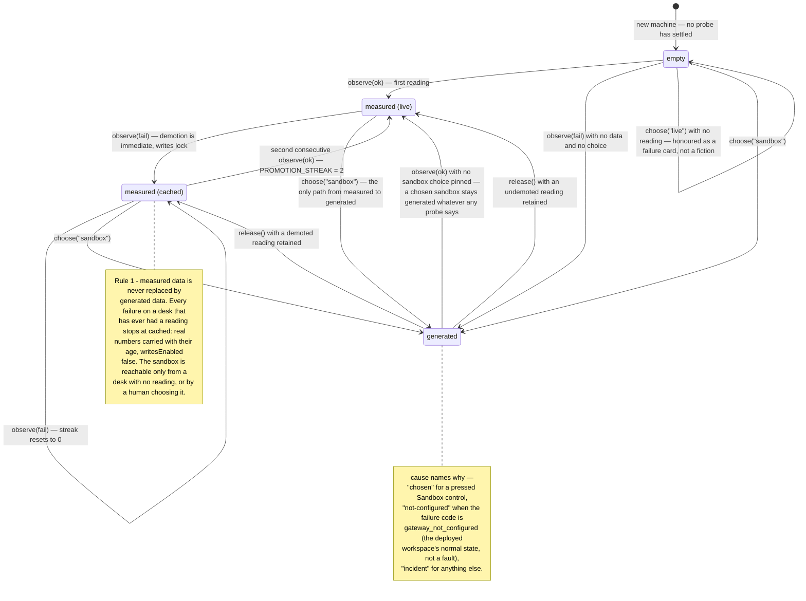
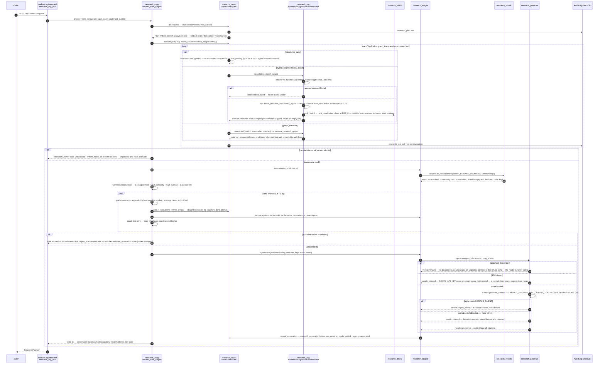

# UML diagrams — the anti-twitch machinery and the research pipeline

*Drawn from the tree as of 22 August 2026. Every class, member and constant here
exists in the named source file; if a diagram disagrees with the code, the code
is right and this file is stale — fix it here.*

This document is four diagrams and the minimum prose to read them. The
arguments behind each design live where they always have:
[`Part2_Infrastructure/README.md`](../../Part2_Infrastructure/README.md)
(§2 Architecture, §Tech Stack → RAG & ML) is authoritative on the system,
[`docs/product/FEATURE_TOUR.md`](../product/FEATURE_TOUR.md) walks the surfaces,
[`docs/architecture/LATENCY_BUDGET.md`](LATENCY_BUDGET.md) owns the three-plane latency
discipline, and the module docstrings — which argue *why* and name rejected
alternatives — are the primary source for everything summarised here.

---

## 1. The anti-twitch machinery — class diagram

Four classes in `web/lib` — sources
[`desk-source.ts`](../../Part2_Infrastructure/web/lib/desk-source.ts),
[`venue-liveness.ts`](../../Part2_Infrastructure/web/lib/venue-liveness.ts),
[`polling.ts`](../../Part2_Infrastructure/web/lib/polling.ts) and
[`use-throttled-value.ts`](../../Part2_Infrastructure/web/lib/use-throttled-value.ts)
— all deliberately **not hooks**, and all four for the same reason their
docstrings state: a class can be driven by a fake clock and a scripted sequence
of outcomes with no DOM and no renderer, and every one of the defects these
classes exist to prevent was unreachable by the unit suite while the decision
lived inside a component. The React wrappers are thin — `useDeskSource`,
`usePolling`, `useThrottledValue` — and
[`livebook.ts`](../../Part2_Infrastructure/web/lib/livebook.ts) constructs one
`VenueLiveness` per venue.

The four are one family, and each docstring cross-cites the others.
`VenueLiveness` refuses to let transport states pretend to be liveness:
`connecting` and `error` pass straight through `statusAt`, and the class
decides only between `live` and `stale`, only once a venue has ever sent a
book. `PROMOTION_STREAK` and `PROMOTION_UPDATES` are both two because two is
the smallest number a single late packet cannot satisfy; the constants' own
comments argue why higher would be worse.

---

## 2. `DeskShowing` transitions — state diagram

`DeskShowing` is a derived value: `resolve()` computes it from the machine's
fields on every `state` read. The diagram below is therefore the resolved value
as it moves under probe outcomes and human choices — the events are
`observe(ok)`, `observe(fail)`, `choose()`, `release()`.

Two readings worth making explicit. First, no arrow leaves a measured state for
`generated` except `choose("sandbox")` — that absence is the module's whole
point, and the cockpit oscillation its docstring reproduces is unrepresentable
here. Second, a gateway alternating success and failure settles at `cached` and
stays there, because each failure resets the streak — the honest description of
a gateway reachable half the time. The flat `tier` field reports `"sandbox"`
for an `empty` desk: the safe reading, not an accurate one; anything that needs
"nothing yet" reads `showing.kind` or `settled` instead.

---

## 3. `POST /api/research/rag/ask` — sequence diagram

The corrective path: route, retrieve wide, narrow, grade, rewrite once, then
answer or refuse. Declared in
[`modules/api/research.py`](../../Part2_Infrastructure/modules/api/research.py)
and orchestrated by `answer_from_corpus` in
[`modules/research_crag.py`](../../Part2_Infrastructure/modules/research_crag.py).
The bands are `ANSWER_BAND = 0.8` and `REFUSE_BAND = 0.4`, defined once in
`research_crag` and imported back by `research_generate` so the two fences
cannot drift apart.

The response model (`ResearchAnswer`) keeps the outcomes that must never
collapse into one another as distinct states: `ok`, `refused`, `unavailable`,
`embed_failed` — and `ok` with an empty `matches` list is "searched, found
nothing", a fifth fact distinct from all four. CRAG refuses on retrieval
relevance; generation refuses on a grounding fence; `generation` is a separate
field precisely so one value can never claim to say which fired.

---

## 4. The research pipeline modules — class diagram of who imports whom

Every arrow below is a verified `import` in the named module, except where the
label says otherwise: `research_stages` defers its `research_generate` import
into `synthesise()`, `modules.api.research` defers `centrality_report` into its
route, and the router never imports `research_rag` at all — it calls whatever
`rag` object it is handed. Sources under
[`Part2_Infrastructure/modules/`](../../Part2_Infrastructure/modules/).

```mermaid
classDiagram
    direction TB

    class api_research["modules.api.research"] {
        research_rag_search()
        research_rag_ask()
        research_graph_communities()
        research_graph_centrality()
    }
    class research_crag {
        ContextGrader
        Grade
        ResearchAnswer
        answer_from_corpus()
        ANSWER_BAND : 0.8
        REFUSE_BAND : 0.4
    }
    class research_router {
        ResearchRouter
        RuleBasedPlanner
        Plan / ToolCall / ToolResult / Execution
        TOOLS : hybrid graph runs lexical
    }
    class research_stages {
        wide()
        narrow()
        synthesise()
        _RERANK_BULKHEAD : Semaphore(2)
    }
    class research_rerank {
        rerank()
        configured()
        RERANK_CANDIDATES : 20
        RERANK_MODEL : bge-reranker-base
    }
    class research_generate {
        generate()
        _precheck()
        _verify()
        verdicts answered / corpus_silent / refused
    }
    class research_bm25 {
        rank_candidates()
        fuse()
        tokenise()
        RRF_K : 60
    }
    class research_rag["modules.research_rag (package)"] {
        ResearchRag / get_rag()
        _RetrievalMixin.search()
        _RetrievalMixin.connected()
        apply_bm25()
        RAG_MIN_SIMILARITY : 0.76
    }
    class research_graph_reads {
        read_all_edges()
        detect_corpus_communities()
        community_report()
        centrality_report()
        reconcile_communities()
    }
    class research_communities {
        detect_communities()
        rank_documents()
        SEED : 20260821
    }
    class research_graph_projection {
        project()
        project_communities()
        configured()
    }
    class research_reconcile {
        re-exports reconcile_communities
    }

    api_research ..> research_crag : answer_from_corpus
    api_research ..> research_stages : wide / narrow
    api_research ..> research_rag : get_rag
    api_research ..> research_graph_reads : community_report, centrality_report

    research_crag ..> research_router : plan / execute
    research_crag ..> research_stages : wide / narrow / synthesise
    research_stages ..> research_rerank : rerank via to_thread
    research_stages ..> research_generate : deferred import inside synthesise()
    research_generate ..> research_crag : ANSWER_BAND, REFUSE_BAND — the one deliberate cycle
    research_router ..> research_rag : duck-typed rag.search / rag.connected at runtime — no import

    research_rag ..> research_bm25 : rank_candidates / fuse
    research_graph_reads ..> research_communities : detect_communities, rank_documents
    research_graph_reads ..> research_graph_projection : project_communities
    research_reconcile ..> research_graph_reads : scheduler name resolution

    note for research_stages "The seam. research_generate reads the bands\nfrom research_crag so one definition of the\nrelevance floor exists - which makes a module-level\nimport back impossible; synthesise() defers it.\nRestating the numbers was the rejected alternative."
    note for research_router "Bounded planner - closed tool registry,\nmax_calls=3, every plan and call written to the\naudit ledger, deterministic fallback to plain\nhybrid search when the planner misbehaves."
    note for research_graph_projection "Neo4j, optional (requirements-graph.txt).\nUnconfigured reports a named reason, never an\nexception. Postgres stays authoritative - drop\nthe graph and re-project."
    note for research_communities "networkx, optional (requirements-communities.txt).\nAbsent reports unavailable with the reason.\nLouvain is seeded - one partition per edge set,\nnot one per run."
```

### What happens when an optional piece is absent

The pipeline's most distinctive property, stated per module because each module
states it about itself:

| Piece | Absent when | Designed behaviour when absent |
|---|---|---|
| Re-ranker (`research_rerank`) | `RERANK_MODEL_PATH` unset (the default), or `fastembed` not installed (`requirements-rerank.txt`) | With the path unset, `configured()` is false and `research_stages.wide` never widens — retrieval stays at the caller's `match_count` and `rerank_state` says `unconfigured`. With the path set but `fastembed` missing, retrieval does widen and `rerank` hands the fused order back truncated, `rerank_state` `unavailable`. Either way the RRF order stands — never an error, never an empty list. |
| Generation (`research_generate`) | `GEMINI_API_KEY` unset, or `google-genai` not installed (`requirements-genai.txt`) | `generate` returns `verdict: refused` with the named reason; the whole test suite passes with neither present. The report's `model_called` flag stays false, so no ledger row claims spend that never happened. |
| Neo4j (`research_graph_projection`) | `requirements-graph.txt` not installed, or the driver unconfigured | `project` / `project_communities` return a named-reason report; the communities route fixes `project=False` anyway, because a GET must not write. |
| networkx (`research_communities`) | `requirements-communities.txt` not installed | `detect_communities` and `rank_documents` return `unavailable` with the reason; `modularity` is additionally *absent* — not null, not 0.0 — when the graph has no tie to measure. |
| Supabase corpus (`research_rag`) | `SUPABASE_URL` / service key unset | `search` and `connected` return a typed `unavailable` state, never `[]`; a failed embed returns `None`, never a zero vector. |
| `structured_runs` tool (`research_router`) | Always, today | **NOT BUILT.** The planner routes counts and extrema to it and the router records the call as `unsupported` — "no structured-runs reader on this gateway; hybrid answers instead". The plan's always-present hybrid call answers. |

One further debt the code names itself: on a re-ranking deployment
`research_stages.wide` applies one width to every tool in a plan, so the graph
arm also fetches twenty neighbours and nothing narrows those — bounded, recall
not correctness, and the fix (a separate width on `ResearchRouter.execute`) is
"owed rather than done", in the module's own words. Likewise
`RAG_MIN_SIMILARITY = 0.76` is measured from six queries against one document
and its comment says the number will move; the eval harness is the named owner
of turning it from a floor derived from three observed clusters into one that
is continuously re-measured.
