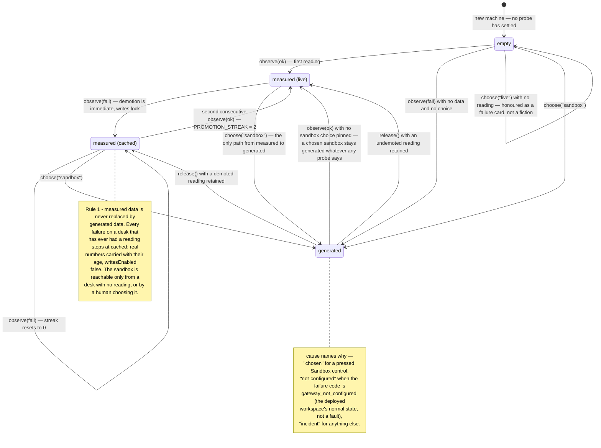
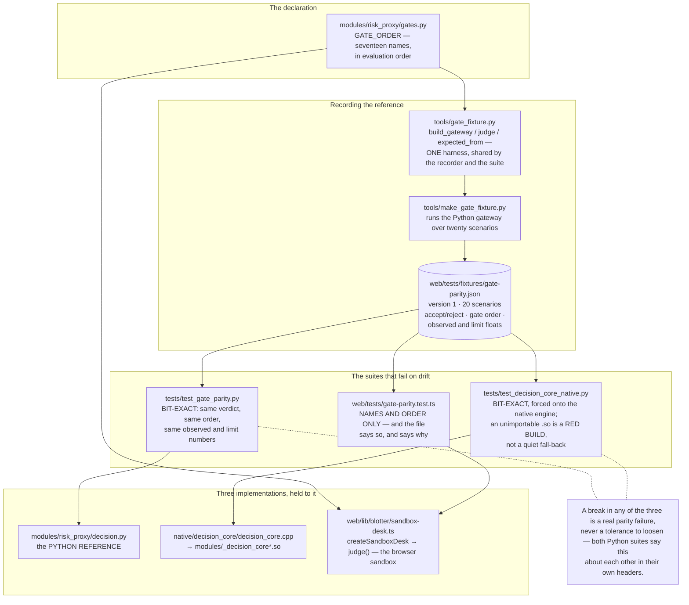
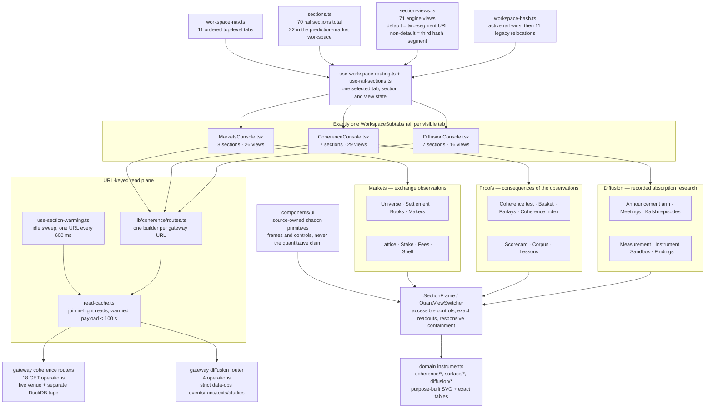

# UML diagrams — anti-twitch state, research, parity and the prediction-market workspace

**Source/worktree audited: 2026-09-02.** Every class, member, file and constant
here was opened and read on that date; no external deployment was probed. If a
diagram disagrees with the code, the code is right and this file is stale — fix
it here.

This document is **six diagrams** and the minimum prose to read them. The
arguments behind each design live where they always have:
[`Part2_Infrastructure/README.md`](../../Part2_Infrastructure/README.md)
(§2 Architecture, §Tech Stack → RAG & ML) is authoritative on the system,
[`ARCHITECTURE.md`](ARCHITECTURE.md) is the map of units and seams,
[`DATA_PROCESSING_FLOW.md`](DATA_PROCESSING_FLOW.md) traces a request end to end,
[`docs/product/FEATURE_TOUR.md`](../product/FEATURE_TOUR.md) walks the surfaces,
[`docs/architecture/LATENCY_BUDGET.md`](LATENCY_BUDGET.md) owns the three-plane latency
discipline, and the module docstrings — which argue *why* and name rejected
alternatives — are the primary source for everything summarised here.

| # | Diagram | Subject |
|---|---|---|
| 1 | class | the four anti-twitch classes in `web/lib` |
| 2 | state | how `DeskShowing` moves under probe outcomes and human choices |
| 3 | sequence | `POST /api/research/rag/ask`, the corrective retrieval path |
| 4 | class | which research module imports which |
| 5 | flow | the gate-parity fixture, and the three implementations pinned to it |
| 6 | component | the prediction-market workspace: 22 sections over Markets, Proofs and Diffusion, with URL-addressable views and one rail per tab |

**A diagram naming a module that no longer exists is a defect.** Every box below
was checked against the tree in this pass. The current seams worth calling out
are visible in the drawings: `PendingPane.tsx` no longer exists; the research
route's HTTP guard is split into `research_quota_gate` / `_scope`; generation's
call telemetry and grounding fences live in `research_generate_call` /
`_fences`; Neo4j reads cross `research_graph_offload` before they reach the
synchronous read model; and `modules/research_rag/session.py` owns the live
`execution_summary` emitter.

---

## 1. The anti-twitch machinery — class diagram

Four classes in `web/lib` — sources
[`desk-source.ts`](../../Part2_Infrastructure/web/lib/desk-source.ts),
[`venue-liveness.ts`](../../Part2_Infrastructure/web/lib/venue-liveness.ts),
[`polling.ts`](../../Part2_Infrastructure/web/lib/polling.ts) and
[`use-throttled-value.ts`](../../Part2_Infrastructure/web/lib/use-throttled-value.ts)
— all deliberately **not hooks**, and all four for the same reason their
docstrings state: a class can be driven by a fake clock and a scripted sequence
of outcomes with no DOM and no renderer, and every one of the defects these
classes exist to prevent was unreachable by the unit suite while the decision
lived inside a component. The React wrappers are thin — `useDeskSource`,
`usePolling`, `useThrottledValue` — and
[`livebook.ts`](../../Part2_Infrastructure/web/lib/livebook.ts) constructs one
`VenueLiveness` per venue.


The four are one family, and each docstring cross-cites the others.
`VenueLiveness` refuses to let transport states pretend to be liveness:
`connecting` and `error` pass straight through `statusAt`, and the class
decides only between `live` and `stale`, only once a venue has ever sent a
book. `PROMOTION_STREAK` and `PROMOTION_UPDATES` are both two because two is
the smallest number a single late packet cannot satisfy; the constants' own
comments argue why higher would be worse.

---

## 2. `DeskShowing` transitions — state diagram

`DeskShowing` is a derived value: `resolve()` computes it from the machine's
fields on every `state` read. The diagram below is therefore the resolved value
as it moves under probe outcomes and human choices — the events are
`observe(ok)`, `observe(fail)`, `choose()`, `release()`.



Two readings worth making explicit. First, no arrow leaves a measured state for
`generated` except `choose("sandbox")` — that absence is the module's whole
point, and the cockpit oscillation its docstring reproduces is unrepresentable
here. Second, a gateway alternating success and failure settles at `cached` and
stays there, because each failure resets the streak — the honest description of
a gateway reachable half the time. The flat `tier` field reports `"sandbox"`
for an `empty` desk: the safe reading, not an accurate one; anything that needs
"nothing yet" reads `showing.kind` or `settled` instead.

---

## 3. `POST /api/research/rag/ask` — sequence diagram

The corrective path: route, retrieve wide, narrow, grade, rewrite once, then
answer or refuse. Declared in
[`modules/api/research.py`](../../Part2_Infrastructure/modules/api/research.py)
and orchestrated by `answer_from_corpus` in
[`modules/research_crag.py`](../../Part2_Infrastructure/modules/research_crag.py).
The bands are `ANSWER_BAND = 0.8` and `REFUSE_BAND = 0.4`, defined once in
`research_crag` and imported back by `research_generate` so the two fences
cannot drift apart.

```mermaid
sequenceDiagram
    autonumber
    participant W as caller
    participant API as modules.api.research<br>research_rag_ask
    participant Gate as research_quota_gate<br>+ research_quota_scope
    participant Q as research_quota<br>AskQuota
    participant CRAG as research_crag<br>answer_from_corpus
    participant R as research_router<br>ResearchRouter
    participant RAG as research_rag<br>ResearchRag.search / connected
    participant B as research_bm25
    participant I as research_image_arm<br>(OPTIONAL)
    participant S as research_stages
    participant RR as research_rerank
    participant G as research_generate
    participant V as research_generate_vision<br>+ research_image_store
    participant A as AuditLog (DuckDB)

    W->>API: POST /api/research/rag/ask
    API->>Gate: scope_for((answer_from_corpus, rag.search, rag.connected)) — probe the whole call chain
    alt configured tenant scope cannot cross every callee
        Gate-->>W: 503 scope_unavailable — no retrieval and no rate token consumed;<br>missing desk or an incompatible callee never falls back to the full corpus
    end
    API->>Q: get_ask_quota().check() — spend BEFORE a rate token,<br>so a capped desk does not also drain its bucket
    alt rate or spend bound refuses
        Q-->>W: 429 rate_limited / spend_capped + Retry-After<br>— typed, never a bare 500, never confusable with "served and found nothing"
    end
    API->>Gate: correlated_router(get_audit()) — mint the id before any ledger row
    Gate-->>API: one ResearchRouter + the correlation id its rows carry
    API->>CRAG: answer_from_corpus(rag, query, router=that router, optional desk_id)<br>— the same scope reaches search and graph traversal
    CRAG->>R: plan(query) — RuleBasedPlanner, then bound_calls():<br>the ROUTER enforces max_calls, not the planner's own slice
    R->>A: research_plan row, stamped with the correlation id<br>every later row of this request also carries
    R-->>CRAG: Plan (hybrid_search always present — fallback plan if the planner misbehaved)
    CRAG->>R: execute(plan, rag, match_count=research_stages.wide(n))

    loop each ToolCall — graph_traverse always moved last
        alt structured_runs
            R->>A: read backtest_runs — counts, extrema, means over the ledger it already writes to
            R-->>R: ToolResult ok — NULL metrics excluded from extrema/means and the count of them reported;<br>rows carry NO similarity and stay off matches (a required float would have to be 0.0).<br>With no audit store: unavailable, and the query still succeeds
        else hybrid_search / lexical_exact
            R->>RAG: search(text, match_count, optional desk_id)
            RAG->>RAG: embed via /functions/v1/embed-research (gte-small, 384-dim)
            alt embed returned None
                RAG-->>R: state embed_failed — never a zero vector
            else
                RAG->>RAG: rpc match_research_documents_hybrid — dense + lexical arms, RRF k=60, similarity floor 0.76
                RAG->>B: apply_bm25 → rank_candidates + fuse at RRF_K — the third arm, reorders but never adds or drops
                RAG->>I: image_arm — OPTIONAL fourth arm, LAST, and never handed the gte-small vector:<br>the query is re-embedded by the CLIP TEXT encoder, because 384 numbers against a 512-dim<br>column is either an error or, far worse, a ranking by two unrelated coordinate systems
                I-->>RAG: rows fused at the same RRF k=60. A document only the picture found is APPENDED<br>with image_rank / image_similarity and similarity left null, never 0.<br>Unconfigured: ranked false + a named reason, and the three-arm order is unchanged
                RAG-->>R: state ok, matches + bm25 + image reports (or unavailable, typed, never an empty list)
            end
        else graph_traverse
            R->>RAG: connected(seed id from earlier matches, width = research_stages.graph_width(n), optional desk_id)<br>via traverse_research_graph — desk scope applies at the seed, edges and reached documents; nothing narrows this arm
            RAG-->>R: state ok + connected rows, or skipped when nothing was retrieved to walk from
            R->>R: fuse_graph_matches — the walk joins as a FIFTH ranking at the same RRF k=60,<br>one stage later than the four inside search();<br>graph_rank is POSITION in the traversal, never a function of depth;<br>rows the walk did not reach carry null, never 0
        end
        R->>A: research_tool_call row per invocation — wall-clock timed, recording the text<br>ACTUALLY sent (the bare token for lexical_exact, not the query), the width and the kind
    end

    alt run.state is not ok, or no matches
        CRAG-->>API: ResearchAnswer state unavailable / embed_failed, or ok with no rows — ungraded, and NOT a refusal
    else rows came back
        CRAG->>S: narrow(query, matches, n)
        S->>RR: asyncio.to_thread(rerank) under _RERANK_BULKHEAD Semaphore(1) — ONE slot, measured:<br>to_thread takes one thread but onnxruntime spreads it over ~9 of 18 cores,<br>so two at once bought 1.30–1.37x throughput for 1.46–1.54x latency on EVERY request
        RR-->>S: report — reranked, or unconfigured / unavailable / failed / empty with the fused order kept
        CRAG->>CRAG: ContextGrader.grade — 0.40 agreement + 0.25 similarity + 0.25 overlap + 0.10 recency,<br>then research_crag_signals.cross_encoder folds the re-ranker's own logit at weight 0.25<br>via sigmoid (its training objective). Absent / null / non-finite: the score does not move<br>by a decimal and no reason line claims a signal that was not read

        opt band rewrite (0.4 – 0.8) — research_crag_policy.rewrite_once
            CRAG->>CRAG: grader.rewrite — appends the best match's symbol / strategy, never an LLM call
            CRAG->>CRAG: nothing to add? return the first round untouched — no round trip is spent
            CRAG->>R: otherwise plan + execute the rewrite, ONCE — straight-line code, no loop for a third attempt
            CRAG->>S: narrow again — same scale, or the score comparison is meaningless
            CRAG->>CRAG: grade the retry — keep whichever round scored higher
        end

        alt score below 0.4 — refused
            CRAG-->>API: state refused — refusal names the corpus_size denominator — matches emptied, generation None (never attempted)
        else still below 0.8 after the rewrite — refused (BEHAVIOUR CHANGE)
            CRAG-->>API: state refused, band "rewrite" — this used to be served as state ok.<br>ANSWER_BAND is load-bearing at last; the refusal names the 0.40–0.80 band and either<br>quotes the rewrite it spent or says no rewrite was spent, and why
        else answerable
            CRAG->>S: synthesise(answered query, matches, kept score, router)
            S->>G: generate(query, documents, crag_score)
            alt precheck fence fires
                G-->>S: verdict refused — no documents, an unciteable id, ungraded context, the refuse band,<br>or an instruction-shaped OVERRIDE inside a retrieved document — the model is never called<br>and nothing is spent, so no ledger row is written
            else SDK absent
                G-->>S: verdict refused — GEMINI_API_KEY unset or google-genai not installed — a normal deployment, reported not raised
            else model called
                G->>V: resolve chart images for the cited chart documents — LRU, then the JobRecord,<br>then ONE PostgREST GET to research_chart_images (1200 ms cap, and 0 disables it)
                V-->>G: at most 2 attachments, each under 2 MB — or a NAMED absence:<br>chart_not_rendered / job_not_retained / image_not_stored / image_store_unreachable /<br>image_too_large / model_declines_images. Never a silent text-only call
                G->>G: Gemini generate_content — MAX_OUTPUT_TOKENS 1024, TEMPERATURE 0.0, thinking_budget 0;<br>TIMEOUT_MS 20000 for text, VISION_TIMEOUT_MS 45000 when an image travels<br>(measured live at 20.6 s and 29.9 s)
                alt reply starts CORPUS_SILENT
                    G-->>S: verdict corpus_silent — a correct answer, not a failure
                else a citation is fabricated, or none given
                    G-->>S: verdict refused — the whole answer, never flagged and returned
                else a figure appears in no supplied document
                    G-->>S: verdict refused — its own reason, deliberately a DIFFERENT sentence from the<br>citation one; the call was spent, so the ledger row is still written
                else a [chart:id] marker names a document whose image was NOT sent
                    G-->>S: verdict refused — without this check the marker would be a way to buy an<br>exemption from the figure fence by labelling an invented number
                else
                    G-->>S: verdict answered + verified [doc:id] citations
                end
            end
            S->>R: record_generation — research_generation ledger row, gated on model_called, never on generated
            CRAG-->>API: state ok — generation report carried separately, never flattened into state
        end
    end
    API->>Q: record(answer.generation) — actual reported tokens/cost;<br>an unpriced provider report remains unpriced, never free
    API-->>W: ResearchAnswer + X-Research-Correlation-Id when a row carries it
```

The response model (`ResearchAnswer`) keeps the outcomes that must never
collapse into one another as distinct states: `ok`, `refused`, `unavailable`,
`embed_failed` — and `ok` with an empty `matches` list is "searched, found
nothing", a fifth fact distinct from all four. CRAG refuses on retrieval
relevance; generation refuses on a grounding fence; `generation` is a separate
field precisely so one value can never claim to say which fired. The bound in
front of the route is a **sixth** fact and does not use this model at all: a
`ResearchBoundRefusal` on 429/503 means the request was never served, where all
five states above mean it was. The 429 is the rate/spend answer; the 503 is the
tenant-scope answer. With `RESEARCH_SCOPE_TO_DESK` off (the default), no scope
argument is added. After migration `20260831130000` is deployed, enabling the
flag makes `/search`, `/ask` and `/graph/{document_id}` carry `desk_id` through
similarity and graph retrieval. A missing desk or incompatible callee refuses
before retrieval. Serving the full corpus is deliberately not the fallback.

Both `/ask` and `/search` return `X-Research-Correlation-Id` when the audit row
that owns the id was written, and it is the id the `research_plan`,
`research_tool_call`, `research_search` and `research_generation` rows carry —
so a refusal a caller saw can be joined to the ledger rows that produced it.

**No UI calls this sequence.** `/ask` is reachable over HTTP, pinned by the
generated contract and covered by the auth matrix, but the workspace proxies
`/search` only. Recorded here because a route with no consumer is the defect
[`PLAN.md` §1](../planning/PLAN.md) exists to catch.

---

## 4. The research pipeline modules — class diagram of who imports whom

Every arrow below is a verified `import` in the named module, except where the
label says otherwise: `research_stages` defers its `research_generate` import
into `synthesise()`, `modules.api.research` defers `centrality_report` into its
route, and the router still never imports `research_rag` **for retrieval** — it
calls whatever `rag` object it is handed. It does now take one deferred import
from that package, inside `_fuse()`: `fuse_graph_matches`, which
`research_rag.retrieval` re-exports from `research_graph_fusion` so every arm is
named in one place. The import is inside the function and typed on
failure — an unimportable primitive reports `{"state": "unavailable", …}` and
the retrieved rows survive — so it is a decoration the arm can lose, not a
dependency it needs. Only the research plane's own modules are drawn. Helpers
that do not move a runtime boundary are named on their parent's box rather than
given one each: `research_router_calls` / `research_router_exec`,
`research_crag_policy` / `research_crag_signals`,
`research_generate_prompt` / `research_generate_figures` /
`research_generate_call` / `research_generate_fences`,
`research_ingest_delivery`, and `research_structured_reads`. The same rule puts
`research_image_arm` and `research_image_ingest` on `research_image`,
`research_image_store_write` on `research_image_store`, and the `research_rag`
package's `retrieval.py` / `arms.py` / `embedding.py` / `writer.py` /
`session.py` on the `research_rag` box. The HTTP scope/refusal seam, event-loop
offload seam and reconciliation-page seam do move a boundary, so
`research_quota_gate`, `research_graph_offload` and `research_corpus_reads`
remain visible boxes. `research_quota_scope` is named inside its gate; the
synchronous graph read model stays visible as the offload box's destination.

`research_ingest_session` is the one exception, and it earns a box of its own
because it now has **two** callers rather than one: `tools/backfill_research_rag.py`
for history, and `research_rag/session.py` — a mixin on the same `ResearchRag`
class the read half lives on — from the risk monitor's UTC rollover, for a
running desk. Until this pass the live arm did not exist and the module was
correctly drawn as a tool's dependency. It is not one any more.

Three arrows to check against the tree if this drawing is ever doubted:
`research_rag.retrieval` imports `image_arm` at module level (it is the query
side of the fourth arm), and `research_generate` imports
`research_generate_vision` as `vision`, which in turn imports
`research_image_store` — `CHART_IMAGE_KEYS` **is** `CHART_PNG_FIELDS` rather
than a copy of it, so an image cannot be stored that no reader can use. The
third is the current graph read path: `research_graph_reads` imports the async
`research_graph_offload`, and only that module imports the synchronous
`research_graph_read_model`; a Neo4j socket must not occupy the gateway's event
loop. Sources under
[`Part2_Infrastructure/modules/`](../../Part2_Infrastructure/modules/).

```mermaid
classDiagram
    direction TB

    class api_research["modules.api.research"] {
        research_rag_search()
        research_rag_ask()
        research_graph_communities()
        research_graph_centrality()
    }
    class research_crag {
        ContextGrader / Grade / ResearchAnswer
        answer_from_corpus()
        rewrite_once() : research_crag_policy
        cross_encoder() : research_crag_signals
        ANSWER_BAND : 0.8 (now decides)
        REFUSE_BAND : 0.4
    }
    class research_router {
        ResearchRouter
        RuleBasedPlanner
        bound_calls() : research_router_calls
        run_call() / merge() : research_router_exec
        TOOLS : hybrid graph runs lexical
    }
    class research_structured {
        answer_structured() : over backtest_runs
        counts / extrema / means
        states ok / empty / unavailable / skipped
    }
    class research_graph_fusion {
        fuse_graph_matches()
        RRF_K : 60 imported from research_bm25
    }
    class research_quota {
        check() / price() / snapshot()
        TokenBucket : risk_proxy.rate_limit
        rate_limited / spend_capped
    }
    class research_quota_gate {
        scope_for() : research_quota_scope
        refusal_response()
        correlated_router()
        record_search()
        429 rate-spend / 503 scope
    }
    class research_stages {
        wide()
        narrow()
        synthesise()
        _RERANK_BULKHEAD : Semaphore(1)
    }
    class research_rerank {
        rerank()
        configured()
        RERANK_CANDIDATES : 20
        RERANK_MODEL : bge-reranker-base
    }
    class research_generate {
        generate() / _call() / _judge()
        telemetry() / thinking() / truncation_refusal() : research_generate_call
        evidence_band() / precheck() / verify() : research_generate_fences
        render() : research_generate_prompt
        figure_refusal() : research_generate_figures
        verdicts answered / corpus_silent / refused
    }
    class research_bm25 {
        rank_candidates()
        fuse()
        tokenise()
        RRF_K : 60
    }
    class research_image["modules.research_image (OPTIONAL)"] {
        the CLIP ViT-B/32 model seam
        image_arm() : research_image_arm
        embed at ingest : research_image_ingest
        IMAGE_MODEL_PATH : empty by default
    }
    class research_image_store {
        locate() / remember()
        CHART_PNG_FIELDS : the ONE map
        write half : research_image_store_write
        FETCH_TIMEOUT_MS : 1200 (0 disables)
    }
    class research_generate_vision {
        resolve() / reconcile() / contents()
        CHART_IMAGE_KEYS IS research_image_store.CHART_PNG_FIELDS
        VISION_TIMEOUT_MS : 45000
        MAX_IMAGES : 2 / MAX_IMAGE_BYTES : 2 MiB
    }
    class research_rag["modules.research_rag (package)"] {
        ResearchRag / get_rag()
        _RetrievalMixin.search() : retrieval.py
        _RetrievalMixin.connected() : retrieval.py
        _SessionIngestMixin.on_session_closed() : session.py
        apply_bm25() : arms.py
        RAG_MIN_SIMILARITY : 0.76
        SESSION_SUMMARY_SETTLE_S : 5.0
    }
    class research_graph_reads {
        read_all_edges()
        detect_corpus_communities()
        community_report()
        centrality_report()
        reconcile_communities()
    }
    class research_communities {
        detect_communities()
        rank_documents()
        SEED : 20260821
    }
    class research_graph_projection {
        project()
        project_communities()
        project_centrality()
        configured()
    }
    class research_graph_read_model {
        community_labels()
        centrality_scores()
        source : neo4j
    }
    class research_graph_offload {
        community_labels() async
        centrality_scores() async
        _NEO4J_READ_BULKHEAD : Semaphore(2)
        asyncio.to_thread()
    }
    class research_corpus_reads {
        keyset page on occurred_at + id
        exact deferred count or named absence
        None means unreadable / empty list means empty
    }
    class research_reconcile {
        edge sweep via research_corpus_reads
        re-exports reconcile_communities
    }
    class research_ingest_session["modules.research_ingest_session"] {
        closed_session_documents()
        session_figures()
        execution_summary_document()
        every absent figure : "not recorded"
    }

    api_research ..> research_crag : answer_from_corpus
    api_research ..> research_stages : wide / narrow
    api_research ..> research_rag : get_rag
    api_research ..> research_graph_reads : community_report, centrality_report
    api_research ..> research_quota : the rate and spend bound on /ask
    api_research ..> research_quota_gate : scope, refusal and correlation wiring
    research_quota_gate ..> research_quota : Bound vocabulary
    research_quota_gate ..> research_router : one correlated router per /ask

    research_crag ..> research_router : plan / execute
    research_crag ..> research_stages : wide / narrow / synthesise
    research_stages ..> research_rerank : rerank via to_thread
    research_stages ..> research_generate : deferred import inside synthesise()
    research_generate ..> research_crag : ANSWER_BAND, REFUSE_BAND — the one deliberate cycle
    research_router ..> research_rag : duck-typed rag.search / rag.connected at runtime — no import
    research_router ..> research_structured : the structured_runs arm
    research_router ..> research_graph_fusion : fuse_graph_matches, deferred via research_rag.retrieval
    research_graph_fusion ..> research_bm25 : RRF_K and _fusion_order — one fusion, not two
    research_graph_reads ..> research_graph_offload : await the Neo4j read off-loop
    research_graph_offload ..> research_graph_read_model : module lookup inside the worker

    research_rag ..> research_bm25 : rank_candidates / fuse
    research_rag ..> research_image : image_arm, LAST and never handed the gte-small vector
    research_rag ..> research_ingest_session : execution_summary, live from the UTC rollover
    research_generate ..> research_generate_vision : attach the chart as evidence, never a source
    research_generate_vision ..> research_image_store : locate the bytes — LRU, JobRecord, then one GET
    research_graph_reads ..> research_communities : detect_communities, rank_documents
    research_graph_reads ..> research_graph_projection : project_communities
    research_reconcile ..> research_corpus_reads : keyset page and backlog report
    research_reconcile ..> research_graph_reads : scheduler name resolution

    note for research_stages "The seam. research_generate reads the bands\nfrom research_crag so one definition of the\nrelevance floor exists - which makes a module-level\nimport back impossible; synthesise() defers it.\nRestating the numbers was the rejected alternative."
    note for research_router "The ROUTER enforces the bound, not the planner:\nbound_calls() truncates from the tail of the\nspeculative calls and lets the guaranteed\nhybrid_search take the last slot, so a substituted\nplanner cannot drop it. One correlation id stamps\nthe plan, every tool call and the generation row."
    note for research_graph_projection "Neo4j, optional (requirements-graph.txt).\nUnconfigured reports a named reason, never an\nexception. Postgres stays authoritative - drop\nthe graph and re-project."
    note for research_communities "networkx, optional (requirements-communities.txt).\nAbsent reports unavailable with the reason.\nLouvain IS seeded - one partition per edge set,\nnot one per run. PageRank takes NO seed and cannot:\nit is deterministic by construction, reproducible\nfrom the canonical node order plus pinned\nMAX_ITER / TOLERANCE."
    note for research_graph_read_model "Binds _driver at IMPORT deliberately, so the\nprojection suites patching research_graph_projection._driver\n(to prove a GET never WRITES) cannot silently\nredirect the read path. Every refusal falls back\nto the in-process computation and says so."
    note for research_graph_offload "The synchronous Aura driver never runs on the\ngateway event loop. Two reads may occupy the shared\nexecutor at once; the read model still owns every\nrefusal, so the wrapper adds no second error vocabulary."
    note for research_image "OFF by default and measured, not hedged:\nCLIP alone scores 0.671 nDCG@3 against the computed\ndescription's 0.687 and 0.747 fused - so ~0.6 GB of\nweights buys +0.06 only in fusion, and the arm is a\nfourth 1/(k+rank) term that can ADD a document and\nnever remove one. No similarity floor: 0.76 was\nmeasured against gte-small's range and a CLIP number\nwould be the unmeasured constant this tree refuses."
    note for research_image_store "One map, two halves, so they cannot disagree -\nresearch_generate_vision.CHART_IMAGE_KEYS IS this\nobject, not a copy. _fetch is a SYNCHRONOUS GET on\nthe event loop's thread; the owed fix is one line in\nresearch_generate.generate (await hydrate). Bounded\nby a 1200 ms cap, an LRU, and the write path warming\nthat same LRU so an ingesting gateway never fetches."
    note for research_ingest_session "The renderer. Two callers now, not one:\ntools/backfill_research_rag.py for history, and\nresearch_rag/session.py from the risk monitor's UTC\nrollover for the live desk. The live call is DEFERRED\n(a whole day's aggregate over `orders` must not run\ninside the trading lock) and delayed 5s, because\nunique (desk_id, kind, source_ref) plus\nignore-duplicates means the FIRST writer wins and an\nearly summary is a permanent one."
    note for research_quota "Inert with no GEMINI_API_KEY: a desk that cannot\nreach a model cannot spend, and refusing a free\nquery because a paid one would be expensive is an\noutage, not a bound. A call with no token counts is\nrecorded UNPRICED and the window total is a floor -\nnever an invented average price."
    note for research_quota_gate "Tenant scope is checked before quota. /search can\ncarry desk_id today; /ask refuses with 503 when\nscoping is enabled because answer_from_corpus does\nnot yet accept it. It never falls back to a wide read."
```



### What happens when an optional piece is absent

The pipeline's most distinctive property, stated per module because each module
states it about itself:

| Piece | Absent when | Designed behaviour when absent |
|---|---|---|
| Re-ranker (`research_rerank`) | `RERANK_MODEL_PATH` unset (the default), or `fastembed` not installed (`requirements-rerank.txt`) | With the path unset, `configured()` is false and `research_stages.wide` never widens — retrieval stays at the caller's `match_count` and `rerank_state` says `unconfigured`. With the path set but `fastembed` missing, retrieval does widen and `rerank` hands the fused order back truncated, `rerank_state` `unavailable`. Either way the RRF order stands — never an error, never an empty list. |
| Generation (`research_generate`) | `GEMINI_API_KEY` unset, or `google-genai` not installed (`requirements-genai.txt`) | `generate` returns `verdict: refused` with the named reason; the whole test suite passes with neither present. The report's `model_called` flag stays false, so no ledger row claims spend that never happened. |
| Neo4j (`research_graph_projection`, `research_graph_offload`, `research_graph_read_model`) | `requirements-graph.txt` not installed, or the driver unconfigured | `project` / `project_communities` / `project_centrality` return a named-reason report; the read model passes the same reason through (so it still names `requirements-graph.txt`) and the route falls back to the in-process computation, marking `source: "corpus"`. The synchronous driver read runs through `asyncio.to_thread` behind a two-slot bulkhead, never on the gateway event loop. The GET routes fix `project=False` anyway, because a GET must not write. A partially re-labelled graph refuses as "mid-rebuild" rather than serving a half-finished partition that looks like a good one. The projection and Cypher reads do not carry `desk_id`; whenever `RESEARCH_SCOPE_TO_DESK=1`, the source read-model guard refuses Neo4j before opening its driver and the reports automatically use the desk-scoped corpus. With the flag off, this optional path is single-desk/per-database rather than a tenant boundary. |
| networkx (`research_communities`) | `requirements-communities.txt` not installed | `detect_communities` and `rank_documents` return `unavailable` with the reason; `modularity` is additionally *absent* — not null, not 0.0 — when the graph has no tie to measure. |
| Supabase corpus (`research_rag`) | `SUPABASE_URL` / service key unset | `search` and `connected` return a typed `unavailable` state, never `[]`; a failed embed returns `None`, never a zero vector. |
| `structured_runs` tool (`research_structured`) | No audit store is handed to the router | **Built** — it answers counts, extrema and means from the audit log's own `backtest_runs`. Four states, never a zero standing in for any of them: `ok`, `empty` (searched, nothing matched — including a `data_hash` no run carries, which is named rather than silently widened into a count of everything), `unavailable` (no readable store), `skipped` (an extremum with no metric named — skipped rather than guessed). NULL metrics are excluded from extrema and means and the number excluded is reported. `modules/ml/store.py`'s `ml_runs` is deliberately **not** reached: it is async PostgREST behind Supabase, and reaching it would put a network call in the test suite. |
| The graph arm's fusion (`research_graph_fusion`) | Nothing to join — no neighbours, rows without ids, or a dense-only path with no ranks to rebuild from | Five named refusals in the BM25 arm's report shape (`ranked: false` + `reason` + `detail`), each returning the caller's rows **untouched**. A walk that returned rows and a walk whose rows were never ranked in stay distinguishable, on the tool call's own detail. |
| Image arm (`research_image`, `research_image_arm`) | `RESEARCH_IMAGE_MODEL_PATH` unset (the default), `fastembed` or Pillow missing, or migration `20260822100000` not applied | `search` returns its `image` report with `ranked: false` and a named reason, and the fused order is **byte-for-byte** the three-arm order — the arm can only add a document, so its absence cannot change what a configured desk already saw. "No vision model" and "no image library" are different sentences, because they have different fixes. On the write side an unconfigured deployment sends the row it sent before the module existed, not even nulls: a PostgREST insert naming a column the deployed schema has not got is answered 400, and the drain would then dead-letter **every** document. |
| Chart pixels for generation (`research_generate_vision`, `research_image_store`) | The chart was never rendered, the job record is gone (restart, Celery worker, second replica), the row predates migration `20260822110000`, the store is unreachable, or the image is over the 2 MB ceiling | Five named states — `chart_not_rendered`, `job_not_retained`, `image_not_stored`, `image_store_unreachable`, `image_too_large` — carried on the report, never an exception and never a silent text-only call. That distinction matters more here than almost anywhere in the plane, because the failure it prevents is an answer that says "the chart shows" over a call that carried no chart, and a reader cannot tell those apart from the prose. |
| The `/ask` bound (`research_quota`) | `GEMINI_API_KEY` unset | Inert by design, and that is what keeps an offline suite from being rate-limited by a cap written for a deployment that would spend. `/search` is not rate-limited at all: it cannot reach a model, and a request-rate control over the whole research plane is a different control with a different argument that should not be smuggled inside a spend cap. |
| Tenant scope (`research_quota_gate`, `research_quota_scope`) | `RESEARCH_SCOPE_TO_DESK` is off (the default) | No route-level desk predicate is added and single-desk behaviour is unchanged. When enabled, `/search`, `/ask` and `/graph/{document_id}` carry one `desk_id` through similarity and graph RPCs; the anomaly writer always scopes its immediate neighbour read to the desk it just wrote. A deployment that cannot carry the configured scope returns typed `scope_unavailable`; an unscoped fallback is forbidden. |

Two debts this table used to carry are closed. `research_stages` now computes a
**second** width for the graph arm (`graph_width`, the caller's own count —
nothing narrows that arm, so every row it asks for is a row the caller is
served), pinned on the corpus handle by `with_graph_width` rather than by a new
parameter on `ResearchRouter.execute`; and `wide()` is a genuine multiple (×4,
floored at 20, ceilinged at 60) instead of a constant that happened to equal
`RERANK_CANDIDATES`. What remains: `wide()` returns the request unchanged above
the ceiling, so a caller asking for more documents than 60 gets no widening —
deliberate, because bounding the widening must never narrow the request, and
serving 60 rows as the top 200 would be a worse defect than the one being
fixed. A third debt has moved rather than closed. The blocking read in
`research_image_store._fetch` is a synchronous PostgREST GET on the event
loop's thread, and the fix is one line in `research_generate.generate`
(`documents = await hydrate(documents)`) that this change could not reach. It is
recorded in that module's own docstring with the two rejected non-blocking
designs, and collected in [`PLAN.md` §2.10](../planning/PLAN.md).

Likewise
`RAG_MIN_SIMILARITY = 0.76` is measured from six queries against one document
and its comment says the number will move; the eval harness is the named owner
of turning it from a floor derived from three observed clusters into one that
is continuously re-measured.

---

## 5. The gate-parity pin — one fixture, three implementations

This is the load-bearing idea of the codebase drawn once. Three runtimes serve
one desk and none can call the others, so the seventeen-gate battery exists
three times. Python is the reference; a tool records its verdicts; the other two
replay them.



**Why the TypeScript half is held to less, and why that is written down.** The
browser sandbox has no ladder — its slippage is a synthesised function of size,
seeded by a PRNG — reads its caps off the book rather than settings, and has no
paper-equity or per-venue routing. Several fixture scenarios are therefore
structurally inexpressible in it, and asserting their numbers anyway would be
"a looser test wearing a stricter name". So the suite pins the cross-language
part — that the mirror walks the same seventeen gates in the same order, never
silently reordering, dropping or adding one — and states the exclusion in its
own header. A parity claim that quietly covers less than it sounds like is worse
than no parity claim at all.

**The same shape, four more times.** `web/tests/parity.test.ts` replays 48
recorded cases from `tools/make_parity_fixture.py` against the TypeScript
backtest engine; `web/tests/risk-parity.test.ts` replays
`tools/make_risk_fixture.py`'s answers against `web/lib/portfolio-risk/`, because
a trader reading one VaR on a phone and another on a screen is the failure mode
worth a fixture; `web/tests/venues-parity.test.ts` has **no** fixture and reads
both sources instead, comparing `web/lib/venues`' `FILL_TOLERANCE` against the
whole gateway-side `modules/tca_engine` package concatenated — because the
tolerance moved on the Python side once and the port did not follow; and
`web/tests/mc-parity.test.ts` pins one Monte Carlo across three runtimes by
executing the browser worker's own stringified source in Node and comparing it
to a committed canonical-JSON reference that carries its own SHA-256.

---

## 6. The prediction-market workspace — component diagram

The workspace now exposes **22 rail sections and 71 views** across three tabs:
Markets has 8 sections / 26 views, Proofs 7 / 29, and Diffusion 7 / 16. Those
figures are derived from
[`web/lib/sections.ts`](../../Part2_Infrastructure/web/lib/sections.ts) and
[`web/lib/section-views.ts`](../../Part2_Infrastructure/web/lib/section-views.ts),
not from component-local arrays. One `<WorkspaceSubtabs>` owns each rail; a
section's smaller switcher selects an addressable third hash segment and never
mounts a second rail.



**Addressability is now part of the component contract.** The 22 default views
keep their canonical `#tab/section` URLs; the other 42 engine views use
`#tab/section/view`. Together with Research's one non-default view, the desk
sweep asserts 43 third-segment cells. `use-rail-sections.ts` seeds each view
from the same table the router resolves, so loading, pressing Back and clicking
a switcher cannot produce three different selections. A stale or unknown view
is corrected to the section's declared default with `replaceState`, not left in
the address bar while another panel is shown.

**The one-rail rule remains mechanical.** `WorkspaceSubtabs` publishes the
global `--rail-h` offset. A nested instance would make two components race over
one property, so section-local controls use `SectionFrame` /
`QuantViewSwitcher` and roving keyboard interaction instead. URL addressability
does not require a second visual rail.

**Read ownership follows sharing.** A read shared across sections or tabs lives
at console/cache level: the universe payload serves Markets' Universe, Lattice
and Stake plus Proofs' Coherence test and Basket. A read specific to one figure
stays beside that figure: Books history requires its History view and ticker;
Fees' 20,000-row replay requires Ablation or Replay table; the signed RFQ call
requires Makers and is never warmed. Diffusion's Model, Instrument and Sandbox
make no gateway request at all — they execute the TypeScript parity
implementation in the browser.

**The primitive boundary is asymmetric on purpose.** Source-owned shadcn
primitives provide buttons, sheets, dialogs, tables, scroll areas, form controls
and focus management. They do not own probability lattices, payoff states,
Fréchet bounds, absorption paths or proof objects. Those remain domain
components with linked exact values and explicit loading/empty/degraded states;
the ADR is
[`ADR_2026-08-27_SHADCN_SOURCE_PRIMITIVES.md`](ADR_2026-08-27_SHADCN_SOURCE_PRIMITIVES.md).
