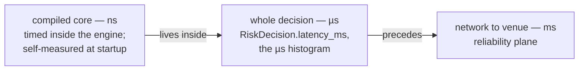
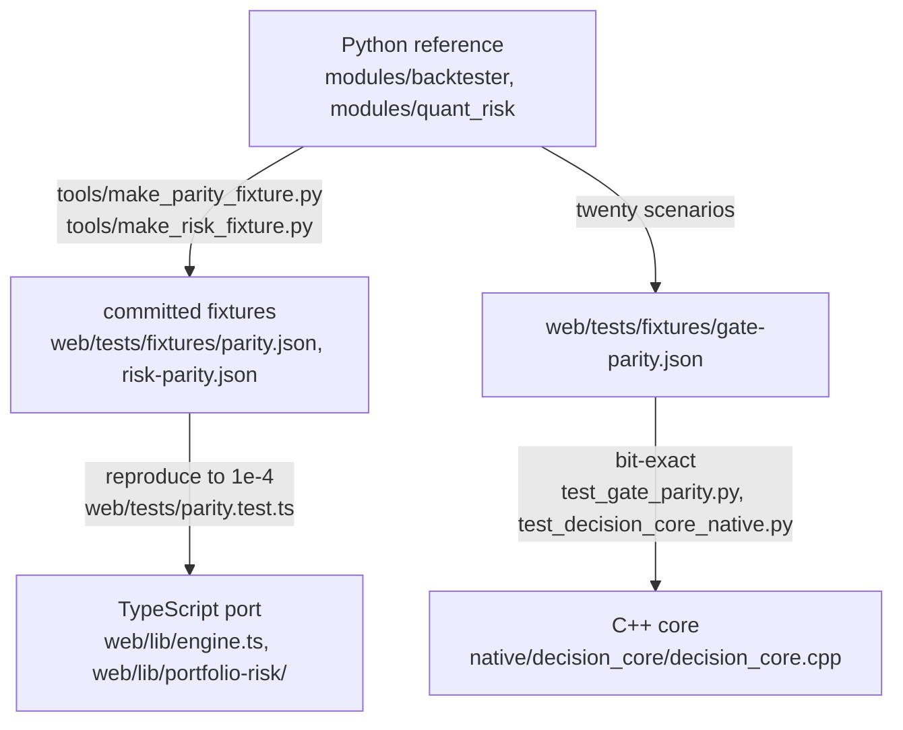

# Coding standards

The house rules, written as a standards document. One thing distinguishes them
from most style guides: **almost every rule here is enforced by a test**, so
breaking one turns a suite red rather than starting an argument in review. The
enforcement suites are named beside each rule; where a rule is convention only,
that is said, and where a rule was convention until recently, that is said too.
Facts checked against the tree on 24 August 2026.

The deep arguments live in
[`Part2_Infrastructure/README.md`](../../Part2_Infrastructure/README.md) and
[`CLAUDE.md`](../../CLAUDE.md); this page states each rule, its reason, and
where it is held. The suites themselves are argued in
[`TESTING.md`](../testing/TESTING.md).

---

## 1. Null honesty: never coerce null to zero

A missing measurement renders as a dash and says why it is missing. `?? 0` on
a nullable metric is the defect this codebase is most alert to: it turns "we
do not know" into "it is fine", and it passes every type check on the way
through. Zero is a *claim* — a fail rate of 0 says "we checked and nothing
failed", which is a different fact from "nothing has been checked yet".

Held by `web/tests/null-honesty.test.ts` on the UI side, and by the engines
themselves:

- the data-quality ledger keeps a fail rate that stays null rather than becoming
  zero (`tests/test_data_quality.py`);
- the community-detection module reports modularity as *absent* rather than 0.0
  when there is nothing to partition, because 0.0 is a meaningful modularity and
  "no graph" is not (`modules/research_communities.py`);
- and the newest example, inside an estimator rather than a panel:
  `modules/coherence/diffusion/skill.py` skips an `unavailable` horizon when
  integrating an absorption curve rather than reading it as zero absorption —
  pinned by `test_unmeasured_horizons_are_skipped_not_read_as_zero` in
  [`tests/test_diffusion_skill.py`](../../Part2_Infrastructure/tests/test_diffusion_skill.py).
  Reading it as zero would not error; it would silently lengthen every
  residence time it touched.

## 2. Absence is a state, not a failure

The most distinctive habit of this system: an optional capability that is not
configured **reports its absence in a named shape** — never an exception,
never a silent success, never a degraded answer dressed as a full one. "Could
not project" and "there was nothing to project" are different facts and must
stay distinguishable at the call site.

The shape has two halves and both are required: a **typed state** and a
**named reason**. `ranked: False` + `reason`; `reranked: False` + `state` +
`model`; `detected: False`; `source: "corpus"`. A state with no reason tells a
reader something is missing and not what; a reason with no state cannot be
branched on.

The three long-standing optional capabilities all follow it:

- **Neo4j** (`modules/research_graph_projection.py`,
  `modules/research_graph_read_model.py`): an unset `NEO4J_URI` is the *normal*
  deployment, and so is an uninstalled driver — `requirements-graph.txt` is
  optional and the whole suite passes without it. Postgres remains
  authoritative; the graph is a one-way rebuildable projection of
  `research_edges`, so divergence is a non-event (drop it and re-project). Two
  routes *read* the projection back — `GET /api/research/graph/communities` and
  `/centrality` (`modules/api/research.py`) — and each stamps
  `source: "neo4j" | "corpus"` so the desk can tell which answered. **No request
  path depends on the graph being up**; request-time traversal is the Postgres
  recursive CTE.

  Three refusals there are worth naming because they are absences a lazier
  reader would round to a value. Labels from two different sweeps refuse as
  **mid-rebuild** rather than serving a half-finished partition that looks like
  a good one, because community ids are stable only for a fixed edge set. A
  writer may not read its own output — `community_labels` refuses when the
  caller is the sweep that writes labels, or the corpus could change daily and
  the labels never would. And a metric the graph does not store (`modularity`,
  `seed`, `resolution`, `damping`) is **absent** from the report rather than
  restated from the caller's arguments: a plausible default is the lie.
- **Gemini** (`modules/research_generate.py`): an unset `GEMINI_API_KEY` and
  an uninstalled `google-genai` are both normal; the gateway boots with no
  generation provider at all. When the model *is* present, the module is built
  as a fence, not a client — refusal band checked before the call, closed
  context, figures quoted never computed, citations verified after generation.
- **The re-ranker** (`modules/research_rerank.py`): `fastembed` not installed
  reports state `unavailable` — "not configured", "not installed" and "the
  model raised" are three different facts and get three different reports.
  Retrieval falls back to RRF fusion alone, returning the candidates **in their
  original fused order**, rather than pretending it re-ranked. Downstream of it,
  `modules/research_crag_signals.py` holds the same line at the level of a
  single number: a row whose `rerank_score` is absent, null, non-numeric or
  non-finite leaves the grade **untouched to the decimal** and appends no reason
  line, because a reason that claims a signal nobody read is a fabricated
  measurement in prose.

Two newer members of the family, both in shapes this section already describes:

- **Delivery to the corpus** (`modules/research_ingest_delivery.py`): a document
  that cannot be written comes back as a typed `Undelivered(reason, detail,
  attempts)` over the mirror's closed vocabulary — `auth` deliberately apart
  from `rejected`, because an expired service-role key is an operator's problem
  and a rejected row is a developer's — and lands in a bounded dead-letter book
  that **counts what it discarded**, since a bounded buffer that forgets
  silently is the same defect as the counter it replaces.
- **The bound on `/ask`** (`modules/research_quota.py`): a call the provider
  reports no token counts for is recorded as *unpriced* and the spend window's
  total is published as a floor (`state: "partial"`) — never completed with an
  invented average price, which would be a fabricated measurement enforcing a
  real refusal. Its refusals are also kept typed and separate from the
  pipeline's own three, because "you are over budget" and "the corpus is
  silent" are different facts that would otherwise share a 200.

The same shape recurs everywhere: the OpenBB bridge returns `ok: false` with a
reason, never a 500 (`tests/test_research.py`); the two data-ops backends refuse
to fall back into each other and say which one is answering
(`Literal["sqlite","postgres"]` on the wire — see
[`DATA_OPS_BACKEND.md`](../architecture/DATA_OPS_BACKEND.md)); the expected
pytest skips *say* which credentials or weights were absent; an empty panel says
it is empty rather than rendering as though still loading.

### The rule applied to this document

**A gap is never rounded up to "planned", and a gap that has been closed is
never left standing as prose because the sentence still reads well.** Both
halves cost something to obey, and this section is where the cost is paid. Three
items that stood in the "not built" list below have now shipped, and the correct
edit is to *state what shipped* rather than to leave a plausible sentence:

| Was written as not built | What is true on 2026-08-24 |
|---|---|
| "`tests/conftest.py` does not blank `RESEARCH_IMAGE_MODEL_PATH` the way it blanks `RERANK_MODEL_PATH`" | It does, at `conftest.py:78`, and the conftest's own note names this document and `modules/research_image.py` as the two places that recorded the hole without closing it. The constant is read at **import**, so a per-file fixture was structurally too late for every file but its own. |
| "`supabase/apply_all.generated.sql` does not yet carry `20260822110000_research_chart_images.sql`" | It carries it, along with `20260823120000_diffusion_events.sql` and `20260823130000_diffusion_studies.sql`. |
| "`execution_summary` documents have no in-process producer (only the backfill tool emits them)" | `modules/research_rag/session.py` (`_SessionIngestMixin` on `ResearchRag`) is the in-process caller: the risk monitor's UTC rollover hands it the session it has just closed, and the document leaves through the **same** bounded queue every other kind uses. Its header is worth reading for two arguments — why the work is deferred off the loop rather than done at the boundary (`session_figures` runs four aggregates over a whole UTC day of the `orders` table, and `_roll_session_if_needed` is called with the gateway's lock **held**), and why there is a settle delay (`unique (desk_id, kind, source_ref)` plus `resolution=ignore-duplicates` means the **first** writer wins permanently, so a wrong summary is worse than a late one). |

**Still not built, or built and off, and named for the same reason:**

- the real cross-encoder does not run on a **push** — the weights would need a
  download and the default suite is network-free by construction. CI's opt-in
  `rerank-real` job runs it on request, and eight cases pass against the real
  model;
- the CLIP image retrieval arm is built but **off by default**, because it
  measured 0.671 nDCG@3 alone against the computed description's 0.687 and only
  earns +0.06 in fusion — a price, stated with its number, not an aspiration;
- `tools/bench_image_retrieval.py` is still not wired into CI (re-verified:
  it appears nowhere in `.github/workflows/ci.yml`);
- the durable chart store's PostgREST GET (`research_image_store._fetch`) still
  runs on the event loop's thread, with the fix written down as one owed line —
  `resolve` is synchronous and the only place that could `await` a hydration
  step is `research_generate.generate`. Until it lands the stall is bounded
  three ways (a 1,200 ms timeout, an in-process LRU, and the ingest path warming
  that LRU) and lands on a request about to spend twenty to thirty seconds
  inside a model call;
- **nothing selects `embedding_status='pending'` to retry it.** A row that could
  not be embedded is stored `pending` with a NULL vector — never a zero vector,
  which is equidistant from everything and would come back as "similar" to any
  query — and the recovery path is a *full re-run* of
  `tools/backfill_research_rag.py`, which re-derives every document from source
  and upserts with `merge-duplicates`. That works and it is not a targeted
  retry; the distinction is the point of writing it down;
- RLS is enabled on `research_documents` and **bypassed by the service role**,
  by design, because the gateway needs the aggregate. What landed is an optional
  `filter_desk_id` predicate on the retrieval RPCs, off by default (`None` means
  UNSCOPED and leaves the key off the payload entirely).

Each is written where the code is as well as here, and collected in
[`PLAN.md` §2](../planning/PLAN.md).

**One worked example of the rule, kept because it teaches better than the rule
does.** This section used to say multimodal generation was NOT BUILT. The gap
was real when written; it was closed on 2026-08-22 by building the thing.
`research_generate` still produces grounded text only and still quotes figures
rather than computing them — but `research_generate_vision` attaches the chart
PNG to the call, and the discipline that made that safe is the example: an image
is **evidence, never a source**; it is named to the model by the id of the
document it belongs to; the figure fence refuses a `[chart:<id>]` marker naming
a document whose image was not actually sent, because without that check the
marker would be a way to buy an exemption from the fence by labelling an
invented number; and every way the path can end in "no image" is a **named
state** rather than a silent text-only call, because a reader cannot tell from
the prose whether "the chart shows" was written over a call that carried a
chart. One claim in the old paragraph is still exactly true and is kept: the
Supabase Edge runtime's `Supabase.ai.Session` exposes `gte-small` and nothing in
its inference API takes an image. What changed is *where the vision model runs*
— in the gateway, not the edge function.

## 3. UI typography: no emoji, no colour-only meaning, no middle dot as a word

- **No emoji in UI** — not in components, not in `app/`. The status vocabulary
  is typographic marks — `● ▲ ✕ ○ ◌ ✓ ✗ →` — which inherit the text colour and
  render in the app's own font. Coloured geometric shapes count as emoji and
  are banned for exactly the reason they are tempting: they encode state in a
  vendor's picture. Held by `web/tests/house-rules.test.ts`, whose header
  records why it exists — the rule was in two planning notes and enforced by
  neither, and by the time the file was written four emoji had shipped, in the
  provider health counts and the kill switch, *the two most safety-critical
  surfaces in the product*. **A rule documented in two plans and enforced by
  neither is a preference.**
- **No colour-only meaning. A mark and a word, every time.** Anything a colour
  says, a mark, a label or a border must also say. `forced-colors.test.ts` holds
  the line for Windows High Contrast, where every colour is replaced: one
  authoritative media block, meaning-bearing washes become system-colour
  borders, ordinary chart strokes use `currentColor`, and authored colour
  survives in exactly two places — the heatmap and the ladder's depth field —
  where the colour *is* the data. The component-level corollary is asserted in
  the same file: the heatmap's five kinds each define a **glyph**, the glyphs
  are distinct from one another rather than merely the colours being distinct,
  and the glyph renders beside the label.
- **The middle dot is not a word.** Never on a heading, kicker, `
`,
  label, section note, button, banner or aria-label — those are names. Notes and
  captions are prose: peer facts of different kinds take a comma ("23 hits, 4
  misses"), a qualifier takes a semicolon ("Configured; no call in 15 minutes"),
  a two-part label becomes words ("23 of 25 left today", not "23 · day"). It
  survives only between same-kind measurements in tabular mono type, and only
  through `metricRow` in `web/lib/format.ts` — so a grep for the raw literal
  finds nothing and the helper's name states the contract.
  `middle-dot.test.ts` began as a ratchet in `dead-css.test.ts`'s shape, ran to
  zero in a day, and **is now a contract rather than a baseline**.
- Type sizes read the `--fs-*` ladder in `globals.css`, never a literal
  (`type-scale.test.ts`); `prefers-reduced-motion` is respected everywhere
  (`motion.test.ts`, and JS animators check the query themselves).
- **The saturated accent has a budget, and it belongs to controls that
  commit.** `--series-1` filled is the desk's loudest statement, reserved for
  Send order, Sign in, Promote strategy, Retry connection. It had also been
  given to `.seg button[aria-pressed="true"]` — the *selected* state of a
  segmented control — and twenty-two components rendered a `.seg` when that was
  written (**forty-six do today**), so choosing a log level or a blotter filter
  shouted in exactly the voice reserved for submitting an order, on every tab.
  Emphasis that is everywhere carries nothing. One exception is deliberate and
  is asserted as hard as the rule: the order ticket's BUY/SELL picker keeps it,
  because quieting the base rule alone would have made the control deciding
  *which direction an order goes* exactly as loud as a filter, on the one screen
  where misreading it sends a wrong-way trade. Held by `accent-budget.test.ts`.
- **No chrome metric may follow selection.** The three controls a reader might
  call "subtabs" — the ten role tabs (`.workspace-tabs`), the section rail
  (`.workspace-subtabs`) and the in-panel pane switcher (`.seg`) — declare one
  metric set each, and no size, padding, border or inset varies with selection,
  hover, focus or a variant class. A control that grows when pressed moves
  everything beside it, which reads as the page twitching rather than as
  feedback. `seg-metrics.test.ts`'s header records both defects it was
  screenshotted for: Portfolio's Performance switcher photographed at **two
  different widths depending on which side was selected** (the seam is
  `.seg button + button { border-left: 1px }` over `border: 0`, so segment one's
  box is a pixel narrower and *a metric was carrying the selection* — the fix is
  to reserve the seam on every segment, transparent, and let the pressed rules
  do nothing but paint), and four rules sizing the same control while
  disagreeing. Two structural corollaries the suites enforce alongside it: each
  box is declared in **one** place, and the assertion is made against the
  *concatenated cascade* (`tests/globals-css.ts`) rather than one partial —
  because a rule added to a later partial is exactly how the four sizes
  accumulated. Held by `tab-chrome-metrics.test.ts`, with `seg-metrics.test.ts`
  the deeper suite on `.seg`.

### Four conventions this document does NOT settle, and should not pretend to

A standards document that names only its settled rules implies everything else
is a matter of taste, which is how a tree ends up with two dialects and no
record of the split. These four were each surveyed across the whole workspace on
2026-08-22 by the tab sweeps, found genuinely divided, and left alone on purpose
— because a unilateral fix in one tab converts a tree-wide split into a tab-wide
oddity, which is worse. Each needs one decision applied everywhere, not nine.

| Split | The count | Why it was not fixed locally |
|---|---|---|
| `412 ms` versus `412ms` | 29 spaced against 37 unspaced across `components/` and `lib/` | Roughly even, and it correlates with context rather than with tab — the compact form sits in narrow numeric table columns and dimension expressions, the spaced form in prose. Consistent *by context*, both unambiguous; settling it belongs to whoever owns `lib/format`'s contract. |
| Rail labels: Title Case versus sentence case | `RISK_SECTIONS` is sentence case ("Risk engine", "Risk drivers"); `DATA_SECTIONS` and `RELIABILITY_SECTIONS` are Title Case ("Trust Summary", "Feeds & Contracts") | The rails read as two products side by side, and two tab headings inherit the Title Case verbatim because they repeat the rail label. The fix is one edit in `lib/sections.ts`, after which the headings follow for free. |
| Column header "Symbol" versus "Instrument" | 5 components against 10 | Not a settled house term. In `ExposureHeatmap` "Instrument" would sit beside a "Symbol limit used" column and read worse, so even the majority spelling is not right everywhere. |
| `aria-label` on a role-less `
` | four places on the Developer tab, and its twin on Data | Most assistive technology ignores an `aria-label` on a generic element, so these are inert rather than harmful. It is consistent across the tabs that do it, which makes it a shared decision — and the rule that accessibility text is never *cut* on one person's judgement outranks tidiness. |

The house position on all four is the same and is worth stating as a rule in its
own right: **an inconsistency that spans surfaces is fixed at the level it spans,
or it is written down.** Recording it costs a paragraph; fixing half of it costs
a second dialect and the memory of why.

## 4. The figure frame: caption, drawing, reading, missing

Every diagram on Markets and Coherence is drawn inside one frame —
[`web/components/coherence/Figure.tsx`](../../Part2_Infrastructure/web/components/coherence/Figure.tsx),
rendered by **21 components** — and the frame's four parts are the standard:

| Prop | Required? | What it is for |
|---|---|---|
| `caption` | always | what is being shown, as a sentence fragment, **above** the drawing |
| `ariaLabel` | always | a screen-reader description of the drawing itself, distinct from the caption |
| `reading` | when there is one | the takeaway a viewer should leave with |
| `missing` | when something is | **what the drawing could not say** |

`missing` is the part that matters and the reason this is a rule rather than a
component. Every diagram on that tab can be missing a leg, a side or a whole
book, and — the header's sentence, which is the rule in one line — *a chart that
quietly omits what it could not measure reads as a complete picture of a smaller
world*. So the footnote renders in the same place, in the same voice, every
time, prefixed with `◌` marked `aria-hidden`. It is §1 and §2 applied to a
drawing: an absence gets a named state and a reason instead of a smaller chart.

Two attached conventions:

- **`Plot` measures its own width.** Every chart on the tab used
  `preserveAspectRatio="none"` over a 0–100 `viewBox`, which stretches the
  drawing to the container *and stretches the text with it* — on a 1,400px
  column "$1 payoff" rendered as "$ 1  p a y o f f". Measuring instead means the
  `viewBox` is in real pixels, the aspect ratio is one, and a label is the size
  it says it is.
- **Two diffusion charts deliberately skip `<Plot>`**:
  `coherence/diffusion/AbsorptionCurve.tsx` and `StageTimeline.tsx`. `Plot`
  emits `role="presentation"`, which would leave them unnamed. The exception is
  written at the call sites rather than worked around in the wrapper.

## 5. `.seg` inside a section, never a nested rail

A section's in-pane view switcher is a `.seg` group — plain CSS at
`app/globals/00-tokens-and-base.css:1560`, styled off `aria-pressed`. It is
**never** a nested `<WorkspaceSubtabs>`, and the reason is mechanical rather than
aesthetic: `WorkspaceSubtabs.tsx` publishes the rail's measured height onto
`document.documentElement` as `--rail-h`, against what is already on the element
rather than a local memo *because eight rails share that one property*. A second
instance inside a section fights the first over it. `CoherenceConsole.tsx`'s
header states the rule and cites `ReliabilityConsole` as the place it was
learned.

This is what the Kalshi engine's eleven sections, across Markets and Coherence, are built on — Universe
(Baskets · Settlement · Formation), Books (Ladder · Identity · Dispersion),
Lattice (Distribution · Stake · Whole family), Dutch book (Verdict · Portfolio ·
Proof), Fees (Worked example · Cost shape · Ablation), Coherence index (Series ·
Families), Combos (Bands · Parlays · Bounds test · Notes), Calibration (Score ·
Bands · Corpus), Diffusion (Absorption · Mechanism · Findings · Kalshi
episodes), Shell (Tree · Reading · Layout) and Lessons (Prices · Structure ·
Bounds · Record — read from `lib/coherence/lessons.ts::LESSON_GROUPS`, so the
switcher cannot drift from the curriculum).

A second convention travels with it, and it is a performance rule rather than a
layout one: **the open view is reported upward so the console can stop polling
for the views that do not need it.** `BooksSection` reports its view through
`onViewChange` precisely so the `books` read stops entirely while Dispersion is
open (the RFQ route is a signed private-channel call on a 25 s budget), and
`FeesSection` holds both of its reads at section level, each gated on its view —
the fees query on Worked example and Cost shape, and `/replay?limit=20000`, the
largest read on the tab, only on Ablation. A `.seg` that only changed what was
rendered would leave those reads running.

## 6. File length: a 400-line ceiling with a one-way ledger

Both runtimes, same rule, same shape, because neither had anything holding it —
there is no ESLint in this project and ruff has no file-length rule:

- [`web/tests/file-size.test.ts`](../../Part2_Infrastructure/web/tests/file-size.test.ts)
- [`tests/test_file_size.py`](../../Part2_Infrastructure/tests/test_file_size.py)

`CEILING = 400`. A file **not** on `OVER_CEILING` may not cross it; a file
**on** it may not grow; a file that has dropped under it must be **removed**
from the list. Every entry is a debt with a comment, not an exemption. The
argument against the obvious alternative is in both headers: a flat
`assert every file < 400` is red on the day it is written and therefore ignored,
where a ratchet is red only when someone makes things worse.

Two entries are the shape to imitate when you have to add one. `config.py` (407)
is the documented un-splittable file — one flat `Settings` dataclass whose ~200
fields are read as `settings.x` from almost every module, so nesting them is a
correct refactor *and* a breaking one; it came off the list at 396 and returned
when four new settings landed, and the comment says the settings won.
`tests/test_session_rollover.py` is the one entry **raised**, deliberately
visible rather than shaved to fit, because fixing a fixture that had gone
vacuous — it patched the `risk_proxy` package attribute while every submodule
binds `_utcnow` directly, so it had silently stopped moving time — cost those
lines, and writing down why cost more.

The rule interacts with §7 in a way worth knowing: `modules/research_rag/session.py`
exists as a mixin rather than a method on `writer.py` **only** because of this
ceiling, and its header says so — `writer.py` was 382 lines when that was
written and is 398 today, so the argument does not fit in what is left of the
400, and shortening the argument to fit is how the next reader "simplifies" a
deliberate deferral back into a blocking call. `ResearchRag` is still one class;
the mixin is a file boundary, not a design one, exactly as
`retrieval._RetrievalMixin` is the read half.

## 7. British spelling — enforced in rendered text, convention in identifiers

Behaviour, colour, normalise, summarise. **This was the last house rule with
nothing behind it, and it now has a test** —
[`web/tests/british-spelling.test.ts`](../../Part2_Infrastructure/web/tests/british-spelling.test.ts),
added after it drifted exactly as an unenforced convention does: the Overview
tab shipped "AlphaEngine command center" in a file whose own comment eight lines
earlier said "the command centre band", and `KpiDeck` rendered "modeled cost"
while the rest of the tree wrote "modelled" in eight places — at which point
`copy-audit.test.ts` was pinning `/modeled cost/` with a failure message that
said "modelled". The guard was arguing with itself.

**Know the scope, because it is deliberately narrow.** The test reads only text
a reader sees — JSX text nodes, and string values of the props that render as
words (`kicker`, `label`, `title`, `description`, `aria-label`, …) — in `.tsx`
files under `components/` and `app/`. Not identifiers, not comments, not CSS,
not Python, not markdown. CSS is why it cannot be a naive grep: `color`,
`color-mix()`, `prefers-color-scheme` and `text-align: center` are American *by
specification*, so anything that looks like CSS is skipped and the word list
omits nothing-but-CSS words rather than excepting them case by case. It is a
word list, not a dictionary: it holds the American forms that have appeared here
or are one slip away, and "should never need a suppression list, because
anything it flags is either a real violation or a sign the entry was too broad
to keep".

**Everything outside that scope is still the rule and is still held by review.**
Identifiers follow it too, so a grep for `normalize` finding half the call sites
is a defect this rule exists to prevent — and no test will tell you. So is
Python prose, so are these documents.

The file also guards its own walk (`files.length > 100`), because a scan that
finds nothing because it looked nowhere reads exactly like a clean bill of
health. Copy that habit into any rule you enforce by scanning.

## 8. Comments argue WHY, and name the rejected alternatives

A comment that restates the code beneath it is dead weight; the house voice
records the *argument* — why this way, and which alternatives were rejected on
what grounds. Three exemplars worth reading before writing your first module:

- `modules/research_rerank.py` — why a local ONNX cross-encoder and not Cohere
  or Voyage: a vendor call would break the network-free suite, make results a
  function of an unpinned model version, turn a vendor outage into a retrieval
  outage, and send the desk's research off-box. Four properties, each named.
- `modules/research_generate.py` — why refusal is checked *before* the model
  call, and why `grounded: false` beside an answer was rejected: a warning
  beside an answer is a thing readers learn to skip.
- `modules/coherence/diffusion/skill.py` — the newest, and the cleanest example
  of the harder version of this rule: each of its four changes is argued as
  **not a choice of answer**. A target that needs no signal gate, a precision
  weight instead of a hard cut, the policy move as a *control* rather than a
  rival, and leave-one-**meeting**-out folding because both stages share a
  statement. The estimator's own verdict is a null, and the argument is what
  makes that null worth believing.

When a debt is taken on knowingly, the argument goes in the ledger next to it —
see the raised entry in `tests/test_file_size.py`.

## 9. Stateful UI: a plain class, then a thin hook

Stateful behaviour in the workspace is written as a **plain class** with no
React and no DOM, wrapped by a thin `use*` hook that only translates renders
into observations. `DeskSourceMachine` in `web/lib/desk-source.ts` (demotion
immediate, promotion needs a streak — the anti-twitch property) is the
pattern's origin; `use-desk-source.ts` is its wrapper.
`web/components/developer/workspace-health.ts` states the argument in its own
header: a scripted pass/fail/pass sequence with no DOM is eleven lines of
arrange-act-assert, driven by a fake clock
(`web/tests/developer-stability.test.ts`). The rejected alternative — state
living inside the hook — makes the interesting behaviour testable only through
a rendered component, which is how hysteresis bugs survive.

## 10. Seam tests import both real modules

The scar this rule grew from is documented where it is enforced, in
[`tests/test_research_contract.py`](../../Part2_Infrastructure/tests/test_research_contract.py):
two modules written in parallel did not meet — the scheduler resolved an entry
point by name that the sweep did not export — and **the full suite stayed
green**, because each side tested against a mock of the other. Its docstring:

> That is the defect this file exists for, and it is worth naming precisely:
> not that the modules disagreed, but that BOTH sides tested against a fiction
> of the other. Each suite proved its own half in isolation and neither proved
> the seam. A mocked collaborator cannot fail a contract.
>
> So nothing here substitutes anything. Every assertion imports both real
> modules and asks whether the real one satisfies the real other.

The standard: wherever two modules meet across a resolution boundary (names,
signatures, wire shapes), there must be a test that imports **both real
modules** and asserts the seam — mocks may cover each half's internals, never
the handshake. The same discipline appears at the process boundary:
`tests/test_stream_desk.py` asserts the desk stream's properties from the side
that owns them rather than reading `main.py` as text from the web repo.

The document-shaped version of the rule is `web/tests/tour-truth.test.ts`, which
holds [`FEATURE_TOUR.md`](../product/FEATURE_TOUR.md) against `lib/sections.ts`:
a prose file is a client of the code like any other, and the web suite goes red
when it disagrees.

## 11. Three latency planes, never blended

A nanosecond figure under a microsecond label is *the* defect: it makes the
system look a thousand times better than it is, and nobody re-checks a number
that flatters. The gateway self-measures the compiled core at startup on a
synthetic book so the ns figure exists before the first order — and
`tests/test_core_self_measure.py` asserts those samples land in the core (ns)
histogram and never in the decision (µs) one. `decision-latency.test.ts`
holds the web side. A fourth plane exists and is also never blended into the
first three: the research plane, in seconds, in the same process, governed by
`research_stages.py`'s one-line rule — *research may wait; risk may not*. The
full budget, plane by plane, is
[`docs/architecture/LATENCY_BUDGET.md`](../architecture/LATENCY_BUDGET.md).

## 12. The maths exists twice — and three times for pre-trade

Neither runtime can call the other, so the gateway's maths is implemented
twice: **Python is the reference** (server and Telegram companion), TypeScript
is the port (browser). The two are pinned by committed parity fixtures, and
the rule is one-directional:

Change a formula on one side and the fixtures make the other side fail. **That
is the design** — regenerate the fixture deliberately rather than loosening
the tolerance. Shared constants (`Z95`, the expected-shortfall multiplier,
`ddof=1`, mid-rank percentiles) are pinned by tests on both sides, and the
iterative allocation solvers run a fixed 60 steps rather than testing for
convergence, because a tolerance check lets two implementations stop on
different iterations and disagree for reasons unrelated to correctness.

The pre-trade arithmetic exists a **third** time, in C++, and there the
standard tightens from tolerance to **bit-exact**: both engines must reproduce
the same twenty-scenario fixture to the bit — same accept/reject, same gate
order, same observed and limit numbers. Python remains the reference even
there. The full argument is
[README §12](../../Part2_Infrastructure/README.md#12-one-engine-two-implementations-one-test-that-proves-it),
and the two cases the fixture currently cannot see are named in
[`TESTING.md`](../testing/TESTING.md).

## 13. Dependencies: the burden of proof is on the package

**No new npm dependencies.** The workspace's runtime dependencies are `next`,
`react`, `react-dom`, `lucide-react`, `@supabase/supabase-js` and `oracledb`,
and nothing else; everything else — charts, engines, state machines — is written
here. Reach for a package and you are changing the argument the project makes
about itself. There is no chart library, no test framework and no ESLint for the
same reason (`web/package.json` has no `lint` script at all —
`npm run lint` fails as a missing script, not as a broken linter).

Python optionality is expressed as split requirements files
(`requirements-core.txt` is the guaranteed-installable floor, and it is what the
container installs; `-native`, `-graph`, `-genai`, `-rerank`, `-ml`,
`-communities`, `-coherence`, `-recall`, `-openbb` are opt-in extras), and
**every optional extra degrades along the §2 absence contract rather than
crashing**. Two of those files carry an argument worth reading before adding a
third: `requirements-dev.txt` deliberately **excludes** `requirements-rerank.txt`
(the cross-encoder's default suite drives a fake scorer and runs in full with
nothing installed, so installing fastembed buys zero coverage — the *weights*
are what differ, and hanging 1.05 GiB off the push gate would let a busy hub
turn a good PR red), and there is deliberately **no** `requirements-image.txt`
(the CLIP arm reuses fastembed).

Ruff's rule selection follows the same philosophy — rules that catch defects,
not rules that restyle working code; pyupgrade is deliberately absent
(`pyproject.toml` says why).

## 14. Where the mechanical discipline lives

The complexity-debt ledger, the generated-artefact gates and the
count-the-skips rule are workflow rather than style: see
[`docs/planning/WORKFLOW.md`](../planning/WORKFLOW.md). The test suites that
enforce this document: `house-rules`, `motion`, `forced-colors`,
`british-spelling`, `type-scale`, `accent-budget`, `tab-chrome-metrics`,
`seg-metrics`, `null-honesty`, `live-motion`, `interaction`, `dead-css`,
`header-ladder`, `decision-latency`, `middle-dot`, `file-size`,
`api-catalogue`, `tour-truth` (all under `web/tests/`), plus `test_file_size`
and the gateway-side seam, parity and self-measure suites named above.

**One limit on all of the CSS-side suites above, stated because it is invisible
from their assertions.** They read stylesheet *text* — `tests/globals-css.ts`
concatenates the partials in import order, so a rule is judged against the
cascade a browser would apply rather than against whichever partial declared it
last, which is what makes the "declared in one place" rule checkable at all.
What they cannot do is run the layout: there is no jsdom and no headless
browser in `web/`, so a rule that is present and correct can still wrap or
overflow at a width nobody tried. Geometry is therefore **derived, never
observed**, and a change to it is walked by a human before it ships — see
[`TESTING.md` §"No DOM, and therefore no layout"](../testing/TESTING.md), which
names the surfaces currently standing on a derivation, the Coherence tab's
eleven `.seg` groups among them.
