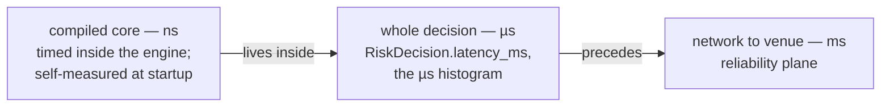
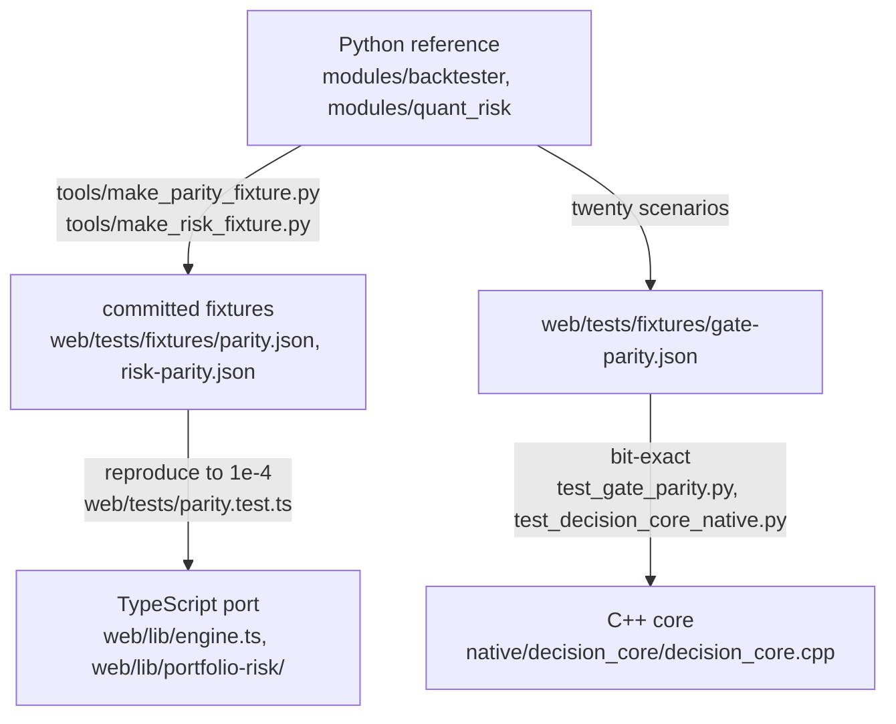

# Coding standards

The house rules, written as a standards document. One thing distinguishes them
from most style guides: **almost every rule here is enforced by a test**, so
breaking one turns a suite red rather than starting an argument in review. The
enforcement suites are named beside each rule; where a rule is convention only,
that is said. Facts checked against the tree on 2026-08-22.

The deep arguments live in
[`Part2_Infrastructure/README.md`](../../Part2_Infrastructure/README.md) and
[`CLAUDE.md`](../../CLAUDE.md); this page states each rule, its reason, and
where it is held.

---

## 1. Null honesty: never coerce null to zero

A missing measurement renders as a dash and says why it is missing. `?? 0` on
a nullable metric is the defect this codebase is most alert to: it turns "we
do not know" into "it is fine", and it passes every type check on the way
through. Zero is a *claim* — a fail rate of 0 says "we checked and nothing
failed", which is a different fact from "nothing has been checked yet".

Held by `web/tests/null-honesty.test.ts` on the UI side, and by the engines
themselves: the data-quality ledger keeps a fail rate that stays null rather
than becoming zero (`tests/test_data_quality.py`), and the community-detection
module reports modularity as *absent* rather than 0.0 when there is nothing to
partition, because 0.0 is a meaningful modularity and "no graph" is not
(`modules/research_communities.py`).

## 2. Absence is a state, not a failure

The most distinctive habit of this system: an optional capability that is not
configured **reports its absence in a named shape** — never an exception,
never a silent success, never a degraded answer dressed as a full one. "Could
not project" and "there was nothing to project" are different facts and must
stay distinguishable at the call site.

The three optional capabilities all follow the same report shape:

- **Neo4j** (`modules/research_graph_projection.py`): an unset `NEO4J_URI` is
  the *normal* deployment, and so is an uninstalled driver —
  `requirements-graph.txt` is optional and the whole suite passes without it.
  Postgres remains authoritative; the graph is a rebuildable projection, so
  divergence is a non-event (drop it and re-project).
- **Gemini** (`modules/research_generate.py`): an unset `GEMINI_API_KEY` and
  an uninstalled `google-genai` are both normal; the gateway boots with no
  generation provider at all. When the model *is* present, the module is built
  as a fence, not a client — refusal band checked before the call, closed
  context, figures quoted never computed, citations verified after generation.
- **The re-ranker** (`modules/research_rerank.py`): `fastembed` not installed
  reports state `unavailable` — "not configured", "not installed" and "the
  model raised" are three different facts and get three different reports.
  Retrieval falls back to RRF fusion alone rather than pretending it
  re-ranked.

The same shape recurs everywhere: the OpenBB bridge returns `ok: false` with a
reason, never a 500 (`tests/test_research.py`); the one expected pytest skip
(`tests/test_data_ops_postgrest.py`) *says* which credentials were absent; an
empty panel says it is empty rather than rendering as though still loading.

**NOT BUILT**, stated plainly because this document would otherwise imply it:
multimodal generation. The only place a model writes prose a trader acts on is
`research_generate`, and it produces grounded text only — it quotes figures
from supplied documents and never computes, draws or renders anything.

## 3. UI typography: no emoji, no colour-only meaning, no middle dot as a word

- **No emoji in UI** — not in components, not in `app/`. The status vocabulary
  is typographic marks — `● ▲ ✕ ○ ◌ ✓ ✗ →` — which inherit the text colour and
  render in the app's own font. Coloured geometric shapes count as emoji and
  are banned for exactly the reason they are tempting: they encode state in a
  vendor's picture. Held by `web/tests/house-rules.test.ts`.
- **No colour-only meaning.** Anything a colour says, a mark, a label or a
  border must also say. `forced-colors.test.ts` holds the line for Windows
  High Contrast, where every colour is replaced.
- **The middle dot is not a word.** Never on a heading, kicker, label, button
  or aria-label; notes and captions are prose ("23 of 25 left today", not
  "23 · day"). It survives only between same-kind measurements in tabular mono
  type, and only through `metricRow` in `web/lib/format.ts`;
  `middle-dot.test.ts` holds the raw-literal count at zero.
- Type sizes read the `--fs-*` ladder in `globals.css`, never a literal
  (`type-scale.test.ts`); `prefers-reduced-motion` is respected everywhere
  (`motion.test.ts`, and JS animators check the query themselves).

## 4. British spelling — in prose and in identifiers

Behaviour, colour, normalise, summarise. Not a prose-only rule: identifiers
follow it too, so a grep for `normalize` finding half the call sites is a
defect this rule exists to prevent. Convention, not a test — the one rule here
held by review rather than by CI.

## 5. Comments argue WHY, and name the rejected alternatives

A comment that restates the code beneath it is dead weight; the house voice
records the *argument* — why this way, and which alternatives were rejected on
what grounds. Two exemplars worth reading before writing your first module:
`modules/research_rerank.py` (why a local ONNX cross-encoder and not Cohere or
Voyage — four properties a hosted re-ranker would take out, each named) and
`modules/research_generate.py` (why refusal is checked *before* the model
call, and why `grounded: false` beside an answer was rejected: a warning
beside an answer is a thing readers learn to skip). When a debt is taken on
knowingly, the argument goes in the ledger next to it — see the raised entry
in `tests/test_file_size.py`.

## 6. Stateful UI: a plain class, then a thin hook

Stateful behaviour in the workspace is written as a **plain class** with no
React and no DOM, wrapped by a thin `use*` hook that only translates renders
into observations. `DeskSourceMachine` in `web/lib/desk-source.ts` (demotion
immediate, promotion needs a streak — the anti-twitch property) is the
pattern's origin; `use-desk-source.ts` is its wrapper.
`web/components/developer/workspace-health.ts` states the argument in its own
header: a scripted pass/fail/pass sequence with no DOM is eleven lines of
arrange-act-assert, driven by a fake clock
(`web/tests/developer-stability.test.ts`). The rejected alternative — state
living inside the hook — makes the interesting behaviour testable only through
a rendered component, which is how hysteresis bugs survive.

## 7. Seam tests import both real modules

The scar this rule grew from is documented where it is enforced, in
[`tests/test_research_contract.py`](../../Part2_Infrastructure/tests/test_research_contract.py):
two modules written in parallel did not meet — the scheduler resolved an entry
point by name that the sweep did not export — and **the full suite stayed
green**, because each side tested against a mock of the other. Its docstring:

> That is the defect this file exists for, and it is worth naming precisely:
> not that the modules disagreed, but that BOTH sides tested against a fiction
> of the other. Each suite proved its own half in isolation and neither proved
> the seam. A mocked collaborator cannot fail a contract.
>
> So nothing here substitutes anything. Every assertion imports both real
> modules and asks whether the real one satisfies the real other.

The standard: wherever two modules meet across a resolution boundary (names,
signatures, wire shapes), there must be a test that imports **both real
modules** and asserts the seam — mocks may cover each half's internals, never
the handshake. The same discipline appears at the process boundary:
`tests/test_stream_desk.py` asserts the desk stream's properties from the side
that owns them rather than reading `main.py` as text from the web repo.

## 8. Three latency planes, never blended

A nanosecond figure under a microsecond label is *the* defect: it makes the
system look a thousand times better than it is, and nobody re-checks a number
that flatters. The gateway self-measures the compiled core at startup on a
synthetic book so the ns figure exists before the first order — and
`tests/test_core_self_measure.py` asserts those samples land in the core (ns)
histogram and never in the decision (µs) one. `decision-latency.test.ts`
holds the web side. The full budget, plane by plane, is
[`docs/architecture/LATENCY_BUDGET.md`](../architecture/LATENCY_BUDGET.md).

## 9. The maths exists twice — and three times for pre-trade

Neither runtime can call the other, so the gateway's maths is implemented
twice: **Python is the reference** (server and Telegram companion), TypeScript
is the port (browser). The two are pinned by committed parity fixtures, and
the rule is one-directional:

Change a formula on one side and the fixtures make the other side fail. **That
is the design** — regenerate the fixture deliberately rather than loosening
the tolerance. Shared constants (`Z95`, the expected-shortfall multiplier,
`ddof=1`, mid-rank percentiles) are pinned by tests on both sides, and the
iterative allocation solvers run a fixed 60 steps rather than testing for
convergence, because a tolerance check lets two implementations stop on
different iterations and disagree for reasons unrelated to correctness.

The pre-trade arithmetic exists a **third** time, in C++, and there the
standard tightens from tolerance to **bit-exact**: both engines must reproduce
the same twenty-scenario fixture to the bit — same accept/reject, same gate
order, same observed and limit numbers. Python remains the reference even
there. The full argument is
[README §12](../../Part2_Infrastructure/README.md#12-one-engine-two-implementations-one-test-that-proves-it).

## 10. Dependencies: the burden of proof is on the package

**No new npm dependencies.** The workspace ships on Next, React,
`lucide-react`, `@supabase/supabase-js` and `oracledb`; everything else —
charts, engines, state machines — is written here. Reach for a package and you
are changing the argument the project makes about itself. There is no chart
library and no ESLint for the same reason.

Python optionality is expressed as split requirements files
(`requirements-core.txt` is the guaranteed-installable floor;
`-native`, `-graph`, `-genai`, `-rerank` and the rest are opt-in extras), and
every optional extra degrades along the §2 absence contract rather than
crashing. Ruff's rule selection follows the same philosophy — rules that catch
defects, not rules that restyle working code; pyupgrade is deliberately absent
(`pyproject.toml` says why).

## 11. Where the mechanical discipline lives

File-size ratchet (400-line ceiling, one-way `OVER_CEILING` ledgers), the
complexity-debt ledger, the four generated gates, and the count-the-skips
rule are workflow rather than style: see
[`docs/planning/WORKFLOW.md`](../planning/WORKFLOW.md). The test suites that
enforce this document: `house-rules`, `motion`, `forced-colors`, `type-scale`,
`accent-budget`, `null-honesty`, `live-motion`, `interaction`, `dead-css`,
`header-ladder`, `decision-latency`, `middle-dot` (all under `web/tests/`),
plus the gateway-side seam, parity and self-measure suites named above.
