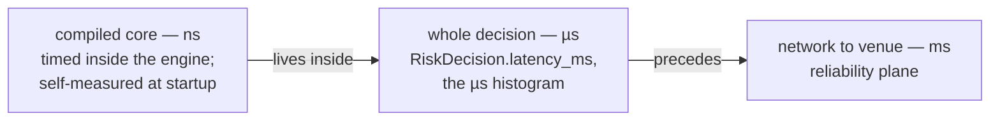
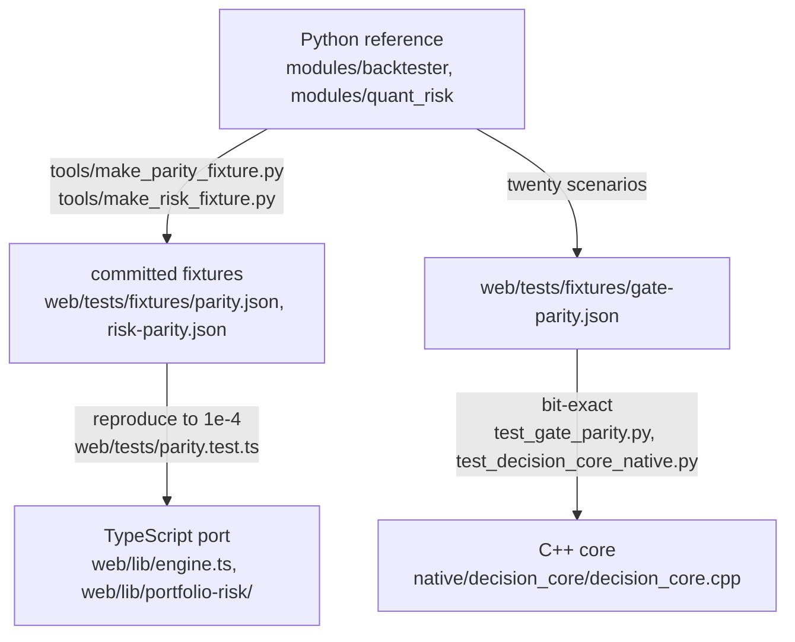

# Coding standards

The house rules, written as a standards document. One thing distinguishes them
from most style guides: **almost every rule here is enforced by a test**, so
breaking one turns a suite red rather than starting an argument in review. The
enforcement suites are named beside each rule; where a rule is convention only,
that is said. Facts checked against the tree on 2026-08-22.

The deep arguments live in
[`Part2_Infrastructure/README.md`](../../Part2_Infrastructure/README.md) and
[`CLAUDE.md`](../../CLAUDE.md); this page states each rule, its reason, and
where it is held.

---

## 1. Null honesty: never coerce null to zero

A missing measurement renders as a dash and says why it is missing. `?? 0` on
a nullable metric is the defect this codebase is most alert to: it turns "we
do not know" into "it is fine", and it passes every type check on the way
through. Zero is a *claim* — a fail rate of 0 says "we checked and nothing
failed", which is a different fact from "nothing has been checked yet".

Held by `web/tests/null-honesty.test.ts` on the UI side, and by the engines
themselves: the data-quality ledger keeps a fail rate that stays null rather
than becoming zero (`tests/test_data_quality.py`), and the community-detection
module reports modularity as *absent* rather than 0.0 when there is nothing to
partition, because 0.0 is a meaningful modularity and "no graph" is not
(`modules/research_communities.py`).

## 2. Absence is a state, not a failure

The most distinctive habit of this system: an optional capability that is not
configured **reports its absence in a named shape** — never an exception,
never a silent success, never a degraded answer dressed as a full one. "Could
not project" and "there was nothing to project" are different facts and must
stay distinguishable at the call site.

The three optional capabilities all follow the same report shape:

- **Neo4j** (`modules/research_graph_projection.py`,
  `modules/research_graph_read_model.py`): an unset `NEO4J_URI` is the *normal*
  deployment, and so is an uninstalled driver — `requirements-graph.txt` is
  optional and the whole suite passes without it. Postgres remains
  authoritative; the graph is a rebuildable projection, so divergence is a
  non-event (drop it and re-project). Now that two routes *read* the projection
  back, the same shape covers the read: every refusal falls back to the
  in-process computation rather than raising, and `source` says which answered.
  Two of those refusals are worth naming because they are absences a lazier
  reader would round to a value — labels from two different sweeps refuse as
  "mid-rebuild" instead of serving a half-finished partition that looks like a
  good one, and a metric the graph does not store (modularity, seed, resolution,
  damping) is **absent** from the report rather than restated from the caller's
  arguments.
- **Gemini** (`modules/research_generate.py`): an unset `GEMINI_API_KEY` and
  an uninstalled `google-genai` are both normal; the gateway boots with no
  generation provider at all. When the model *is* present, the module is built
  as a fence, not a client — refusal band checked before the call, closed
  context, figures quoted never computed, citations verified after generation.
- **The re-ranker** (`modules/research_rerank.py`): `fastembed` not installed
  reports state `unavailable` — "not configured", "not installed" and "the
  model raised" are three different facts and get three different reports.
  Retrieval falls back to RRF fusion alone rather than pretending it
  re-ranked. Downstream of it, `modules/research_crag_signals.py` holds the same
  line at the level of a single number: a row whose `rerank_score` is absent,
  null, non-numeric or non-finite leaves the grade **untouched to the decimal**
  and appends no reason line, because a reason that claims a signal nobody read
  is a fabricated measurement in prose.

Two newer members of the family, both in shapes this section already describes:

- **Delivery to the corpus** (`modules/research_ingest_delivery.py`): a document
  that cannot be written comes back as a typed `Undelivered(reason, detail,
  attempts)` over the mirror's closed vocabulary — `auth` deliberately apart
  from `rejected`, because an expired service-role key is an operator's problem
  and a rejected row is a developer's — and lands in a bounded dead-letter book
  that **counts what it discarded**, since a bounded buffer that forgets
  silently is the same defect as the counter it replaces.
- **The bound on `/ask`** (`modules/research_quota.py`): a call the provider
  reports no token counts for is recorded as *unpriced* and the spend window's
  total is published as a floor (`state: "partial"`) — never completed with an
  invented average price, which would be a fabricated measurement enforcing a
  real refusal. Its refusals are also kept typed and separate from the
  pipeline's own three, because "you are over budget" and "the corpus is
  silent" are different facts that would otherwise share a 200.

The same shape recurs everywhere: the OpenBB bridge returns `ok: false` with a
reason, never a 500 (`tests/test_research.py`); the one expected pytest skip
(`tests/test_data_ops_postgrest.py`) *says* which credentials were absent; an
empty panel says it is empty rather than rendering as though still loading.

**This paragraph used to say multimodal generation was NOT BUILT, and it is now
the standards document's own worked example of the rule it teaches.** The gap
was real when written; it was closed on 2026-08-22 by building the thing, and
the correct edit is therefore to *state what shipped*, not to leave a plausible
sentence standing. `research_generate` still produces grounded text only and
still quotes figures rather than computing them — but `research_generate_vision`
now attaches the chart PNG to the call, and the discipline that made that safe
is worth reading as an example: an image is **evidence, never a source**; it is
named to the model by the id of the document it belongs to; the figure fence
refuses a `[chart:<id>]` marker naming a document whose image was not actually
sent, because without that check the marker would be a way to buy an exemption
from the fence by labelling an invented number; and every way the path can end
in "no image" is a **named state** rather than a silent text-only call, because
a reader cannot tell from the prose whether "the chart shows" was written over a
call that carried a chart. One claim in the old paragraph is still exactly true
and is kept: the Supabase Edge runtime's `Supabase.ai.Session` exposes
`gte-small` and nothing in its inference API takes an image. What changed is
where the vision model runs — in the gateway, not the edge function.

**Still NOT BUILT, or built and off, and named for the same reason:** the real
cross-encoder does not run in CI on a push (the weights would need a download
and the default suite is network-free by construction — CI's opt-in
`rerank-real` job runs it on request, and eight cases pass against the real
model); the CLIP image retrieval arm is built but **off by default**, because it
measured 0.671 nDCG@3 alone against the computed description's 0.687 and only
earns +0.06 in fusion — a price, stated with its number, not an aspiration;
`tools/bench_image_retrieval.py` is not wired into CI; `tests/conftest.py` does
not blank `RESEARCH_IMAGE_MODEL_PATH` the way it blanks `RERANK_MODEL_PATH`;
`supabase/apply_all.generated.sql` does not yet carry
`20260822110000_research_chart_images.sql`; the durable chart store's PostgREST
GET still runs on the event loop's thread with the fix written down as one owed
line; `execution_summary` documents have no in-process producer (only the
backfill tool emits them); nothing re-embeds the corpus's `pending` rows (no
query selects on `embedding_status`); and RLS on `research_documents` is still
bypassed — what landed is an optional `filter_desk_id` predicate on the
retrieval RPCs, off by default. Each is written where the code is as well as
here, and collected in [`PLAN.md` §2](../planning/PLAN.md); the rule this
document enforces is that a gap is never rounded up to "planned" — and its
mirror image, that a gap which has been closed is never left standing as prose
because the sentence still reads well.

## 3. UI typography: no emoji, no colour-only meaning, no middle dot as a word

- **No emoji in UI** — not in components, not in `app/`. The status vocabulary
  is typographic marks — `● ▲ ✕ ○ ◌ ✓ ✗ →` — which inherit the text colour and
  render in the app's own font. Coloured geometric shapes count as emoji and
  are banned for exactly the reason they are tempting: they encode state in a
  vendor's picture. Held by `web/tests/house-rules.test.ts`.
- **No colour-only meaning.** Anything a colour says, a mark, a label or a
  border must also say. `forced-colors.test.ts` holds the line for Windows
  High Contrast, where every colour is replaced.
- **The middle dot is not a word.** Never on a heading, kicker, label, button
  or aria-label; notes and captions are prose ("23 of 25 left today", not
  "23 · day"). It survives only between same-kind measurements in tabular mono
  type, and only through `metricRow` in `web/lib/format.ts`;
  `middle-dot.test.ts` holds the raw-literal count at zero.
- Type sizes read the `--fs-*` ladder in `globals.css`, never a literal
  (`type-scale.test.ts`); `prefers-reduced-motion` is respected everywhere
  (`motion.test.ts`, and JS animators check the query themselves).
- **The saturated accent has a budget, and it belongs to controls that
  commit.** `--series-1` filled is the desk's loudest statement, reserved for
  Send order, Sign in, Promote strategy, Retry connection. It had also been
  given to `.seg button[aria-pressed="true"]` — the *selected* state of a
  segmented control — and twenty-two components render a `.seg`, so choosing a
  log level or a blotter filter shouted in exactly the voice reserved for
  submitting an order, on all eight tabs. Emphasis that is everywhere carries
  nothing. One exception is deliberate and is asserted as hard as the rule: the
  order ticket's BUY/SELL picker keeps it, because quieting the base rule alone
  would have made the control deciding *which direction an order goes* exactly
  as loud as a filter, on the one screen where misreading it sends a wrong-way
  trade. Held by `accent-budget.test.ts`.
- **No chrome metric may follow selection.** The three controls a reader might
  call "subtabs" — the eight role tabs (`.workspace-tabs`), the section rail
  (`.workspace-subtabs`) and the in-panel pane switcher (`.seg`) — declare one
  metric set each, and no size, padding, border or inset varies with selection,
  hover, focus or a variant class. A control that grows when pressed moves
  everything beside it, which reads as the page twitching rather than as
  feedback. Two structural corollaries the suites enforce alongside it: each
  box is declared in **one** place, and the assertion is made against the
  *concatenated cascade* rather than one partial. Both come from the same
  incident — the rail was sized in four partials at once (06, 07, 12 and 15),
  three of which lost silently on specificity in files whose comments described
  them as live. Nothing was wrong on screen at any instant, and no reader could
  tell which number was real. Held by `tab-chrome-metrics.test.ts`, with
  `seg-metrics.test.ts` the deeper suite on `.seg`.

### Four conventions this document does NOT settle, and should not pretend to

A standards document that names only its settled rules implies everything else
is a matter of taste, which is how a tree ends up with two dialects and no
record of the split. These four were each surveyed across the whole workspace on
2026-08-22 by the tab sweeps, found genuinely divided, and left alone on purpose
— because a unilateral fix in one tab converts a tree-wide split into a tab-wide
oddity, which is worse. Each needs one decision applied everywhere, not eight.

| Split | The count | Why it was not fixed locally |
|---|---|---|
| `412 ms` versus `412ms` | 29 spaced against 37 unspaced across `components/` and `lib/` | Roughly even, and it correlates with context rather than with tab — the compact form sits in narrow numeric table columns and dimension expressions, the spaced form in prose. Consistent *by context*, both unambiguous; settling it belongs to whoever owns `lib/format`'s contract. |
| Rail labels: Title Case versus sentence case | `RISK_SECTIONS` is sentence case ("VaR & model", "Risk drivers"); `DATA_SECTIONS` and `RELIABILITY_SECTIONS` are Title Case ("Trust Summary", "Feeds & Contracts") | The rails read as two products side by side, and two tab headings inherit the Title Case verbatim because they repeat the rail label. The fix is one edit in `lib/sections.ts`, after which the headings follow for free. |
| Column header "Symbol" versus "Instrument" | 5 components against 10 | Not a settled house term. In `ExposureHeatmap` "Instrument" would sit beside a "Symbol limit used" column and read worse, so even the majority spelling is not right everywhere. |
| `aria-label` on a role-less `
` | four places on the Developer tab, and its twin on Data | Most assistive technology ignores an `aria-label` on a generic element, so these are inert rather than harmful. It is consistent across the tabs that do it, which makes it a shared decision — and the rule that accessibility text is never *cut* on one person's judgement outranks tidiness. |

The house position on all four is the same and is worth stating as a rule in its
own right: **an inconsistency that spans surfaces is fixed at the level it spans,
or it is written down.** Recording it costs a paragraph; fixing half of it costs
a second dialect and the memory of why.

## 4. British spelling — in prose and in identifiers

Behaviour, colour, normalise, summarise. Not a prose-only rule: identifiers
follow it too, so a grep for `normalize` finding half the call sites is a
defect this rule exists to prevent. Convention, not a test — the one rule here
held by review rather than by CI.

## 5. Comments argue WHY, and name the rejected alternatives

A comment that restates the code beneath it is dead weight; the house voice
records the *argument* — why this way, and which alternatives were rejected on
what grounds. Two exemplars worth reading before writing your first module:
`modules/research_rerank.py` (why a local ONNX cross-encoder and not Cohere or
Voyage — four properties a hosted re-ranker would take out, each named) and
`modules/research_generate.py` (why refusal is checked *before* the model
call, and why `grounded: false` beside an answer was rejected: a warning
beside an answer is a thing readers learn to skip). When a debt is taken on
knowingly, the argument goes in the ledger next to it — see the raised entry
in `tests/test_file_size.py`.

## 6. Stateful UI: a plain class, then a thin hook

Stateful behaviour in the workspace is written as a **plain class** with no
React and no DOM, wrapped by a thin `use*` hook that only translates renders
into observations. `DeskSourceMachine` in `web/lib/desk-source.ts` (demotion
immediate, promotion needs a streak — the anti-twitch property) is the
pattern's origin; `use-desk-source.ts` is its wrapper.
`web/components/developer/workspace-health.ts` states the argument in its own
header: a scripted pass/fail/pass sequence with no DOM is eleven lines of
arrange-act-assert, driven by a fake clock
(`web/tests/developer-stability.test.ts`). The rejected alternative — state
living inside the hook — makes the interesting behaviour testable only through
a rendered component, which is how hysteresis bugs survive.

## 7. Seam tests import both real modules

The scar this rule grew from is documented where it is enforced, in
[`tests/test_research_contract.py`](../../Part2_Infrastructure/tests/test_research_contract.py):
two modules written in parallel did not meet — the scheduler resolved an entry
point by name that the sweep did not export — and **the full suite stayed
green**, because each side tested against a mock of the other. Its docstring:

> That is the defect this file exists for, and it is worth naming precisely:
> not that the modules disagreed, but that BOTH sides tested against a fiction
> of the other. Each suite proved its own half in isolation and neither proved
> the seam. A mocked collaborator cannot fail a contract.
>
> So nothing here substitutes anything. Every assertion imports both real
> modules and asks whether the real one satisfies the real other.

The standard: wherever two modules meet across a resolution boundary (names,
signatures, wire shapes), there must be a test that imports **both real
modules** and asserts the seam — mocks may cover each half's internals, never
the handshake. The same discipline appears at the process boundary:
`tests/test_stream_desk.py` asserts the desk stream's properties from the side
that owns them rather than reading `main.py` as text from the web repo.

## 8. Three latency planes, never blended

A nanosecond figure under a microsecond label is *the* defect: it makes the
system look a thousand times better than it is, and nobody re-checks a number
that flatters. The gateway self-measures the compiled core at startup on a
synthetic book so the ns figure exists before the first order — and
`tests/test_core_self_measure.py` asserts those samples land in the core (ns)
histogram and never in the decision (µs) one. `decision-latency.test.ts`
holds the web side. The full budget, plane by plane, is
[`docs/architecture/LATENCY_BUDGET.md`](../architecture/LATENCY_BUDGET.md).

## 9. The maths exists twice — and three times for pre-trade

Neither runtime can call the other, so the gateway's maths is implemented
twice: **Python is the reference** (server and Telegram companion), TypeScript
is the port (browser). The two are pinned by committed parity fixtures, and
the rule is one-directional:

Change a formula on one side and the fixtures make the other side fail. **That
is the design** — regenerate the fixture deliberately rather than loosening
the tolerance. Shared constants (`Z95`, the expected-shortfall multiplier,
`ddof=1`, mid-rank percentiles) are pinned by tests on both sides, and the
iterative allocation solvers run a fixed 60 steps rather than testing for
convergence, because a tolerance check lets two implementations stop on
different iterations and disagree for reasons unrelated to correctness.

The pre-trade arithmetic exists a **third** time, in C++, and there the
standard tightens from tolerance to **bit-exact**: both engines must reproduce
the same twenty-scenario fixture to the bit — same accept/reject, same gate
order, same observed and limit numbers. Python remains the reference even
there. The full argument is
[README §12](../../Part2_Infrastructure/README.md#12-one-engine-two-implementations-one-test-that-proves-it).

## 10. Dependencies: the burden of proof is on the package

**No new npm dependencies.** The workspace ships on Next, React,
`lucide-react`, `@supabase/supabase-js` and `oracledb`; everything else —
charts, engines, state machines — is written here. Reach for a package and you
are changing the argument the project makes about itself. There is no chart
library and no ESLint for the same reason.

Python optionality is expressed as split requirements files
(`requirements-core.txt` is the guaranteed-installable floor;
`-native`, `-graph`, `-genai`, `-rerank` and the rest are opt-in extras), and
every optional extra degrades along the §2 absence contract rather than
crashing. Ruff's rule selection follows the same philosophy — rules that catch
defects, not rules that restyle working code; pyupgrade is deliberately absent
(`pyproject.toml` says why).

## 11. Where the mechanical discipline lives

File-size ratchet (400-line ceiling, one-way `OVER_CEILING` ledgers), the
complexity-debt ledger, the four generated gates, and the count-the-skips
rule are workflow rather than style: see
[`docs/planning/WORKFLOW.md`](../planning/WORKFLOW.md). The test suites that
enforce this document: `house-rules`, `motion`, `forced-colors`, `type-scale`,
`accent-budget`, `tab-chrome-metrics`, `seg-metrics`, `null-honesty`,
`live-motion`, `interaction`, `dead-css`, `header-ladder`, `decision-latency`,
`middle-dot` (all under `web/tests/`), plus the gateway-side seam, parity and
self-measure suites named above.

**One limit on all of the CSS-side suites above, stated because it is invisible
from their assertions.** They read stylesheet *text* — `tests/globals-css.ts`
concatenates the partials in import order, so a rule is judged against the
cascade a browser would apply rather than against whichever partial declared it
last, which is what makes the "declared in one place" rule checkable at all.
What they cannot do is run the layout: there is no jsdom and no headless
browser in `web/`, so a rule that is present and correct can still wrap or
overflow at a width nobody tried. Geometry is therefore **derived, never
observed**, and a change to it is walked by a human before it ships — see
[`TESTING.md` §"No DOM, and therefore no layout"](../testing/TESTING.md), which
names the surfaces currently standing on a derivation.
