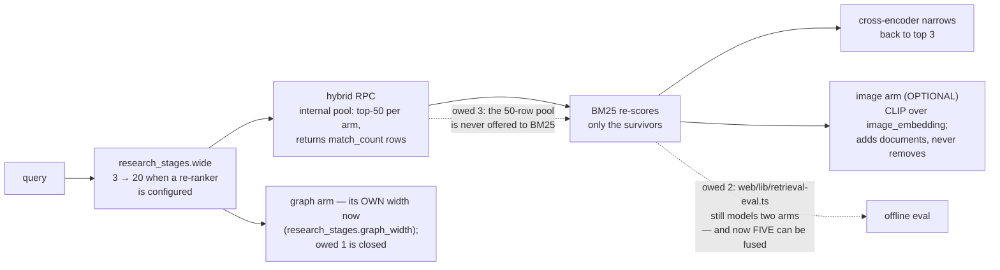

# Plan — where the research plane stands, and what it still owes

*Source/worktree state and release evidence audited on **2 September 2026**.
"Done" below means wired to a production caller and
proven against the real modules, not merely present in the tree — this
repository has shipped fully-tested modules with no caller before, and the
lesson is recorded in §1. The owed items in §2 are not a wishlist: each one is
already written down in the module that owes it, and this document only
collects them. Dated measurements remain records of the run that produced
them, not claims about this source-audit date. The requirement this delivers against is
[`PRD.md`](PRD.md).*

Current release topology, toolchain, suite totals and build evidence live in
[`CURRENT_STATE.md`](../CURRENT_STATE.md). This plan keeps delivery decisions
and debt; it does not duplicate that moving ledger.

## 1. Done

**All four optional RAG stage modules are wired, and the wiring is what the
tests hold.** The recurring defect this codebase found in itself: a module
arrives with twenty passing tests and no production caller, and the suite
stays green because each side tests against a fiction of the other. A
verification pass over the research plane found exactly that, twice —
`rank_documents` (PageRank) had no caller, and `project_communities`' only
caller pinned `project=False`, so both were unreachable in production while
every unit test passed (`tests/test_research_centrality_route.py` opens with
"the two wirings a verifier found dead by mutation"). The response was not
more unit tests but *seam suites* that run the real modules on both sides,
substituting only the outside world:

| Module | Production caller | Pinned by |
|---|---|---|
| `modules/research_bm25.py` (lexical arm) | `research_rag/retrieval.py::apply_bm25`, on every hybrid search | `tests/test_research_bm25_wiring.py` — checked against the migration's own SQL text |
| `modules/research_rerank.py` (cross-encoder) | `research_stages.narrow`, from `/api/research/rag/search` and the CRAG path | `tests/test_research_stage_seam.py` |
| `modules/research_generate.py` (stage 5) | `research_stages.synthesise`, from `research_crag.answer_from_corpus` | `tests/test_research_generation_seam.py` |
| `modules/research_graph_projection.py` + `research_communities.py` | the 6h/daily reconcile sweeps and the two graph routes | `tests/test_research_centrality_route.py`, `tests/test_research_contract.py` |

The CRAG loop and the router themselves got their production caller in the
same spirit: both were fully built and unreachable until
`POST /api/research/rag/ask` was wired through them, and the router's audit
write turned out to be broken in a way only a real `AuditLog` could reveal —
the test stand-in accepted a keyword argument the production object rejects.

**The Neo4j path is wired in source, and is no longer write-only.** The
projection MERGEs derived edges on the `reconcile:graph@every=6h` sweep, and
`reconcile:communities@every=1d` now writes **both** label sets off one
whole-corpus read — the seeded Louvain partition and the PageRank scores
(`modules/research_schedule.py`). `modules/research_graph_read_model.py` reads
them back, and `/communities` and `/centrality` try it before falling back to
the in-process computation, marking `source: "neo4j" | "corpus"`. Postgres
stays authoritative — drop the graph and re-project, and drift is a non-event.
Because that projection has no `desk_id`, the read model refuses Neo4j whenever
`RESEARCH_SCOPE_TO_DESK=1` and both reports automatically compute from the
desk-filtered Postgres corpus instead. With the flag off, Neo4j is suitable
only for one desk or an isolated database. E2E run `33633746350` read 15
documents, 48 edges and 2 communities from live Aura sweep
`deploy-33633139022-1`; the corpus answer under desk scoping remains the
intentional safety fallback.
Request-time traversal is still the Postgres CTE, and the algorithms are not run
inside Neo4j: GDS is not on Aura Free and CI cannot install it, so the read model
serves what the sweep computed rather than computing something different under
the same field name.

**Four claims the docs made are now true of the tree, and were not before.**
An adversarial documentation audit found each of these asserted where the code
did the opposite, and this pass closed the code side rather than softening the
prose:

| The claim | What was actually true | What closed it |
|---|---|---|
| The corpus is "written through the same bounded-queue discipline as the mirror" | the *queue* matched; the drain made **one** delivery attempt and discarded, where the mirror retried three times with backoff | `modules/research_ingest_delivery.py` — the mirror's own attempt count, curve and reason vocabulary, plus a bounded dead-letter book |
| Session execution summaries are an ingested source | `execution_summary` was in the enum, the API filter vocabulary and the graph linker's `promoted_to` rule, and **nothing wrote one** | `modules/research_ingest_session.py` built the document, and `modules/research_rag/session.py` is now the live caller: `RiskGateway._roll_session_if_needed` hands the closed session to `on_session_closed` at the UTC boundary (`modules/risk_proxy/monitor.py:260`). Pinned by `tests/test_research_session_emission.py`, which drives the **rollover site** rather than the producer — a test calling `on_session_closed` directly would pass on a tree where nothing ever reaches it, which is the exact defect being closed |
| Three bands: answer, rewrite, refuse | one band gated anything (`score < refuse_band`); `ANSWER_BAND` was a constructor default nothing read, so a mid-band result was served regardless | `modules/research_crag_policy.py` — a mid-band result that does not clear the band after its one rewrite now refuses. A **behaviour change**, argued in the module rather than softened |
| "Figures are quoted, never computed" is a fence | it was prompt text; nothing checked | `modules/research_generate_figures.py` — every number the answer states, other than a citation id, a date or an ordinal, must appear character-for-character in a supplied document |

**One claim was corrected in the prose instead**, because the code was right:
the PRD described PageRank as "seeded". `nx.pagerank` takes no seed and cannot —
it is deterministic by construction, and its reproducibility comes from the
canonical node insertion order plus pinned `MAX_ITER`/`TOLERANCE`. Louvain *is*
seeded and needs to be. Fixing the claim was the correct edit; adding a `seed=`
argument to make the sentence true would have been the wrong one.

**The image arm and multimodal generation landed, and one of this file's own
decision-log rows was overturned by them.** §3 recorded "Charts indexed by
computed description" with "CLIP/SigLIP image embedding" as the *rejected*
alternative. That rejection has been reversed in the only way this repository
accepts a reversal — by measuring it. `modules/research_image.py` holds the CLIP
`ViT-B/32` pair, `research_image_ingest.py` embeds a chart's PNG at ingest,
`research_image_arm.py` ranks it as a fourth arm at the same k = 60, and
`research_generate_vision.py` shows the chart to the model while it answers. The
description arm is **unweakened and still the default**: `tools/bench_image_retrieval.py`
puts CLIP alone at nDCG@3 0.671 against descriptions' 0.687 — inside the noise
between two draws of one corpus — and the fusion at 0.747. Weights of ~0.6 GB
and a forward pass per chart are not bought by +0.06 nDCG@3 on a seven-document
corpus, so the arm is off unless an operator sets `RESEARCH_IMAGE_MODEL_PATH`.

**The anti-twitch machinery landed on the web side.** The value throttle
(`web/lib/use-throttled-value.ts`, 300 ms), the venue-liveness hysteresis
(`web/lib/venue-liveness.ts` — "a twitching badge and a twitching price are
the same defect seen twice"), the desk-source liveness ladder
(`web/lib/desk-source.ts`) and `NumberTicker`'s 420 ms floor. Diagrammed in
[`../architecture/UML_DIAGRAMS.md`](../architecture/UML_DIAGRAMS.md).

**The disclosure pass folded detail instead of deleting it.** The eight
`web/tests/disclosure-*.test.ts` suites pin every moved sentence byte for byte
— a fold and a deletion look identical in a diff and are opposites in the
product — and empty states and null explanations are barred from folding,
because "this is withheld because…" reads as broken behind a `
`.

**The suite is green, and the counts belong to one file rather than to this
one.** [`web/lib/test-counts.generated.ts`](../../Part2_Infrastructure/web/lib/test-counts.generated.ts)
carries them and [`TESTING.md`](../testing/TESTING.md) explains them — why the
gateway has more than one correct collection shape, why the web figure cannot be asserted from
inside the suite, and which of the three lines CI actually checks. Only the
**web** line is checked (`web/scripts/check-test-counts.mjs` refuses any suite
argument but `web`); the gateway line is a **dated record CI does not gate on**.
It was behind the runner on 2026-08-24, the historical example that exposed the
gap. This section used to restate all of
it, which made a planning file one of five places a number had to be corrected;
the count belongs where it is generated, and the discipline is unchanged: read
the *skip reasons*, never the pass count ([`WORKFLOW.md` §2](WORKFLOW.md)). The
one thing worth stating here is the outcome — the gateway, web and service
suites are green. The 2026-09-02 generated record is 3,492 gateway tests,
6,846 web tests across 1,461 suites and 24 service tests; main CI also passed
live Oracle/Supabase and the eight-case real cross-encoder job.

**The September frontend/data parity pass is shipped.** The three quantitative
tabs now register 71 addressable views (26 Markets, 29 Proofs, 16 Diffusion),
and the desk sweep covers their 50 non-default destinations as well as all 70
rail sections. Shell is split into Namespace, Routing and Browse with grouped
readings tables; Makers renders an account-membership refusal as verified
access policy rather than a red gateway outage; a single closed Kalshi episode
renders a value strip rather than an empty survival curve; Findings reports the
57-meeting out-of-sample score instead of “study not built”. Deployment run
`33633139022` restored the complete Diffusion ledger to Supabase before
cutover: 62 events, 248 runs, 62 texts, 4 studies and 14 assessable findings.

### The information-diffusion instrument — **measured, killed, re-armed, killed again, then re-measured out of sample**

Recorded here because a negative result that is not written down gets rebuilt;
because the second attempt produced a false positive convincing enough that the
tool's own verdict function had to be taught to reject it; and because the
criterion was then replaced outright by an out-of-sample one, which measured the
question on **62 of 62** meetings per stage rather than on the 26 that cleared a
noise floor — and returned a **stronger** null, not a softer one.

**What was built.** `modules/coherence/diffusion/` measures how fast a
timestamped announcement reaches the price, and separately estimates how much
information one text carries about another as a density over log-SNR — the
integrand of a diffusion mutual-information bound, whose shape says at what
*resolution* one text explains another. Both halves are tested against known
answers: a 2-d correlated Gaussian at 1.2185 nats, a 32-d analogue, a jointly
Gaussian triple recovering its analytic mutual information, conditional
independence reading as zero. The calendar is verified — 62 of 62 FOMC meetings
confirmed against federalreserve.gov, date *and* hour.

**The positive control, which the first attempt lacked.** An absorption
pipeline that cannot detect the obvious is measuring noise, and every null it
reports is then unfalsifiable. `policy.py` reads the target range out of each
statement — all four wordings the Committee has used since 2019, including the
zero-lower-bound "0 to 1/4 percent" that a careless parser drops along with the
whole pandemic. The size of the policy move predicts the standardised
thirty-minute response at **t = +3.9 (release)** and **t = +4.5 (call)** over
61 meetings, shuffled p ≤ 0.001. The machinery works.

**What survives as a measurement.** Statement absorbed in a median 166 seconds
against 2.87× as long for the press conference, on a volatility clock built
from matched non-event windows; the interval excludes zero, and the placebo run
of the identical pipeline on windows with no announcement gives 0.68×. The
statement sits at control percentile 0.00, the press conference at 0.50.

**What still does not work: predicting SPEED from text.** Three fixes were made
to the instrument before re-testing, two of them real:

* The latent is now **whitened**, and the file that refused to whiten was
  wrong. Its argument was that a direction's place on the resolution axis is
  set by its log-eigenvalue; the premise is right and the conclusion does not
  follow, because the information density is a *difference* between the
  unconditional and conditional spectra and whitening moves only the first.
  Measured: the whitened spectrum's inter-quartile width is 2.18 against the raw
  2.42 — the same shape — while effective rank goes from 2.89/8 to 8.00/8. On
  the real statements, **5.5/10 → 9.9/10**.
* The conditioning is now the **previous statement** rather than the opening
  sentences of the same one. The old contrast was partly tautological (the
  headline is a subset of the body); consecutive FOMC statements are 0.978
  cosine apart, so the information is in the small differences, which is the
  Lazy Prices question asked as a spectrum. Centroid spread **1.08 = 10/10** of
  the sampler's scale.
* The gate that dropped 62 meetings to 26 was removed for the response tests,
  because gating on the size of a move and then dividing by it is selection on
  the denominator.

With those fixes one moment DID clear the bar — the spread of the density, at
**t = −2.86 (release)** and **t = −3.58 (call)**, both stages agreeing in sign,
shuffled p 0.009 and 0.002, and it survived controlling for the policy move
(t = −2.78, −3.51). It is not real. Re-fitting at latent widths nobody can
justify to the decimal gives t = +0.27 (dim 8), −0.20 (dim 10), −2.86 (dim 12),
−1.75 (dim 14) on the release stage; splitting the sample puts the call effect
entirely in the second half (+0.18 early, −4.89 late).

**So `_verdict` in `tools/diffusion_spectrum.py` was taught to require
stability, not just a threshold**, and re-fits at neighbouring widths before it
will say `predicts`. A verdict function that can be fooled by a hyperparameter
is a bug; `tests/test_diffusion_verdict.py` pins it with the exact numbers that
fooled it. That criterion is still computed and still prints
`does_not_predict` — but it is no longer the one the verdict turns on. It was
superseded by out-of-sample scoring, below, for a reason no amount of stability
checking could fix: an in-sample t on the largest of eight fits is the statistic
most likely to be an artefact even when it is stable.

**WHY it does not work — the diagnosis, which is worth more than the result.**
Four questions, asked in order, each answerable:

1. *Is the outcome measurable?* Yes, and very well. BTC and ETH respond to the
   same statement, so their half-lives are two measurements of one quantity:
   they correlate **+0.916** (n=34 paired), a two-asset reliability of 0.956.
   A predictor could in principle reach r ≈ 0.98. The dependent variable is not
   the problem.
2. *Does the pipeline detect anything?* Yes. Policy-move size predicts the
   standardised response at t = +3.9 and +4.5 over 61 meetings.
3. *Does the representation encode the subject?* **It did not, and this was the
   bug.** A whitened twelve-dimensional latent over the WHOLE statement cannot
   recover the policy move that is literally written in it — out-of-fold
   R² = **−0.60**, worse than predicting the mean — and classifies hike / hold /
   cut at 0.84 against a 0.64 majority baseline. Embedding only the sentence
   that states the target range gives R² = **+0.70** and direction at **1.00**.
   The cause is dilution, not the encoder: the decision sentence is ~131
   characters of a ~1,950-character statement, and the other 93% is an economic
   assessment whose wording moves for its own reasons. The same thing defeats
   the literal Lazy-Prices word-diff — the fraction of words changed since the
   previous statement correlates **+0.014** with the size of the policy move,
   because a 50bp cut can be a two-word edit while a hold arrives with a
   rewritten paragraph on the labour market.
4. *With an admissible representation, is the effect there?* **No.** Re-run on
   the decision sentence, conditioned on the previous one: 24 tests across four
   latent widths, largest |t| = 1.15, no width-dependent hits. Dissents do not
   predict it either (t = +0.71, +1.04), nor does the policy move (t = −0.31,
   −0.47). And out of fold the text adds nothing to the number: |bp| alone
   gives R² +0.13 / +0.20 for the response, |bp| plus text is worse.

**So `gate.py` exists**, and it is the reusable part. A latent must recover a
fact known to be stated in the documents, out of fold, before anything measured
through it counts as evidence about the text. `tools/diffusion_spectrum.py`
reports `inadmissible` and refuses a verdict when it does not — including
refusing the t = −3.58 false positive above, which was measured through the
whole-statement latent that fails the gate at −0.52.

**The three conditioning diagnostics were then swept, on diagnostics only.**
Gate R², effective rank and centroid spread are all measured without reference
to absorption speed, so choosing a representation on them cannot manufacture a
relationship with absorption speed — which is what makes the sweep legitimate
where a sweep over outcomes would not be. Eighteen configurations
(conditioning × segment × latent width); two clear every threshold with no
event refused:

| representation | gate R² | effective rank | centroid spread | scored |
|---|---|---|---|---|
| decision segment, d=6 | **+0.742** | 9.99/10 | 9.21/10 | 61 of 61 |
| guidance segment, d=6 | +0.621 | 9.99/10 | 10.00/10 | 57 of 57 |
| decision segment, d=10 | +0.714 | 9.99/10 | 8.52/10 | 61 of 61 |
| whole statement, any d | −0.22 … −0.61 | — | — | *inadmissible* |

The answer does not move: largest in-sample |t| is **1.15** at d=6 on the
decision segment, **1.47** on guidance. The whole-statement latent fails the
gate at every width, reproducing the dilution diagnosis exactly.

### The verdict is now scored OUT OF SAMPLE, and the null got stronger

Everything above is in-sample. A largest-of-eight |t| is the statistic most
likely to be an artefact, and this instrument already carries the scar — the
t = −3.58 moment cleared a shuffled p of 0.002 and turned out to be a
hyperparameter. So the criterion the verdict turns on was replaced.
[`modules/coherence/diffusion/skill.py`](../../Part2_Infrastructure/modules/coherence/diffusion/skill.py)
is the new one, imported and dispatched by
[`tools/diffusion_spectrum.py`](../../Part2_Infrastructure/tools/diffusion_spectrum.py)
and pinned by
[`tests/test_diffusion_skill.py`](../../Part2_Infrastructure/tests/test_diffusion_skill.py)
(21 test functions). Four changes, each argued in the module as *not* a choice
of answer:

1. **The target no longer needs a signal.** `half_life_s` is a fit, and it is
   fitted only where the terminal move cleared two sigma — **26 of 62** release
   meetings and **29 of 62** call meetings, so the study was discarding more
   than half its events while measuring its own dependent variable.
   `residence_time` is the area above the absorption curve,
   `∫₀³⁰ (1 − absorbed(t)) dt`, anchored at `absorbed(0) = 0` and joined
   piecewise-linearly. For an exponential approach that **is** the time
   constant, so it estimates the same quantity the half-life estimates — but it
   is a path integral rather than a fit, so it is defined for every measured
   path: **62 of 62 per stage.**
2. **A hard gate became a weight.** The terminal move's signal-to-noise is known
   per row, so a barely-measurable event counts in proportion to how well it is
   measured instead of being deleted. A two-sigma cut is a weight of one on one
   side of a line nothing derives.
3. **The stages are pooled and the policy move is a CONTROL, not a rival.**
   Release and call were fitted separately, halving n twice. One fit with a call
   indicator uses both, and the rate move — the one quantity already known to
   move the price at four standard errors — enters as a baseline term. The
   question is what the *text* adds to it.
4. **Scoring is leave-one-MEETING-out.** Folding by row leaks: a meeting
   contributes a release row and a call row that share one statement, one rate
   move and one encoder reading, so holding out a row while fitting on its
   sibling lets the held-out meeting's text into its own prediction — leakage
   that looks exactly like skill.

**The result, and it is a null.** The absorption clock **is** predictable —
out-of-sample **R² +0.144** from the stage and the rate move alone, with the
press conference about **7.0 minutes slower** than the statement — but adding
the text changes that by **−0.343**, at a shuffled **p of 0.875**. Over a
declared **3 × 3 grid** of specifications the gain was **negative in all nine
cells**, including the cell with the largest in-sample |t| of 2.85.

That is a *stronger* null than the one it replaced, not a weaker one. The
previous version could not distinguish "the text does not predict this" from
"nothing predicts this, so there was never a question" — which is why
`skill.verdict` reports **four** outcomes rather than two, and why
`skill_baseline_r2` must be read before `skill_gain`. Here the baseline is
positive and out of sample: the clock has real structure, measured on every
meeting rather than on the half that cleared a noise floor, and the statement's
information spectrum is not part of that structure.

**Both verdicts are reported, because on this data they disagree.** The tool
still computes `_verdict` — the in-sample criterion with its stability re-fit at
neighbouring latent widths, pinned by `tests/test_diffusion_verdict.py` with the
exact numbers that once fooled it — and prints it as `verdict_in_sample` beside
the out-of-sample one. The **reported** verdict is the out-of-sample one. Keeping
the loser visible is the point: a reader who sees only the surviving criterion
cannot tell that the two methods answer differently.

**Five fields carry it off the tool.** `skill_meetings`, `skill_baseline_r2`,
`skill_gain`, `skill_shuffled_p` and `skill_stage_minutes` were added to
`DiffusionStudy` in
[`modules/schemas_diffusion.py`](../../Part2_Infrastructure/modules/schemas_diffusion.py),
mirrored on the storage dataclass and its DDL in
[`studies.py`](../../Part2_Infrastructure/modules/coherence/diffusion/studies.py),
populated in
[`findings.py`](../../Part2_Infrastructure/modules/coherence/diffusion/findings.py)
and surfaced as two rows on
[`InstrumentFit.tsx`](../../Part2_Infrastructure/web/components/coherence/diffusion/InstrumentFit.tsx).
Adding those fields is also a worked example of the generated-artefact cascade —
one pydantic field, three committed artefacts to regenerate
([`WORKFLOW.md` §4a](WORKFLOW.md)).

**What the null now says.** With a reliable outcome, a working control, a
representation proven to carry the content, and a criterion that scores on
meetings the fit never saw, the absence of a text→speed relationship for FOMC
statements against crypto is a measurement rather than a failure to find one.
What moves the price is the number, and the number is public. The torch extra
remains unwritten — there is no `requirements-torch.txt` on this tree.

**Runs are filed rather than printed.**
[`modules/coherence/diffusion/studies.py`](../../Part2_Infrastructure/modules/coherence/diffusion/studies.py)
keeps one row per run — its gate, its conditioning diagnostics, its regressions,
its five `skill_*` fields and its verdict — and `tools/diffusion_spectrum.py
--persist` writes it. Refusals are kept: "the encoder was not configured" and
"it ran and found nothing" are different facts and a ledger of successes cannot
tell them apart. **The desk reports `DiffusionStudyStore.best()`, not the newest
run.** "Whoever ran last sets the headline" is a selection rule that rewards
re-running until a number moves, which is the failure the ledger exists to
prevent; the rule is fixed, stated on the pane, and blind to the outcome —
highest gate R² among runs whose latent clears rank ≥ 9 and spread ≥ 0.9.

**And it is on the desk.** `GET /api/research/diffusion/findings`
(`modules/api/diffusion.py`) returns every measured relationship, positive and
null at the same weight, each with its count and a shuffled-pairing null. Six
rows are computed straight off the ledgers — policy move → response size, policy
move → absorption speed and dissents → absorption speed, each for both stages —
and the admissible study's own spectrum regressions are appended on top by
`_study_rows`, so the total is a function of what that run measured rather than
a constant. (This section pinned "fourteen" before the list became dynamic; do
not re-pin a number without re-running the route.) Diffusion is now its own
workspace tab at `#diffusion`, with seven rail sections and sixteen registered
views in `web/lib/section-views.ts`; `#diffusion/findings`,
`#diffusion/findings/table` and `#diffusion/findings/instrument` are addressable
rather than private picker state. Findings draws the effects against the
|t| < 2 band and tabulates them beside the instrument's diagnostics; publishing
the empty rows remains the point: without a row the pipeline demonstrably *can*
detect, "we found nothing" and "this could not have found anything" are the
same table.

## 2. Open — the owed items

Each of these is documented in the module that owes it. That is deliberate:
a debt written next to the code that carries it cannot be lost in a planning
file nobody re-reads, and this section is only the collection point.

### 2.1 `graph_traverse` width narrowing — **closed**

`research_stages.wide` widened retrieval to `RERANK_CANDIDATES` (20) only when a
cross-encoder was configured to narrow it again, and the router applied **one
count to every tool in the plan** — so on a re-ranking deployment
`graph_traverse` also asked for twenty neighbours, a different list the
cross-encoder never saw. Closed twice over: `graph_width()` gives the graph arm
the caller's own count, because nothing narrows that arm and every row it asks
for is a row the caller is served; and `with_graph_width()` pins it on the
corpus handle rather than adding a parameter to `ResearchRouter.execute`, using
only the public `search`/`connected` protocol `research_crag` already depends on.
`wide()` itself is now a genuine multiple (×4, floored at 20, ceilinged at 60)
rather than a constant that happened to equal `RERANK_CANDIDATES` — the
"widening" that widened nothing above three candidates. Both widths are measured
**at the corpus** on the real path in `tests/test_research_stage_widths.py`,
not asserted against the arithmetic that produced them.

What is deliberately left: `wide()` returns the request unchanged above the
ceiling (`wide(200) == 200`), so a caller asking for more documents than 60 gets
no widening. Bounding the widening must never narrow the request, and serving 60
rows as the top 200 is a worse defect than the one being fixed.

### 2.2 Web retrieval-eval two-arm parity divergence

`web/lib/retrieval-eval.ts` fuses **two** rankings (vector + lexical) against
the committed golden set; the gateway now fuses up to **five** — dense and FTS
inside the RPC, `research_bm25.fuse`, the optional CLIP image arm
(`research_image_arm`), and the graph walk via
`research_graph_fusion.fuse_graph_matches` in the router's execution. Both of
the last two import `RRF_K` from `research_bm25` precisely so a further arm
cannot join at a different constant. The gap this section named has therefore
widened by *two* arms since it was written, not closed. The
constant is pinned identical on both sides at k = 60 — the tree argues in three places (`research_bm25.py` twice,
`research_rag/retrieval.py` once) that a third arm joining on a different
constant is "a second fusion wearing the first one's name" — so the divergence
is bounded to the missing arm, but the offline evaluator currently ratchets a
fusion the production path no longer runs. Owed: a third-arm-aware
`reciprocalRankFusion` and golden-set labels for it, so a BM25 change moves a
number in CI rather than an impression formed while clicking around.

### 2.3 BM25 candidate-pool widening

The BM25 arm scores only the survivors the hybrid RPC *returned* — it can
reorder a result and "can never introduce a document into it", which is what
made adding it provably safe. The cost of that safety: the RPC's internal
candidate pool is fifty rows per arm
(`supabase/migrations/20260810090000_hybrid_research_search.sql`), and BM25
never sees them — a document the two Postgres arms ranked just below the cut
cannot be rescued by the better lexical model. Owed: hand the wider pool to
the arm (or return it from the RPC) so BM25's ordering opinion applies before
truncation, not after. This buys recall only with the ordering model already
in place — the same argument, in the same direction, as `wide`/`narrow`.

### 2.5 `execution_summary` live emission — **closed**

The renderer, its figures and its document were built, tested and called only by
`tools/backfill_research_rag.py`, so on a running desk the summaries appeared
when somebody remembered to run the backfill and not before. The rollover hook
this section owed has landed:
[`modules/research_rag/session.py`](../../Part2_Infrastructure/modules/research_rag/session.py)
is a mixin on `ResearchRag` — the same class, not a second write path — and
`RiskGateway._roll_session_if_needed` calls its `on_session_closed` at the UTC
boundary (`modules/risk_proxy/monitor.py:260`). Everything it emits leaves
through `ResearchRag._submit`, the same bounded queue every other kind uses.

Two properties are worth carrying forward, because both were the reason the hook
was hard rather than incidental:

- **The rollover does not wait for it.** `_roll_session_if_needed` is called from
  `submit` and `sweep_working_orders` with the gateway's lock **held**, inside
  the region `submit` times to produce an order's `latency_ms`. `session_figures`
  runs four aggregate queries over a whole UTC day of the `orders` table, so
  doing the work at the call site would put a table scan inside the trading lock
  and charge it to whichever order happened to be first of a new session. The
  hook returns after a boolean and a `create_task`; the reading happens later,
  off the loop rather than merely off the lock, because a scan that blocks the
  event loop still stalls the breaker and the venue feeds.
- **A corpus failure changes nothing about the rollover.** A rollover is a
  trading-state transition; the corpus is an observer, exactly as the decision
  hooks are.

The seam is pinned by
[`tests/test_research_session_emission.py`](../../Part2_Infrastructure/tests/test_research_session_emission.py),
which drives `_roll_session_if_needed` against a real audit log on disk and reads
the corpus's own bounded queue. It deliberately does **not** call
`on_session_closed` directly — such a test passes on a tree where the rollover
site never calls it, which is the defect being closed.

*Why this module is not a method on `writer.py`:* only the 400-line ceiling.
`writer.py` measures 398 lines and the argument above does not fit in the two
that are left, and shortening the argument to fit is how the next reader
"simplifies" the deferral back into a blocking call. The ratchet
([`WORKFLOW.md` §5](WORKFLOW.md)) forced a split that was worth making.

### 2.6 The dead-letter book is a diagnosis, not a replay queue

A document that survives three delivery attempts is recorded — kind,
`source_ref`, reason, detail, attempts, timestamp — in a bounded in-memory deque
that counts what it discarded when full, and `status()` publishes the depth, the
discards and the recent entries. Deliberately **not** the body: that is the
embedded text and can be kilobytes. What does not exist: durability across a
restart, and anything that re-submits from the book. Replaying a dead letter is
still the backfill tool's job. Related and separate: **nothing re-embeds the
`pending` rows either** — no query selects on `embedding_status`, and the
backfill repairs a pending document only as a side effect of re-deriving its
source row, which never happens at all for a `chart`.

`_ensure_drain_alive()` also fires only on the submit path, so a drain that dies
while the queue is idle is revived by the next submission rather than
immediately. A watchdog loop was the rejected alternative: a second task to
watch the first is one more thing that can die quietly.

### 2.7 Tenancy: the predicate landed, RLS did not

Both retrieval RPCs now take an optional `filter_desk_id`, applied inside the
candidate CTE before either ranking is taken. Three debts remain, named in the
migration's own header: **RLS is still bypassed** (the gateway reads with the
service-role key), **the writer still sets no `user_id`**, and **the scope is
per-desk, not per-user** — every web request authenticates against one shared
gateway token, so `trader_identity` resolves to `web:token` / `web:anonymous`
and there is no per-user identity to key on. `desk_scope()` is where that
mapping goes the day there is one, and says so.

### 2.8 Structured answers do not reach CRAG or the HTTP `matches` array

`research_structured`'s computed rows live on `Execution.structured` and reach
the caller through the tool call's `detail`, not through `matches` — because
`ResearchRagMatch.similarity` is a required float, so a computed row would have
to carry 0.0 ("not applicable" written as "worst possible"), which would rank the
one exact answer last and 500 the route if left null. Consequence: CRAG does not
grade them, and a question whose real answer is a count is graded on the prose
documents beside it. Owed: one optional field in `research_crag` so a typed
non-similarity row can travel with the others.

Also unread by the grader: `bm25_rank`. Folding it in means changing `agreement`
to count a third retriever, which moves the grade on every desk with the BM25 arm
configured — a calibration change the golden fixture (which records two rankings,
not three) cannot back. It wants its own change with its own fixture row.

### 2.9 The smaller ledger

- **The scheduler's third arm.** `parse_schedule` and `DataScheduler.submit`
  hardcode replay and backfill; the reconcile cadences live beside them in
  `modules/research_schedule.py`, built from the scheduler's own parts. When
  the third arm lands: delete `parse_reconcile_schedule` and move the
  expressions into `DATA_SCHEDULES` (the module says exactly this).
- **`research.reconcile` is absent from `celery_tasks.TASK_MAP`** — a real gap
  on a broker deployment, reported verbatim at submit time rather than
  papered over.
- **Stale chart text is not assessable.** `metrics` is overwritten to
  `{"chart": <name>}` at write time, so the figures behind a chart sentence
  are discarded and the sentence is the only copy of its own inputs. Each
  sweep reports that half NOT ASSESSABLE with the reason; the fix is a
  retained field on the write path, not a cleverer sweep.
- **`chart_docs` stays unscheduled** — the sweep scope is declared and nothing
  implements it, and adding a cadence before the job exists would file a failed job every six hours
  (`modules/research_schedule.py`).
- **`web/lib/test-counts.generated.ts` falls behind the tree** whenever a
  test file lands without a refresh, and CI's "Committed test counts match the
  suite" step then exits 1 (it did for a week: 4,008 committed against 4,124
  measured, until the 2026-08-23 refresh). The debt is written in the generated
  file's own header — "Re-run the script after adding tests; nothing regenerates
  these automatically" — and the fix is `npm run counts:refresh -- --suite=web`,
  never a hand edit. Indexed here because three separate changes added suites and
  none of them refreshed it, which is the failure mode the generator exists to
  make visible rather than one it prevents. **The gateway and service lines in
  that file are not gated at all** — `web/scripts/check-test-counts.mjs` accepts
  only `web` — so they drift silently, and on 2026-08-24 the gateway line had
  (2,965 committed against a 2,986 CI-shape run). Refreshed the same day. Whether
  that wants a second gate or an explicit "dated record" marker on those two lines
  is undecided; what is not in doubt is that quoting the gateway figure as a
  *checked* number is wrong — and that the figure means nothing without the
  collection shape beside it, since seeding the cross-encoder weights moves it
  from 3,033 to 3,040.

### 2.10 The chart-image store: one blocking call

`modules/research_image_store._fetch` is a **synchronous** PostgREST GET and it
runs on the event loop's thread — the thread that also serves pre-trade risk.
It cannot go off the loop from where it is: `research_generate_vision.resolve`
is synchronous, and the async caller that would have to `await` a hydration step
is `research_generate.generate`. The end state is one line there —
`documents = await hydrate(documents)` — and the two rejected non-blocking
designs are written into `research_image_store`'s docstring rather than left to
be rediscovered (scheduling the fetch and reporting "not in time", which leaves
the first asker after a restart with no chart and the feature still absent on
the deployment that scales; and prefetching every chart row retrieval returns,
which pulls image bytes for searches that never generate an answer). Owed: that
one line. Until it lands the stall is bounded three ways — a 1,200 ms timeout
that `0` disables outright, an in-process LRU, and the write path warming the
same LRU so an ingesting gateway never fetches at all.

Two smaller debts travel with it. A third — `supabase/apply_all.generated.sql`
not carrying `20260822110000_research_chart_images.sql` — is **closed**: the
bundle was regenerated (`python3 tools/bundle_migrations.py`) and now contains
the `public.research_chart_images` table, its one-home constraint, its index and
its RLS grants, so a deployment that applies the bundle rather than
`supabase db push` no longer gets the image columns without the table.

- **A third copy of the `{"equity_curve": "equity_curve_png"}` map.** The read
  and write halves of the durable store now share one object by construction —
  `research_generate_vision.CHART_IMAGE_KEYS` *is*
  `research_image_store.CHART_PNG_FIELDS`, not a copy — but
  `modules/research_image_ingest.py`, the CLIP arm, still holds its own. The
  duplication is recorded in `research_image_store`'s docstring.
- **The rendered Sharpe heatmap has no chart document**, so it has no citable
  home and is deliberately not sent to the model — an image with no citable
  document is one the generator refuses. Closing it needs a `heatmap` `ChartDoc`
  in `research_chartdoc`, which needs the parameter surface off `BacktestResult`.

### 2.11 The image arm's bench is not in CI

`tools/bench_image_retrieval.py` is wired the way `tools/bench_rerank.py` was
before CI adopted it: an executable entry point, referenced from
`research_image.py`'s docstring, with its corpus, answer key, metrics and
degrade paths under test. `.github/workflows/ci.yml` already has a job that
seeds weights for `bench_rerank` and benches against a cached directory; this
bench wants the same treatment and nobody has added it.

Two honest limits on what the bench answers, stated in the tool itself: it
compares **two** arms (description against picture), not the live index's four,
so it settles "does the picture beat the sentence" and not "what does the
four-arm ordering do"; and nine queries over seven documents is a small sample,
whose honest strengthening is more queries rather than another seed.

**The conftest hole this section also carried is closed.**
`tests/conftest.py` now blanks `RESEARCH_IMAGE_MODEL_PATH` by **assignment**,
beside `GEMINI_API_KEY` and `RERANK_MODEL_PATH`, and the reasoning is written
above the three lines: the shape that actually loads 0.6 GB is an *exported*
path — the developer who ran the bench's `--seed` and kept it in their shell —
and `setdefault` beats only a `.env`. It had to go in the conftest rather than in
a per-file fixture because `research_image.IMAGE_MODEL_PATH` is read off
`os.environ` in a module-level assignment at **import**, so a fixture is
structurally too late for every file but its own. The arm's four suites each
patched the constant and were safe; anything driving `/api/research/rag/search`
reaches `research_image_arm` and was not.

## 3. Decision log

Decisions are recorded with their reason and the rejected alternative, in the
place a future reader will actually look — the module, the migration, or the
commit that made them. This table is an index, not the record; the "where"
column is authoritative and each entry there argues at ten times this length.

| Decision | Why, in one line | Rejected alternative | Where recorded |
|---|---|---|---|
| Fuse by rank (RRF, k=60), not by score | cosine and `ts_rank_cd` are numbers on unrelated scales; an ordering is the one thing both retrievers can honestly state | weighted score sum with a tuned normalisation | `web/lib/retrieval-eval.ts` |
| BM25 as a third arm, not an FTS replacement | replacing FTS discards the GIN index — the only thing that *finds* a candidate — and moves the scan onto the request path | delete `ts_rank_cd`, rank lexically with BM25 alone | `modules/research_bm25.py` |
| Keep k1=1.2, b=0.75, k=60 canonical, untuned | tuning constants against a corpus this small fits them to a handful of documents and calls the fit a finding | per-corpus tuning | `modules/research_bm25.py` |
| No minimum token length in the BM25 tokeniser | `len > 2` deletes FX, MA, PE and the 20/100 of a parameter pair — the exact tokens the dense arm blurs; IDF already prices empty tokens at zero | the usual length filter | `modules/research_bm25.py` |
| The CRAG grader is arithmetic, not a model | every signal is already on the row; an LLM grade becomes a function of a model version, the property this project spends effort removing | LLM-as-judge | `modules/research_crag.py` |
| Exactly one rewrite, bounded structurally | the second attempt holds nearly all the value; straight-line code with one `if` leaves nowhere for a third attempt to be added by accident | a corrective loop with a counter | `modules/research_crag.py` |
| Re-ranker is local ONNX on CPU | no key on the retrieval path, no vendor outage that becomes a retrieval outage, no desk research leaving the box | Cohere Rerank / Voyage (better scorers, rejected on exactly that) | `requirements-rerank.txt` |
| Retrieve wide only when something narrows | RRF sees only rank; widening without a re-ranker buys recall and pays for it immediately in precision | a constant somebody flips | `modules/research_stages.py` |
| Re-rank off the loop, behind a **one**-slot bulkhead | this process serves pre-trade risk in microseconds, and the re-rank is 197 ms at short rows and 1,523 ms at the truncation ceiling. One slot, not two, because `to_thread` takes one thread but onnxruntime spreads it over ~9 of 18 cores — the executor worker was never the scarce resource. Two at once measured 1.30–1.37× throughput for 1.46–1.54× latency on every request | two slots (the previous value, argued rather than measured); an inline call; a `wait_for` timeout, which cannot cancel the thread and would abandon a request still holding nine cores; `TextCrossEncoder(threads=…)`, the better lever, deliberately left to the deployment box rather than hardcoded from one machine | `modules/research_stages.py`, `tools/bench_rerank.py` |
| Kalshi prices are `Decimal` end to end, never float | every decision this engine takes is a comparison at the fourth decimal place, and `0.1` is not representable in binary64 — a float engine is right on every case a casual test would try and wrong on the marginal ones, which are the only ones an arbitrage test looks at | float with a `Number()` boundary conversion, which is the correct choice everywhere else on this desk | `modules/coherence/kernel/money.py`, `tests/test_coherence_no_float.py` |
| The coherence test runs two engines and names which answered | the linear programme finds strictly more than the closed-form family checks, and SciPy is not on the deployment image — so "coherent" and "coherent as far as the weaker engine can see" are different claims and must not print the same | LP only (fails closed on the image); closed-form only (misses portfolios assembled across constraints) | `modules/coherence/syscalls/certify.py` |
| The exchange's `mutually_exclusive` flag beats our arithmetic over the strikes | cutting the NYC weather family at its strikes gives nine intervals for six markets, three of which no market pays in because the underlying is whole degrees — treated as reachable states they say the basket does not pay a dollar in every future, and the additive constraint quietly stops applying to a family the exchange declares exhaustive | deriving exclusivity from `floor_strike`/`cap_strike`, which asserts a claim the venue never made | `modules/coherence/kernel/states.py` |
| The book tape is its own DuckDB file, not tables in the audit ledger | the ledger is evidence about decisions and is deliberately fire-and-forget; the tape is high-volume input to later analysis where a gap is a hole in a survival curve, and sharing the single-writer lock would make a recorder stall look like an audit failure | tables inside `modules/audit/` | `modules/coherence/fs/store.py` |
| The engine sizes and plans orders but has no send path | the detection is the hard part and the tape is the asset; an order route here would be a change to what this subsystem is rather than a method on it, and it should have to argue for itself | a dry-run flag guarding a real send path, which is one boolean away from live | `tests/test_coherence_security_auth.py` asserts the router publishes no non-GET route |
| Kelly's plan is reported beside the riskless one, never instead of it | where a basket costs under a dollar both exist and they are different portfolios: the Dutch book buys equal contracts for a certain profit, while the log-optimal plan stakes the measure — on a family costing $0.94 it grows at 0.1421 against the arbitrage's certain 0.0619 and can still leave 0.625 of the bankroll. Reporting only the growth rate would let "log-optimal" read as "riskless", which is the one inference this engine must not invite | a single "recommended size"; a `riskless` flag on the plan, which is what the field was first called and was wrong — the flag describes the family, not the plan | `modules/coherence/kernel/kelly.py` |
| The Murphy decomposition reports a fourth term the textbooks omit | `Brier = Reliability - Resolution + Uncertainty` is exact only for a forecaster quoting a fixed set of probabilities. A market quotes a continuum, so binning into ten bands throws away the variation inside each one and the three terms stop adding to the score. Publishing three terms that do not reconstruct their own total is worse than publishing four | quietly computing the Brier from bin means so the identity closes (it would no longer be the Brier score); shipping the standard three and letting the arithmetic not add up | `modules/coherence/kernel/calibration.py` |
| A settled market's last price counts only where something actually traded | Kalshi reports `last_price_dollars` as `"0.0000"` for a market that never traded, which is indistinguishable from one that traded at nothing. On settled KXBTCD ladders 175 of 200 markets have never traded, and scoring those as forecasts of "impossible" put 86 markets that resolved YES into the cheapest reliability bin — the curve then claimed contracts priced at half a cent happen a quarter of the time. That is a parser treating silence as a quote | trusting `last_price` as published, which is self-consistent and produces a confident, wrong calibration curve | `modules/coherence/syscalls/calibrate.py` |
| The Frechet band is read from the offer, and the reading says so | across a thousand listed parlays not one carries a bid — nobody offers to buy a parlay — so a band position that demanded a mid would report nothing about every combo on the exchange. The basis travels with the number because an ask carries the maker's margin, and a dependence called "positive" off an ask may be nothing but the spread | requiring a mid (reports `unavailable` universally); silently substituting the ask (turns a spread into a finding) | `modules/coherence/kernel/frechet.py` |
| The implied distribution takes the exclusivity flag over the strikes, again | the same precedence `states.py` settled, re-derived after the same bug in a second module: the NYC daily-high family was differenced into three bins off two quoted thresholds and its six exhaustive outcomes were discarded. Two modules independently getting this wrong is the argument for writing the rule down rather than remembering it | reading whichever structure is found first, which is how both bugs happened | `modules/coherence/kernel/distribution.py` |
| Unquoted markets are skipped from a surface and counted, never priced at zero | a BTC hourly event lists sixty strikes whose far wings nobody offers on; demanding every strike be priced refused a family with forty live strikes in it, reporting "no distribution" for a market that plainly has one. Differencing only ever needs two adjacent quoted strikes | requiring full coverage (refuses real ladders); filling gaps with zero (invents certainty at exactly the strikes nobody would quote) | `modules/coherence/kernel/distribution.py` |
| The implied distribution is NOT cross-checked against `forecast_percentile_history` | the endpoint is signed-only — the OpenAPI puts the three `KALSHI-ACCESS-*` headers on it — and this engine holds a demo key by decision, which signs demo and never production. Probed rather than assumed: with documented-valid arguments (`percentiles` in 0-9999, `period_interval` in {0,1,60,1440}, both timestamps) a keyless call returns 400 rather than 401, so the refusal does not even announce itself as an auth failure. The spec's §9.2 cross-check is therefore unbuildable on this deployment, and is recorded here rather than quietly omitted | asking for a production key, which would change what this engine is allowed to do; or shipping the cross-check against demo data, where the percentile history describes a different exchange | `modules/coherence/kernel/distribution.py` |
| The favourite-longshot slope is reported per series as well as over the corpus | a slope is a statement about how a set of markets is priced, and a fifteen-minute crypto strike is not the same question as a daily temperature bucket — different people, different information. On a synthetic corpus built from two series with opposite bias the aggregate reads 0.9845, which looks like near-perfect calibration, while the halves read 0.916 and 1.038. One number would have hidden both | a single aggregate, which §9.3 explicitly asks not to report alone | `modules/coherence/kernel/calibration.py` |
| The settlement index's formation rule is tested against every completed minute, not assumed | the published minute appears to be the mean of the stations that cleared quality control, and on that basis the trailing unpublished minutes are computable. "Appears to be" is not a basis for a number someone might trade: if the venue changes how it forms the index, a provisional value under the old rule is worse than no value. The dated 2026-08-24 read agreed on 1,435 of 1,435 completed minutes, and where a later read fails the pane says not to trade it | hardcoding the mean-of-ok-stations rule, which was right on that read and would be silent the day it stopped being | `modules/coherence/drivers/weather_qc.py` |
| The diffusion verdict is scored OUT of sample, on a target that needs no signal gate | an in-sample t on the largest of eight univariate fits is the statistic most likely to be an artefact, and this instrument has the scar to prove it (t = −3.58, shuffled p 0.002, and a hyperparameter). Residence time is a path integral rather than a fit, so it is defined on 62 of 62 meetings per stage where `half_life_s` was defined on 26; the rate move enters as a CONTROL rather than as a rival; and folding is by MEETING because both stages share a statement, so a row-wise fold leaks the held-out text into its own prediction | the previous criterion (largest in-sample \|t\| ≥ 2 against `half_life_s`, with a stability re-fit at neighbouring latent widths) — kept and still printed as `verdict_in_sample`, because on this data the two disagree and hiding the loser would hide that; and a non-zero skill floor, rejected because zero is the only threshold that is not a choice | `modules/coherence/diffusion/skill.py`, `tests/test_diffusion_skill.py` |
| The diffusion findings list is built dynamically, not pinned at a count | the six ledger rows are always computable; the study's spectrum regressions are appended only when the latent cleared the admissibility gate, so a fixed total would have to lie in one direction or the other on every run that refused | a constant fourteen, which is what this document said until the list stopped being one | `modules/coherence/diffusion/findings.py` |
| Neo4j is a projection, never a dual write | drift between an authoritative store and a copy is only detectable if somebody looks; a rebuildable read model makes divergence a non-event | second write path | `modules/research_graph_projection.py` |
| Louvain/PageRank in-process via networkx; Louvain seeded, PageRank not | Aura Free has no GDS — `gds.louvain.stream` there is procedure-not-found; unseeded Louvain makes "cluster 3" mean nothing a week later. PageRank takes no seed and cannot: it is deterministic by construction, reproducible from the canonical node order plus pinned `MAX_ITER`/`TOLERANCE` | Neo4j GDS; unseeded Louvain; inventing a `seed=` argument for PageRank to make a doc sentence true | `modules/research_communities.py` |
| The graph walk fused at the same k = 60 as every other arm (it was the fourth when written; the optional image arm now sits between them, and the constant did not move) | an arm joining on a different constant is a second fusion wearing the first one's name; `RRF_K` is imported from `research_bm25`, not restated | a graph-specific constant; turning depth into a score ("a two-hop document is half as relevant" is a number nobody measured) | `modules/research_graph_fusion.py` |
| A mid-band CRAG result refuses after its one rewrite | `ANSWER_BAND` decided nothing, so the documented three bands were one band in code; harsh is the point of a middle band, and the lever is `ContextGrader(answer_band=…)`, now actually wired to a verdict | keep serving it as `state: "ok"`; soften the band in code rather than argue it in the docstring | `modules/research_crag_policy.py` |
| The cross-encoder's logit folds in via `sigmoid`, weight 0.25 | that is the objective bge-reranker was trained under, so `sigmoid(logit)` is the model's own calibrated relevance; 0.25 is enough to carry a grade across a band edge, never enough for a model's opinion to carry a document alone | min-max normalising the batch — it scores the best candidate 1.0 whether or not it is relevant, re-introducing the failure one layer down | `modules/research_crag_signals.py` |
| The figure fence exempts dates and clock times | a document writing `2026-03-12` and an answer writing "12 March" are the same fact; a verbatim comparison would refuse legitimate prose. Recorded as a gap rather than left to be discovered | date normalisation now (a bigger piece of work); or dropping the fence because it cannot be complete | `modules/research_generate_figures.py` |
| The `/ask` bound is inert with no `GEMINI_API_KEY` | a desk that cannot reach a model cannot spend; refusing a free query because a paid one would be expensive is an outage, not a bound — and without it the offline suite would be rate-limited by a cap written for a deployment that spends | a cap that fires regardless; an invented average price so an unpriced provider can still be capped | `modules/research_quota.py` |
| The ingest drain retries and dead-letters rather than discarding | the queue matched the mirror but the delivery did not; a bounded buffer that forgets silently is the same defect as the counter it replaces, so the book records identity and counts its discards | one attempt then drop (what it did); an unbounded book; storing the body, which is the embedded text | `modules/research_ingest_delivery.py` |
| Generation refuses before the call, below band | spending the call to dress up weak evidence leaves a fluent paragraph that is far harder to throw away than one never written | generate first, grade after | `modules/research_generate.py` |
| A fabricated citation refuses the whole answer | a warning beside an answer is a thing readers learn to skip | return it with `grounded: false` | `modules/research_generate.py` |
| Charts indexed by computed description, and that stays the default | every figure a vision model would read off pixels is a number the desk computed to draw the chart; exact beats approximate at zero cost | *no longer a rejection.* The CLIP arm was built and measured: alone 0.671 nDCG@3 against descriptions' 0.687, fused 0.747. It is off by default because ~0.6 GB of weights and a forward pass per chart do not buy +0.06 on a seven-document corpus — a price, not an impossibility | `modules/research_chartdoc.py`, `modules/research_image.py`, `tools/bench_image_retrieval.py` |
| The image arm is a fourth `1/(k + rank)` term that can add a document and never remove one | it makes the three-arm ordering a sub-ordering of the four-arm one, so switching the arm on cannot make yesterday's good answer worse — the only property that made shipping an unproven arm safe | weighting the image score into the existing fusion; a similarity floor (`RAG_MIN_SIMILARITY` = 0.76 was measured against gte-small's range, CLIP cosines live far lower, and inventing a CLIP number is the unmeasured constant this tree refuses) | `modules/research_image_arm.py` |
| A chart's pixels live in a side table, not a column on `research_documents` | a hard constraint: no retrieval projection may ever be able to name those bytes. The isolation is also a rollout property — a deployment that has not run the migration answers 404 to the image write and nowhere else, where a column would have made PostgREST 400 the *document* insert and dead-letter the whole corpus | a column on `research_documents`; Supabase Storage (kept open by construction — `storage_path` is present, unused, and a row using it reads as "no inline image", which is the honest answer from a reader that cannot fetch) | `supabase/migrations/20260822110000_research_chart_images.sql`, `modules/research_image_store_write.py` |
| Reconcile on `DataScheduler`, not Celery beat | a beat reconciler would not exist on the default deployment, and reconciliation that runs only on the scaled topology is not reconciliation | Celery beat | `modules/research_schedule.py` |
| An embed outage stores `pending`, never a zero vector | a zero vector is equidistant from everything and ranks as similar to any query | zero-fill and move on | `modules/research_rag/retrieval.py` |
| Similarity floor 0.76, measured | 0.35 "a third is generous" filtered nothing — gte-small compresses near the top; unrelated text lands at ~0.735 whatever it is about | a floor derived from what the range ought to look like | `modules/research_rag/retrieval.py` |

## 4. How to extend this document

Add to §2 only what a module already owes in its own docstring — if the debt
is not written where the code is, write it there first and index it here.
Add to §3 in the same shape: decision, reason, the alternative that was
actually considered and rejected (an entry with no rejected alternative is a
description, not a decision), and where the full argument lives. Never record
a count or a date here that a generated file already carries — link the file.
