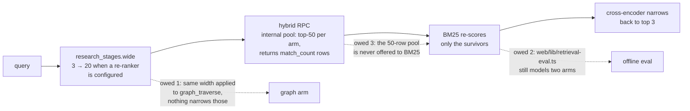

# Plan — where the research plane stands, and what it still owes

*As of 22 August 2026. "Done" below means wired to a production caller and
proven against the real modules, not merely present in the tree — this
repository has shipped fully-tested modules with no caller before, and the
lesson is recorded in §1. The owed items in §2 are not a wishlist: each one is
already written down in the module that owes it, and this document only
collects them. The requirement this delivers against is
[`PRD.md`](PRD.md).*

## 1. Done

**All four optional RAG stage modules are wired, and the wiring is what the
tests hold.** The recurring defect this codebase found in itself: a module
arrives with twenty passing tests and no production caller, and the suite
stays green because each side tests against a fiction of the other. A
verification pass over the research plane found exactly that, twice —
`rank_documents` (PageRank) had no caller, and `project_communities`' only
caller pinned `project=False`, so both were unreachable in production while
every unit test passed (`tests/test_research_centrality_route.py` opens with
"the two wirings a verifier found dead by mutation"). The response was not
more unit tests but *seam suites* that run the real modules on both sides,
substituting only the outside world:

| Module | Production caller | Pinned by |
|---|---|---|
| `modules/research_bm25.py` (lexical arm) | `research_rag/retrieval.py::apply_bm25`, on every hybrid search | `tests/test_research_bm25_wiring.py` — checked against the migration's own SQL text |
| `modules/research_rerank.py` (cross-encoder) | `research_stages.narrow`, from `/api/research/rag/search` and the CRAG path | `tests/test_research_stage_seam.py` |
| `modules/research_generate.py` (stage 5) | `research_stages.synthesise`, from `research_crag.answer_from_corpus` | `tests/test_research_generation_seam.py` |
| `modules/research_graph_projection.py` + `research_communities.py` | the 6h/daily reconcile sweeps and the two graph routes | `tests/test_research_centrality_route.py`, `tests/test_research_contract.py` |

The CRAG loop and the router themselves got their production caller in the
same spirit: both were fully built and unreachable until
`POST /api/research/rag/ask` was wired through them, and the router's audit
write turned out to be broken in a way only a real `AuditLog` could reveal —
the test stand-in accepted a keyword argument the production object rejects.

**Neo4j is live.** `NEO4J_URI` is set in the gateway's environment (a
`neo4j+s://` Aura instance); the projection MERGEs the derived edges on the
`reconcile:graph@every=6h` sweep and the seeded Louvain partition runs on
`reconcile:communities@every=1d` (`modules/research_schedule.py`). Postgres
stays authoritative — drop the graph and re-project, and drift is a non-event.

**The anti-twitch machinery landed on the web side.** The value throttle
(`web/lib/use-throttled-value.ts`, 300 ms), the venue-liveness hysteresis
(`web/lib/venue-liveness.ts` — "a twitching badge and a twitching price are
the same defect seen twice"), the desk-source liveness ladder
(`web/lib/desk-source.ts`) and `NumberTicker`'s 420 ms floor. Diagrammed in
[`../architecture/UML_DIAGRAMS.md`](../architecture/UML_DIAGRAMS.md).

**The disclosure pass folded detail instead of deleting it.** The eight
`web/tests/disclosure-*.test.ts` suites pin every moved sentence byte for byte
— a fold and a deletion look identical in a diff and are opposites in the
product — and empty states and null explanations are barred from folding,
because "this is withheld because…" reads as broken behind a `
`.

**The suite is green and the counts are measured, not remembered.** Gateway
1,719 passed and exactly one skipped, web 3,883 tests across 838 suites,
OpenBB service 14 — read from `web/lib/test-counts.generated.ts` (printed
2026-08-21; re-run 2026-08-22 per [`CLAUDE.md`](../../CLAUDE.md), which also
explains why the *skip count* is the number to watch, not the pass count).

## 2. Open — the owed items

Each of these is documented in the module that owes it. That is deliberate:
a debt written next to the code that carries it cannot be lost in a planning
file nobody re-reads, and this section is only the collection point.

### 2.1 `graph_traverse` width narrowing

`research_stages.wide` widens retrieval to `RERANK_CANDIDATES` (20) only when
a cross-encoder is configured to narrow it again. Its docstring names the
consequence rather than leaving it to be discovered: the router applies **one
count to every tool in the plan**, so on a re-ranking deployment
`graph_traverse` also asks for twenty neighbours — and those are a different
list the cross-encoder never sees, so nothing narrows them. Bounded, and
recall rather than a wrong answer; the fix is a separate width for the graph
arm on `ResearchRouter.execute`, "which is owed rather than done"
(`modules/research_stages.py`).

### 2.2 Web retrieval-eval two-arm parity divergence

`web/lib/retrieval-eval.ts` fuses **two** rankings (vector + lexical) against
the committed golden set; the gateway now fuses **three**
(`research_bm25.fuse`). The constant is pinned identical on both sides at
k = 60 — the tree argues in three places (`research_bm25.py` twice,
`research_rag/retrieval.py` once) that a third arm joining on a different
constant is "a second fusion wearing the first one's name" — so the divergence
is bounded to the missing arm, but the offline evaluator currently ratchets a
fusion the production path no longer runs. Owed: a third-arm-aware
`reciprocalRankFusion` and golden-set labels for it, so a BM25 change moves a
number in CI rather than an impression formed while clicking around.

### 2.3 BM25 candidate-pool widening

The BM25 arm scores only the survivors the hybrid RPC *returned* — it can
reorder a result and "can never introduce a document into it", which is what
made adding it provably safe. The cost of that safety: the RPC's internal
candidate pool is fifty rows per arm
(`supabase/migrations/20260810090000_hybrid_research_search.sql`), and BM25
never sees them — a document the two Postgres arms ranked just below the cut
cannot be rescued by the better lexical model. Owed: hand the wider pool to
the arm (or return it from the RPC) so BM25's ordering opinion applies before
truncation, not after. This buys recall only with the ordering model already
in place — the same argument, in the same direction, as `wide`/`narrow`.

### 2.4 The smaller ledger

- **The scheduler's third arm.** `parse_schedule` and `DataScheduler.submit`
  hardcode replay and backfill; the reconcile cadences live beside them in
  `modules/research_schedule.py`, built from the scheduler's own parts. When
  the third arm lands: delete `parse_reconcile_schedule` and move the
  expressions into `DATA_SCHEDULES` (the module says exactly this).
- **`research.reconcile` is absent from `celery_tasks.TASK_MAP`** — a real gap
  on a broker deployment, reported verbatim at submit time rather than
  papered over.
- **Stale chart text is not assessable.** `metrics` is overwritten to
  `{"chart": <name>}` at write time, so the figures behind a chart sentence
  are discarded and the sentence is the only copy of its own inputs. Each
  sweep reports that half NOT ASSESSABLE with the reason; the fix is a
  retained field on the write path, not a cleverer sweep.
- **`chart_docs` stays unscheduled** — the sweep scope is declared and nothing
  implements it, and a cadence today would file a failed job every six hours
  (`modules/research_schedule.py`).

## 3. Decision log

Decisions are recorded with their reason and the rejected alternative, in the
place a future reader will actually look — the module, the migration, or the
commit that made them. This table is an index, not the record; the "where"
column is authoritative and each entry there argues at ten times this length.

| Decision | Why, in one line | Rejected alternative | Where recorded |
|---|---|---|---|
| Fuse by rank (RRF, k=60), not by score | cosine and `ts_rank_cd` are numbers on unrelated scales; an ordering is the one thing both retrievers can honestly state | weighted score sum with a tuned normalisation | `web/lib/retrieval-eval.ts` |
| BM25 as a third arm, not an FTS replacement | replacing FTS discards the GIN index — the only thing that *finds* a candidate — and moves the scan onto the request path | delete `ts_rank_cd`, rank lexically with BM25 alone | `modules/research_bm25.py` |
| Keep k1=1.2, b=0.75, k=60 canonical, untuned | tuning constants against a corpus this small fits them to a handful of documents and calls the fit a finding | per-corpus tuning | `modules/research_bm25.py` |
| No minimum token length in the BM25 tokeniser | `len > 2` deletes FX, MA, PE and the 20/100 of a parameter pair — the exact tokens the dense arm blurs; IDF already prices empty tokens at zero | the usual length filter | `modules/research_bm25.py` |
| The CRAG grader is arithmetic, not a model | every signal is already on the row; an LLM grade becomes a function of a model version, the property this project spends effort removing | LLM-as-judge | `modules/research_crag.py` |
| Exactly one rewrite, bounded structurally | the second attempt holds nearly all the value; straight-line code with one `if` leaves nowhere for a third attempt to be added by accident | a corrective loop with a counter | `modules/research_crag.py` |
| Re-ranker is local ONNX on CPU | no key on the retrieval path, no vendor outage that becomes a retrieval outage, no desk research leaving the box | Cohere Rerank / Voyage (better scorers, rejected on exactly that) | `requirements-rerank.txt` |
| Retrieve wide only when something narrows | RRF sees only rank; widening without a re-ranker buys recall and pays for it immediately in precision | a constant somebody flips | `modules/research_stages.py` |
| Re-rank off the loop, behind a two-slot bulkhead | this process serves pre-trade risk in microseconds; a blocking re-rank is milliseconds on a plane that never reports them | inline call, "measure it later"; also a `wait_for` timeout, which cannot cancel the thread | `modules/research_stages.py` |
| Neo4j is a projection, never a dual write | drift between an authoritative store and a copy is only detectable if somebody looks; a rebuildable read model makes divergence a non-event | second write path | `modules/research_graph_projection.py` |
| Louvain/PageRank in-process, seeded, via networkx | Aura Free has no GDS — `gds.louvain.stream` there is procedure-not-found; unseeded Louvain makes "cluster 3" mean nothing a week later | Neo4j GDS; unseeded runs | `modules/research_communities.py` |
| Generation refuses before the call, below band | spending the call to dress up weak evidence leaves a fluent paragraph that is far harder to throw away than one never written | generate first, grade after | `modules/research_generate.py` |
| A fabricated citation refuses the whole answer | a warning beside an answer is a thing readers learn to skip | return it with `grounded: false` | `modules/research_generate.py` |
| Charts indexed by computed description | every figure a vision model would read off pixels is a number the desk computed to draw the chart; exact beats approximate at zero cost | CLIP/SigLIP image embedding (and the Edge runtime has no vision model anyway) | `modules/research_chartdoc.py` |
| Reconcile on `DataScheduler`, not Celery beat | a beat reconciler would not exist on the default deployment, and reconciliation that runs only on the scaled topology is not reconciliation | Celery beat | `modules/research_schedule.py` |
| An embed outage stores `pending`, never a zero vector | a zero vector is equidistant from everything and ranks as similar to any query | zero-fill and move on | `modules/research_rag/retrieval.py` |
| Similarity floor 0.76, measured | 0.35 "a third is generous" filtered nothing — gte-small compresses near the top; unrelated text lands at ~0.735 whatever it is about | a floor derived from what the range ought to look like | `modules/research_rag/retrieval.py` |

## 4. How to extend this document

Add to §2 only what a module already owes in its own docstring — if the debt
is not written where the code is, write it there first and index it here.
Add to §3 in the same shape: decision, reason, the alternative that was
actually considered and rejected (an entry with no rejected alternative is a
description, not a decision), and where the full argument lives. Never record
a count or a date here that a generated file already carries — link the file.
