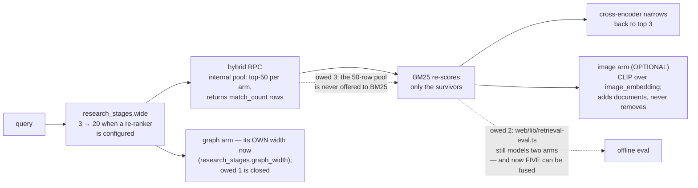

# Plan — where the research plane stands, and what it still owes

*As of 22 August 2026. "Done" below means wired to a production caller and
proven against the real modules, not merely present in the tree — this
repository has shipped fully-tested modules with no caller before, and the
lesson is recorded in §1. The owed items in §2 are not a wishlist: each one is
already written down in the module that owes it, and this document only
collects them. The requirement this delivers against is
[`PRD.md`](PRD.md).*

## 1. Done

**All four optional RAG stage modules are wired, and the wiring is what the
tests hold.** The recurring defect this codebase found in itself: a module
arrives with twenty passing tests and no production caller, and the suite
stays green because each side tests against a fiction of the other. A
verification pass over the research plane found exactly that, twice —
`rank_documents` (PageRank) had no caller, and `project_communities`' only
caller pinned `project=False`, so both were unreachable in production while
every unit test passed (`tests/test_research_centrality_route.py` opens with
"the two wirings a verifier found dead by mutation"). The response was not
more unit tests but *seam suites* that run the real modules on both sides,
substituting only the outside world:

| Module | Production caller | Pinned by |
|---|---|---|
| `modules/research_bm25.py` (lexical arm) | `research_rag/retrieval.py::apply_bm25`, on every hybrid search | `tests/test_research_bm25_wiring.py` — checked against the migration's own SQL text |
| `modules/research_rerank.py` (cross-encoder) | `research_stages.narrow`, from `/api/research/rag/search` and the CRAG path | `tests/test_research_stage_seam.py` |
| `modules/research_generate.py` (stage 5) | `research_stages.synthesise`, from `research_crag.answer_from_corpus` | `tests/test_research_generation_seam.py` |
| `modules/research_graph_projection.py` + `research_communities.py` | the 6h/daily reconcile sweeps and the two graph routes | `tests/test_research_centrality_route.py`, `tests/test_research_contract.py` |

The CRAG loop and the router themselves got their production caller in the
same spirit: both were fully built and unreachable until
`POST /api/research/rag/ask` was wired through them, and the router's audit
write turned out to be broken in a way only a real `AuditLog` could reveal —
the test stand-in accepted a keyword argument the production object rejects.

**Neo4j is live, and no longer write-only.** `NEO4J_URI` is set in the
gateway's environment (a `neo4j+s://` Aura instance); the projection MERGEs the
derived edges on the `reconcile:graph@every=6h` sweep, and
`reconcile:communities@every=1d` now writes **both** label sets off one
whole-corpus read — the seeded Louvain partition and the PageRank scores
(`modules/research_schedule.py`). `modules/research_graph_read_model.py` reads
them back, and `/communities` and `/centrality` try it before falling back to
the in-process computation, marking `source: "neo4j" | "corpus"`. Postgres
stays authoritative — drop the graph and re-project, and drift is a non-event.
Request-time traversal is still the Postgres CTE, and the algorithms are not run
inside Neo4j: GDS is not on Aura Free and CI cannot install it, so the read model
serves what the sweep computed rather than computing something different under
the same field name.

**Four claims the docs made are now true of the tree, and were not before.**
An adversarial documentation audit found each of these asserted where the code
did the opposite, and this pass closed the code side rather than softening the
prose:

| The claim | What was actually true | What closed it |
|---|---|---|
| The corpus is "written through the same bounded-queue discipline as the mirror" | the *queue* matched; the drain made **one** delivery attempt and discarded, where the mirror retried three times with backoff | `modules/research_ingest_delivery.py` — the mirror's own attempt count, curve and reason vocabulary, plus a bounded dead-letter book |
| Session execution summaries are an ingested source | `execution_summary` was in the enum, the API filter vocabulary and the graph linker's `promoted_to` rule, and **nothing wrote one** | `modules/research_ingest_session.py` — but its only caller is the backfill tool; see §2.5 |
| Three bands: answer, rewrite, refuse | one band gated anything (`score < refuse_band`); `ANSWER_BAND` was a constructor default nothing read, so a mid-band result was served regardless | `modules/research_crag_policy.py` — a mid-band result that does not clear the band after its one rewrite now refuses. A **behaviour change**, argued in the module rather than softened |
| "Figures are quoted, never computed" is a fence | it was prompt text; nothing checked | `modules/research_generate_figures.py` — every number the answer states, other than a citation id, a date or an ordinal, must appear character-for-character in a supplied document |

**One claim was corrected in the prose instead**, because the code was right:
the PRD described PageRank as "seeded". `nx.pagerank` takes no seed and cannot —
it is deterministic by construction, and its reproducibility comes from the
canonical node insertion order plus pinned `MAX_ITER`/`TOLERANCE`. Louvain *is*
seeded and needs to be. Fixing the claim was the correct edit; adding a `seed=`
argument to make the sentence true would have been the wrong one.

**The image arm and multimodal generation landed, and one of this file's own
decision-log rows was overturned by them.** §3 recorded "Charts indexed by
computed description" with "CLIP/SigLIP image embedding" as the *rejected*
alternative. That rejection has been reversed in the only way this repository
accepts a reversal — by measuring it. `modules/research_image.py` holds the CLIP
`ViT-B/32` pair, `research_image_ingest.py` embeds a chart's PNG at ingest,
`research_image_arm.py` ranks it as a fourth arm at the same k = 60, and
`research_generate_vision.py` shows the chart to the model while it answers. The
description arm is **unweakened and still the default**: `tools/bench_image_retrieval.py`
puts CLIP alone at nDCG@3 0.671 against descriptions' 0.687 — inside the noise
between two draws of one corpus — and the fusion at 0.747. Weights of ~0.6 GB
and a forward pass per chart are not bought by +0.06 nDCG@3 on a seven-document
corpus, so the arm is off unless an operator sets `RESEARCH_IMAGE_MODEL_PATH`.

**The anti-twitch machinery landed on the web side.** The value throttle
(`web/lib/use-throttled-value.ts`, 300 ms), the venue-liveness hysteresis
(`web/lib/venue-liveness.ts` — "a twitching badge and a twitching price are
the same defect seen twice"), the desk-source liveness ladder
(`web/lib/desk-source.ts`) and `NumberTicker`'s 420 ms floor. Diagrammed in
[`../architecture/UML_DIAGRAMS.md`](../architecture/UML_DIAGRAMS.md).

**The disclosure pass folded detail instead of deleting it.** The eight
`web/tests/disclosure-*.test.ts` suites pin every moved sentence byte for byte
— a fold and a deletion look identical in a diff and are opposites in the
product — and empty states and null explanations are barred from folding,
because "this is withheld because…" reads as broken behind a `
`.

**The suite is green, and the counts belong to one file rather than to this
one.** `web/lib/test-counts.generated.ts` carries them and
[`TESTING.md`](../testing/TESTING.md) explains them — why the gateway has two
correct pass counts, why the web figure cannot be asserted from inside the
suite, and why the committed record is currently behind the runner. This
section used to restate all of it, which made a planning file one of five
places a number had to be corrected; the count belongs where it is generated,
and the discipline is unchanged: read the *skip reasons*, never the pass count
([`WORKFLOW.md` §2](WORKFLOW.md)). The one thing worth stating here is the
outcome — the gateway, web and service suites are green, with the web suite's
two skips being cross-ownership debts rather than opt-ins.

## 2. Open — the owed items

Each of these is documented in the module that owes it. That is deliberate:
a debt written next to the code that carries it cannot be lost in a planning
file nobody re-reads, and this section is only the collection point.

### 2.1 `graph_traverse` width narrowing — **closed**

`research_stages.wide` widened retrieval to `RERANK_CANDIDATES` (20) only when a
cross-encoder was configured to narrow it again, and the router applied **one
count to every tool in the plan** — so on a re-ranking deployment
`graph_traverse` also asked for twenty neighbours, a different list the
cross-encoder never saw. Closed twice over: `graph_width()` gives the graph arm
the caller's own count, because nothing narrows that arm and every row it asks
for is a row the caller is served; and `with_graph_width()` pins it on the
corpus handle rather than adding a parameter to `ResearchRouter.execute`, using
only the public `search`/`connected` protocol `research_crag` already depends on.
`wide()` itself is now a genuine multiple (×4, floored at 20, ceilinged at 60)
rather than a constant that happened to equal `RERANK_CANDIDATES` — the
"widening" that widened nothing above three candidates. Both widths are measured
**at the corpus** on the real path in `tests/test_research_stage_widths.py`,
not asserted against the arithmetic that produced them.

What is deliberately left: `wide()` returns the request unchanged above the
ceiling (`wide(200) == 200`), so a caller asking for more documents than 60 gets
no widening. Bounding the widening must never narrow the request, and serving 60
rows as the top 200 is a worse defect than the one being fixed.

### 2.2 Web retrieval-eval two-arm parity divergence

`web/lib/retrieval-eval.ts` fuses **two** rankings (vector + lexical) against
the committed golden set; the gateway now fuses up to **five** — dense and FTS
inside the RPC, `research_bm25.fuse`, the optional CLIP image arm
(`research_image_arm`), and the graph walk via
`research_graph_fusion.fuse_graph_matches` in the router's execution. Both of
the last two import `RRF_K` from `research_bm25` precisely so a further arm
cannot join at a different constant. The gap this section named has therefore
widened by *two* arms since it was written, not closed. The
constant is pinned identical on both sides at k = 60 — the tree argues in three places (`research_bm25.py` twice,
`research_rag/retrieval.py` once) that a third arm joining on a different
constant is "a second fusion wearing the first one's name" — so the divergence
is bounded to the missing arm, but the offline evaluator currently ratchets a
fusion the production path no longer runs. Owed: a third-arm-aware
`reciprocalRankFusion` and golden-set labels for it, so a BM25 change moves a
number in CI rather than an impression formed while clicking around.

### 2.3 BM25 candidate-pool widening

The BM25 arm scores only the survivors the hybrid RPC *returned* — it can
reorder a result and "can never introduce a document into it", which is what
made adding it provably safe. The cost of that safety: the RPC's internal
candidate pool is fifty rows per arm
(`supabase/migrations/20260810090000_hybrid_research_search.sql`), and BM25
never sees them — a document the two Postgres arms ranked just below the cut
cannot be rescued by the better lexical model. Owed: hand the wider pool to
the arm (or return it from the RPC) so BM25's ordering opinion applies before
truncation, not after. This buys recall only with the ordering model already
in place — the same argument, in the same direction, as `wide`/`narrow`.

### 2.5 `execution_summary` has a producer but no live caller

The renderer, its figures and its document are built and tested, and
`tools/backfill_research_rag.py` calls them — so this is not another module
shipped with no caller, which is the defect §1 exists to catch. But nothing
emits one **in process**: that needs a hook at the session-rollover site in
`modules/risk_proxy/`. On a running desk the summaries appear when the backfill
is run and not before, and every document that says "ingested sources" must say
so. Owed: the rollover hook, which makes the live path emit one summary per
closed session the way `on_backtest_complete` emits one per finished sweep.

### 2.6 The dead-letter book is a diagnosis, not a replay queue

A document that survives three delivery attempts is recorded — kind,
`source_ref`, reason, detail, attempts, timestamp — in a bounded in-memory deque
that counts what it discarded when full, and `status()` publishes the depth, the
discards and the recent entries. Deliberately **not** the body: that is the
embedded text and can be kilobytes. What does not exist: durability across a
restart, and anything that re-submits from the book. Replaying a dead letter is
still the backfill tool's job. Related and separate: **nothing re-embeds the
`pending` rows either** — no query selects on `embedding_status`, and the
backfill repairs a pending document only as a side effect of re-deriving its
source row, which never happens at all for a `chart`.

`_ensure_drain_alive()` also fires only on the submit path, so a drain that dies
while the queue is idle is revived by the next submission rather than
immediately. A watchdog loop was the rejected alternative: a second task to
watch the first is one more thing that can die quietly.

### 2.7 Tenancy: the predicate landed, RLS did not

Both retrieval RPCs now take an optional `filter_desk_id`, applied inside the
candidate CTE before either ranking is taken. Three debts remain, named in the
migration's own header: **RLS is still bypassed** (the gateway reads with the
service-role key), **the writer still sets no `user_id`**, and **the scope is
per-desk, not per-user** — every web request authenticates against one shared
gateway token, so `trader_identity` resolves to `web:token` / `web:anonymous`
and there is no per-user identity to key on. `desk_scope()` is where that
mapping goes the day there is one, and says so.

### 2.8 Structured answers do not reach CRAG or the HTTP `matches` array

`research_structured`'s computed rows live on `Execution.structured` and reach
the caller through the tool call's `detail`, not through `matches` — because
`ResearchRagMatch.similarity` is a required float, so a computed row would have
to carry 0.0 ("not applicable" written as "worst possible"), which would rank the
one exact answer last and 500 the route if left null. Consequence: CRAG does not
grade them, and a question whose real answer is a count is graded on the prose
documents beside it. Owed: one optional field in `research_crag` so a typed
non-similarity row can travel with the others.

Also unread by the grader: `bm25_rank`. Folding it in means changing `agreement`
to count a third retriever, which moves the grade on every desk with the BM25 arm
configured — a calibration change the golden fixture (which records two rankings,
not three) cannot back. It wants its own change with its own fixture row.

### 2.9 The smaller ledger

- **The scheduler's third arm.** `parse_schedule` and `DataScheduler.submit`
  hardcode replay and backfill; the reconcile cadences live beside them in
  `modules/research_schedule.py`, built from the scheduler's own parts. When
  the third arm lands: delete `parse_reconcile_schedule` and move the
  expressions into `DATA_SCHEDULES` (the module says exactly this).
- **`research.reconcile` is absent from `celery_tasks.TASK_MAP`** — a real gap
  on a broker deployment, reported verbatim at submit time rather than
  papered over.
- **Stale chart text is not assessable.** `metrics` is overwritten to
  `{"chart": <name>}` at write time, so the figures behind a chart sentence
  are discarded and the sentence is the only copy of its own inputs. Each
  sweep reports that half NOT ASSESSABLE with the reason; the fix is a
  retained field on the write path, not a cleverer sweep.
- **`chart_docs` stays unscheduled** — the sweep scope is declared and nothing
  implements it, and a cadence today would file a failed job every six hours
  (`modules/research_schedule.py`).
- **`web/lib/test-counts.generated.ts` is behind the tree**, so CI's
  "Committed test counts match the suite" step exits 1 (4,008 committed against
  4,124 measured). The debt is written in the generated file's own header —
  "Re-run the script after adding tests; nothing regenerates these
  automatically" — and the fix is `npm run counts:refresh -- --suite=web`, never
  a hand edit. Indexed here because three separate changes added suites and none
  of them refreshed it, which is the failure mode the generator exists to make
  visible rather than one it prevents.

### 2.10 The chart-image store: one blocking call, one stale bundle

`modules/research_image_store._fetch` is a **synchronous** PostgREST GET and it
runs on the event loop's thread — the thread that also serves pre-trade risk.
It cannot go off the loop from where it is: `research_generate_vision.resolve`
is synchronous, and the async caller that would have to `await` a hydration step
is `research_generate.generate`. The end state is one line there —
`documents = await hydrate(documents)` — and the two rejected non-blocking
designs are written into `research_image_store`'s docstring rather than left to
be rediscovered (scheduling the fetch and reporting "not in time", which leaves
the first asker after a restart with no chart and the feature still absent on
the deployment that scales; and prefetching every chart row retrieval returns,
which pulls image bytes for searches that never generate an answer). Owed: that
one line. Until it lands the stall is bounded three ways — a 1,200 ms timeout
that `0` disables outright, an in-process LRU, and the write path warming the
same LRU so an ingesting gateway never fetches at all.

Three smaller debts travel with it:

- **`supabase/apply_all.generated.sql` does not carry
  `20260822110000_research_chart_images.sql`.** The bundle is regenerated
  centrally (`python3 tools/bundle_migrations.py`); until it is,
  `tests/test_migration_bundle.py` has two failures of that one cause, and a
  deployment that applies the bundle rather than `supabase db push` has the
  image columns from `20260822100000` and not the table from `20260822110000`.
- **A third copy of the `{"equity_curve": "equity_curve_png"}` map.** The read
  and write halves of the durable store now share one object by construction —
  `research_generate_vision.CHART_IMAGE_KEYS` *is*
  `research_image_store.CHART_PNG_FIELDS`, not a copy — but
  `modules/research_image_ingest.py`, the CLIP arm, still holds its own. The
  duplication is recorded in `research_image_store`'s docstring.
- **The rendered Sharpe heatmap has no chart document**, so it has no citable
  home and is deliberately not sent to the model — an image with no citable
  document is one the generator refuses. Closing it needs a `heatmap` `ChartDoc`
  in `research_chartdoc`, which needs the parameter surface off `BacktestResult`.

### 2.11 The image arm's bench is not in CI, and conftest has a matching hole

`tools/bench_image_retrieval.py` is wired the way `tools/bench_rerank.py` was
before CI adopted it: an executable entry point, referenced from
`research_image.py`'s docstring, with its corpus, answer key, metrics and
degrade paths under test. `.github/workflows/ci.yml` already has a job that
seeds weights for `bench_rerank` and benches against a cached directory; this
bench wants the same treatment and nobody has added it.

Two honest limits on what the bench answers, stated in the tool itself: it
compares **two** arms (description against picture), not the live index's four,
so it settles "does the picture beat the sentence" and not "what does the
four-arm ordering do"; and nine queries over seven documents is a small sample,
whose honest strengthening is more queries rather than another seed.

Separately, and a real hole: **`tests/conftest.py` does not blank
`RESEARCH_IMAGE_MODEL_PATH`** the way it blanks `RERANK_MODEL_PATH` by
assignment. A developer who has exported a seeded ~0.6 GB directory can have
unrelated suites load it through `search`. The bench's own suite blanks it in an
autouse fixture, so that file is safe either way; the conftest line is owed.

## 3. Decision log

Decisions are recorded with their reason and the rejected alternative, in the
place a future reader will actually look — the module, the migration, or the
commit that made them. This table is an index, not the record; the "where"
column is authoritative and each entry there argues at ten times this length.

| Decision | Why, in one line | Rejected alternative | Where recorded |
|---|---|---|---|
| Fuse by rank (RRF, k=60), not by score | cosine and `ts_rank_cd` are numbers on unrelated scales; an ordering is the one thing both retrievers can honestly state | weighted score sum with a tuned normalisation | `web/lib/retrieval-eval.ts` |
| BM25 as a third arm, not an FTS replacement | replacing FTS discards the GIN index — the only thing that *finds* a candidate — and moves the scan onto the request path | delete `ts_rank_cd`, rank lexically with BM25 alone | `modules/research_bm25.py` |
| Keep k1=1.2, b=0.75, k=60 canonical, untuned | tuning constants against a corpus this small fits them to a handful of documents and calls the fit a finding | per-corpus tuning | `modules/research_bm25.py` |
| No minimum token length in the BM25 tokeniser | `len > 2` deletes FX, MA, PE and the 20/100 of a parameter pair — the exact tokens the dense arm blurs; IDF already prices empty tokens at zero | the usual length filter | `modules/research_bm25.py` |
| The CRAG grader is arithmetic, not a model | every signal is already on the row; an LLM grade becomes a function of a model version, the property this project spends effort removing | LLM-as-judge | `modules/research_crag.py` |
| Exactly one rewrite, bounded structurally | the second attempt holds nearly all the value; straight-line code with one `if` leaves nowhere for a third attempt to be added by accident | a corrective loop with a counter | `modules/research_crag.py` |
| Re-ranker is local ONNX on CPU | no key on the retrieval path, no vendor outage that becomes a retrieval outage, no desk research leaving the box | Cohere Rerank / Voyage (better scorers, rejected on exactly that) | `requirements-rerank.txt` |
| Retrieve wide only when something narrows | RRF sees only rank; widening without a re-ranker buys recall and pays for it immediately in precision | a constant somebody flips | `modules/research_stages.py` |
| Re-rank off the loop, behind a **one**-slot bulkhead | this process serves pre-trade risk in microseconds, and the re-rank is 197 ms at short rows and 1,523 ms at the truncation ceiling. One slot, not two, because `to_thread` takes one thread but onnxruntime spreads it over ~9 of 18 cores — the executor worker was never the scarce resource. Two at once measured 1.30–1.37× throughput for 1.46–1.54× latency on every request | two slots (the previous value, argued rather than measured); an inline call; a `wait_for` timeout, which cannot cancel the thread and would abandon a request still holding nine cores; `TextCrossEncoder(threads=…)`, the better lever, deliberately left to the deployment box rather than hardcoded from one machine | `modules/research_stages.py`, `tools/bench_rerank.py` |
| Neo4j is a projection, never a dual write | drift between an authoritative store and a copy is only detectable if somebody looks; a rebuildable read model makes divergence a non-event | second write path | `modules/research_graph_projection.py` |
| Louvain/PageRank in-process via networkx; Louvain seeded, PageRank not | Aura Free has no GDS — `gds.louvain.stream` there is procedure-not-found; unseeded Louvain makes "cluster 3" mean nothing a week later. PageRank takes no seed and cannot: it is deterministic by construction, reproducible from the canonical node order plus pinned `MAX_ITER`/`TOLERANCE` | Neo4j GDS; unseeded Louvain; inventing a `seed=` argument for PageRank to make a doc sentence true | `modules/research_communities.py` |
| The graph walk fused at the same k = 60 as every other arm (it was the fourth when written; the optional image arm now sits between them, and the constant did not move) | an arm joining on a different constant is a second fusion wearing the first one's name; `RRF_K` is imported from `research_bm25`, not restated | a graph-specific constant; turning depth into a score ("a two-hop document is half as relevant" is a number nobody measured) | `modules/research_graph_fusion.py` |
| A mid-band CRAG result refuses after its one rewrite | `ANSWER_BAND` decided nothing, so the documented three bands were one band in code; harsh is the point of a middle band, and the lever is `ContextGrader(answer_band=…)`, now actually wired to a verdict | keep serving it as `state: "ok"`; soften the band in code rather than argue it in the docstring | `modules/research_crag_policy.py` |
| The cross-encoder's logit folds in via `sigmoid`, weight 0.25 | that is the objective bge-reranker was trained under, so `sigmoid(logit)` is the model's own calibrated relevance; 0.25 is enough to carry a grade across a band edge, never enough for a model's opinion to carry a document alone | min-max normalising the batch — it scores the best candidate 1.0 whether or not it is relevant, re-introducing the failure one layer down | `modules/research_crag_signals.py` |
| The figure fence exempts dates and clock times | a document writing `2026-03-12` and an answer writing "12 March" are the same fact; a verbatim comparison would refuse legitimate prose. Recorded as a gap rather than left to be discovered | date normalisation now (a bigger piece of work); or dropping the fence because it cannot be complete | `modules/research_generate_figures.py` |
| The `/ask` bound is inert with no `GEMINI_API_KEY` | a desk that cannot reach a model cannot spend; refusing a free query because a paid one would be expensive is an outage, not a bound — and without it the offline suite would be rate-limited by a cap written for a deployment that spends | a cap that fires regardless; an invented average price so an unpriced provider can still be capped | `modules/research_quota.py` |
| The ingest drain retries and dead-letters rather than discarding | the queue matched the mirror but the delivery did not; a bounded buffer that forgets silently is the same defect as the counter it replaces, so the book records identity and counts its discards | one attempt then drop (what it did); an unbounded book; storing the body, which is the embedded text | `modules/research_ingest_delivery.py` |
| Generation refuses before the call, below band | spending the call to dress up weak evidence leaves a fluent paragraph that is far harder to throw away than one never written | generate first, grade after | `modules/research_generate.py` |
| A fabricated citation refuses the whole answer | a warning beside an answer is a thing readers learn to skip | return it with `grounded: false` | `modules/research_generate.py` |
| Charts indexed by computed description, and that stays the default | every figure a vision model would read off pixels is a number the desk computed to draw the chart; exact beats approximate at zero cost | *no longer a rejection.* The CLIP arm was built and measured: alone 0.671 nDCG@3 against descriptions' 0.687, fused 0.747. It is off by default because ~0.6 GB of weights and a forward pass per chart do not buy +0.06 on a seven-document corpus — a price, not an impossibility | `modules/research_chartdoc.py`, `modules/research_image.py`, `tools/bench_image_retrieval.py` |
| The image arm is a fourth `1/(k + rank)` term that can add a document and never remove one | it makes the three-arm ordering a sub-ordering of the four-arm one, so switching the arm on cannot make yesterday's good answer worse — the only property that made shipping an unproven arm safe | weighting the image score into the existing fusion; a similarity floor (`RAG_MIN_SIMILARITY` = 0.76 was measured against gte-small's range, CLIP cosines live far lower, and inventing a CLIP number is the unmeasured constant this tree refuses) | `modules/research_image_arm.py` |
| A chart's pixels live in a side table, not a column on `research_documents` | a hard constraint: no retrieval projection may ever be able to name those bytes. The isolation is also a rollout property — a deployment that has not run the migration answers 404 to the image write and nowhere else, where a column would have made PostgREST 400 the *document* insert and dead-letter the whole corpus | a column on `research_documents`; Supabase Storage (kept open by construction — `storage_path` is present, unused, and a row using it reads as "no inline image", which is the honest answer from a reader that cannot fetch) | `supabase/migrations/20260822110000_research_chart_images.sql`, `modules/research_image_store_write.py` |
| Reconcile on `DataScheduler`, not Celery beat | a beat reconciler would not exist on the default deployment, and reconciliation that runs only on the scaled topology is not reconciliation | Celery beat | `modules/research_schedule.py` |
| An embed outage stores `pending`, never a zero vector | a zero vector is equidistant from everything and ranks as similar to any query | zero-fill and move on | `modules/research_rag/retrieval.py` |
| Similarity floor 0.76, measured | 0.35 "a third is generous" filtered nothing — gte-small compresses near the top; unrelated text lands at ~0.735 whatever it is about | a floor derived from what the range ought to look like | `modules/research_rag/retrieval.py` |

## 4. How to extend this document

Add to §2 only what a module already owes in its own docstring — if the debt
is not written where the code is, write it there first and index it here.
Add to §3 in the same shape: decision, reason, the alternative that was
actually considered and rejected (an entry with no rejected alternative is a
description, not a decision), and where the full argument lives. Never record
a count or a date here that a generated file already carries — link the file.
