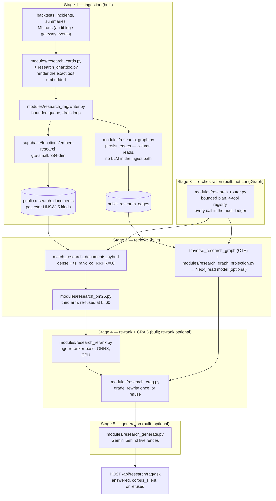

# PRD — enterprise RAG over the desk's own research

*As of 22 August 2026. Every claim about this repository was read from the tree
on that date, with the file named beside it. The requirement itself is restated
from the brief; the delivery record against it is checkable, and where a stage
is NOT BUILT this document says so plainly rather than rounding it up to
"planned". [`PLAN.md`](PLAN.md) carries the open items and the decision log;
[`Part2_Infrastructure/README.md` §Tech Stack "RAG & ML"](../../Part2_Infrastructure/README.md#tech-stack)
is the authoritative per-layer table and is not repeated here.*

## 1. The requirement

Build the retrieval-augmented research capability an enterprise trading desk
would specify: a five-stage pipeline in which documents are ingested and
parsed, retrieved through vector, sparse and graph arms, orchestrated by an
agent, re-ranked and graded before anything reads them, and answered by a
generator that is fenced rather than trusted. The brief names the pattern's
usual parts — a parsing service, a vector database, hybrid search, GraphRAG,
LangGraph-style orchestration, a cross-encoder re-ranker, CRAG-style
evaluation, and guardrailed generation — and asks for a working system, not a
diagram of one.

## 2. The problem it answers

The desk already records everything it does: completed backtests, execution
summaries, risk incidents, ML runs and the charts each run drew. What it could
not do was recall any of it at the moment it matters — an accepted fill whose
realised slippage exceeds the pre-trade ceiling should arrive with "the three
most similar things that happened before", and a question like "why did runs on
this data hash keep tripping the breaker" is a relations question no
similarity ranking can express. The failure mode to design against is not
missing recall; it is *fabricated* recall — a fluent, specific, invented
number wearing the same typography as a measured one. Every stage below is
therefore built to refuse rather than to guess, which is this codebase's
defining habit ([`CLAUDE.md`](../../CLAUDE.md): null is never coerced to zero;
empty results are reported, not hidden).

## 3. The five stages, as required and as built

The requirement's stages, with generation as stage 5 — the numbering the code
itself uses (`modules/research_generate.py` opens "Stage 5"):

1. **Ingestion and parsing** — get documents into a corpus with their meaning intact.
2. **Retrieval** — vector, sparse and graph arms over that corpus.
3. **Agent orchestration** — decide which retrieval tools a question needs.
4. **Re-ranking and CRAG evaluation** — reorder candidates, then grade the
   evidence before anyone reads it.
5. **Generation and guardrails** — write a grounded answer, or refuse with the reason.

What was actually built, with real module names — optional stages are marked,
and each reports its own absence rather than degrading silently:

## 4. The recommended enterprise stack, per stage

The stack the requirement points at, stage by stage. This table is the
*requirement's* content — none of these named products is asserted to be in
this tree; §5 records what is.

| Stage | Recommended enterprise choice | What it is for |
|---|---|---|
| 1. Ingestion / parsing | Unstructured.io, Docling or LlamaParse; a document pipeline with OCR and table extraction | Turning PDFs, filings and slide decks into chunks that survive embedding |
| 2. Retrieval | A managed vector DB (Pinecone, Weaviate, Milvus) or pgvector; BM25/SPLADE sparse search (Elasticsearch/OpenSearch); Neo4j for GraphRAG | Dense recall for paraphrase, lexical precision for exact terms, a graph for relations |
| 3. Orchestration | LangGraph (or LlamaIndex agents): a stateful graph of tools with routing, retries and memory | Deciding which retrieval arms a question needs, in what order |
| 4. Re-ranking + evaluation | Cohere Rerank or a BGE cross-encoder; CRAG-style corrective loops; RAGAS-style offline evaluation | Precision over the widened candidate set, and refusing weak evidence |
| 5. Generation + guardrails | A hosted LLM (GPT/Gemini/Claude) behind a guardrails framework with citation checking | The answer itself, constrained to the supplied context |

## 5. The delivery record

Three honest categories: **built** (in this tree, tested), **substituted**
(the requirement's job done by a deliberately different means, with the
argument written where the code is), and **NOT BUILT** (absent, with the reason
it waits — §6).

| Stage | Requirement | Status in this repo | Where |
|---|---|---|---|
| 1 | Document ingestion | **Built** — five document kinds, written through a bounded queue; `body` stores the exact embedded text | `modules/research_rag/writer.py`, `modules/research_cards.py`, migrations `20260808120400`, `20260820090600`, `20260820100700` |
| 1 | External-document parsing | **NOT BUILT** — no PDF/OCR/table parser exists anywhere in this tree | §6 |
| 1 | Multimodal (chart image) ingestion | **Substituted** — charts are indexed by computed descriptions, never by pixels | `modules/research_chartdoc.py` |
| 2 | Vector search | **Built** — pgvector HNSW over gte-small (384-dim, unit-normalised), embedded by a Supabase edge function; similarity floor 0.76, measured not chosen | `modules/research_rag/retrieval.py`, `supabase/functions/embed-research/` |
| 2 | Sparse search | **Built, twice** — `ts_rank_cd` over a generated tsvector (GIN-indexed, supplies recall) plus an in-process Okapi BM25 arm (k1=1.2, b=0.75) that re-scores candidates; all three arms fused by RRF at k=60 | `supabase/migrations/20260810090000_hybrid_research_search.sql`, `modules/research_bm25.py` |
| 2 | Graph retrieval | **Built** — derived edges in Postgres, a recursive-CTE traverse, and an optional Neo4j *projection* (read model, never a second write path); Louvain communities and PageRank run in-process (networkx, seeded) | `modules/research_graph.py`, `research_graph_projection.py`, `research_communities.py`, `research_graph_reads.py` |
| 3 | LangGraph orchestration | **Substituted** — a bounded, deterministic, audit-replayable router; LangGraph itself NOT BUILT | `modules/research_router.py`, §6 |
| 4 | Cross-encoder re-ranking | **Built, optional** — `BAAI/bge-reranker-base` via fastembed, ONNX on CPU, off the event loop behind a two-slot bulkhead; unconfigured, the RRF order passes through and `rerank_state` says why | `modules/research_rerank.py`, `modules/research_stages.py`, `requirements-rerank.txt` |
| 4 | CRAG evaluation | **Built** — a deterministic grader with named bands (`ANSWER_BAND` 0.8, `REFUSE_BAND` 0.4) and exactly one structural rewrite; the grader is arithmetic over fields the RPC already returns, deliberately not a model | `modules/research_crag.py` |
| 5 | Grounded generation | **Built, optional** — Gemini via `google-genai` behind five fences; verdicts `answered`, `corpus_silent` and `refused` never collapse into each other; every model call actually spent lands in the `research_generation` ledger | `modules/research_generate.py`, `requirements-genai.txt` |
| 5 | Multimodal generation | **NOT BUILT** | §6 |

Points the table cannot carry:

**Parsing is a read, not an inference.** Every document in this corpus is born
structured — symbol, interval, strategy, `data_hash`, kind are columns before
they are prose — so entity extraction reads columns rather than running a
model, and the ingest path is deterministic, free and replayable
(`modules/research_graph.py` argues this in full, including the real
limitation it accepts). That is why an enterprise parsing service has nothing
to parse here yet.

**The router fights the rest of the plane, and says so.** Its own docstring
opens with that admission. The four structural limits — a bounded plan over a
closed four-tool registry (`hybrid_search`, `graph_traverse`,
`structured_runs`, `lexical_exact`), every plan and call written to the audit
log, a deterministic fallback to plain hybrid search, and routing that never
invents an answer — are enforced by the router, not the planner, so
substituting a model-backed planner later cannot loosen them.

**Every optional stage reports absence in the same shape.** No Neo4j driver,
no `RERANK_MODEL_PATH`, no `GEMINI_API_KEY`, no Supabase at all: each is a
*named, typed state* — never an empty list, never an exception, never a zero
vector (which is equidistant from everything and would rank as similar to any
query). "Searched and found nothing" and "could not search" are different
facts and every surface keeps them apart. This is the most distinctive
property of the system and it is tested, not aspirational.

## 6. NOT BUILT, and why each waits

**Multimodal generation and vision embedding.** The plan allowed a second edge
function embedding chart images, gated on the Supabase Edge runtime offering a
vision model. It does not: `Supabase.ai.Session` exposes `gte-small` for text
and nothing in its inference API takes an image
(`modules/research_chartdoc.py` records this rather than shipping a stub). The
substitution that holds meanwhile is *exact where a vision model would be
approximate*: every figure a model would squint at off the pixels is a number
the desk computed in order to draw the chart, so the chart's meaning is
rendered as a sentence and the sentence is embedded. Image retrieval here is
retrieval over descriptions until the runtime changes.

**External-document parsing.** Unstructured/Docling-class parsing waits until
this desk ingests a document it did not write. Today there is none: the corpus
is the desk's own output, already structured at birth. Building a PDF pipeline
now would be capability without a corpus — untestable against real inputs and
unfalsifiable in review. The moment broker research or filings enter scope,
stage 1 grows a parser; the write path (bounded queue, `embedding_status`,
verbatim `body`) is already the seam it would feed.

**LangGraph orchestration.** Rejected for now rather than merely deferred,
and the reason is recorded where the substitute lives: this codebase's
defining claim is reproducibility, and a stateful agent graph is neither
deterministic nor replayable from a ledger. The router keeps the *decision*
("which tools, why") and writes it down; what it gives up is multi-step state,
branching and retries — none of which a corpus of this shape has yet needed.
When a plan genuinely needs branches, the `Planner` protocol is the
substitution point, and the router's four limits stay in force around whatever
is plugged in.

## 7. Acceptance properties

What "done" means for this feature, all of them checkable today:

- The whole suite passes with **none** of the optional stages installed —
  `requirements-graph.txt`, `-rerank.txt`, `-genai.txt`, `-communities.txt`
  are choices, not prerequisites, and each module reports the absence.
- No fabricated recall: below the refuse band the model is never called; a
  citation not in the supplied context refuses the whole answer; `corpus_silent`
  is a verdict, not an error (`modules/research_generate.py`).
- Wiring is proven against real modules, not mocks — the seam suites exist
  because modules once shipped fully tested with no caller
  ([`PLAN.md` §1](PLAN.md)).
- Surfaces: `POST /api/research/rag/search`, `/ask`, `/embed`;
  `GET /api/research/rag/status`; `GET /api/research/graph/communities`,
  `/centrality`, `/{document_id}` (`modules/api/research.py`).

## Where the depth lives

- [`Part2_Infrastructure/README.md` — "RAG & ML"](../../Part2_Infrastructure/README.md#tech-stack): the per-layer table, each row arguing what its choice refuses to do.
- [`Part2_Infrastructure/docs/GRAPH_RECALL.md`](../../Part2_Infrastructure/docs/GRAPH_RECALL.md): the graph-recall CLI walked end to end.
- [`PLAN.md`](PLAN.md): current state, the owed items, and the decision log.
- [`../architecture/DATA_PROCESSING_FLOW.md`](../architecture/DATA_PROCESSING_FLOW.md): where the research plane sits in the wider data flow.
