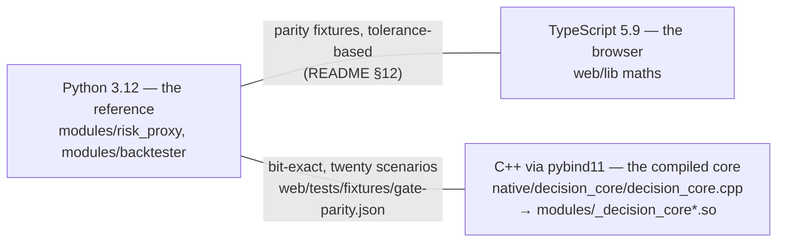
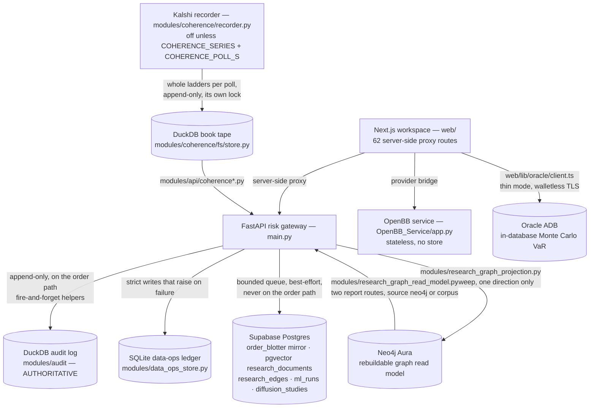
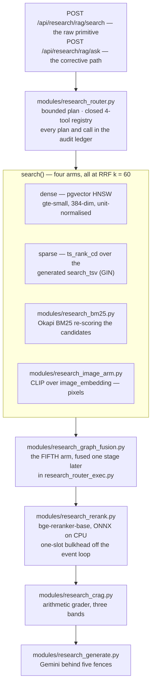

# The tech stack, layer by layer

What AlphaEngine is built from, and why each piece earned its place — the
languages, the backend, the frontend, every datastore actually in use, the
machine-learning surface, the retrieval stack, the optional-extras pattern, and
the CI/CD that gates all of it. Every version, path, count and constant below
was read off this tree or a command's output on **2026-08-24**: pins from
[`requirements*.txt`](../../Part2_Infrastructure/) and
[`OpenBB_Service/pyproject.toml`](../../Part2_Infrastructure/OpenBB_Service/pyproject.toml),
locked versions from `web/package-lock.json`, installed versions from the
Python 3.12 virtualenv CI mirrors. The deployed-versions tables in
[README §Tech Stack](../../Part2_Infrastructure/README.md#tech-stack) are the
authoritative long form; this document distils the argument and links to it
rather than restating two thousand lines.

The stack's one-sentence thesis: **one Postgres, and determinism everywhere a
number is produced** — every service that could put a vendor, a model version
or a network call on a measured path was either rejected by name or fenced off
as an optional extra whose absence is a reported state.

A word on the numbers in this file. CI enforces exactly three counts — the web
test total ([`scripts/check-test-counts.mjs`](../../Part2_Infrastructure/web/scripts/check-test-counts.mjs),
which accepts no suite but `web`), the OpenAPI canonical-JSON digest, and the
repository manifest's file list. Everything else a document pins goes stale, so
where a count is load-bearing this file describes the **gate** instead. The
suite figures live in `web/lib/test-counts.generated.ts` and are argued in
[`TESTING.md`](../testing/TESTING.md); they are not repeated here.

## Languages

### Python 3.12 — pinned, and the pin is load-bearing

The gateway runs on Python 3.12 (`3.12.14` in the CI-mirroring virtualenv). The
gateway itself accepts 3.11–3.14 (stated in
[`pyproject.toml`](../../Part2_Infrastructure/pyproject.toml)'s argument for
leaving pyupgrade out of ruff) and the OpenBB service declares
`>=3.12,<3.15`, so the pin is not about syntax — it is about a trap
[CLAUDE.md](../../CLAUDE.md) documents because it cost an hour: **numba
publishes no wheel for 3.14, so vectorbt silently does not install there, and
`tests/test_backtester.py` skips rather than fails.** A 3.14 venv looks fine
and reads green while the vectorbt engine goes entirely untested.

The tell is the skip **reasons**, not the pass count and not the skip count
either — the suite has two correct skip shapes, and both are right:

| Environment | Skips, and what each names |
|---|---|
| CI, and a plain laptop venv | `tests/test_data_ops_postgrest.py` (no Supabase credentials) and `tests/test_research_rerank_real.py` (no seeded cross-encoder weights) |
| Weights seeded via `tools/bench_rerank.py --seed` | the re-ranker suite runs for real, so only the Supabase skip remains |

Read them with `pytest -rs`. The interpreter is wrong when the vectorbt skip
from `tests/test_backtester.py` appears, whatever the total. Build the venv
with `python3.12 -m venv venv`, at `Part2_Infrastructure/venv` and no other
name — the dev scripts spawn `venv/bin/python` with no existence check.

### TypeScript — the browser's copy of the maths

TypeScript `5.9.3` (locked; the pin is `^5.6`), strict mode. It exists because
the gateway's maths must also run where Python cannot: the browser. Python is
the reference implementation; the TypeScript side reproduces it against
committed fixtures emitted by the Python engine, so changing a formula on one
side fails the other — see
[README §12](../../Part2_Infrastructure/README.md#12-one-engine-two-implementations-one-test-that-proves-it).

### C++ — the compiled decision core, held to bit-exactness

The pre-trade arithmetic exists a third time in C++
([`native/decision_core/decision_core.cpp`](../../Part2_Infrastructure/native/decision_core/decision_core.cpp)),
bound with pybind11 (`3.1.0` installed; build-time only, via
`requirements-native.txt`) into `modules/_decision_core*.so`.
`DECISION_CORE=auto|native|python` selects the engine and `/health` names which
one is live. Where Python↔TypeScript parity is tolerance-based, the C++
standard is **bit-exact**: `tests/test_decision_core_native.py` and
`tests/test_gate_parity.py` pin both engines to the same twenty-scenario
fixture, `web/tests/fixtures/gate-parity.json`. The core is the nanosecond
plane of the three-plane latency doctrine (decision in µs, core in ns, network
in ms — never blended); [LATENCY_BUDGET.md](../architecture/LATENCY_BUDGET.md) carries the
measurements.



## The backend — the FastAPI risk gateway

**FastAPI** (pin `>=0.110`; `0.141.1` in the venv) is the gateway, and it is
the one stateful, always-on unit.

**Routes, counted on a stated basis.** `modules/api/*.py` carries **77**
`@router.*` decorators across fifteen router modules — audit 4, coherence 5,
coherence_history 3, coherence_lab 7, data 11, diffusion 4, meta 5, ml 3,
research 15, risk 14, tca 3, telegram 3. One of the three in
[`modules/api/tca.py`](../../Part2_Infrastructure/modules/api/tca.py) is
`@router.websocket("/ws/book/{symbol}")`, which produces no OpenAPI operation.
So the committed contract
[`tools/openapi.json`](../../Part2_Infrastructure/tools/openapi.json) carries
**73 paths / 76 operations**, OpenAPI 3.1.0. `main.py` adds three more
decorators — `/`, `/app`, `/ui`, aliases for one console — and all three are
`include_in_schema=False`, which is why they are in neither figure. That schema
is a **contract**: its canonical-JSON SHA-256 is checked at the web build's
`prebuild` step, which refuses to build against a stale one (see
[DevOps](#devops-and-infrastructure) below).

**`main.py` holds only what one file can hold** — the lifespan that fixes
start-up and shutdown ordering, the application object, the middleware stack
(whose order is load-bearing), the console template, and the exception handler
that gives every error the same shape. Its own docstring records why it stays
at that path: `docker/gateway.Dockerfile` copies the root modules by name, so a
route that moved to a new root package would be missing from the image with
nothing to catch it before a request arrived.

**Uvicorn** (`0.52.3`) runs **one process, no workers, by design**: the gateway
holds a mutable in-memory book, a resting-order book, a token bucket and the
kill switch, and a second worker would fork the book and localise the halt.
[`tests/test_container_contract.py`](../../Part2_Infrastructure/tests/test_container_contract.py)
fails the build on `--workers` with that reason inline.

**Pydantic** (`2.13.4`) types every payload through one schema family
(`modules/schemas*.py`), shared by API, UI and the Telegram companion. Adding a
field to one of those models cascades to three committed generated artefacts —
that cascade is documented under [DevOps](#the-three-artefact-cascade).
**httpx** (`0.28.1`) carries all outbound HTTP including the Supabase mirror —
chosen over `supabase-py` to keep the import graph network-free for CI.

**Configuration is one dataclass.** [`config.py`](../../Part2_Infrastructure/config.py)
holds every setting the gateway reads, including all six store locations and
every optional-extra credential; `settings.ensure_dirs()` runs at import time,
which is why the container `chown`s before it drops to uid 10001.

**Celery + Redis** are optional: set `REDIS_URL` and the job queue switches
from the in-process pool automatically, same task callables either way. Only
`requirements.txt` carries them; the deployed image does not.

**The OpenBB service** is a separate, stateless unit and pins exactly, not with
ranges — `fastapi==0.136.3`, `uvicorn==0.40.0`, `openbb-core==1.6.13`,
`openbb-yfinance==1.6.3`, `yfinance==1.5.2` — because a serverless unit
redeploys constantly and a floating pin turns each deploy into a version
lottery. The gateway *also* has an in-process OpenBB bridge behind
`requirements-openbb.txt`, but the standalone service is the production path.

## The frontend — the Next.js desk workspace

**Next.js `16.3.0` / React `19.2.8`** (both locked) build the desk workspace on
Node 22 (`.nvmrc` at the **repository root**, which is the single place that
number is written; `engines` allows `>=20.9.0 <27`). Deployed on Vercel with
Root Directory `Part2_Infrastructure/web` and region `sin1`
([`web/vercel.json`](../../Part2_Infrastructure/web/vercel.json)).

**Server-side proxy routes are the only path to backend credentials.** There
are **62** `route.ts` handlers under `web/app/api/`, **38** of them under
`app/api/gateway/`, and the browser bundle ships zero secrets.
`next.config.mjs:194` declares `serverExternalPackages: ["oracledb"]` so the
thin-mode driver never enters a client bundle —
`tests/deployment-contract-config-surfaces.test.ts` asserts it.

**Ten tabs, fifty-eight rail sections, one source of truth.**
[`components/WorkspaceHeader.tsx`](../../Part2_Infrastructure/web/components/WorkspaceHeader.tsx)
declares `NAV_ITEMS` — Overview (All Roles), Research (Quant), Execution
(Trader), Portfolio (PM), Risk (Risk), Data (Data), Reliability (SRE),
Developer (Dev), Quotes (Quant), Proofs (Quant). The last two are the Kalshi
engine and their view **ids** are `markets` and `coherence`, older than the
labels and deliberately unchanged.
[`lib/sections.ts`](../../Part2_Infrastructure/web/lib/sections.ts) is where the
rails, the command palette, the hash whitelist and "Copy link to this view" all
read from: 3 + 9 + 5 + 5 + 8 + 7 + 5 + 6 + 5 + 4 = **57**. Section ids never
change, because they are public deep links — which is why the 2026-08-24
restructure moved five ids between tabs and demoted eight to in-pane views
without renaming one of them, and `RELOCATED_SECTIONS` in
`lib/workspace-hash.ts` is what keeps every old hash resolving.
[`scripts/desk-sweep-plan.mjs`](../../Part2_Infrastructure/web/scripts/desk-sweep-plan.mjs)
mirrors the ten tabs by hand and asserts `EXPECTED_SECTIONS = 58`, so a rail
edited without the sweep being updated fails rather than drifting.

**The Kalshi engine uses in-pane `.seg` switchers, and that is a hard rule.** All
nine Quotes and Proofs sections split their content into segmented views inside
the section — Universe (Baskets · Families · Settlement · Formation · Pending),
Books (Ladder · Identity · Dispersion · Channel), Lattice (Survival · Mass ·
Moments · Whole family · Stake, whose Stake view opens a second seg of Plan ·
Capital · Method), Fees (Worked example · Cost shape · Ablation · Replay table),
Shell (Tree · Reading · Commands · Layout), Dutch book (Verdict · Proof ·
Certificate · Bands · Parlays · Bounds), Scorecard (Score · Bands · Corpus ·
Index series · Index families), Diffusion (Absorption · Noise floor · Meetings ·
Mechanism · Kalshi survival · Kalshi episodes · Findings), Lessons (Coverage ·
Prices · Structure · Bounds · Record). A six-view seg is still one seg: Dutch
book's wraps rather than shrinking its type. A nested `<WorkspaceSubtabs>` inside a section is
**forbidden**, and the reason is mechanical rather than aesthetic:
`WorkspaceSubtabs.tsx` sets `--rail-h` on `document.documentElement`, so a
second rail instance fights the first over the same publisher — as
`ReliabilityConsole` records and
[`components/CoherenceConsole.tsx`](../../Part2_Infrastructure/web/components/CoherenceConsole.tsx)'s
header restates. `.seg` is plain CSS styled off `aria-pressed`
(`app/globals/00-tokens-and-base.css:1560`), so it publishes nothing.

That structure is also what makes the read budget affordable: polls are gated on
`active`, on the open section, and — where a view alone is expensive — on the
open view. The public book read stops entirely while Books shows Dispersion or
Channel, because the RFQ route behind them is a signed private-channel call on a
25 s budget and the two must never be in flight together; `/replay?limit=20000`,
the largest read on either tab, runs only on Fees → Ablation or Replay table and
is warmed by nothing.

**Styling.** Tailwind CSS `4.3.3` runs **without preflight**, bridged onto the
hand-written token system. `app/globals.css` is a manifest and nothing else —
sixteen partials in declared order, with `tests/globals-manifest.test.ts`
failing the suite if a declaration block is written into the manifest itself,
because at least eleven documented cascade ties resolve on source order.

**No chart library.** All 239 components under `web/components/` draw on one
hand-rolled scale kit,
[`components/chart-kit.tsx`](../../Part2_Infrastructure/web/components/chart-kit.tsx).
There is no Jest and no Vitest: `npm test` is Node's built-in runner via `tsx`.
There is also no `lint` script — linting is Python-side (`ruff check .`), a
fact CLAUDE.md lists among the four that cost an hour each.

## The data layer

**Six stores, one authority.** The DuckDB audit log decides what happened;
everything else is a mirror, a ledger, a tape or a read model — and each one's
absence is a designed state rather than an exception.



### 1. DuckDB — the audit ledger (authoritative)

*What it holds.* Every paper order and risk decision, TCA snapshots, the OHLCV
cache, `backtest_runs`, and the `research_plan` / `research_tool_call` /
`research_generation` router ledger.

*Who writes it.* [`modules/audit/store.py`](../../Part2_Infrastructure/modules/audit/store.py)
(`AuditStore`), with `AuditLog` assembled in `modules/audit/__init__.py` from
`boundaries.py`, `clock.py`, `ohlcv.py`, `read_models.py`, `schema.py`,
`subscribers.py` and `writers.py`. Path: `settings.db_path` = `DB_PATH` or
`${DATA_DIR}/alphaengine.duckdb` (`config.py:50`). In the container that is
`/app/data/alphaengine.duckdb` on the **named volume**
`alphaengine_alphaengine_audit`.

*Who reads it.* The gateway's own read models, the Portfolio/Risk/Execution
surfaces through the proxy, and the structured (non-similarity) research arm.

*Write helpers are fire-and-forget on purpose* — `_exec` swallows a failed
write and `query` returns `[]`, because a lost TCA snapshot must never take the
order path down.

*When it is absent, two different failures kept deliberately apart:*

- **DuckDB not importable** → SQLite fallback at `alphaengine.sqlite`, and
  `backend` reports `"sqlite"`. Nothing is lost but analytical SQL.
- **Another live process holds the file** → `AuditLedgerConflict` is **raised
  and never fallen back from**, matched on `_LOCK_CONFLICT_MARKERS`
  (`"conflicting lock is held"`, `"could not set lock on file"`). The module's
  header records why: a silent private ledger at `<db>.sqlite` once began
  writing a divergent history while `/health` reported `backend: sqlite` as
  though nothing were wrong. Defence in depth sits behind
  [`modules/single_writer.py`](../../Part2_Infrastructure/modules/single_writer.py),
  which takes a `flock(2)` claim on `data/gateway.writer.lock` in
  `RiskGateway.start()` — chosen because the kernel releases it when the
  holding process dies, which no lock row in Postgres does.

### 2. SQLite — the data-operations ledger (strict semantics, on purpose)

*What it holds.* Quality findings, escalations, work items, schedule runs —
"state a person just edited or another instance is about to read".

*Who writes and reads it.*
[`modules/data_ops_store.py`](../../Part2_Infrastructure/modules/data_ops_store.py)
(`SqliteStore`), reached **only** through
[`modules/data_ops_backend.py`](../../Part2_Infrastructure/modules/data_ops_backend.py) —
which is the seam, and exists because the previous factory had no callers at
all while `DATA_OPS_BACKEND=postgres` selected a backend nothing ever asked
for. `tests/test_data_ops_backend.py` now asserts that no module constructs
`SqliteStore` directly outside that file. Path: `settings.data_ops_db_path` =
`DATA_OPS_DB_PATH` or `${DATA_DIR}/data_ops.sqlite` (`config.py:59`).

*Why it is not in the audit log.* The opposite contract. These rows need a
write that **raises** when it fails and an UPDATE that reports whether it hit a
row; the ledger's fire-and-forget helpers are right for evidence and wrong for
a work item.

*Two constants, both argued against a measurement.* `BUSY_TIMEOUT_S = 30.0`
(`PRAGMA busy_timeout=30000`) replaced Python's default five, because a WAL
checkpoint under an exclusive close-lock outlasted five seconds on a loaded
runner. `_OPEN_LOCK` serialises opens process-wide, because two connections in
one process both running `PRAGMA journal_mode=WAL` at the same instant is a
race SQLite refuses to wait out — 2 of 240 concurrent opens failed at once, in
0.00s, with the busy handler never consulted.

*When Postgres is selected instead.* `DATA_OPS_BACKEND=postgres` swaps in
`PostgrestStore`; with `SUPABASE_URL` or `SUPABASE_SERVICE_ROLE_KEY` missing it
**raises at startup and refuses to fall back**, because a deployment that
believes its durable state is in Postgres while it sits on a container
filesystem is worse than one that will not start. See
[DATA_OPS_BACKEND.md](../architecture/DATA_OPS_BACKEND.md).

### 3. DuckDB — the Kalshi book tape (a second, separate file)

*What it holds.* Whole bid ladders per poll, append-only, as JSON text rather
than a row per level — "the unit of truth is the book at an instant, and a
partially-written book is not a smaller book but a false one".

*Who writes it.* [`modules/coherence/fs/store.py`](../../Part2_Infrastructure/modules/coherence/fs/store.py),
driven by `modules/coherence/recorder.py`. Path: `COHERENCE_DB_PATH` or
`${DATA_DIR}/coherence.duckdb`
([`modules/coherence/tunables.py`](../../Part2_Infrastructure/modules/coherence/tunables.py):
`DB_PATH`). *Who reads it:* `modules/api/coherence.py`,
`coherence_history.py`, `coherence_lab.py`, `modules/coherence/fs/corpus.py`,
`modules/coherence/syscalls/calibrate.py` and the Telegram coherence tab.

*Why its own file.* "Store books, not prices" — depth is forward-only and
missed depth is gone for good, so this is high-volume input to later analysis
rather than a record of an action. Sharing the ledger's single-writer lock
would make a recorder stall look like an audit failure and vice versa.

*When it is absent or locked.* A **reported state, never a fallback** — the
opposite of `AuditStore`'s choice, and argued: "a second store quietly
recording to a different file would split the tape in two and neither half
would be complete." The recorder is also **off by default**: it needs both
`COHERENCE_SERIES` and `COHERENCE_POLL_S` set, and `POLL_SECONDS = 0` keeps it
off. `MAX_EVENTS_PER_SERIES = 2` bounds the tape, because KXBTCD alone carries
three open events totalling 318 markets and recording all of them every
twenty-six seconds writes about 1.2 GB a day.

### 4. Supabase Postgres + pgvector — authoritative for the research corpus

*What it holds.* `public.order_blotter` (the decision mirror), the pgvector
research index (`public.research_documents`, HNSW over
`extensions.vector_cosine_ops`), `public.research_edges`, the ML run tables,
and the diffusion event/study tables. **37 migrations** in
`supabase/migrations/`, newest `20260823120000_diffusion_events.sql` and
`20260823130000_diffusion_studies.sql`. Two edge functions:
[`embed-research`](../../supabase/functions/embed-research/index.ts) (gte-small)
and `evaluate-order`.

*Who writes it.* `modules/research_rag/writer.py` (corpus, through a bounded
queue with a supervised drain), `modules/supabase_mirror.py` (blotter),
`modules/research_graph.py` (`persist_edges`), `modules/ml/store.py` (runs),
and `modules/data_ops_postgrest.py` when the data-ops backend is Postgres.
*Who reads it.* `modules/research_rag/retrieval.py`,
`modules/research_corpus_reads.py`, `modules/research_graph.py`'s traversal,
and the workspace's Realtime client via `@supabase/supabase-js`.

*Migrations worth naming.* `20260808120400_pgvector_research_documents.sql`,
[`20260810090000_hybrid_research_search.sql`](../../supabase/migrations/20260810090000_hybrid_research_search.sql)
(the generated `search_tsv`, its GIN index and the hybrid RPC),
`20260820090400_research_edges.sql`,
[`20260820090500_research_graph_traverse.sql`](../../supabase/migrations/20260820090500_research_graph_traverse.sql)
(a recursive CTE whose depth is **capped at 4 in the body regardless of what
the caller asks**, returning one row per document at the shortest depth it was
reached),
[`20260822090000_research_tenant_scope.sql`](../../supabase/migrations/20260822090000_research_tenant_scope.sql)
(the `filter_desk_id` argument), `20260822100000_research_image_embedding.sql`
and `20260822110000_research_chart_images.sql`.

*Config.* `SUPABASE_URL`, `SUPABASE_SERVICE_ROLE_KEY`,
`SUPABASE_MIRROR_ENABLED` (default **False**), `SUPABASE_DESK_ID`,
`SUPABASE_TIMEOUT_S` 5.0, `SUPABASE_MIRROR_QUEUE_MAX` 1000, and
`RESEARCH_RAG_ENABLED` (default **False**) — `config.py:126-142`.

*When it is absent.* With no `SUPABASE_URL`/`SUPABASE_SERVICE_ROLE_KEY` the
mirror and the RAG plane are no-ops and every test passes offline. `search` and
`connected` return a typed `unavailable` **state**, never `[]` — "searched and
found nothing" and "could not search" are different facts and the workspace
renders them differently. An embed that fails stores
`embedding_status='pending'`, never a zero vector, which would be equidistant
from everything and rank as "similar" to any query.

### 5. Neo4j Aura — a one-way, rebuildable projection

This is **already built and already in use**; what follows is the shape of it,
not an announcement.

*What it holds.* A copy of `research_edges` and the sweep's computed community
labels and centrality scores. Nothing else.

*Who writes it.*
[`modules/research_graph_projection.py`](../../Part2_Infrastructure/modules/research_graph_projection.py),
and nothing else — asserted in
[`tests/test_research_graph_projection.py`](../../Part2_Infrastructure/tests/test_research_graph_projection.py).
`RELATION_TYPES` maps the six Postgres `research_relation` values (`same_data`,
`same_symbol`, `same_strategy`, `same_regime`, `followed_by`, `promoted_to`)
onto uppercase relationship types, spelled out so a new enum value **refuses
the projection with a named reason** rather than inventing an undeclared edge
type. `BATCH = 500` edges per transaction.

*Who reads it.*
[`modules/research_graph_read_model.py`](../../Part2_Infrastructure/modules/research_graph_read_model.py),
dispatched by
[`modules/research_graph_reads.py`](../../Part2_Infrastructure/modules/research_graph_reads.py).
Exactly **two** routes: `GET /api/research/graph/communities`
(`modules/api/research.py:215`) and `GET /api/research/graph/centrality`
(`:252`). Both stamp `"source": "neo4j"` or `"source": "corpus"` on the
answer, so a reader can tell which computation replied.

*The frontend does not read Neo4j, and the honest answer is stronger than
that: no frontend surface reads the two graph reports at all.* `grep -rn neo4j`
over `web/**/*.ts{,x}` returns nothing — no component opens a driver — and the
workspace's only graph consumer is the proxy
`web/app/api/gateway/research/graph/[id]/route.ts`, which serves the
**per-document traversal**, i.e. the Postgres recursive CTE rather than the
graph. `/api/research/graph/communities` and `/centrality` are reachable over
HTTP and pinned by `lib/gateway-contract.generated.ts`, but nothing in `web/`
calls them. Recorded here rather than rounded up, because a route with no
consumer is exactly the defect [`PLAN.md` §1](PLAN.md) exists to catch.

*Why a projection and not a second write path.* A dual write is two systems
that must agree, and `persist_edges` already has a latent way to disagree — it
posts with `Prefer: resolution=ignore-duplicates` and no `on_conflict`, so a
batch containing one already-present edge can 409 whole. Projecting makes
divergence a non-event: if the graph is wrong, drop it and re-project. That is
safe only because MERGE is idempotent and because nothing else writes there.

*Why Neo4j at all, when a recursive CTE already traverses this.* It does, and
for depth-bounded reachability the CTE is the better tool. What it cannot do is
whole-corpus community detection and ranking, which is a graph-algorithm
workload rather than a traversal one. Per-document traversal stays on the CTE;
the partition and the ranking moved to the sweep.

*Three refusals that must stay distinguishable* (the module's own list):
"Neo4j is not configured", "the sweep has not run yet", "the projection is
mid-rebuild". The last exists because community ids are stable only for a fixed
edge set — two sweeps' labels co-resident do not describe one partition, and
`_one_sweep` refuses when more than one stamp is present. A related rule: a
**writer may not read its own output**, so `community_labels` refuses when the
caller is the sweep that writes labels, or the corpus could change daily while
the labels never did.

*What is deliberately absent from these reports:* `seed`, `resolution`,
`damping`, `modularity`. None was written to the graph, and a plausible default
is the lie.

*GDS is not on Aura Free.* `CALL gds.louvain.stream(...)` there is
procedure-not-found, so Louvain and PageRank run **in process** via networkx
([`modules/research_communities.py`](../../Part2_Infrastructure/modules/research_communities.py)) —
which is also why that module takes `edges` as an argument rather than a
driver, and why the algorithms run in CI and on a laptop with no Neo4j at all.

*When it is absent.* An unset `NEO4J_URI` is the **normal deployment**
(`config.py:129-132`; the driver itself is optional, `requirements-graph.txt`).
The sweep and the read model each report a named reason —
`detected: False` / `ranked: False` with the reason string — and the two report
routes fall back to the in-process computation saying `source: "corpus"`.
**No request path depends on the graph being up.**

### 6. Oracle Autonomous Database — the in-database VaR second opinion

*What it holds.* The Monte Carlo VaR schema applied from `oracle/01_schema.sql`,
[`02_monte_carlo.sql`](../../oracle/02_monte_carlo.sql) and `03_app_user.sql`.

*Who writes and reads it.* The **web** side, not the gateway:
[`web/lib/oracle/client.ts`](../../Part2_Infrastructure/web/lib/oracle/client.ts)
and [`web/app/api/oracle/var/route.ts`](../../Part2_Infrastructure/web/app/api/oracle/var/route.ts),
surfacing on `#risk/oraclevar`. The gateway is Python and carries no Oracle
client at all, which is why `deploy.yml` never touches this database.

*Mode.* node-oracledb **thin** (a pure-JS wire protocol, the default in 6+), so
there is no Instant Client to install and no `cwallet.sso` to ship — walletless
TLS `tcps://` on 1521. `poolMin: 0` so a scaled-down lambda holds no ADB
sessions; `poolMax: 2` because Vercel scales lambdas independently and a
per-instance max of 2 against a low ADB session limit is the difference between
graceful queueing and `ORA-12516`. Env: `ORACLE_CONN_STRING`, `ORACLE_USER`,
`ORACLE_PASSWORD`, `ORACLE_WALLET_PEM_B64`, `ORACLE_WALLET_PASSWORD`.

*When it is absent.* A typed result, never a throw. `oracle_not_configured`,
unreachable and found-nothing are three distinct codes, and a classified
failure carries no credential, hostname or raw ORA text. The client refuses to
flatten them into one empty array. A free-tier ADB also stops itself after
**seven consecutive idle days**, which is what `oracle-keepalive.yml` exists to
prevent.

## Machine learning

Everything here is **built and tested**; what is optional is marked, and every
optional arm reports its absence in the house shape rather than raising. Two
disciplines run through all of it: *nothing in-sample reaches a result object*,
and *a null is reported beside a positive control* so that "the text does not
predict this" and "nothing predicts this" stay different findings.

### Backtesting and the strategy engine

[`modules/backtester/`](../../Part2_Infrastructure/modules/backtester/) —
[`engines.py`](../../Part2_Infrastructure/modules/backtester/engines.py) ("The
NumPy engine, the optional vectorbt one, and the walk-forward over both"),
`signals.py`, `indicators.py`, `moving_averages.py`, `grid.py`,
`statistics.py`, `run.py`, `state.py`, `data.py`, `plots.py`, and `_common.py`
which exports `VECTORBT_AVAILABLE` and `vbt`.

**46 strategies** in the `strategy` enum, counted off the generated contract
`web/lib/gateway-contract.generated.ts` (`ma_cross` … `linreg_forecast`).

**vectorbt is optional and the container does not have it.** The image builds
from `requirements-core.txt`, which omits it; `modules/api/meta.py` reports
`"engine": "vectorbt" if VECTORBT_AVAILABLE else "numpy"` on `/health`, so a
fallback announces itself. Opt back in with
`--build-arg REQUIREMENTS=requirements.txt`.

**DSR and PBO have exactly one implementation.**
`modules.backtester.overfitting_probability` is it;
[`modules/ml/selection.py`](../../Part2_Infrastructure/modules/ml/selection.py)
imports and delegates rather than defining a second, on the stated ground that
a research plane with two definitions of "deflated Sharpe" has none.

### Supervised ML runs

[`modules/ml/`](../../Part2_Infrastructure/modules/ml/) — `engine.py`,
`features.py`, `fit.py`, `models.py`, `runner.py`, `selection.py`,
`sklearn_adapter.py`, `splits.py`, `store.py`. Schema `modules/schemas_ml.py`;
three routes in `modules/api/ml.py` (`POST /api/research/ml/fit`,
`GET /api/research/ml/runs`, `GET /api/research/ml/runs/{run_id}`); tables from
migrations `20260820090000_ml_runs.sql`, `_folds`, `_features`, `_artefacts`.

**Two engines, one contract.** `ML_ENGINE` is `auto` (sklearn if importable,
else numpy), `sklearn` (refuse to start without it) or `numpy`; anything else
raises at import (`engine.py:48-49`).

**Nothing in `engine.py` imports scikit-learn.** `main.py` imports
`modules.ml.fit` at boot, so a module-scope import would put scipy on the
start-up path; `sklearn_installed()` uses `find_spec`, and
`sklearn_adapter.import_sklearn` is the authority because it is the code that
actually imports.

**A run that fell back is a different run** — recorded on `ml_runs.engine`,
reported on `/health`, and named in the strategy's unavailability message.

**Ridge and logistic are hand-rolled in NumPy**
([`models.py`](../../Part2_Infrastructure/modules/ml/models.py)), closed-form,
one deterministic sequence, because *the coefficients are the research result*
and a solver that changes between minor versions changes yesterday's
conclusions. No early stopping, no adaptive rates, no feature selection —
each would be a hyperparameter that would need to live in the fold, be purged
alongside the data, and be reported.

**Every headline figure is out of sample.**
[`runner.py`](../../Part2_Infrastructure/modules/ml/runner.py) computes every
metric on the **concatenated out-of-sample predictions**, test windows only, in
time order. There is **no in-sample number in the result object**; an in-sample
Sharpe exists inside a fold, can decide the pick there, and then goes away
rather than travelling to a reader beside the out-of-sample one.

### Walk-forward, purge and embargo

[`modules/ml/splits.py`](../../Part2_Infrastructure/modules/ml/splits.py) —
purged, embargoed, expanding-window walk-forward, after De Prado's *Advances in
Financial Machine Learning*, with no tuning knobs beyond the two gaps and the
fold count. It refuses to shuffle anything: a shuffled split of a time series is
a leak with extra steps, and offering the option would be offering the defect.

- **Purge** drops the last `label_horizon` training bars whose label window
  reaches into the test window. Without it, the model has been fitted on the
  answer it is about to be scored against.
- **Embargo** drops training bars immediately *after* a test window, because
  serial correlation runs both ways.
- **The embargo is vacuous in this splitter, and that is a property of the
  scheme rather than an omission.** Fold *i* trains on `[0, test_start_i)` with
  `test_start_i == test_end_{i-1}`, so no training row ever follows a test
  window. Every fold reports `embargoed_bars == 0` — **a measured zero, not a
  missing value** — and `embargoed_range` returns an empty slice. The parameter
  and its plumbing are kept for combinatorial purged CV, where a test window is
  cut from the middle and training data exists on both sides of it.

### Calibration — were the prices right, once settled

[`modules/coherence/kernel/calibration.py`](../../Part2_Infrastructure/modules/coherence/kernel/calibration.py)
scores a corpus of settled markets under **Murphy's decomposition**:

    Brier = Reliability − Resolution + Uncertainty + Binning

*Reliability* is the only term a recalibration repairs (`isotonic_map`).
*Resolution* enters with a minus sign, so it is the term you want large — a
forecaster quoting the base rate everywhere is perfectly reliable and useless,
and only resolution notices. *Uncertainty* `o(1−o)` is a property of the
question, which is why raw Brier scores are not comparable across corpora and
are never reported here without their decomposition. *Binning* is the term
textbooks leave out: Murphy's three-way split is exact only for a forecaster
quoting a small fixed set of probabilities, and a market quotes a continuum, so
the residual is computed and shown rather than a decomposition being published
that does not reconstruct its own total. Favourite–longshot bias is reported
with its bin counts because on a thin corpus it is mostly noise, and the module
is explicit that **selection is the hard part it can only report, not solve**.
Surfaces on `#coherence/calibration` (`CalibrationPane.tsx`,
`ReliabilityDiagram.tsx`, `MurphyBars.tsx`).

### The information-diffusion estimator — and its headline is a null

Package
[`modules/coherence/diffusion/`](../../Part2_Infrastructure/modules/coherence/diffusion/):
`absorption.py`, `spectrum.py`, `gaussian.py`, `latent.py`, `embed.py`,
`estimator.py`, `experiment.py`, `gate.py`, `policy.py`, `findings.py`,
`studies.py`, `runs.py`, `segments.py`, `fomc.py`, `calendar.py` and
**`skill.py`**. Tools: `tools/diffusion_spectrum.py`, `diffusion_phase0.py`,
`diffusion_text.py`. Routes: `GET /api/research/diffusion/events`,
`/findings`, `/absorption` and `POST /api/research/diffusion/events/{source_ref}/stage`
(`modules/api/diffusion.py`).

[`modules/coherence/diffusion/skill.py`](../../Part2_Infrastructure/modules/coherence/diffusion/skill.py)
**replaced the study's old criterion**, and is tested by
[`tests/test_diffusion_skill.py`](../../Part2_Infrastructure/tests/test_diffusion_skill.py)
(21 test functions). The old criterion was the largest of eight **in-sample**
univariate |t| values against `half_life_s` — a target fitted only where the
move cleared two sigma, i.e. 26 of 62 release meetings and 29 of 62 call
meetings. Four changes, each argued in the module's header as *not a choice of
answer*:

1. **The target no longer needs a signal gate.** `residence_time` is
   `∫₀³⁰ (1 − absorbed(t)) dt` — the area above the absorption curve, anchored
   at `absorbed(0) = 0` and joined piecewise-linearly. For an exponential
   approach that **is** the time constant, so it estimates the same quantity as
   the half-life; but it is a path integral rather than a fit, so it is defined
   for every measured path. **62 of 62 per stage.**
2. **A hard gate became a weight.** The terminal move's signal-to-noise is
   known per row, so a barely-measurable event counts in proportion to how well
   it is measured instead of being deleted. Weights are clipped at their own
   0.95 quantile so one enormous move cannot become the whole regression.
3. **The stages are pooled with a call indicator, and the policy move is a
   CONTROL, not a rival.** It is the one quantity already known to move the
   price at four standard errors; the question is what the text *adds* to it.
4. **Scoring is leave-one-MEETING-out.** Folding by row leaks, because both
   stages share a statement — so both stages of a meeting leave together. The
   null is a re-pairing of statements to meetings (400 draws, `seed=7`), not a
   row reshuffle, so it breaks the link between a text and its own absorption
   while leaving both stages attached to one statement.

Constants: `HORIZON_MINUTES` (1s, 30s, 1m, 2m, 5m, 10m, 15m, 30m),
`TERMINAL_MINUTES = 30.0`, `MIN_MEETINGS = 20`, and **`SKILL_FLOOR = 0.0`** —
"zero is the honest threshold and the only one that is not a choice: below it
the text makes predictions WORSE than not having read the text."

**The result, and it must not be softened.** The recorded study reports that
the absorption clock **is** predictable — out-of-sample **R² +0.144** from the
stage and the rate move alone, with the press conference about **7.0 minutes
slower** than the statement — but adding the text changes that by **−0.343**
(shuffled **p 0.875**). Over a declared **3 × 3 grid** of specifications, the
gain was **negative in all nine cells**, including the one with the largest
in-sample |t| of **2.85**. So the headline is a **null, and a stronger one than
before**: the clock has real structure, and the statement's information
spectrum is not part of it.

`verdict()` reports **four** outcomes rather than two, precisely so that this
stays legible: `not_assessable`, `target_unpredictable`, and the two verdicts
about the text. Five fields carry it — `skill_meetings`, `skill_baseline_r2`,
`skill_gain`, `skill_shuffled_p`, `skill_stage_minutes` — added to
`DiffusionStudy` (`modules/schemas_diffusion.py:197-204`), mirrored on the
storage dataclass and DDL in
[`studies.py`](../../Part2_Infrastructure/modules/coherence/diffusion/studies.py),
populated in
[`findings.py`](../../Part2_Infrastructure/modules/coherence/diffusion/findings.py),
and consumed by `tools/diffusion_spectrum.py`.

They surface as **two rows** in
[`InstrumentTable.tsx`](../../Part2_Infrastructure/web/components/coherence/diffusion/InstrumentTable.tsx),
and the order is deliberate — the target's own row sits **above** the
predictor's, because a reader who takes the last row as a result about the
market has to pass this one first, and if it fails the last row means nothing:

| Row | Value | Target |
|---|---|---|
| *The clock is predictable at all* | `R² ±x.xxx` | `> 0, out of sample` |
| *The text predicts it* | `±x.xxx R², p x.xx` | `> 0, p < 0.05` |

Two diffusion charts, `AbsorptionCurve.tsx` and `StageTimeline.tsx`,
deliberately skip the `<Plot>` wrapper — it emits `role="presentation"` and
would leave them unnamed.

### Which library each arm needs, and what happens without it

| Library | Optional? | Where it is used | Absence |
|---|---|---|---|
| **numpy / pandas** | no (`requirements-core.txt`) | everywhere | not applicable — the floor |
| **scikit-learn** | yes (`requirements-ml.txt`, `>=1.5,!=1.8.0,<2.0`) | `modules/ml/fit.py`, `sklearn_adapter.py`, `engine.py` (via `find_spec` only), `modules/schemas_ml.py`, `modules/telegram/_mixins/research_detail.py` | strategies report UNAVAILABLE with the import error; the hand-rolled NumPy models run and `ml_runs.engine` records `numpy` |
| **vectorbt** | yes (`requirements.txt`, `requirements-dev.txt`) | `modules/backtester/engines.py`, `_common.py`, `__init__.py`, `modules/api/meta.py` | the built-in NumPy engine runs; `/health` says `engine: numpy` |
| **networkx** | yes (`requirements-communities.txt`, with `scipy`) | `modules/research_communities.py` (Louvain seeded; PageRank unseeded **by construction** with pinned `MAX_ITER`/`TOLERANCE`), `modules/research_graph_read_model.py` as the fallback it names | the two graph report routes return `unavailable` with the reason and the install command |
| **scipy** | yes (named in *both* `requirements-communities.txt` and `requirements-coherence.txt`, on purpose) | the coherence LP through HiGHS; communities | the closed-form family checks still find Dutch books and every certificate says `engine: closed_form`, so a weaker answer announces itself |
| **fastembed / onnxruntime** | yes (`requirements-rerank.txt`) | `modules/research_rerank.py` and — reusing the same package, which is why there is deliberately no `requirements-image.txt` — `modules/research_image.py` | the fused order passes through untouched with `reranked: False` and a named reason |
| **torch** | **optional and in no requirements file at all** | `modules/coherence/diffusion/gaussian.py`, and named in `modules/coherence/diffusion/__init__.py` | the package's own header states that everything in it is importable without a network, without Supabase and without torch. **PLANNED, not built: there is no `requirements-torch.txt` on this tree** — verified by its absence — so the torch extra remains unwritten and an operator installs it by hand |

## Retrieval-augmented generation

The desk's RAG plane retrieves over the desk's **own** records — completed
backtests, execution summaries, risk incidents, ML runs and the charts each run
drew. Every document is born structured, so parsing is a column read rather
than an inference; [`PRD.md`](PRD.md) carries the full delivery record against
the enterprise requirement and is not restated here. What follows is the
pipeline as the code implements it.



### Five arms, one fusion constant

[`modules/research_rag/retrieval.py`](../../Part2_Infrastructure/modules/research_rag/retrieval.py)'s
header states it plainly: *"Retrieval fuses FOUR arms, all at RRF k = 60 — an
arm on another constant would be a second fusion wearing the first one's name."*
A fifth is fused **one stage later**, in the router's execution rather than
inside `search`:

| Arm | Where | What it ranks on |
|---|---|---|
| **Dense** | inside the RPC `match_research_documents_hybrid` | pgvector over gte-small, 384-dim, unit-normalised |
| **Sparse** | inside the same RPC | `ts_rank_cd` over the generated `search_tsv` — GIN-indexed, and the arm that supplies *recall* |
| **BM25** | [`modules/research_bm25.py`](../../Part2_Infrastructure/modules/research_bm25.py), wired by `modules/research_rag/arms.py::apply_bm25` | Okapi BM25 re-scoring the candidate rows the RPC returned; it can reorder but never add or drop |
| **Image (CLIP)** | [`modules/research_image_arm.py`](../../Part2_Infrastructure/modules/research_image_arm.py) + `research_image.py`, RPC `match_research_document_images` | the `image_embedding` column — a chart's **pixels**. Alone among the four it can **add** a document |
| **Graph** | [`modules/research_graph_fusion.py`](../../Part2_Infrastructure/modules/research_graph_fusion.py)`::fuse_graph_matches`, called from [`research_router_exec.py`](../../Part2_Infrastructure/modules/research_router_exec.py) | `traverse_research_graph` rows, one per document at the shortest depth |

**`RRF_K = 60`** is defined once, at `modules/research_bm25.py:120` — Cormack et
al.'s original constant — and is **imported, never restated**, by
`research_graph_fusion.py`, `research_image_arm.py` and
`tools/bench_image_retrieval_metrics.py`. It is the same 60 the Postgres RPC
and `web/lib/retrieval-eval.ts` use. A neighbour ranked first by the traversal
therefore contributes exactly `1/(60 + 1)`.

Other constants, each argued where it lives:

| Constant | Value | Where | Why that value |
|---|---|---|---|
| `BM25_K1` / `BM25_B` | 1.2 / 0.75 | `research_bm25.py:83, 90` | the canonical Okapi TREC defaults, kept rather than tuned: on a corpus this small, tuning fits the constant to a handful of documents and calls the fit a finding |
| `IDF_FLOOR` | 0.0 | `research_bm25.py:103` | floored at exactly zero, not at a small epsilon: a term most of the candidate set contains cannot tell those documents apart, and a small positive weight would hand the ordering to document length while still looking like a lexical match |
| `MIN_TOKEN_LENGTH` | 1 | `research_bm25.py:114` | the usual `len > 2` rule deletes `FX`, `MA`, `PE`, the `20`/`100` of a parameter pair and the `s`/`p` of `S&P` — the very tokens the dense arm blurs and this arm exists to catch |
| `TEXT_FIELDS` (BM25) | `title, body, symbol, strategy` | `research_bm25.py:127` | weighting deliberately **not** reproduced: Postgres `setweight` gives titles the A slot, so the two lexical arms disagree about titles on purpose and RRF gets two genuinely different opinions rather than one opinion twice |
| `RAG_MIN_SIMILARITY` | 0.76 | `modules/research_rag/arms.py:55` | measured, not chosen |
| `EMBEDDING_MODEL` / `EMBEDDING_DIMENSIONS` | `gte-small` / 384 | `modules/research_rag/embedding.py:33-34` | one place, so a mismatch is a type error rather than a silent re-rank |
| `IMAGE_MODEL_VISION` / `_TEXT` / `IMAGE_DIMENSIONS` | `Qdrant/clip-ViT-B-32-vision` / `-text` / 512 | `modules/research_image.py:133, 138, 146` | the query is embedded by the CLIP **text** encoder, never by gte-small: 384 against 512 is a length error Postgres catches, and the far worse version is a text encoder of the right *width* substituted where nothing errors at all |

### The router — the piece that fights the rest of the plane

[`modules/research_router.py`](../../Part2_Infrastructure/modules/research_router.py)
says so in its own docstring. Four structural limits, none advisory, all
enforced by the **router** rather than by the planner:

1. **A bounded plan** — at most `max_calls` invocations from a closed registry.
   `TOOLS = frozenset({"hybrid_search", "graph_traverse", "structured_runs",
   "lexical_exact"})`
   ([`research_router_calls.py`](../../Part2_Infrastructure/modules/research_router_calls.py)),
   with `GUARANTEED_TOOL = TOOL_HYBRID` named as a constant so the guarantee is
   not a sentence in a docstring. `bound_calls` drops speculative calls and
   never the guaranteed one.
2. **Every plan and call is audited** — one `research_plan` row from `plan`,
   one `research_tool_call` row per invocation from `execute`, all sharing a
   `correlation_id`.
3. **A deterministic fallback always exists** — plain hybrid search.
4. **Routing never invents an answer.**

The default planner is `RuleBasedPlanner` — a **rule set, not a model**: it
reads the query for the desk's own vocabulary (a symbol, an eight-hex
`data_hash`, a job id, "why", "after"). `Planner` is a Protocol, so a
model-backed planner can be substituted later without loosening any of the four
limits. `research_router_exec.py` owns the **only** stage timing on this path
(wall clock around the dispatch, network to Supabase included) — and when the
graph fusion primitive cannot be imported or raises, the report becomes a named
fusion **state** rather than a crash, because the retrieved rows are still good
and what was lost is the graph arm's influence on their order.

### The re-ranker seam — optional, measured, and off by default

[`modules/research_rerank.py`](../../Part2_Infrastructure/modules/research_rerank.py):

- `RERANK_MODEL = "BAAI/bge-reranker-base"` — `base` not `large`, because 3× the
  compute buys a gain that matters at the top of a thousand-candidate list, not
  twenty.
- `RERANK_CANDIDATES = 20` — the width the measurements were taken at.
- `TEXT_FIELDS = ("title", "summary", "body", "symbol", "strategy")` —
  deliberately the set `research_crag.ContextGrader` reads, plus `summary`.
- `MAX_DOCUMENT_CHARS = 2_000` — bge-reranker-base truncates at 512 tokens
  anyway, and **this constant is the latency**: 101 ms at 40 chars/row, 193 ms
  at 200, 412 ms at 500, 1,529 ms at 2,000.
- `SCORE_FIELD = "rerank_score"` is **absent** — not `None`, not `0.0` — on any
  document the cross-encoder did not score.

**Measured, not estimated** ([`tools/bench_rerank.py`](../../Part2_Infrastructure/tools/bench_rerank.py),
median of seven runs, arm64 18-core, Python 3.12, fastembed 0.7.4 /
onnxruntime 1.29.0): twenty short rows **197 ms wall / 1,776 ms CPU** across
about nine cores; twenty rows at `MAX_DOCUMENT_CHARS` **1,523 ms wall /
12,573 ms CPU**; model load **0.45 s** off a seeded directory. The one-off
seeding is roughly **22 s and 1.05 GiB** — one 1,112,459,588-byte fp32 ONNX
blob — which is why it is a build-time fetch and never a request-time one.

`rerank` is **synchronous and CPU-bound on purpose**; the caller owns the
executor. [`modules/research_stages.py`](../../Part2_Infrastructure/modules/research_stages.py)
is the seam that pushes it off the loop via `asyncio.to_thread` behind
`_RERANK_BULKHEAD = asyncio.Semaphore(1)`. One slot, not two: a second buys
1.30–1.37× throughput for 1.46–1.54× latency on *every* request.

**Off by default.** `configured()` returns `bool(settings.rerank_model_path)`
and `RERANK_MODEL_PATH` is empty by default; `tests/conftest.py` blanks it (and
`RESEARCH_IMAGE_MODEL_PATH` alongside) so the suite stays network-free. Falling
back returns the candidates **in their original fused order**, truncated to
`top_k`, with `reranked: False`, a `state` and a named `reason`.

*Rejected by name:* Cohere Rerank and Voyage. A vendor call would break the
network-free suite, make results a function of an unpinned model version, turn
a vendor outage into a retrieval outage, and send the desk's research off-box.

### CRAG, generation and the bound on `/ask`

[`modules/research_crag.py`](../../Part2_Infrastructure/modules/research_crag.py) —
`ANSWER_BAND = 0.8` (`:71`), `REFUSE_BAND = 0.4` (`:72`). Three bands: above
0.8 answer; 0.4–0.8 rewrite once, re-query, then answer **or refuse**; below 0.4
refuse and say why. The one retry is bounded **structurally** —
`answer_from_corpus` is straight-line code with one `if`, not a loop with a
counter. Policy lives in `research_crag_policy.py`, signals in
`research_crag_signals.py`, and the grader is **arithmetic, not a model**,
deliberately: an LLM grade is a function of a model version, which is the
property the rest of the project spends its effort removing.

`POST /api/research/rag/ask` is the only corrective path;
`POST /api/research/rag/search` is the raw ungraded primitive. Generation is
`modules/research_generate.py` plus `_prompt` / `_figures` / `_fences` /
`_vision` / `_call`, Gemini via `google-genai`, behind five fences — and the
band check happens **before** the call, so below the refuse band the model is
never invoked and nothing is spent.

`/ask` is bounded by
[`modules/research_quota.py`](../../Part2_Infrastructure/modules/research_quota.py)
with `research_quota_gate.py` and `research_quota_scope.py`: a token bucket —
the gateway's own `risk_proxy.rate_limit.TokenBucket`, imported rather than
reinvented — plus a rolling spend window. Refusals are typed `RATE_LIMITED`,
`SPEND_CAPPED` and `SCOPE_UNAVAILABLE` on 429/503, never a bare 500. Tenant
scope is threaded as `filter_desk_id`; `None` means UNSCOPED and leaves the key
off the payload entirely, which is a rollout property rather than a style
choice.

Outside the request path,
[`tools/graph_recall.py`](../../Part2_Infrastructure/tools/graph_recall.py) is a
standalone terminal reader documented in
[`docs/GRAPH_RECALL.md`](../../Part2_Infrastructure/docs/GRAPH_RECALL.md). It
writes nothing, and nothing in `modules/` imports it.

### Every optional RAG stage reports absence in the same shape

This is the doctrine made checkable, and it is tested rather than aspirational:

| Stage | Absent when | What comes back |
|---|---|---|
| Neo4j projection | `NEO4J_URI` unset, or no driver | `detected: False` / `ranked: False` + reason; report routes answer `source: "corpus"` |
| BM25 arm | its own reported failure | `bm25: { ranked: False, reason }`; the fused order is byte-for-byte what it was |
| CLIP image arm | `RESEARCH_IMAGE_MODEL_PATH` unset | `image` report names the reason; the write path sends the row it sent before the module existed, **not even nulls** |
| Cross-encoder | `RERANK_MODEL_PATH` unset, or fastembed absent | `reranked: False` + `state` + `reason`; RRF order truncated to `top_k` |
| Generation | no `google-genai`, no `GEMINI_API_KEY` | every answer is `verdict: refused` with the reason; the plane still retrieves |
| Supabase entirely | no URL / service-role key | typed `unavailable`, never `[]`, never a zero vector |

## The optional-extras pattern

`requirements-core.txt` is the guaranteed-installable floor; everything else is
a choice, and — the codebase's defining habit — **every absence is a reported
state in the same shape as an unset key, never an exception and never a silent
skip**. Imports are lazy; the whole test suite passes with none of the extras
installed (bar the native toolchain CI builds deliberately). Each file opens
with a comment arguing why it is not core; the table compresses those
arguments.

| File | Adds | When absent |
|---|---|---|
| [`requirements.txt`](../../Part2_Infrastructure/requirements.txt) | The full local set: core plus vectorbt (numba) and Celery/Redis. | — |
| [`requirements-core.txt`](../../Part2_Infrastructure/requirements-core.txt) | FastAPI, uvicorn, pydantic, jinja2, python-dotenv, httpx, websockets, DuckDB, NumPy/pandas/matplotlib, pytest. **This is what the container installs.** | Not applicable — the floor. The backtester runs its built-in NumPy engine instead of vectorbt. |
| [`requirements-dev.txt`](../../Part2_Infrastructure/requirements-dev.txt) | The CI set: core, the native toolchain, ruff, communities, ML, vectorbt, coherence, and the `httpx2` transport starlette's test client is built on. Separate so the runtime image never carries tooling; the ML extra and vectorbt are here so the job that gates the push runs what the suite tests. **`requirements-rerank.txt` is deliberately excluded**, argued in-file: the cross-encoder's default suite drives a fake scorer and runs in full with nothing installed, so installing fastembed buys zero coverage — the *weights* are what differ, and hanging 1.05 GiB off the push gate would let a busy hub turn a good PR red. | `ruff check .` is unavailable locally; CI still runs it. Without scikit-learn the adapter tests skip; without vectorbt the backtester's parity test skips. |
| [`requirements-native.txt`](../../Part2_Infrastructure/requirements-native.txt) | setuptools + pybind11, **build-time only** — the runtime image carries the `.so` and no compiler. | With no built `.so`, `DECISION_CORE=auto` falls back to the Python reference engine; the two native-parity tests **fail rather than skip** unless `DECISION_CORE=python` was set on purpose. |
| [`requirements-ml.txt`](../../Part2_Infrastructure/requirements-ml.txt) | scikit-learn (`>=1.5,!=1.8.0,<2.0` — a solver that changes between releases changes yesterday's coefficients). Ridge and logistic are hand-rolled in `modules/ml/models.py` and always available. | `modules/ml/engine.py` reports the sklearn strategies as UNAVAILABLE with the import error attached; `ml_runs.engine` records `numpy`, because a run that fell back must not be ranked as though it had not. |
| [`requirements-graph.txt`](../../Part2_Infrastructure/requirements-graph.txt) | The `neo4j` driver (`>=5.20`) for the projection sweep **and** for reading the sweep's labels back on `/api/research/graph/communities` and `/centrality`. | Reported exactly as an unset `NEO4J_URI` is, and the two report routes fall back to the in-process networkx computation with `source: "corpus"`. Postgres remains authoritative; **no request path depends on the graph being up**. |
| [`requirements-communities.txt`](../../Part2_Infrastructure/requirements-communities.txt) | networkx + scipy — Louvain and PageRank **in process** over the edge list, independent of the graph database, and the answer to Aura Free having no GDS. | The two graph report routes return `unavailable` with the reason string, including the install command. |
| [`requirements-rerank.txt`](../../Part2_Infrastructure/requirements-rerank.txt) | fastembed + onnxruntime, the local BGE cross-encoder — and, reused with no file of its own, the CLIP image arm. | `modules/research_rerank.py` hands back the fused RRF order untouched and truncated, and the state says why. Precision is bought, never a prerequisite for an answer. |
| [`requirements-coherence.txt`](../../Part2_Infrastructure/requirements-coherence.txt) | scipy (the coherence LP through HiGHS) and cryptography (RSA-PSS request signing). Neither is on the read path: Kalshi's markets, events, series, orderbooks, trades and fee feeds are all public, which is why the engine runs with no account at all. | Without scipy the closed-form family checks still find Dutch books and every certificate says `engine: closed_form`, so a weaker answer announces itself. Without cryptography the signed endpoints are unavailable and the status route says so. Adopted into `requirements-dev.txt` because its absence SKIPS four signing tests — including the only one that signs a real vector and verifies it. |
| [`requirements-openbb.txt`](../../Part2_Infrastructure/requirements-openbb.txt) | `openbb==4.7.2` + `openbb-yfinance==1.6.3` in the gateway env — the heavyweight in-process bridge behind `/api/research/openbb/*`. | A reported state, not a boot failure: `/api/research/openbb/health` names exactly what is missing and the provider registry routes around it (the standalone `OpenBB_Service/` is the production path anyway). |
| [`requirements-genai.txt`](../../Part2_Infrastructure/requirements-genai.txt) | `google-genai`, Stage-5 grounded generation. | `modules/research_generate.py` reports the package's absence in the same shape as an unset `GEMINI_API_KEY`: every answer is `verdict: refused` with the reason, and the desk runs exactly as before. |
| [`requirements-recall.txt`](../../Part2_Infrastructure/requirements-recall.txt) | Nothing new — one package already in core, so `tools/graph_recall.py` runs from a minimal laptop venv. Deliberately **not** here: the Anthropic SDK — `--narrate` shells out to the `claude` CLI instead, keeping the integration outside the dependency graph entirely. | If `claude` is not on PATH or fails, the CLI says so with the reason and prints the deterministic traversal anyway. |
| *(no file, on purpose)* — the **CLIP image arm** | Nothing to install: it reuses `fastembed` from `requirements-rerank.txt`, plus `PIL.Image`, which fastembed's image models already depend on. What an operator must supply is the seeded `ViT-B/32` pair at `RESEARCH_IMAGE_MODEL_PATH` and migrations `20260822100000` / `20260822110000`. | The arm does not run; `search`'s `image` report names the reason and the other arms' ordering is byte-for-byte unchanged. `modules/research_image.py` distinguishes "no vision model" from "no image library" in a sentence rather than a traceback, because they have different fixes. |
| *(no file — **PLANNED, not built**)* — the **torch extra** | Would carry torch for `modules/coherence/diffusion/gaussian.py`. | There is no `requirements-torch.txt` on this tree. The diffusion package is importable without torch and states so in its own header; an operator who wants that path installs torch by hand. |

## The web's dependency rule

**No new npm dependencies.** The workspace ships on exactly six runtime
packages (locked versions from `package-lock.json`):

| Package | Locked | Why it is allowed in |
|---|---|---|
| `next` | `16.3.0` | The framework; App Router, server-side proxy routes. |
| `react` / `react-dom` | `19.2.8` | The framework's other half. |
| `lucide-react` | `1.28.0` | The only icon dependency. |
| `@supabase/supabase-js` | `2.112.2` | The browser Realtime client. |
| `oracledb` | `6.10.0` | Thin-mode ADB access from the server-side routes, kept out of the client bundle by `serverExternalPackages`. |

Everything else is written here: charts are hand-rolled SVG on one scale kit
(`components/chart-kit.tsx`) and the test runner is Node's own. As CLAUDE.md
([§ house rules](../../CLAUDE.md)) puts it: reach for a package and you are
changing the argument the project makes about itself.

**How far that rule is actually enforced, stated rather than overclaimed.**
[`web/tests/house-rules.test.ts`](../../Part2_Infrastructure/web/tests/house-rules.test.ts)
exists precisely because "a rule documented in two plans and enforced by
neither is a preference", and it holds three suites — no emoji in the UI,
motion decorates while text means, and an empty result is reported rather than
hidden. It **does not** read `package.json`: no test on this tree asserts the
dependency allowlist, so this one is a convention the file above records and a
reviewer enforces. Naming that gap is cheaper than a claim a grep disproves.

## Model dependencies

Three models touch the system, and none of them touches the trade path.

- **gte-small** (384-dim, unit-normalised) embeds the research corpus —
  **server-side**, inside the
  [`embed-research` edge function](../../supabase/functions/embed-research/index.ts)
  via `Supabase.ai`. No paid API, no key, no model weights in the gateway
  image. An embed outage stores `embedding_status='pending'` — never a zero
  vector, which is equidistant from everything and would rank as "similar" to
  any query.
- **BGE re-ranker** (`BAAI/bge-reranker-base`) runs locally as ONNX on the CPU
  via fastembed, resolved from `RERANK_MODEL_PATH`. Once the model directory is
  seeded there is no network at request time — a query must never pay for a
  download, and CI is network-free by construction. The corollary, stated
  because it is a real limit on what the suite proves: **the real weights never
  run in the default suite.** `tests/conftest.py` blanks `RERANK_MODEL_PATH`
  deliberately and the ONNX path is exercised through a fake cross-encoder at
  the import seam. What that proves is the wiring, the widening arithmetic, the
  bulkhead and the grader's handling of a score — not the model's own quality.
  The `rerank-real` CI job closes exactly that gap, on request; see below.
- **CLIP `ViT-B/32`** (`Qdrant/clip-ViT-B-32-vision` and `-text`, 512-dim) is
  the optional image arm, reusing the same fastembed/ONNX runtime. The query is
  embedded by the **text** encoder, never by gte-small.
- **Gemini** (via `google-genai` and `GEMINI_API_KEY`/`GEMINI_MODEL`, default
  `gemini-2.5-flash`) writes Stage-5 grounded answers behind five fences,
  **four of which refuse in code**: the refuse band is checked before the call;
  the context is closed and every document line is quoted as untrusted data,
  with an instruction-shaped override refusing before the call and spending
  nothing; figures are quoted never computed, and that is now checked — every
  number the answer states, other than a citation id, a date or an ordinal,
  must appear character-for-character in a supplied document; one fabricated
  citation refuses the whole answer, under a reason deliberately distinct from
  the figure one. The fifth is the bound itself: timeout and token cap.
  `corpus_silent` is a correct verdict, not an error. Two limits stated rather
  than hidden: **dates and clock times are exempt** from the figure fence (a
  verbatim comparison would refuse legitimate prose), and one poisoned document
  refuses the whole answer including the clean documents beside it, because
  per-document quarantine would change the set the CRAG grade was computed over.

A further one is deliberately not a dependency: the `claude` CLI narrates
`tools/graph_recall.py` output by shell-out only, so no SDK and no key enter
any dependency graph.

## DevOps and infrastructure

### Three deployment units, and only one of them is deployed by this repository's CI

| Unit | Source root | How it deploys | Config |
|---|---|---|---|
| **FastAPI risk gateway** (stateful, always-on) | `Part2_Infrastructure/` | Docker image → GHCR → SSH container swap on an OCI compute instance | [`.github/workflows/deploy.yml`](../../.github/workflows/deploy.yml), [`docker/gateway.Dockerfile`](../../Part2_Infrastructure/docker/gateway.Dockerfile), [`docker-compose.yml`](../../docker-compose.yml) |
| **Next.js desk workspace** | `Part2_Infrastructure/web/` | Vercel, git-driven; Root Directory `Part2_Infrastructure/web`, region `sin1` | [`web/vercel.json`](../../Part2_Infrastructure/web/vercel.json) |
| **OpenBB research service** (stateless) | `Part2_Infrastructure/OpenBB_Service/` | Vercel, git-driven, its own `pyproject.toml` | [`OpenBB_Service/vercel.json`](../../Part2_Infrastructure/OpenBB_Service/vercel.json) |

`deploy.yml`'s header states the rule in its own words: it deploys **one** of
the three, because "the web workspace and the OpenBB service are Vercel projects
and deploy themselves from git — putting them here would deploy them twice."

There is a fourth Next.js app in the tree,
`Part2_Infrastructure/developer-console/`, with its own README, `build:vercel`
script and `vercel.json`. It is **not** the desk workspace and **not** one of
the three units, and its own README records that the pipeline runs, code diffs
and gateway contracts it shows are illustrative fixtures, labelled as such in
the rendered UI.

### What CI runs, and in what order

[`.github/workflows/ci.yml`](../../.github/workflows/ci.yml) — on `push` to
`main`, on **every** `pull_request`, and on `workflow_dispatch`. Concurrency
group `ci-${{ github.ref }}`, cancel-in-progress. `PYTHON_VERSION: "3.12"`;
Node comes from the repo-root `.nvmrc`. Six jobs, four of which gate every push:

| Job | Runs, in order |
|---|---|
| **`gateway`** — *Gateway (pytest + ruff + API contract)*, `working-directory: Part2_Infrastructure` | `pip install -r requirements-dev.txt` → build the native decision core (`python native/decision_core/setup.py build_ext --inplace --build-temp build/native`) → `ruff check .` → `python -m pytest` → **`python tools/export_openapi.py --check`** → **`python tools/synthetic_probe.py`** (the money-path probe) |
| **`openbb-service`** | `pip install -r requirements-dev.txt` → `python -m pytest`, in `Part2_Infrastructure/OpenBB_Service` |
| **`web`** — *Web workspace (tests + typecheck + build)* | `npm ci` → tests teed to `$RUNNER_TEMP/web-tests.log` → **`node scripts/check-test-counts.mjs web "$RUNNER_TEMP/web-tests.log"`** → `npm run typecheck` → `npm run build` (which runs `prebuild` first) |
| **`repo-audit`** — *Committed tree is complete* | `checkout` with `fetch-depth: 0`, then `bash Part2_Infrastructure/tools/check_repo_complete.sh --fast` — it catches the file that "builds locally but was never committed because a `.gitignore` pattern silently matched it" |

The suites are **network-free by design**: market data is disabled, the
backtester falls back to its NumPy engine, and every fixture is committed, so
these four jobs need no secrets and no services. A red build means the code
broke, never that an exchange was slow.

### The two opt-in jobs, and precisely why each is opt-in

- **`live-smoke`** — `if: github.event_name == 'workflow_dispatch'`. It needs
  **live Oracle and Supabase secrets**: it runs `node scripts/verify-oracle.mjs`
  and a Supabase PostgREST reachability check. A secret-gated job on every PR
  would go red for reasons unrelated to the code, and a fork would never pass
  it. It gates each half on the secrets actually being present.
- **`rerank-real`** — `if: workflow_dispatch OR the PR carries a 'rerank'
  label`. Opt-in **because of the weights, not the package**: it installs
  `requirements-core.txt -r requirements-rerank.txt`, **caches** the weight
  directory keyed on `hashFiles('.../requirements-rerank.txt')` (keyed on the
  pin, because a re-ranker that scores differently between releases re-orders
  what the desk was shown), seeds roughly **1.05 GiB** with
  `python tools/bench_rerank.py --seed --model-path "$RERANK_WEIGHTS"`, then
  runs `tests/test_research_rerank_real.py` **offline** against that directory
  and **fails if that suite skips**. A follow-up step asserts the default suite
  is still weight-free, and a final step benches the re-ranker on the runner.
  `ci.yml`'s header amends its own network-free rule for this one job in
  writing: a build-time fetch, never a test-time one.

### The other five workflows

| File | Trigger | What it does, and why it is shaped that way |
|---|---|---|
| [`deploy.yml`](../../.github/workflows/deploy.yml) | `push` to `main` **path-filtered** to `Part2_Infrastructure/**` minus `web/**` and `OpenBB_Service/**`, plus the workflow file itself; also `workflow_dispatch` with a `force` boolean. Concurrency `deploy-gateway`, **cancel-in-progress: false** | Four jobs in a chain: `verify` → `build` → `deploy` → `reachable`. The suite must pass before anything ships; the image goes to GHCR under a **lowercased** path (`github.repository` has capitals in both halves and GHCR rejects them with an opaque "invalid reference format"); the SSH swap preserves the named volume `alphaengine_alphaengine_audit`; a failed health check **rolls back**; a Caddy TLS sidecar terminates on `:8443` with a pinned internal CA, and the final public probe from a GitHub runner treats `:8443` as advisory only |
| [`e2e.yml`](../../.github/workflows/e2e.yml) | `workflow_dispatch` **+ `schedule: "23 6,18 * * *"`** — twice daily, and **never on push** | `python tools/e2e_smoke.py --full` against the live gateway, live Vercel and live databases, with the report also written to `$GITHUB_STEP_SUMMARY`. Never on push because "a venue outage or an idle database is not a reason to block a code change". Authenticated checks **skip** rather than fail when secrets are absent, so a fork gets a partial run |
| [`openbb-keepalive.yml`](../../.github/workflows/openbb-keepalive.yml) | `schedule: "*/10 * * * *"` + `workflow_dispatch`, concurrency `openbb-keepalive` cancel-in-progress | Two `curl` probes of `${OPENBB_BASE_URL}/healthz`; fails only on a non-200. It exists because a Vercel function stays warm about 5–15 minutes while Vercel Hobby crons run at most **once a day**, so the platform's own scheduler cannot do this |
| [`oracle-keepalive.yml`](../../.github/workflows/oracle-keepalive.yml) | `schedule: "17 2 * * *"` — daily, at 02:17 rather than on the hour, to stay out of the top-of-hour queue — plus `workflow_dispatch`. **cancel-in-progress: false** | `pip install oracledb` and one connection, in **thin mode** — the same mode the web routes use, so a pass proves their path. A free-tier ADB stops itself after **seven consecutive idle days** and is reclaimed after about ninety; there is no "do not auto-stop" switch |
| [`schema.yml`](../../.github/workflows/schema.yml) | **`workflow_dispatch` only**, with inputs `target` (`both`/`oracle`/`supabase`) and `dry_run`. Concurrency `schema`, cancel-in-progress: false | Applies `oracle/*.sql` and runs `supabase db push` plus the edge functions. **Manual on purpose**: "DDL that rides a code deploy is how a table gets altered by someone who was shipping a CSS change." Idempotent and safe to re-run; both halves skip cleanly with no secrets |

### The prebuild contract gates

`web/package.json` runs two checks before `next build`, and a stale artefact
**fails the build** rather than shipping:

```
"prebuild": "node scripts/check-gateway-openapi-digest.mjs && node scripts/generate-codebase-manifest.mjs --check"
```

1. [`check-gateway-openapi-digest.mjs`](../../Part2_Infrastructure/web/scripts/check-gateway-openapi-digest.mjs)
   reads `../../tools/openapi.json`, computes a sha256 over **canonical JSON
   with sorted keys** through its own `canonicalJson()` — *not* a file hash, so
   reformatting the file does not move it — and compares it with the 64-hex
   literal in `lib/gateway-openapi-digest.generated.ts`.
2. [`generate-codebase-manifest.mjs --check`](../../Part2_Infrastructure/web/scripts/generate-codebase-manifest.mjs)
   runs `git ls-files --cached --others --exclude-standard` from the repository
   root and compares **only the file list** against
   `lib/repository-manifest.generated.json`. `generatedAt` and `commit` change
   with every commit, and gating on them would fail every push. It skips
   cleanly when git is unavailable, so a tarball build still works.

Regenerate with `npm run catalog:refresh` (manifest) and
`npm run counts:refresh` (test counts). **Do not pin the manifest's file count
in prose** — six documentation agents editing this tree move it within the hour;
describe the gate, which is stable.

### The three-artefact cascade

Adding a field to any `modules/schemas_*.py` model cascades to **three
committed generated artefacts**, in this order — miss one and either CI or the
web build refuses:

1. [`Part2_Infrastructure/tools/openapi.json`](../../Part2_Infrastructure/tools/openapi.json)
   — regenerate with `python tools/export_openapi.py`; CI's `gateway` job gates
   it with `--check`.
2. `Part2_Infrastructure/web/lib/gateway-openapi-digest.generated.ts` — the
   canonical-JSON sha256 above. Prebuild gate #1.
3. `Part2_Infrastructure/web/lib/gateway-contract.generated.ts` — regenerate
   with `node --import tsx scripts/generate-gateway-client.ts`, which reads
   `tools/openapi.json`; `tests/gateway-contract.test.ts` fails the suite when
   the committed output is behind.

The two other generated files in `web/lib/` are
`mc-parity-reference.generated.ts` and `test-counts.generated.ts`. Of the
latter's four figures, **only the `web` total is checked by CI**; the gateway
line is a dated record, so cite it as one.

### The container, and the decisions inside it

[`docker-compose.yml`](../../docker-compose.yml) declares project
`name: alphaengine` and exactly one service, `gateway`
(`container_name: alphaengine_gateway`), built from `./Part2_Infrastructure`
with `docker/gateway.Dockerfile`, published on `8000:8000`, `env_file`
`./Part2_Infrastructure/.env` with `required: false`, environment
`ENVIRONMENT=production`, `REQUIRE_AUTH=1`, `DATA_DIR=/app/data`,
`DB_PATH=/app/data/alphaengine.duckdb`, the named volume
`alphaengine_audit:/app/data`, `restart: unless-stopped`, json-file logging
10 m × 3, and **`stop_grace_period: 20s`** — because the lifespan writes a final
`gateway_stop` risk event on SIGTERM and the 10 s default risks SIGKILL
mid-write and a stranded `.duckdb.wal`.

**A named volume, not a bind mount**, and the reason is not preference: a host
directory arrives owned by the host user, the container's **uid 10001** cannot
write it, and DuckDB then degrades to an unwritable SQLite fallback — silently.

`docker/gateway.Dockerfile`, decisions worth carrying:

- **`requirements-core.txt`, not `requirements.txt`** — vectorbt/numba is
  hundreds of megabytes and can fail to compile per-platform. `ARG
  REQUIREMENTS` makes opting back in a one-flag change.
- **One uvicorn process** — no `--workers`, no gunicorn, for the reason under
  [the backend](#the-backend--the-fastapi-risk-gateway).
- **`chown` before `USER`**, because `config.py` calls `settings.ensure_dirs()`
  at import time.
- **The health probe is stdlib `urllib`** against the unauthenticated
  `/health`, because `python:slim` ships no curl.
- **Port 8000 is fixed in EXPOSE, HEALTHCHECK and CMD together**; publishing
  80:8080 would bind a port nothing listens on.
- **The native `.so` is compiled in the builder stage** and only the finished
  artefact is copied into a runtime that never sees a compiler. A build that
  fails to produce it surfaces as `decision_engine: python` on `/health`, which
  `deploy.yml` treats as unhealthy and **rolls back**.

### Secrets

Secrets never appear in `docker-compose.yml`, and
[`tests/test_container_contract.py`](../../Part2_Infrastructure/tests/test_container_contract.py)
fails the suite on a secret-shaped literal committed there. They arrive through
`Part2_Infrastructure/.env` locally, and through GitHub Actions secrets in CI —
where `deploy.yml` passes them to the remote host with `envs:` and **never**
`${{ }}` inside `script:`, because an interpolated secret is substituted into
the remote command line, where it is visible in the VM's process list and shell
history for the life of the command. The gateway holds no Oracle credential at
all: `ORACLE_*` is read by the Next.js routes on Vercel, which is where those
variables belong.

## The enterprise-RAG mapping

The pattern this desk is built toward is the standard enterprise
retrieval-augmented stack. Almost every recommended component was replaced,
and the replacements share two reasons: **one Postgres** (the corpus is the
desk's own records, already flowing through the mirror's bounded queue — a
second datastore is a second thing to drift) and **determinism** (nothing on a
measured path may be a function of a vendor's model version or uptime).

| The pattern recommends | This project uses | The argued reason (from the tree) |
|---|---|---|
| A dedicated vector database (Pinecone, Weaviate, Milvus) | pgvector HNSW in the same Supabase Postgres that holds `order_blotter` | One Postgres. The index lives beside the data it indexes; `body` holds the exact embedded text so a renderer change can never silently invalidate stored vectors. |
| A hosted embedding API | gte-small in a Supabase edge function | No key, no per-call cost, no weights in the gateway image; an outage is `pending`, never a zero vector. |
| A lexical search engine (Elasticsearch / OpenSearch) | Postgres FTS (GIN over a generated tsvector) for recall, plus hand-rolled Okapi BM25 ([`modules/research_bm25.py`](../../Part2_Infrastructure/modules/research_bm25.py)) re-scoring the survivors, fused by RRF | FTS keeps the only index that finds a candidate at all; BM25 supplies the better ranking model as a pure function — no database round trip, no clock, testable without a network. It can reorder but never add or drop. |
| A hosted re-ranker (Cohere Rerank, Voyage) | The local BGE cross-encoder, ONNX on CPU | Rejected by name in `requirements-rerank.txt` despite being better scorers: a vendor call on the retrieval path makes the tests mockable-or-meaningless, the accuracy a function of an unpinned model version, a vendor outage a retrieval outage, and sends desk research off the box. |
| LLM-graded relevance (LLM-as-judge) | An arithmetic grader ([`modules/research_crag.py`](../../Part2_Infrastructure/modules/research_crag.py)) over signals the hybrid RPC already returns | Deterministic, free, reproducible across deployments; an LLM grade is a function of a model version, which is precisely the property the rest of the project spends its effort removing. |
| An orchestration framework (LangGraph, LlamaIndex agents) | Hand-written stages: `research_router.py`, `research_crag.py`, `research_stages.py`, `research_generate.py` | The Python cousin of the no-new-npm-deps rule: everything on the path is written here, so every property — the one-retry bound, the refuse bands, the bulkhead off the event loop — is asserted by the offline suite. |
| A graph database as authoritative store, with GDS for algorithms | Postgres `research_edges` authoritative; Neo4j Aura Free as a **rebuildable projection**; Louvain/PageRank **in process** via networkx | A dual write is two systems that must agree; projecting makes divergence a non-event. And Aura Free has no GDS — `CALL gds.louvain.stream(...)` there is procedure-not-found, so the algorithms run where they can run everywhere: pure Python, in CI, on a laptop with no Neo4j at all. |
| Always-on generation | Optional Gemini, fenced, refuse-first | A model that invents a Sharpe ratio is worse than no answer: the invented number arrives wearing the same typography as a measured one. Below the CRAG refuse band the model is never called. |

**Both halves of multimodal are BUILT and both are OFF by default.**
*Retrieval*: `modules/research_image.py` holds a local CLIP `ViT-B/32` pair
(fastembed, ONNX on CPU — the same "no vendor on the retrieval path" argument
as the re-ranker), embedding a chart's PNG into a 512-dim `image_embedding`
column and ranking it as a fourth arm at the same k = 60. *Generation*:
`research_generate_vision.py` attaches the chart PNG to the Gemini call as
**evidence, never a source**. Both are gated on an operator opting in
(`RESEARCH_IMAGE_MODEL_PATH`, plus migrations `20260822100000` and
`20260822110000`), and the measured reason the default stays off is in
[`PRD.md` §6](PRD.md): CLIP alone scores 0.671 nDCG@3 against the computed
description's 0.687, so the weights buy +0.06 only in fusion. The Edge runtime
constraint that originally blocked the retrieval half is unchanged and still
true — `Supabase.ai.Session` takes no image; what moved is that the model now
runs in the gateway rather than in the edge function.

Also deliberately absent, with the argument in
[README §What is deliberately missing](../../Part2_Infrastructure/README.md#what-is-deliberately-missing):
real broker connectivity, multi-worker serving, external-document (PDF/OCR)
parsing, and the rest of the list that section owns.

## Verifying any of this

Never trust a version or a count in prose, including this file's. The suite
figures live in `web/lib/test-counts.generated.ts` and are argued in
[`TESTING.md`](../testing/TESTING.md), which is the only document that states
the two conditions attached to them: the gateway has two correct pass counts
depending on whether the cross-encoder weights are seeded, and the committed
gateway line is a dated measurement CI does not check, while the web line is
the one `scripts/check-test-counts.mjs` enforces.

CLAUDE.md's rule stands — run the suite and read the number off the output;
`/verify` runs every check and reports real measurements. Quick re-derivations
for the structural claims above:

| Claim | How to re-derive it |
|---|---|
| Route count | `grep -h "@router\." Part2_Infrastructure/modules/api/*.py \| wc -l`, then subtract the WebSocket |
| Contract paths / operations | read `Part2_Infrastructure/tools/openapi.json` |
| Rail sections | `node Part2_Infrastructure/web/scripts/desk-sweep-plan.mjs` — it asserts 57 |
| The fusion constant | `grep -rn "RRF_K" Part2_Infrastructure/modules/` — one definition, the rest imports |
| Store paths | `Part2_Infrastructure/config.py` and `modules/coherence/tunables.py` |
| Requirements extras | `ls Part2_Infrastructure/requirements*.txt` |

For the wider walk of what these pieces do in use, start at the
[feature tour](../product/FEATURE_TOUR.md); for the plane-by-plane data flow,
[DATA_PROCESSING_FLOW.md](../architecture/DATA_PROCESSING_FLOW.md); for the
RAG delivery record against the requirement, [`PRD.md`](PRD.md); for the open
items and the decision log, [`PLAN.md`](PLAN.md).
