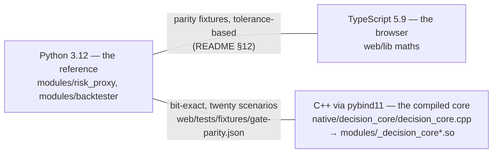
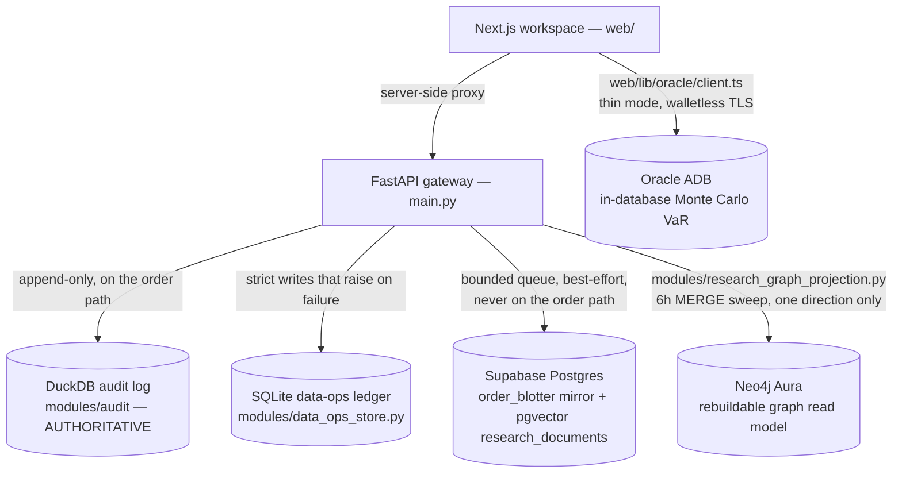

# The tech stack, layer by layer

What AlphaEngine is built from, and why each piece earned its place — languages,
frameworks, datastores, the optional-extras pattern, the web's dependency rule,
and the three model dependencies. Every version here was read from the tree on
2026-08-22: pins from [`requirements*.txt`](../../Part2_Infrastructure/) and
[`OpenBB_Service/pyproject.toml`](../../Part2_Infrastructure/OpenBB_Service/pyproject.toml),
locked versions from `web/package-lock.json`, installed versions from the
Python 3.12 virtualenv CI mirrors. The deployed-versions tables in
[README §Tech Stack](../../Part2_Infrastructure/README.md#tech-stack) are the
authoritative long form; this document distils the argument and links to it
rather than restating two thousand lines.

The stack's one-sentence thesis: **one Postgres, and determinism everywhere a
number is produced** — every service that could put a vendor, a model version
or a network call on a measured path was either rejected by name or fenced off
as an optional extra whose absence is a reported state.

## Languages

### Python 3.12 — pinned, and the pin is load-bearing

The gateway runs on Python 3.12 (`3.12.14` in the CI-mirroring virtualenv). The
gateway itself accepts 3.11–3.14 and the OpenBB service declares
`>=3.12,<3.15`, so the pin is not about syntax — it is about a trap
[CLAUDE.md](../../CLAUDE.md) documents because it cost an hour: **numba
publishes no wheel for 3.14, so vectorbt silently does not install there, and
`tests/test_backtester.py` skips rather than fails.** A 3.14 venv looks fine
and reads green while the vectorbt engine goes entirely untested. The tell is
the skip REASONS, not the pass count and not the skip count either: on 3.12 the
suite shows exactly two skips — `tests/test_data_ops_postgrest.py` (no Supabase
credentials in the environment) and `tests/test_research_rerank_real.py` (no
seeded cross-encoder weights) — each naming what it did not exercise. Read them
with `pytest -rs`; the interpreter is wrong when the vectorbt skip from
`tests/test_backtester.py` appears, whatever the total.
Build the venv with `python3.12 -m venv venv`, at
`Part2_Infrastructure/venv` and no other name — the dev scripts spawn
`venv/bin/python` with no existence check.

### TypeScript — the browser's copy of the maths

TypeScript `5.9.3` (locked; the pin is `^5.6`), strict mode. It exists because
the gateway's maths must also run where Python cannot: the browser. Python is
the reference implementation; the TypeScript side reproduces it against
committed fixtures emitted by the Python engine, so changing a formula on one
side fails the other — see
[README §12](../../Part2_Infrastructure/README.md#12-one-engine-two-implementations-one-test-that-proves-it).

### C++ — the compiled decision core, held to bit-exactness

The pre-trade arithmetic exists a third time in C++
([`native/decision_core/decision_core.cpp`](../../Part2_Infrastructure/native/decision_core/decision_core.cpp)),
bound with pybind11 (`3.1.0` installed; build-time only, via
`requirements-native.txt`) into `modules/_decision_core*.so`.
`DECISION_CORE=auto|native|python` selects the engine and `/health` names which
one is live. Where Python↔TypeScript parity is tolerance-based, the C++
standard is **bit-exact**: `tests/test_decision_core_native.py` and
`tests/test_gate_parity.py` pin both engines to the same twenty-scenario
fixture, `web/tests/fixtures/gate-parity.json`. The core is the nanosecond
plane of the three-plane latency doctrine (decision in µs, core in ns, network
in ms — never blended); [LATENCY_BUDGET.md](../architecture/LATENCY_BUDGET.md) carries the
measurements.

## Frameworks

**FastAPI** (pin `>=0.110`; `0.141.1` in the venv) is the gateway. Its OpenAPI
schema is a committed contract — `tools/openapi.json`, whose SHA-256 the web
build verifies at `prebuild` and refuses to build against when stale. The
route-count arithmetic (decorators vs operations vs paths, each counted on a
stated basis) lives in
[README §Backend](../../Part2_Infrastructure/README.md#backend).

**Uvicorn** (`0.52.3`) runs **one process, no workers, by design**: the gateway
holds a mutable in-memory book, a resting-order book, a token bucket and the
kill switch, and a second worker would fork the book and localise the halt.
`tests/test_container_contract.py` fails the build on `--workers` with that
reason inline.

**Pydantic** (`2.13.4`) types every payload through one schema family
(`modules/schemas*.py`), shared by API, UI and the Telegram companion.
**httpx** (`0.28.1`) carries all outbound HTTP including the Supabase mirror —
chosen over `supabase-py` to keep the import graph network-free for CI.

**Next.js `16.3.0` / React `19.2.8`** (both locked) build the desk workspace on
Node 22 (`.nvmrc`; engines `>=20.9.0 <27`). Server-side proxy routes are the
only path to backend credentials; the browser bundle ships zero secrets.
Tailwind CSS `4.3.3` runs without preflight, bridged onto the hand-written
token system in `app/globals.css`. There is no Jest and no Vitest: `npm test`
is Node's built-in runner via `tsx`. There is also no `lint` script — linting
is Python-side (`ruff check .`), a fact CLAUDE.md lists among the four that
cost an hour each.

**The OpenBB service** pins exactly, not with ranges — `fastapi==0.136.3`,
`uvicorn==0.40.0`, `openbb-core==1.6.13`, `openbb-yfinance==1.6.3`,
`yfinance==1.5.2` — because a stateless serverless unit redeploys constantly
and a floating pin turns each deploy into a version lottery.

**Celery + Redis** are optional: set `REDIS_URL` and the job queue switches
from the in-process pool automatically, same task callables either way.

## Datastores

Five stores, one authority. DuckDB decides what happened; everything else is a
mirror, a ledger or a read model, and each one's absence is a designed state.

| Store | Role | When it is absent |
|---|---|---|
| **DuckDB** (`1.5.5`) | The **authoritative** append-only audit log (orders, events, backtests, equity) on a named Docker volume, with an SQLite fallback. Embedded on purpose: the desk must keep trading when every network dependency is down. Its helpers are deliberately fire-and-forget — a lost TCA snapshot must never take the order path down. | Not optional — this is the floor. |
| **SQLite** (stdlib) | The data-ops ledger ([`modules/data_ops_store.py`](../../Part2_Infrastructure/modules/data_ops_store.py)): quality findings, escalations, work items, schedule runs. Split from DuckDB because these rows need the opposite contract — writes that raise on failure and UPDATEs that report whether they hit a row. `DATA_OPS_BACKEND=postgres` moves the four tables to Supabase; see [DATA_OPS_BACKEND.md](../architecture/DATA_OPS_BACKEND.md). | The default backend; selecting `postgres` without credentials raises at startup rather than falling back silently. |
| **Supabase Postgres + pgvector** | The durable **mirror, never a second decision-maker**: every decision streams through a bounded queue into `public.order_blotter`; pgvector holds the 384-dim HNSW index over `public.research_documents`. RLS deny-by-default, append-only by trigger. | With no `SUPABASE_URL`/`SUPABASE_SERVICE_ROLE_KEY`, mirror and RAG are no-ops and every test passes offline; RAG routes return a typed `unavailable`, never `[]`. |
| **Neo4j Aura** | A **rebuildable read model** of `research_edges`, written one-way by [`modules/research_graph_projection.py`](../../Part2_Infrastructure/modules/research_graph_projection.py) and read back by [`research_graph_read_model.py`](../../Part2_Infrastructure/modules/research_graph_read_model.py) on the two graph report routes only. Postgres stays authoritative and request-time traversal never leaves it; drift is a non-event — drop the graph and re-project. | An unset `NEO4J_URI` is the normal deployment: the sweep and the read model each report a named reason, never an exception, and the report routes fall back to the in-process computation, saying which answered. |
| **Oracle ADB** | Optional second opinion: `POST /api/oracle/var` runs a Monte Carlo VaR **in the database** so the Risk tab can show two independent implementations of the same quantity. `oracledb` thin mode — pure JavaScript wire protocol, walletless `tcps://`, deployable serverless. | `web/lib/oracle/client.ts` refuses to flatten "not configured", "unreachable" and "found nothing" into one empty array — each is a distinct typed failure. |

## The optional-extras pattern

`requirements-core.txt` is the guaranteed-installable floor; everything else is
a choice, and — the codebase's defining habit — **every absence is a reported
state in the same shape as an unset key, never an exception and never a silent
skip**. Imports are lazy; the whole test suite passes with none of the extras
installed (bar the native toolchain CI builds deliberately). Each file opens
with a comment arguing why it is not core; the table compresses those
arguments.

| File | Adds | When absent |
|---|---|---|
| [`requirements.txt`](../../Part2_Infrastructure/requirements.txt) | The full set: core plus vectorbt (numba) and Celery/Redis. | — |
| [`requirements-core.txt`](../../Part2_Infrastructure/requirements-core.txt) | FastAPI, uvicorn, pydantic, httpx, websockets, DuckDB, NumPy/pandas/matplotlib, pytest. | Not applicable — the floor. The backtester runs its built-in NumPy engine instead of vectorbt. |
| [`requirements-dev.txt`](../../Part2_Infrastructure/requirements-dev.txt) | The CI set: ruff, the native toolchain, communities, `requirements-ml.txt` (scikit-learn), vectorbt and the `httpx2` transport starlette's test client is built on, on top of core. Separate so the runtime image never carries tooling; the ML extra and vectorbt are here so the job that gates the push runs what the suite tests. | `ruff check .` is unavailable; CI still runs it. Without scikit-learn the five adapter tests skip, without vectorbt the backtester's parity test skips — a venv from the pre-2026-08-22 file read 7 skipped where CI should read 1. |
| [`requirements-native.txt`](../../Part2_Infrastructure/requirements-native.txt) | setuptools + pybind11, **build-time only** — the runtime image carries the `.so` and no compiler. | With no built `.so`, `DECISION_CORE=auto` falls back to the Python reference engine; the two native-parity tests **fail rather than skip** unless `DECISION_CORE=python` was set on purpose. |
| [`requirements-ml.txt`](../../Part2_Infrastructure/requirements-ml.txt) | scikit-learn (`>=1.5,<2.0` — a solver that changes between releases changes yesterday's coefficients). The ridge and logistic regression are hand-rolled in `modules/ml/models.py` and always available. | `modules/ml/engine.py` reports the sklearn strategies as UNAVAILABLE with the import error attached; `ml_runs.engine` records `numpy` for every hand-rolled run, because a run that fell back must not be ranked as though it had not. |
| [`requirements-openbb.txt`](../../Part2_Infrastructure/requirements-openbb.txt) | `openbb==4.7.2` + `openbb-yfinance==1.6.3` in the gateway env — the heavyweight local bridge behind `/api/research/openbb/*`. | Absence is a reported state, not a boot failure: `/api/research/openbb/health` says exactly what is missing and the portal's provider registry routes around it (the standalone `OpenBB_Service/` is the production path anyway). |
| [`requirements-graph.txt`](../../Part2_Infrastructure/requirements-graph.txt) | The `neo4j` driver for the projection sweep **and** for reading the sweep's labels back on `/api/research/graph/communities` and `/centrality`. | Reported the same way as an unset `NEO4J_URI`, and the two report routes fall back to the in-process networkx computation with `source: "corpus"`. Postgres remains authoritative; **no request path depends on the graph being up** — request-time traversal is the Postgres recursive CTE, and the two report routes degrade rather than fail. |
| [`requirements-communities.txt`](../../Part2_Infrastructure/requirements-communities.txt) | networkx — Louvain and PageRank **in process** over the edge list, independent of the graph database. | `/api/research/graph/communities` and `/centrality` return `unavailable` with the reason string, including the install command. |
| [`requirements-rerank.txt`](../../Part2_Infrastructure/requirements-rerank.txt) | fastembed + onnxruntime, the local BGE cross-encoder. | `modules/research_rerank.py` hands back the fused RRF order untouched and truncated, and `rerank_state` says why. Precision is bought, never a prerequisite for an answer. |
| [`requirements-genai.txt`](../../Part2_Infrastructure/requirements-genai.txt) | `google-genai`, Stage-5 grounded generation. | `modules/research_generate.py` reports the package's absence in the same shape as an unset `GEMINI_API_KEY`: every answer is `verdict: refused` with the reason, and the desk runs exactly as before. |
| [`requirements-recall.txt`](../../Part2_Infrastructure/requirements-recall.txt) | Nothing new — one package already in core, so `tools/graph_recall.py` runs from a minimal laptop venv. Deliberately **not** here: the Anthropic SDK — `--narrate` shells out to the `claude` CLI instead, keeping the integration outside the dependency graph entirely. | If `claude` is not on PATH or fails, the CLI says so with the reason and prints the deterministic traversal anyway. |

## The web's dependency rule

**No new npm dependencies** — a house rule enforced by
`web/tests/house-rules.test.ts`, not by convention. The workspace ships on
exactly five runtime packages (locked versions from `package-lock.json`):

| Package | Locked | Why it is allowed in |
|---|---|---|
| `next` | `16.3.0` | The framework; App Router, server-side proxy routes. |
| `react` / `react-dom` | `19.2.8` | The framework's other half. |
| `lucide-react` | `1.28.0` | The only icon dependency. |
| `@supabase/supabase-js` | `2.112.2` | The browser Realtime client. |
| `oracledb` | `6.10.0` | Thin-mode ADB access from the server-side routes. |

Everything else is written here: charts are hand-rolled SVG on one scale kit
(`components/chart-kit.tsx`) — there is deliberately no chart library — and the
test runner is Node's own. As CLAUDE.md puts it: reach for a package and you
are changing the argument the project makes about itself.

## Model dependencies

Three models touch the system, and none of them touches the trade path.

- **gte-small** (384-dim, unit-normalised) embeds the research corpus —
  **server-side**, inside the
  [`embed-research` edge function](../../supabase/functions/embed-research/index.ts)
  via `Supabase.ai`. No paid API, no key, no model weights in the gateway
  image. An embed outage stores `embedding_status='pending'` — never a zero
  vector, which is equidistant from everything and would rank as "similar" to
  any query.
- **BGE re-ranker** (`BAAI/bge-reranker-base`) runs locally as ONNX on the CPU
  via fastembed, resolved from `RERANK_MODEL_PATH`. The module holds that once
  the model directory is seeded there is no network at request time — a query
  must never pay for a download, and CI is network-free by construction. The
  corollary, stated because it is a real limit on what the suite proves: **the
  real weights never run in CI.** Seeding them would be a download, so
  `tests/conftest.py` blanks `RERANK_MODEL_PATH` deliberately and the ONNX path
  is exercised through a fake cross-encoder at the import seam. What CI holds is
  the wiring, the widening arithmetic, the bulkhead and the grader's handling of
  a score — not the model's own quality.
- **Gemini** (via `google-genai` and `GEMINI_API_KEY`/`GEMINI_MODEL`) writes
  Stage-5 grounded answers behind five fences, **four of which refuse in code**:
  the refuse band is checked before the call; the context is closed and every
  document line is quoted as untrusted data, with an instruction-shaped override
  refusing before the call and spending nothing; figures are quoted never
  computed, and that is now checked — every number the answer states, other than
  a citation id, a date or an ordinal, must appear character-for-character in a
  supplied document; one fabricated citation refuses the whole answer, under a
  reason deliberately distinct from the figure one. The fifth is the bound
  itself: timeout and token cap. `corpus_silent` is a correct verdict, not an
  error. Two limits stated rather than hidden: **dates and clock times are
  exempt** from the figure fence (a verbatim comparison would refuse legitimate
  prose), and one poisoned document refuses the whole answer including the clean
  documents beside it, because per-document quarantine would change the set the
  CRAG grade was computed over.
- **The `/ask` route is bounded** ([`modules/research_quota.py`](../../Part2_Infrastructure/modules/research_quota.py)):
  a token bucket — the gateway's own `risk_proxy.rate_limit.TokenBucket`,
  imported rather than reinvented — plus a rolling spend window priced from the
  token counts the SDK reports, refusing spend before a rate token is consumed.
  Typed refusals on 429/503, never a bare 500. Inert with no `GEMINI_API_KEY`,
  because a desk that cannot reach a model cannot spend.

A fourth is deliberately not a dependency: the `claude` CLI narrates
`tools/graph_recall.py` output by shell-out only, so no SDK and no key enter
any dependency graph.

## The enterprise-RAG mapping

The pattern this desk is built toward is the standard enterprise
retrieval-augmented stack. Almost every recommended component was replaced,
and the replacements share two reasons: **one Postgres** (the corpus is the
desk's own records, already flowing through the mirror's bounded queue — a
second datastore is a second thing to drift) and **determinism** (nothing on a
measured path may be a function of a vendor's model version or uptime).

| The pattern recommends | This project uses | The argued reason (from the tree) |
|---|---|---|
| A dedicated vector database (Pinecone, Weaviate, Milvus) | pgvector HNSW in the same Supabase Postgres that holds `order_blotter` | One Postgres. The index lives beside the data it indexes; `body` holds the exact embedded text so a renderer change can never silently invalidate stored vectors. |
| A hosted embedding API | gte-small in a Supabase edge function | No key, no per-call cost, no weights in the gateway image; an outage is `pending`, never a zero vector. |
| A lexical search engine (Elasticsearch / OpenSearch) | Postgres FTS (GIN over a generated tsvector) for recall, plus hand-rolled Okapi BM25 ([`modules/research_bm25.py`](../../Part2_Infrastructure/modules/research_bm25.py)) re-scoring the survivors, fused by RRF | FTS keeps the only index that finds a candidate at all; BM25 supplies the better ranking model as a pure function — no database round trip, no clock, testable without a network. It can reorder but never add or drop. |
| A hosted re-ranker (Cohere Rerank, Voyage) | The local BGE cross-encoder, ONNX on CPU | Rejected by name in `requirements-rerank.txt` despite being better scorers: a vendor call on the retrieval path makes the tests mockable-or-meaningless, the accuracy a function of an unpinned model version, a vendor outage a retrieval outage, and sends desk research off the box. |
| LLM-graded relevance (LLM-as-judge) | An arithmetic grader ([`modules/research_crag.py`](../../Part2_Infrastructure/modules/research_crag.py)) over signals the hybrid RPC already returns | Deterministic, free, reproducible across deployments; an LLM grade is a function of a model version, which is precisely the property the rest of the project spends its effort removing. |
| An orchestration framework | Hand-written stages: `research_router.py`, `research_crag.py`, `research_stages.py`, `research_generate.py` | The Python cousin of the no-new-npm-deps rule: everything on the path is written here, so every property — the one-retry bound, the refuse bands, the bulkhead off the event loop — is asserted by the offline suite. |
| A graph database as authoritative store, with GDS for algorithms | Postgres `research_edges` authoritative; Neo4j Aura Free as a **rebuildable projection**; Louvain/PageRank **in process** via networkx | A dual write is two systems that must agree; projecting makes divergence a non-event. And Aura Free has no GDS — `CALL gds.louvain.stream(...)` there is procedure-not-found, so the algorithms run where they can run everywhere: pure Python, in CI, on a laptop with no Neo4j at all. |
| Always-on generation | Optional Gemini, fenced, refuse-first | A model that invents a Sharpe ratio is worse than no answer: the invented number arrives wearing the same typography as a measured one. Below the CRAG refuse band the model is never called. |

**NOT BUILT:** multimodal generation — the generation stage writes prose over
documents Postgres already holds, and nothing generates or interprets images.
Also deliberately absent, with the argument in
[README §What is deliberately missing](../../Part2_Infrastructure/README.md#what-is-deliberately-missing):
real broker connectivity, multi-worker serving, and the rest of the list that
section owns.

## Verifying any of this

Never trust a version or a count in prose, including this file's. The suite
figures committed on 2026-08-21 (`web/lib/test-counts.generated.ts`): gateway
2,028 passed + 2 skipped, web 3,900 tests across 839 suites, OpenBB service 14.
CLAUDE.md's rule stands — run the suite and read the number off the output;
`/verify` runs every check and reports real measurements. For the wider walk of
what these pieces do in use, start at the [feature tour](../product/FEATURE_TOUR.md).
