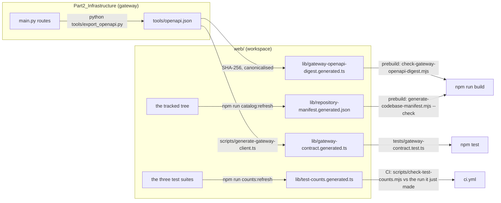

# Development workflow

How to work on AlphaEngine without losing an hour to a trap somebody else has
already fallen into. The traps are real — each one below cost time before it
was written down. Facts here were read from the tree on 2026-08-22; where a
figure can drift, the document says where the current one lives rather than
asking you to trust this page.

Running instructions live in [`SETUP.md`](../../SETUP.md); the authoritative
deep-dives are [`Part2_Infrastructure/README.md`](../../Part2_Infrastructure/README.md)
and [`CLAUDE.md`](../../CLAUDE.md). This page is the workflow distilled: the
venv rules, the commands, the generated gates, the ratchet, and CI.

---

## 1. The virtualenv: one path, one Python

**The venv must be named `venv`, at `Part2_Infrastructure/venv`, built on
Python 3.12.** Not `.venv`, not conda, not uv, not 3.13 or 3.14. Both halves of
that sentence are load-bearing.

**The path.** `web/package.json`'s `dev:gateway` script runs
`cd .. && ./venv/bin/python`, and `web/scripts/start-dev-all.mjs` spawns
`resolve(rootDir, "venv/bin/python")` with no existence check and no `error`
handler on the child process. Any other layout produces an unhandled `ENOENT`
that looks nothing like "wrong Python path" — it looks like Node itself broke.
Never rename the venv; never add a second one.

**The version.** CI pins 3.12 because it is the only version both Python units
accept: the gateway supports 3.11–3.14, the OpenBB service declares
`>=3.12,<3.15` in `OpenBB_Service/pyproject.toml`. A 3.14 venv is worse than a
refusing one, because it *works* — one test lighter. numba has no 3.14 wheel,
so vectorbt cannot install, so `tests/test_backtester.py` skips with "vectorbt
not installed" and the summary line still reads green while the vectorbt engine
goes untested. The default `python3` on current macOS/Homebrew is 3.14, so
build explicitly:

```bash
cd Part2_Infrastructure
python3.12 -m venv venv
venv/bin/pip install -r requirements-dev.txt   # the CI set: core + native toolchain + ruff + networkx/scipy + scikit-learn + vectorbt + httpx2
venv/bin/python native/decision_core/setup.py build_ext --inplace --build-temp build/native
```

The native build is not optional for a full run: `tests/test_decision_core_native.py`
and `tests/test_core_self_measure.py` **fail**, not skip, when
`modules/_decision_core*.so` is missing — a broken core must be a red build,
never a quiet absence. The deliberate escape hatch is `DECISION_CORE=python`,
set on purpose, not arrived at by forgetting the build step.

## 1b. The `.env` trap: never `set -a`

`Part2_Infrastructure/.env` holds the real `SUPABASE_*`, `NEO4J_*`,
`GEMINI_API_KEY` and `RERANK_MODEL_PATH`. The obvious way to load it is the one
that costs the hour:

```bash
set -a && . ./.env       # ← not before a test run
```

That also exports `REQUIRE_AUTH`. `tests/conftest.py` sets it with
`os.environ.setdefault`, and **`setdefault` cannot override a variable that is
already exported** — so the app comes up requiring auth and about **eighty tests
fail with 401**. Nothing is broken. The shell decided the suite's policy, and
the failure looks like a bug in the auth layer rather than like an environment
mistake, which is why it is written down here.

**Pass one variable per run instead:**

```bash
SUPABASE_URL=… SUPABASE_SERVICE_ROLE_KEY=… venv/bin/python -m pytest tests/test_data_ops_postgrest.py
RERANK_TEST_MODEL_PATH=/path/to/weights venv/bin/python -m pytest tests/test_research_rerank_real.py
```

Two variables are deliberately immune to this, and the difference is the point.
`GEMINI_API_KEY` and `RERANK_MODEL_PATH` are **assigned** `""` in the conftest,
not `setdefault`-ed, so an exported real key cannot reach `settings` and spend
quota during a test run. Do not weaken that. `RESEARCH_IMAGE_MODEL_PATH` — the
CLIP pair behind the image retrieval arm — has **not** been given the same
treatment yet, and is recorded as owed in [`PLAN.md` §2.11](PLAN.md).
[`TESTING.md`](../testing/TESTING.md) argues why the two mechanisms encode two
different policies.

---

## 2. Count the skips, not the passes

The suite's health is read off the skip REASONS, because the pass count stays
plausible under several failure modes — and because the pass count legitimately
moves. On a correct 3.12 venv the gateway suite reads **2,149 passed and one
skipped** with the cross-encoder weights seeded on disk, and **2,141 passed and
two skipped** without them, which is what CI sees (both measured 2026-08-23).
Both are correct; the difference is one opt-in file, not a regression.
[`web/lib/test-counts.generated.ts`](../../Part2_Infrastructure/web/lib/test-counts.generated.ts)
(generated 2026-08-23) carries CI's figure — 2,143 collected, 2,141 passed,
2 skipped. Re-run the suite rather than trusting either file; the counts
in prose have drifted before, which is why that file is generated — and its own
web line has been behind the tree for a week at a time, so it is not a
substitute for running the suite either. [`TESTING.md`](../testing/TESTING.md)
is the argument in full.

Run `venv/bin/python -m pytest -rs` and read what each one says. Every expected
skip names the thing it did not exercise, which is the whole point of them:

- `tests/test_data_ops_postgrest.py` — no `SUPABASE_URL` /
  `SUPABASE_SERVICE_ROLE_KEY` in the environment, so the Postgres backend never
  ran. Absence reported, not papered over.
- `tests/test_research_rerank_real.py` — `RERANK_TEST_MODEL_PATH` unset, so no
  cross-encoder weights were offered and the real ONNX path was not exercised.
  Seed with `python tools/bench_rerank.py --seed --model-path DIR`; CI's opt-in
  `rerank-real` job does it in a setup step.

**Counting rather than reading is the trap.** This section said "exactly one
skipped" and "a second skip is the alarm" until 2026-08-22, when the opt-in
re-ranker test made two correct — and then, later the same day, seeding the
weights locally made *one* correct again. It has now been wrong in both
directions, which is as clear a case as this repository has for reading rather
than counting. The alarm is a NAMED skip that should not be there, above all the
vectorbt one from `tests/test_backtester.py`, which means the venv is the wrong
Python and that engine is silently untested. A skip that disappears is worth
the same attention: `test_data_ops_postgrest.py` going quiet means Supabase
credentials reached the test environment.

## 3. Running everything

All from `Part2_Infrastructure` unless stated; web commands from
`Part2_Infrastructure/web`.

| What | Command | Notes |
|---|---|---|
| Gateway tests | `venv/bin/python -m pytest` | 134 `test_*.py` suites (`ls tests/test_*.py \| wc -l`, 2026-08-23), deterministic, no network |
| Web tests | `npm test` | `node --test` via tsx; **4,430 tests across 972 suites in 300 files**, measured 2026-08-23 from a clean checkout. Two skips, both cross-ownership debts rather than opt-ins. The committed record agrees; when it stops agreeing, refresh it, see §4.3 |
| Service tests | `cd OpenBB_Service && python -m pytest` | own `pyproject.toml`, 14 tests |
| Typecheck | `npm run typecheck` | `tsc --noEmit`, strict |
| Lint | `venv/bin/python -m ruff check .` | configured in `pyproject.toml`; installed only by `requirements-dev.txt` |
| Money-path probe | `venv/bin/python tools/synthetic_probe.py` | book → cost → gate → audit, exits non-zero on any break |
| Both dev servers | `npm run dev:all` | gateway `:8000`, portal `:3000` |

**`npm run lint` does not exist.** `web/package.json` has exactly `dev`,
`dev:gateway`, `dev:all`, `prebuild`, `build`, `catalog:refresh`, `start`,
`typecheck`, `test` and `counts:refresh`. Running `npm run lint` fails as a
*missing script*, not a broken linter — there is no ESLint in the project at
all (no dependency, no config), a deliberate consequence of the no-new-npm-deps
rule. Linting is Python-side only, and the two conventions ESLint would have
held (file length, dead CSS) are held instead by tests
(`web/tests/file-size.test.ts`, `dead-css.test.ts`).

The repo's `/verify` skill runs all of the above and reports the measured
numbers; use it before claiming anything works. Never quote a test count from
memory or from a README — run the suite and read the runner's own final line.

## 4. The four generated gates

Four files in `web/lib/` are generated, committed, and then *checked* against
their source of truth by a build step or a test. The pattern is deliberate:
regeneration is a reviewable act in a diff, where generate-at-build would let
drift ship silently. Two of the four guard the contract between separately
deployed units — a mismatch there is the contract asserting itself, not a
build failure.



**1. OpenAPI digest.** `prebuild` canonicalises `tools/openapi.json`, SHA-256s
it and compares against the digest committed in
`lib/gateway-openapi-digest.generated.ts`. A mismatch exits 1 with `Gateway
OpenAPI digest is stale`. If you changed a gateway route: regenerate the
snapshot (`python tools/export_openapi.py` from `Part2_Infrastructure`), then
update the digest module with the hex the check script prints. CI additionally
runs `python tools/export_openapi.py --check` on the gateway side.

**2. Repository manifest.** The second `prebuild` step refuses to build if
`lib/repository-manifest.generated.json` no longer matches the tree. Refresh:
`npm run catalog:refresh`.

**3. Test counts.** `lib/test-counts.generated.ts` is what the Developer
console displays; it was three hand-copied integers before, and they drifted
three separate times (the script's header names the incidents). The web total
cannot be asserted from *inside* the suite — a test checking the count changes
the count — so CI checks it one step outside: the Tests step tees its log and
`scripts/check-test-counts.mjs` compares the runner's summary line against the
committed figure. Refresh after adding tests: `npm run counts:refresh` (or
`--suite=web` to re-run only the web suite, which keeps the committed Python
figures).

**This gate was red for a week in August**, and it is the worked example of
why it exists: three changes landed on 2026-08-22 adding suites, none refreshed
the module, and the committed 4,008 faced a measured 4,124 until the 2026-08-23
refresh (now 4,430, and it agrees). Nothing was broken —
the gate is doing precisely its job, which is to make "I added tests and forgot"
a red step rather than a stale number on the Developer tab. Run
`npm run counts:refresh -- --suite=web` and commit the result. Do not edit the
integer: it is a `*.generated.*` file, and hand-editing one is the original
defect the generator was written to end.

**4. Gateway client.** `lib/gateway-contract.generated.ts` is typed bindings
for the committed OpenAPI contract, produced by a bespoke ~150-line converter
(`node --import tsx scripts/generate-gateway-client.ts`) rather than a codegen
dependency — the contract uses a small closed set of pydantic v2 constructs,
and anything outside that set must fail the generation loudly rather than
degrade to `any`. `tests/gateway-contract.test.ts` fails the suite when the
committed output goes stale.

## 5. The file-size ratchet

There is a 400-line ceiling on source files, held by twin tests —
[`tests/test_file_size.py`](../../Part2_Infrastructure/tests/test_file_size.py)
(gateway) and
[`web/tests/file-size.test.ts`](../../Part2_Infrastructure/web/tests/file-size.test.ts)
(workspace) — because neither ruff nor anything else on this tree has a
file-length rule, and an unenforced 300–400 line convention is how
`modules/telegram.py` once reached nearly 7,000 lines.

Each test carries an `OVER_CEILING` ledger: the files over the ceiling today,
at the length they are at. **Every entry is a debt, not an exemption**, and the
ratchet turns one way:

- a file **on** the list may not get *longer* — that is what stops "I will
  split it later" becoming "it grew while I waited";
- a file **not** on the list may not cross the ceiling at all;
- an entry is deleted once the file drops under 400 — the ratchet closing.

The rejected alternative — a flat "every file under 400" — would have been red
on the day it was written and therefore ignored. A ratchet is red only when
someone makes things worse. The rare deliberate raise is written down in the
ledger with its argument (see `tests/test_session_rollover.py`'s entry), which
is the honest version of what other codebases do silently.

**Two files currently have zero headroom, and the next change to either must
pay for itself by splitting something first** (measured 2026-08-22):
`web/components/portfolio/OracleVarPanel.tsx` at 398 lines and
`web/components/ResearchWorkspace.tsx` at 399. Neither is on the ledger, so one
added line puts each over the ceiling. Both are pinned to their current paths by
several other suites — for `OracleVarPanel` that is risk-stability,
no-dead-ends, summarised-risk, tile-anatomy and layout-stability — so a split
has to move the guards with it rather than around them. The web ceiling scans
`app`, `components`, `lib`, `scripts` and `tests`; documents, including this
one, are not in it.

The Python side has a twin for complexity: the `C901`/`PLR0915` per-file-ignores
ledger in `pyproject.toml`, seeded from the offenders that existed when the
rules were switched on, with `tests/test_complexity_debt.py` failing when an
entry is no longer needed — so the list cannot quietly outlive the debt.

## 6. CI

[`.github/workflows/ci.yml`](../../.github/workflows/ci.yml) runs four
network-free jobs on every push and PR — a red build means the code broke,
never that an exchange was slow:

- **Gateway**: `pip install -r requirements-dev.txt`, build the native core
  (so a broken core is a red build), `ruff check .`, `pytest`,
  `export_openapi.py --check`, then the synthetic money-path probe.
- **OpenBB service**: its own `requirements-dev.txt`, `pytest`.
- **Web**: `npm ci`, `npm test` (with `set -o pipefail` — GitHub's default
  bash does not set it, and `| tee` alone would mask a red suite behind tee's
  exit 0), the test-count check against the log it just teed, `npm run
  typecheck`, `npm run build` (which exercises the two prebuild gates and the
  same artefact Vercel deploys).
- **Repo audit**: `tools/check_repo_complete.sh --fast` — catches the failure
  mode where a file builds locally but was never committed because a
  `.gitignore` pattern silently matched it.

Runtimes are pinned where the code declares them: Python 3.12 in the workflow
`env`, Node from the repo-root `.nvmrc` (it was declared in three places once;
a bump that missed one had CI testing a version nobody develops on). npm, not
yarn or pnpm — `package-lock.json` and `npm ci` are what CI uses.

Two further jobs are opt-in rather than on every push, and both are deliberate
holes in the network-free rule rather than exceptions to it.

**`rerank-real`** (`workflow_dispatch`, or a PR labelled `rerank`) caches the
`BAAI/bge-reranker-base` weights keyed on the `requirements-rerank.txt` pin —
keyed on the pin because a re-ranker that scores differently between releases
re-orders what the desk was shown — seeds them in the one networked step in the
file, runs the real ONNX suite against the seeded directory, then re-runs the
default suite to prove it is still weight-free, and finally benches on the
runner. **The equivalent job for the image arm does not exist.**
`tools/bench_image_retrieval.py` is wired exactly the way `bench_rerank` was
before CI adopted it — an executable entry point with its corpus, answer key,
metrics and degrade paths under test — and wants the same treatment. It is
recorded as owed in [`PLAN.md` §2.11](PLAN.md) rather than described as covered.

**`live-smoke`** is `workflow_dispatch` only and skips cleanly when
secrets are absent — putting a live-database probe on `pull_request` would
trade away the network-free guarantee, since an idle Always Free ADB
auto-stops. The other workflows split by tempo on purpose:
`deploy.yml` (gateway to the OCI instance — web and OpenBB deploy themselves
from git as Vercel projects, and putting them there would deploy them twice),
`e2e.yml` (smoke against what is actually deployed — the opposite job to CI),
`schema.yml` (DDL against live databases, manual on purpose: DDL that rides a
code deploy is how a table gets altered by someone shipping a CSS change), and
two keepalives.

## 7. Deploying

The short version: the gateway ships as a one-process Docker container
(`docker compose up -d --build` from the repo root) because long-lived venue
WebSockets, an embedded DuckDB file and an in-memory kill switch need one
process that never spins down — a second uvicorn worker would fork the book
and localise the kill switch. The portal and the OpenBB service are separate
Vercel projects; TLS on the VM is a Caddy sidecar with a pinned internal CA
([`docs/engineering/TLS_FLIP.md`](../engineering/TLS_FLIP.md)).

The full argument — Dockerfile design decisions, OCI steps, Vercel env vars
and region (US egress gets 451/403 from the venues), continuous deployment —
is [README §11](../../Part2_Infrastructure/README.md#11-deployment). Live URLs
and what runs keyless are in the [feature tour](../product/FEATURE_TOUR.md).
