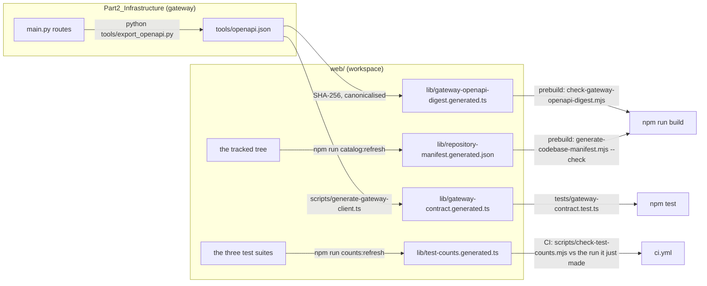
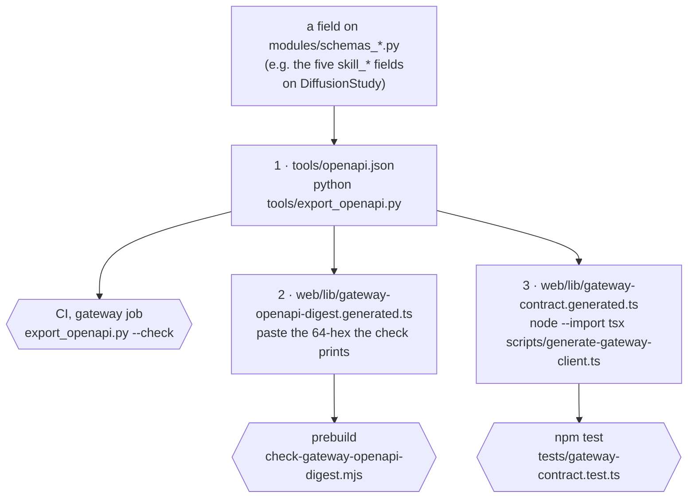

# Development workflow

How to work on AlphaEngine without losing an hour to a trap somebody else has
already fallen into. The traps are real — each one below cost time before it
was written down. Facts here were read from the tree on 2026-08-24; where a
figure can drift, the document says where the current one lives — or which gate
enforces it — rather than asking you to trust this page.

Running instructions live in [`SETUP.md`](../../SETUP.md); the authoritative
deep-dives are [`Part2_Infrastructure/README.md`](../../Part2_Infrastructure/README.md)
and [`CLAUDE.md`](../../CLAUDE.md). This page is the workflow distilled: the
venv rules, the commands, the generated gates, the schema cascade, the ratchet,
and CI.

---

## 1. The virtualenv: one path, one Python

**The venv must be named `venv`, at `Part2_Infrastructure/venv`, built on
Python 3.12.** Not `.venv`, not conda, not uv, not 3.13 or 3.14. Both halves of
that sentence are load-bearing.

**The path.** `web/package.json`'s `dev:gateway` script runs
`cd .. && ./venv/bin/python`, and `web/scripts/start-dev-all.mjs` spawns
`resolve(rootDir, "venv/bin/python")` with no existence check and no `error`
handler on the child process. Any other layout produces an unhandled `ENOENT`
that looks nothing like "wrong Python path" — it looks like Node itself broke.
Never rename the venv; never add a second one.

**The version.** CI pins 3.12 because it is the only version both Python units
accept: the gateway supports 3.11–3.14, the OpenBB service declares
`>=3.12,<3.15` in `OpenBB_Service/pyproject.toml`. A 3.14 venv is worse than a
refusing one, because it *works* — one test lighter. numba has no 3.14 wheel,
so vectorbt cannot install, so `tests/test_backtester.py` skips with "vectorbt
not installed" and the summary line still reads green while the vectorbt engine
goes untested. The default `python3` on current macOS/Homebrew is 3.14, so
build explicitly:

```bash
cd Part2_Infrastructure
python3.12 -m venv venv
venv/bin/pip install -r requirements-dev.txt   # the CI set: core + native toolchain + ruff + networkx/scipy + scikit-learn + vectorbt + httpx2
venv/bin/python native/decision_core/setup.py build_ext --inplace --build-temp build/native
```

The native build is not optional for a full run: `tests/test_decision_core_native.py`
and `tests/test_core_self_measure.py` **fail**, not skip, when
`modules/_decision_core*.so` is missing — a broken core must be a red build,
never a quiet absence. The deliberate escape hatch is `DECISION_CORE=python`,
set on purpose, not arrived at by forgetting the build step.

## 1b. The `.env` trap: never `set -a`

`Part2_Infrastructure/.env` holds the real `SUPABASE_*`, `NEO4J_*`,
`GEMINI_API_KEY` and `RERANK_MODEL_PATH`. The obvious way to load it is the one
that costs the hour:

```bash
set -a && . ./.env       # ← not before a test run
```

That also exports `REQUIRE_AUTH`. `tests/conftest.py` sets it with
`os.environ.setdefault`, and **`setdefault` cannot override a variable that is
already exported** — so the app comes up requiring auth and about **eighty tests
fail with 401**. Nothing is broken. The shell decided the suite's policy, and
the failure looks like a bug in the auth layer rather than like an environment
mistake, which is why it is written down here.

**Pass one variable per run instead:**

```bash
SUPABASE_URL=… SUPABASE_SERVICE_ROLE_KEY=… venv/bin/python -m pytest tests/test_data_ops_postgrest.py
RERANK_TEST_MODEL_PATH=/path/to/weights venv/bin/python -m pytest tests/test_research_rerank_real.py
```

**Three** variables are deliberately immune to this, and the difference is the
point. `GEMINI_API_KEY`, `RERANK_MODEL_PATH` and `RESEARCH_IMAGE_MODEL_PATH` are
**assigned** `""` in `tests/conftest.py`, not `setdefault`-ed, so an exported
real key cannot reach `settings` and spend quota during a test run and an
exported weights directory cannot have unrelated suites load a model off disk.
Do not weaken that.

`RESEARCH_IMAGE_MODEL_PATH` — the CLIP `ViT-B/32` pair behind the image
retrieval arm — joined the group most recently, and this section said it was
still owed until 2026-08-24. Two things earned it the assignment rather than a
`setdefault`. The shape that actually loads 0.6 GB is an **exported** path — the
developer who ran `tools/bench_image_retrieval.py --seed` and kept it in their
shell — and `setdefault` beats only a `.env`. And it had to go in the conftest
rather than in a per-file fixture, because `research_image.IMAGE_MODEL_PATH` is
read off `os.environ` in a **module-level assignment at import**: before the
first test module imports the package is the last moment the value is settable,
so a fixture is structurally too late for every file but its own. The arm's four
suites each patched the constant and were safe; anything driving
`/api/research/rag/search` reaches `research_image_arm` and was not.

Blanking takes no opt-in away, which is the other half of the rule:
`tests/test_research_rerank_real.py` opts in through its own separate
`RERANK_TEST_MODEL_PATH`, deliberately left alone.
[`TESTING.md`](../testing/TESTING.md) argues why the two mechanisms —
`setdefault` for a documented opt-in, assignment for a refusal — encode two
different policies.

---

## 2. Count the skips, not the passes

The suite's health is read off the skip REASONS, because the pass count stays
plausible under several failure modes — and because the pass count legitimately
moves. **The gateway has two correct pass counts, not one.** With the
cross-encoder weights seeded on disk the suite reads **3,039 passed and one
skipped** (measured 2026-08-24); without them — the shape CI sees on the jobs
that gate a push — `tests/test_research_rerank_real.py` skips too and the totals
differ by that one file. Both are correct; the difference is an opt-in, not a
regression. Quote which shape you measured, always: a bare number is the half of
the fact that goes stale.

[`web/lib/test-counts.generated.ts`](../../Part2_Infrastructure/web/lib/test-counts.generated.ts)
carries the committed record, and it is worth knowing exactly how much of it CI
holds. **Only the web line is gated** — `web/scripts/check-test-counts.mjs`
refuses any suite argument but `web`, and the `web` job compares it against the
log the runner just teed. The **gateway** and **service** lines in that file are
*dated records nothing checks*. Refreshed 2026-08-24 to 3,033 (3,031 passed,
2 skipped), which is the **CI shape** — no cross-encoder weights seeded. A
machine with weights measures 3,040 (3,039 passed, 1 skipped); the eight-test
difference is the shape, not drift, so quote the shape whenever you quote the
number. That the line agrees today is not a gate; it is a gate that was never
claimed. Re-run the suite rather than trusting the file, and refresh the file
rather than editing it.
[`TESTING.md`](../testing/TESTING.md) is the argument in full.

Run `venv/bin/python -m pytest -rs` and read what each one says. Every expected
skip names the thing it did not exercise, which is the whole point of them:

- `tests/test_data_ops_postgrest.py` — no `SUPABASE_URL` /
  `SUPABASE_SERVICE_ROLE_KEY` in the environment, so the Postgres backend never
  ran. Absence reported, not papered over.
- `tests/test_research_rerank_real.py` — `RERANK_TEST_MODEL_PATH` unset, so no
  cross-encoder weights were offered and the real ONNX path was not exercised.
  Seed with `python tools/bench_rerank.py --seed --model-path DIR`; CI's opt-in
  `rerank-real` job does it in a setup step.

**Counting rather than reading is the trap.** This section said "exactly one
skipped" and "a second skip is the alarm" until 2026-08-22, when the opt-in
re-ranker test made two correct — and then, later the same day, seeding the
weights locally made *one* correct again. It has now been wrong in both
directions, which is as clear a case as this repository has for reading rather
than counting. The alarm is a NAMED skip that should not be there, above all the
vectorbt one from `tests/test_backtester.py`, which means the venv is the wrong
Python and that engine is silently untested. A skip that disappears is worth
the same attention: `test_data_ops_postgrest.py` going quiet means Supabase
credentials reached the test environment.

## 3. Running everything

All from `Part2_Infrastructure` unless stated; web commands from
`Part2_Infrastructure/web`.

| What | Command | Notes |
|---|---|---|
| Gateway tests | `venv/bin/python -m pytest` | **189** `test_*.py` files (`ls tests/test_*.py \| wc -l`, 2026-08-24), deterministic, no network. 3,039 passed / 1 skipped with the re-ranker weights seeded; one more skip without them |
| Web tests | `npm test` | `node --test` via tsx; **4,670 passed, 0 failed, 2 skipped across 1,011 suites** in 313 `*.test.ts` files, measured 2026-08-24 from a clean checkout. Both skips are cross-ownership debts rather than opt-ins. This is the one count CI actually gates; when the committed record stops agreeing, refresh it — see §4.3 |
| Service tests | `cd OpenBB_Service && python -m pytest` | own `pyproject.toml` and its own `requirements-dev.txt`; **24 passed** (2026-08-24) |
| Typecheck | `npm run typecheck` | `tsc --noEmit`, strict |
| Lint | `venv/bin/python -m ruff check .` | configured in `pyproject.toml`; installed only by `requirements-dev.txt` |
| Money-path probe | `venv/bin/python tools/synthetic_probe.py` | book → cost → gate → audit, exits non-zero on any break |
| Both dev servers | `npm run dev:all` | gateway `:8000`, portal `:3000` |

**`npm run lint` does not exist.** `web/package.json` has exactly `dev`,
`dev:gateway`, `dev:all`, `prebuild`, `build`, `catalog:refresh`, `start`,
`typecheck`, `test` and `counts:refresh`. Running `npm run lint` fails as a
*missing script*, not a broken linter — there is no ESLint in the project at
all (no dependency, no config), a deliberate consequence of the no-new-npm-deps
rule. Linting is Python-side only, and the two conventions ESLint would have
held (file length, dead CSS) are held instead by tests
(`web/tests/file-size.test.ts`, `dead-css.test.ts`).

The repo's `/verify` skill runs all of the above and reports the measured
numbers; use it before claiming anything works. Never quote a test count from
memory or from a README — run the suite and read the runner's own final line.

## 4. The four generated gates

Four files in `web/lib/` are generated, committed, and then *checked* against
their source of truth by a build step or a test. The pattern is deliberate:
regeneration is a reviewable act in a diff, where generate-at-build would let
drift ship silently. Two of the four guard the contract between separately
deployed units — a mismatch there is the contract asserting itself, not a
build failure.



**1. OpenAPI digest.** `prebuild` canonicalises `tools/openapi.json`, SHA-256s
it and compares against the digest committed in
`lib/gateway-openapi-digest.generated.ts`. A mismatch exits 1 with `Gateway
OpenAPI digest is stale`. If you changed a gateway route: regenerate the
snapshot (`python tools/export_openapi.py` from `Part2_Infrastructure`), then
update the digest module with the hex the check script prints. CI additionally
runs `python tools/export_openapi.py --check` on the gateway side.

**2. Repository manifest.** The second `prebuild` step refuses to build if
`lib/repository-manifest.generated.json` no longer matches the tree. Refresh:
`npm run catalog:refresh`.

**3. Test counts — and only one of its three lines is a gate.**
`lib/test-counts.generated.ts` is what the Developer console displays; it was
three hand-copied integers before, and they drifted three separate times (the
script's header names the incidents). The web total cannot be asserted from
*inside* the suite — a test checking the count changes the count — so CI checks
it one step outside: the Tests step tees its log and
`scripts/check-test-counts.mjs` compares the runner's summary line against the
committed figure.

That script **refuses any suite argument but `web`** (`if (suite !== "web" ||
!logPath)` → usage, exit 1), and CI invokes it as `node
scripts/check-test-counts.mjs web "$RUNNER_TEMP/web-tests.log"`. So the
`gateway` and `service` lines in that file are **dated records, not gates**.
They are still worth committing — the console displays them and a reader
deserves to know when they were taken — but nothing goes red when they drift.
Refreshed 2026-08-24 to 3,033 in the CI shape, against 3,040 on a
weights-seeded machine — the same suite, two collection shapes. Cite it as a
record with its date AND its shape, never as a checked figure.

Refresh after adding tests: `npm run counts:refresh` (or `-- --suite=web` to
re-run only the web suite, which keeps the committed Python figures).

**The web gate was red for a week in August**, and it is the worked example of
why it exists: three changes landed on 2026-08-22 adding suites, none refreshed
the module, and the committed 4,008 faced a measured 4,124 until the 2026-08-23
refresh. It agrees today at 4,672 total (4,670 passed + 2 skipped) across 1,011
suites. Nothing was broken — the gate is doing precisely its job, which is to
make "I added tests and forgot" a red step rather than a stale number on the
Developer tab. Run `npm run counts:refresh -- --suite=web` and commit the
result. Do not edit the integer: it is a `*.generated.*` file, and hand-editing
one is the original defect the generator was written to end.

**4. Gateway client.** `lib/gateway-contract.generated.ts` is typed bindings
for the committed OpenAPI contract, produced by a bespoke ~150-line converter
(`node --import tsx scripts/generate-gateway-client.ts`) rather than a codegen
dependency — the contract uses a small closed set of pydantic v2 constructs,
and anything outside that set must fail the generation loudly rather than
degrade to `any`. `tests/gateway-contract.test.ts` fails the suite when the
committed output goes stale.

## 4a. The schema cascade: one pydantic field, three committed artefacts

The gates above describe how drift is *caught*. This section is the one thing you
have to do so it never fires: **adding or changing a field on any
`Part2_Infrastructure/modules/schemas_*.py` model cascades to three committed
generated artefacts, in this order.** Miss step 1 and the gateway's own CI step
fails; miss step 2 and `npm run build` refuses before Next.js starts; miss step 3
and `npm test` goes red on `tests/gateway-contract.test.ts`. None of the three
regenerates itself, and that is deliberate — regeneration is a reviewable act in
a diff, where generate-at-build lets drift ship silently.



**1. The OpenAPI snapshot.** `python tools/export_openapi.py` from
`Part2_Infrastructure` rewrites `tools/openapi.json`; CI runs the same script
with `--check` and exits 1 when it is stale. On 2026-08-24 that snapshot carries
**73 paths / 76 operations** at OpenAPI 3.1.0 — the three `@app.get` console
aliases in `main.py` are all `include_in_schema=False` and correctly absent.

**2. The digest.** `web/scripts/check-gateway-openapi-digest.mjs` reads
`../../tools/openapi.json`, and it is worth knowing exactly what it hashes,
because the obvious guess is wrong: **it is a SHA-256 over CANONICAL JSON with
sorted keys, not a hash of the file.** Its own `canonicalJson()` re-serialises
the parsed document with `Object.keys(value).sort()`, so reformatting the
snapshot, reordering keys or changing whitespace does *not* move the digest —
only a change to the contract's content does. Paste the hex it prints into
`lib/gateway-openapi-digest.generated.ts`; the file is matched with
`/[0-9a-f]{64}/`, so the literal is the whole payload.

**3. The typed client.** `node --import tsx scripts/generate-gateway-client.ts`
from `Part2_Infrastructure/web` rewrites `lib/gateway-contract.generated.ts`. It
is a bespoke converter rather than a codegen dependency because the contract uses
a small closed set of pydantic v2 constructs, and anything outside that set must
fail the generation **loudly** rather than degrade to `any` — which is exactly
the drift the file exists to surface.

A worked example is [`PLAN.md`'s diffusion section](PLAN.md): five `skill_*`
fields were added to `DiffusionStudy`, and all three artefacts moved with them.

**The two prebuild gates, spelled out.** `web/package.json`'s `prebuild` is
literally `node scripts/check-gateway-openapi-digest.mjs && node
scripts/generate-codebase-manifest.mjs --check`, so `npm run build` — and
therefore Vercel — runs both before Next.js compiles anything. The second
compares `git ls-files --cached --others --exclude-standard` from the repo root
against `lib/repository-manifest.generated.json`, and it compares **only the file
list**: `generatedAt` and `commit` change with every commit, and gating on them
would fail every push. It also skips cleanly when git is unavailable, so a
tarball build still works. Refresh with `npm run catalog:refresh`.

**Do not pin the manifest's path count in prose.** It moves whenever a file is
added, including by the documentation change you are reading. Describe the gate —
"`npm run build` refuses until `npm run catalog:refresh` has run" — and let the
generated file carry the number.

## 5. The file-size ratchet

There is a **400-line** ceiling on source files — `CEILING = 400`, the same
literal in both halves, verified 2026-08-24 — held by twin tests:
[`tests/test_file_size.py`](../../Part2_Infrastructure/tests/test_file_size.py)
(gateway) and
[`web/tests/file-size.test.ts`](../../Part2_Infrastructure/web/tests/file-size.test.ts)
(workspace). They exist because neither ruff nor anything else on this tree has a
file-length rule, and an unenforced 300–400 line convention is how
`modules/telegram.py` once reached nearly 7,000 lines with a single class holding
84% of them, and how `web/app/dashboard/page.tsx` reached 2,205 lines with a
single 2,000-line function inside it. Both files are now well under; the
convention was never the problem, the absence of a gate was.

**What each half scans.** The Python side walks `modules`, `tools` and `tests`
recursively for `*.py`, plus four root files by name — `main.py`, `config.py`,
`celery_tasks.py`, `worker.py`. The web side walks `app`, `components`, `lib`,
`scripts` and `tests` for `.ts`, `.tsx`, `.mjs` **and `.css`**; `.css` joined the
scan on 2026-08-21, which is the whole reason `app/globals.css` had reached
17,416 lines — 68% of all over-ceiling frontend code — while a 401-line component
failed the build. Files matching `*.generated.*` are **excluded, not exempted**:
`gateway-contract.generated.ts`'s length is a function of the gateway's route
count, splitting it would be undone by the next regeneration, and a ratchet entry
for it would record a debt nobody can pay. Documents, including this one, are in
neither scan.

Each test carries an `OVER_CEILING` ledger: the files over the ceiling today,
at the length they are at. **Every entry is a debt, not an exemption**, and the
ratchet turns one way:

- a file **on** the list may not get *longer* — that is what stops "I will
  split it later" becoming "it grew while I waited";
- a file **not** on the list may not cross the ceiling at all;
- an entry is deleted once the file drops under 400 — the ratchet closing.

The rejected alternative — a flat "every file under 400" — would have been red
on the day it was written and therefore ignored. A ratchet is red only when
someone makes things worse. The rare deliberate raise is written down in the
ledger with its argument (see `tests/test_session_rollover.py`'s entry), which
is the honest version of what other codebases do silently.

**Files at zero headroom are common, and the list moves — measure it, do not
memorise it.** This section used to name two files at 398 and 399 lines; on
2026-08-24 fifteen files sit at exactly 400 under the test's own measure, so any
list written here is wrong within the week. Get the current one from the
measurement itself rather than from prose:

```bash
cd Part2_Infrastructure/web && node --import tsx --test tests/file-size.test.ts
cd Part2_Infrastructure   && venv/bin/python -m pytest tests/test_file_size.py
```

One counting detail matters when you compare against `wc -l`: both tests measure
`read(...).split("\n").length`, which is **one more** than `wc -l` for a file
ending in a newline. A file `wc -l` calls 399 is 400 to the ceiling — at it, not
under it. Getting this backwards is how a "safe" one-line addition turns the
build red.

A file at the ceiling cannot take another line, and splitting it is rarely just
moving code: components are pinned to their current paths by other suites — for
`web/components/portfolio/OracleVarPanel.tsx` that is risk-stability,
no-dead-ends, summarised-risk, tile-anatomy and layout-stability — so a split has
to move the guards with it rather than around them. The ratchet's real product is
that the cost is paid deliberately, in the change that needs the room. A worked
example on the gateway side is `modules/research_rag/session.py`: it exists as a
mixin rather than a method because `writer.py` measures 398 lines and the
argument would not fit in the two that were left, and shortening an argument to
fit a ceiling is how the next reader "simplifies" a deferral back into a blocking
call ([`PLAN.md` §2.5](PLAN.md)).

The Python side has a twin for complexity: the `C901`/`PLR0915` per-file-ignores
ledger in `pyproject.toml`, seeded from the offenders that existed when the
rules were switched on, with `tests/test_complexity_debt.py` failing when an
entry is no longer needed — so the list cannot quietly outlive the debt.

## 6. CI

[`.github/workflows/ci.yml`](../../.github/workflows/ci.yml) runs four
network-free jobs on every push and PR — a red build means the code broke,
never that an exchange was slow:

- **Gateway**: `pip install -r requirements-dev.txt`, build the native core
  (so a broken core is a red build), `ruff check .`, `pytest`,
  `export_openapi.py --check`, then the synthetic money-path probe.
- **OpenBB service**: its own `requirements-dev.txt`, `pytest`.
- **Web**: `npm ci`, `npm test` (with `set -o pipefail` — GitHub's default
  bash does not set it, and `| tee` alone would mask a red suite behind tee's
  exit 0), the test-count check against the log it just teed, `npm run
  typecheck`, `npm run build` (which exercises the two prebuild gates and the
  same artefact Vercel deploys).
- **Repo audit**: `tools/check_repo_complete.sh --fast` — catches the failure
  mode where a file builds locally but was never committed because a
  `.gitignore` pattern silently matched it.

Runtimes are pinned where the code declares them: Python 3.12 in the workflow
`env`, Node from the repo-root `.nvmrc` (it was declared in three places once;
a bump that missed one had CI testing a version nobody develops on). npm, not
yarn or pnpm — `package-lock.json` and `npm ci` are what CI uses.

Two further jobs are opt-in rather than on every push, and both are deliberate
holes in the network-free rule rather than exceptions to it.

**`rerank-real`** (`workflow_dispatch`, or a PR labelled `rerank`) caches the
`BAAI/bge-reranker-base` weights keyed on the `requirements-rerank.txt` pin —
keyed on the pin because a re-ranker that scores differently between releases
re-orders what the desk was shown — seeds them in the one networked step in the
file, then runs the real ONNX suite with `HF_HUB_OFFLINE=1` against the seeded
directory. Two assertions are what make it worth having, and both are the
skip-reading rule made mechanical:

- **it fails if that suite SKIPS.** The step greps its own teed log and errors
  out. A job that exists to run the real model and reports green having run
  nothing is the same "summary reads green while the engine goes untested"
  failure the vectorbt skip produces on the wrong Python;
- **it then re-runs the default suite to prove it is still weight-free** — with
  the opt-in `RERANK_TEST_MODEL_PATH` unset, on a runner where the weights are
  on disk and fastembed is installed, `tests/test_research_rerank_real.py` must
  still skip. If that stops being true, the default suite has started depending
  on weights, and the other three jobs' network-free guarantee is gone.

A final step benches the re-ranker on the runner, because `research_rerank`'s
docstring and `research_stages._RERANK_BULKHEAD` both quote a table measured on
an 18-core arm64 laptop and onnxruntime sizes its pool from the cores it finds —
so the runner's numbers are the ones the bulkhead argument actually needs.

**The equivalent job for the image arm does not exist.**
`tools/bench_image_retrieval.py` is wired exactly the way `bench_rerank` was
before CI adopted it — an executable entry point with its corpus, answer key,
metrics and degrade paths under test — and wants the same treatment. It is
recorded as owed in [`PLAN.md` §2.11](PLAN.md) rather than described as covered.

**`live-smoke`** is `workflow_dispatch` only and skips cleanly when
secrets are absent — putting a live-database probe on `pull_request` would
trade away the network-free guarantee, since an idle Always Free ADB
auto-stops.

### The six workflows, and why each runs at the tempo it does

Triggers read from the files on 2026-08-24. The split is by tempo on purpose:
what gates a change, what ships it, what watches what already shipped, and what
a human has to decide.

| Workflow | Trigger | What it is for |
|---|---|---|
| [`ci.yml`](../../.github/workflows/ci.yml) | `push` to `main`, **every** `pull_request`, `workflow_dispatch`; concurrency `ci-<ref>`, cancel-in-progress | The four gating jobs above plus the two opt-ins. `PYTHON_VERSION: "3.12"` in the workflow `env` — the one version both Python units accept |
| [`deploy.yml`](../../.github/workflows/deploy.yml) | `push` to `main` **path-filtered** to `Part2_Infrastructure/**` minus `web/**` and `OpenBB_Service/**`, plus the workflow itself; `workflow_dispatch` with a `force` boolean. Concurrency `deploy-gateway`, **cancel-in-progress: false** | Ships **one** of the three deployment units — the gateway. The web workspace and the OpenBB service are Vercel projects that deploy themselves from git, and putting them here would deploy them twice. The path filter exists because a web-only commit rebuilding the gateway costs a container restart and, briefly, the desk. Deploys are never cancelled mid-flight |
| [`e2e.yml`](../../.github/workflows/e2e.yml) | `workflow_dispatch` **+ `schedule: "23 6,18 * * *"`** — twice daily, and **never on push** | Smoke against what is actually deployed: live gateway, live Vercel, live databases. Off the push path because a venue outage or an idle database is not a reason to block a code change. Authenticated checks **skip** rather than fail when secrets are absent, so a fork gets a partial run |
| [`schema.yml`](../../.github/workflows/schema.yml) | **`workflow_dispatch` only**, with `target` (`both`/`oracle`/`supabase`) and `dry_run` | DDL against live databases. Manual on purpose: DDL that rides a code deploy is how a table gets altered by someone who was shipping a CSS change. Idempotent, and both halves skip cleanly with no secrets |
| [`openbb-keepalive.yml`](../../.github/workflows/openbb-keepalive.yml) | `schedule: "*/10 * * * *"` + dispatch | Two `/healthz` probes, failing only on a non-200. Exists because a Vercel function stays warm for roughly 5–15 minutes and Vercel Hobby crons run at most once a day, so the platform's own scheduler cannot keep it warm |
| [`oracle-keepalive.yml`](../../.github/workflows/oracle-keepalive.yml) | `schedule: "17 2 * * *"` + dispatch | One thin-mode `oracledb` connection. Free-tier ADB stops itself after **7 consecutive idle days** and there is no "do not auto-stop" switch. Daily, well inside that window, so six consecutive failures can go unnoticed and the instance still survives; 02:17 rather than the hour, because scheduled runs queue behind the top-of-hour surge |

## 7. Deploying

The short version: the gateway ships as a one-process Docker container
(`docker compose up -d --build` from the repo root) because long-lived venue
WebSockets, an embedded DuckDB file and an in-memory kill switch need one
process that never spins down — a second uvicorn worker would fork the book
and localise the kill switch. The portal and the OpenBB service are separate
Vercel projects; TLS on the VM is a Caddy sidecar on `:8443` with a pinned
internal CA ([`docs/engineering/TLS_FLIP.md`](../engineering/TLS_FLIP.md)).

Four details from [`docker-compose.yml`](../../docker-compose.yml) and
[`deploy.yml`](../../.github/workflows/deploy.yml) cost time when they are
guessed at, so they are written down here rather than only in the README:

- **The audit log lives on a NAMED volume, not a bind mount.** A host directory
  arrives owned by the host user and the container's **uid 10001** cannot write
  it, which silently degrades DuckDB to an unwritable SQLite fallback — a
  running gateway that has quietly stopped recording.
- **The volume's real name carries the compose project prefix.** Compose project
  `alphaengine` plus volume `alphaengine_audit` makes
  **`alphaengine_alphaengine_audit`**, which is what `deploy.yml` sets as
  `env.VOLUME`. Deploying against the unprefixed name mounts a *different,
  empty* volume, and the swap comes up healthy with no history.
- **The port is 8000, fixed** in EXPOSE, HEALTHCHECK and CMD, and
  `stop_grace_period` is raised to **20s** because the lifespan writes a final
  `gateway_stop` risk event on SIGTERM; the 10s default risks SIGKILL mid-write
  and a stranded `.duckdb.wal`.
- **Secrets never appear in the compose file** — they arrive through
  `Part2_Infrastructure/.env`, and `tests/test_container_contract.py` fails the
  suite on a secret-shaped literal committed there.

One thing the deploy does *not* do, worth stating because the opposite is a
reasonable guess: a container reporting `decision_engine: "python"` — the native
core failed to build into the image — is a **`::warning::`, not a rollback**.
The Python engine is correct; only the nanosecond core figure is missing from the
desk, and the header already marks the fallback. Bricking a working gateway over
a display detail would be the disproportionate response. Rollback is reserved for
a container that does not come up healthy at all.

The full argument — Dockerfile design decisions, OCI steps, Vercel env vars
and region (US egress gets 451/403 from the venues), continuous deployment —
is [README §11](../../Part2_Infrastructure/README.md#11-deployment). Live URLs
and what runs keyless are in the [feature tour](../product/FEATURE_TOUR.md).
