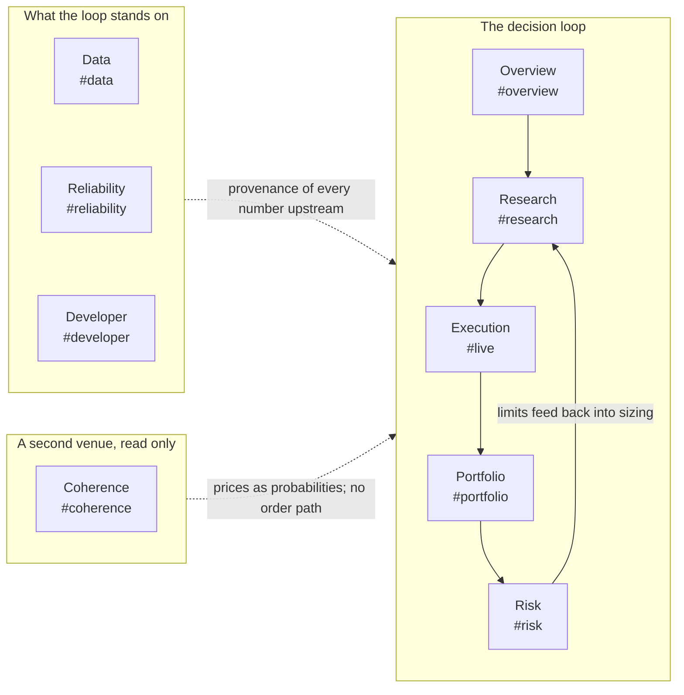
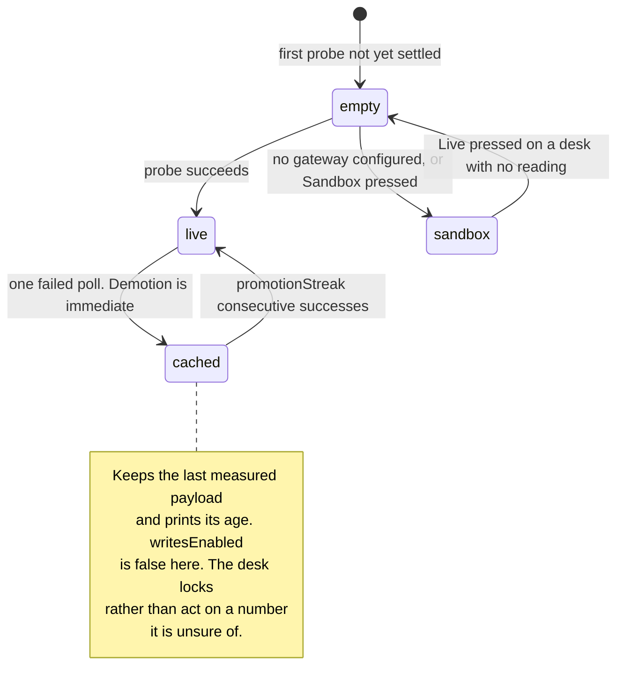

# AlphaEngine — the product guide

*As of 2026-08-24. This is the what-and-why of the desk workspace: what each tab
is for, what a number on screen is allowed to be, and what a click is allowed to
change. For the guided demo script — the presets to fire, the moments worth
showing, the live URLs — use [`docs/product/FEATURE_TOUR.md`](FEATURE_TOUR.md); this
guide deliberately does not repeat it. For the architecture behind the product,
[`Part2_Infrastructure/README.md`](../../Part2_Infrastructure/README.md) is
authoritative.*

## What AlphaEngine is for

AlphaEngine is a paper-trading quant desk: one workspace in which a strategy is
researched, priced, sent through a pre-trade risk gate, accounted for and
audited — with every role that touches that loop given a surface that answers
its own question. It is a Next.js workspace over a FastAPI risk gateway and a
stateless research service, sharing one append-only audit log; the maths exists
in Python (the reference), TypeScript (the browser) and C++ (the compiled
decision core), pinned against each other by parity fixtures rather than by
promise (README [§12](../../Part2_Infrastructure/README.md)).

The product's thesis is honesty about provenance. Every number on screen is
either measured, cached with its age, or generated and labelled — and only a
measured-now number can back a write. The rest of this guide is that thesis
applied surface by surface, which is why every tab below is described three
ways: **the question it answers**, **the writes it gates**, and **what it
refuses to claim**. The third is the differentiator. Any dashboard can draw a
number; this one is built so that the numbers it will not draw are visible as
absences with reasons attached, rather than as plausible defaults.

## One workspace, ten tabs

The tabs are the decision loop made navigable, in the order a desk makes
decisions: research flows to execution only through a risk gate, the next three
tabs interrogate the ground the first five stand on, and the last two are one
self-contained research engine over a different venue — Markets is what that
venue quotes, Coherence is what the engine proves about it. `Alt+1` through
`Alt+9`, then `Alt+0` for the tenth, switch tabs — the listener is in
[`web/lib/use-tab-shortcuts.ts`](../../Part2_Infrastructure/web/lib/use-tab-shortcuts.ts)
and keys off `event.code`, because on macOS `Option+digit` types `¡™£` and a
key-range test never matches. `⌘K` opens a command palette that fuzzy-matches
every tab, every rail section, all 46 strategy models and every research symbol;
`?` opens the shortcuts-and-tour overlay. Those three are the only global
keystrokes the shell owns.

Four URL ids deliberately disagree with their labels, because deep links came
first and ids never change: view `live` renders **Execution**, section `codex`
renders **Strategies**, section `activity` renders **Blotter**, and Risk's
section `model` renders **Risk engine**
(`web/lib/sections.ts`). One whole tab id is legacy the same way: the console
used to have a **Systems** tab, and `#systems` still resolves — to Reliability,
the half that answers "is it up", which is the question someone following a
saved systems link is most likely asking (`web/lib/workspace-hash.ts`).

The rails below name each tab's sections. They are transcribed from
`web/lib/sections.ts` — the single definition the rails, the palette, the hash
whitelist and "Copy link to this view" all read, **59 sections across the nine
tabs** — so if this file and the app ever disagree, `sections.ts` is right. A
test holds the feature tour to the same file
(`web/tests/tour-truth.test.ts`); this guide has no such guard, which is why it
names the source rather than asking to be believed.

### The seven desk roles, and which tab answers each

The workspace is organised by role rather than by feature, and the mapping is
data: `NAV_ITEMS` carries a `role` on every tab
(`web/components/WorkspaceHeader.tsx`), and Overview's **Desk roles** section
renders seven launcher cards from `web/components/overview/RoleCards.tsx`, each
of which opens exactly one tab and does nothing else. A test derives the card
labels from `NAV_ITEMS` rather than pinning seven strings, so renaming a tab
fails the suite instead of leaving a card pointing at a name the desk no longer
uses (`web/tests/desk-interconnect-role-launcher.test.ts`).

| Role | Code | Tab | The question that role brings |
|---|---|---|---|
| Quant Researcher | QR | Research | Is this strategy evidence, or noise that survived a search? |
| Quant Trader | EX | Execution | What would it cost to trade this, and what stops a bad order? |
| Portfolio Manager | PM | Portfolio | What does the book hold, and which sleeve earned the P&L? |
| Risk Manager | RM | Risk | How much can we lose, and who can stop the desk? |
| Data Engineer | DE | Data | Can the numbers upstream of every other tab be trusted? |
| DevOps / SRE | SRE | Reliability | Is the platform up, and what degraded first? |
| Quant Developer | API | Developer | How is this built, and does the running system match the repo? |

Two tabs have no card, for two different reasons. **Overview** is marked *All
Roles* and is the launcher itself. **Coherence** carries the Quant role in the
header but is not a stop on the desk's own decision loop — it reads a second
venue and cannot reach the book — so putting it in the loop's launcher would
imply a handoff that does not exist.

### 1 · Overview — `#overview`

**The question:** what is the state of the whole desk, right now, in one screen?

**Rail:** Decision loop → Desk roles → Audit trail. The KPI deck reads the same
book snapshots every other tab uses; the pipeline diagram is the loop above with
each stage a link; the audit trail is every paper order, accounted.

**Writes it gates:** none of its own. The header — identical on all ten tabs —
carries the two controls that follow you everywhere: the kill switch
(operator-gated, reversible) and the Telegram **Connect** chip.

**Refuses to claim:** a percentile it has not got the samples for. The header's
decision chip reads "collecting" rather than quoting a p99 until twenty
decisions exist (`LATENCY_MIN_SAMPLES` in `web/lib/overview-latency.ts`),
because a p99 of one sample is a maximum wearing a decimal point.

### 2 · Research — `#research`

**The question:** is this strategy evidence, or noise that survived a search?

**Rail:** Summary → Parameters → Walk-forward → Attribution → Lineage →
Decision → Runs → Fitted models → Strategies. A sweep auto-runs on load
(BTCUSDT daily — the zero-config tier); Summary opens with the reproducibility
capsule and the PASS/MARGINAL/FAIL verdict; Decision holds the six-veto
promotion gate, deflated Sharpe among them (`web/lib/quant/promotion.ts`), with
a Promote button that stays dead until every veto clears. Strategies is the
catalogue: 46 models in seven families, each card carrying the first sentence of
*when it fails*, browsable before any run exists.

**Writes it gates:** research jobs, never desk state. `⌘Enter` submits a sweep
(`POST /api/backtest`) and Fitted models fits supervised runs
(`POST /api/research/ml/fit`) — compute on the gateway's jobs engine, not a
change to the book. The experiment trail is recorded in this browser only,
capped at 60 (`MAX_RECORDS` in `web/lib/experiments.ts`), and auto-runs are
deliberately not recorded: the trail is an honest count of hypotheses, not
keystrokes.

**Refuses to claim:** an in-sample result as a result. A supervised run's metrics
are computed on the concatenated out-of-sample predictions, test windows only,
in time order — `modules/ml/runner.py` states that there is **no in-sample
number in the result object at all**, because one that travels beside the
out-of-sample figure will eventually be read as if it were one. The walk-forward
splitter is purged and embargoed (`modules/ml/splits.py`), and it reports
`embargoed_bars == 0` on every fold: with contiguous expanding test windows no
training row ever follows a test window, so that zero is a measured property of
the scheme rather than a parameter nobody wired up.

### 3 · Execution — `#live`

**The question:** what would it cost to trade this, and what stops a bad order?

**Rail:** Trade → Liquidity → Routing & TCA → Fill quality → Blotter. The order
ticket's three presets demonstrate the gate battery; Liquidity is the
consolidated Binance+Bybit L2 book; Fill quality closes the loop — realised cost
against the cost the model predicted, the only honest test of a TCA number.

**Writes it gates:** the desk's one first-class write. `POST /api/orders`
submits a paper order through the pre-trade battery —
[17 gates defined, 15 reachable by any crypto order](FEATURE_TOUR.md)
(`GATE_ORDER` in `modules/risk_proxy/gates.py`; the two others,
`paper_execution_model` and `reference_freshness`, are added only when
`req.paper_execution is not None`, which is the paper-equity path) — plus cancel
and replace on the resting book. A rejection comes back with the failing gate
named, decided in tens of microseconds
([`docs/architecture/LATENCY_BUDGET.md`](../architecture/LATENCY_BUDGET.md)).

**Refuses to claim:** a fill it cannot observe. There are no partial fills and no
queue position, because the venue feeds carry ladders rather than trade prints,
and a partial-fill model would report an assumption as measured execution.

### 4 · Portfolio — `#portfolio`

**The question:** what does the book hold, and which sleeve earned the P&L?

**Rail:** Overview → Equity & P&L → Positions → Allocation → Performance. The
session curve is drawn against the start-of-day mark and the drawdown-breaker
level; the waterfall says which sleeve earned it; the book snapshot is the same
one Risk reads, and the intro card says so. Positions link back to Research and
Execution with the symbol kept in context.

**Writes it gates:** none. Portfolio is deliberately read-only — it is the
accounting of what Execution did, and an accounting surface that could also
mutate the book would be marking its own homework.

**Refuses to claim:** a covariance it has not measured. The risk-model card reads
"Measured · N aligned bars" when the estimate comes from real venue bars and
"Pending" when it does not; the floor is 20 aligned observations
(`web/components/portfolio/RiskEngine.tsx`), and below it the panel says so
instead of substituting an assumption.

### 5 · Risk — `#risk`

**The question:** how much can we lose, and who can stop the desk?

**Rail:** Limits → Risk engine → Risk diagram → Risk drivers → Monte Carlo →
Oracle VaR → Stress tests → Controls. The VaR carries its own Kupiec backtest
score, and Risk diagram draws that forecast against what the book actually lost;
Oracle VaR asks the same question a second way, inside Oracle 23ai, because
loss estimates that disagree are signal about method, not error; stress tests
are forward shocks applied by hand.

**Writes it gates:** the desk's authority controls, all operator-gated and all
reversible: the kill switch (`POST /api/risk/kill`, `/api/risk/resume`),
reduce-only mode (`POST /api/risk/reduce-only`) and the paper-book reset
(`POST /api/risk/reset`).

**Refuses to claim:** a validated model on a short history. The rolling band
needs 80 daily bars from the shortest history it aligns, and under that the
diagram names the floor rather than drawing a line or leaving the subtab blank
(`web/components/portfolio/RiskEngine.tsx`). The Oracle path refuses in the same
shape: a typed result, never a throw, with `oracle_not_configured`, unreachable
and found-nothing as three distinct codes, and no credential, hostname or raw
`ORA-` text in any of them (`web/lib/oracle/client.ts`).

### 6 · Data — `#data`

**The question:** can the numbers upstream of every other tab be trusted?

**Rail:** Trust Summary → Feeds & Contracts → Quality → Incidents → Lineage &
Payloads → Providers & Capacity → Work Queue. Freshness, contract validation,
reconciliation, quarantine, per-request provenance down to the vendor's raw
JSON, and provider failover with quota reserve.

**Writes it gates:** the data-operations surface. Replay re-runs one capability
through the validated path and backfill merges contract-checked bars into the
gateway's bar cache (`POST /api/data/replay`, `/api/data/backfill`); quality
escalations are acknowledged
(`POST /api/data-quality/escalations/{id}/ack`); and the Work Queue is
persisted on the gateway — versioned rows, audit-logged edits, a PATCH that
must quote the row version it read — with a pill that says so, or says "edits
held locally" when the gateway cannot be reached. The backend behind it is
documented in [`docs/architecture/DATA_OPS_BACKEND.md`](../architecture/DATA_OPS_BACKEND.md).

**Refuses to claim:** that an edit landed when it did not. This is the one desk
store deliberately kept out of the append-only audit log: quality findings,
escalations, work items and schedule runs live in SQLite
(`modules/data_ops_store.py`) precisely because they need a write that
*raises* and an UPDATE that reports whether it hit a row — where the audit
log's writers are fire-and-forget by design, so that a lost TCA snapshot can
never take the order path down.

### 7 · Reliability — `#reliability`

**The question:** is the platform up, and what degraded first?

**Rail:** Attention & SLIs → Dependencies → Services & Circuits → Logs &
Traces → Remediation. Triage first, telemetry second; the dependency topology
drawn so that a dead gateway reads as *one transport down*, with everything
behind it honestly `unknown` — never `down`, because you cannot read a
component's health through a dead transport. This tab is also where the three
latency planes are kept apart: the decision in microseconds, the compiled core
in nanoseconds, the network in milliseconds
([`docs/architecture/LATENCY_BUDGET.md`](../architecture/LATENCY_BUDGET.md)).

**Writes it gates:** remediation, bounded and reversible by construction. The
eight operator actions (`web/lib/operator-actions.ts`) — `purge_cache`,
`reset_breaker`, `simulate_outage`, `clear_outage`, `reset_quota`,
`probe_provider`, `reload_providers`, `clear_telemetry` — go through
`POST /api/system/actions`; simulated outages carry a clamped TTL and expire on
their own even if nobody clears them.

The Remediation section is split into five panes along the blast-radius seam,
and the seam is the product decision worth stating: **Mutations** holds the
five server writes together with everything a reader needs *before* pressing
one — the guard, the token field, the last result, each write's price stated
inline — while **Scope** holds the reference material that answers "what would
a write reach in this instance right now", and **Session** holds the controls
that touch only this browser tab and no server at all. Recovery and History are
the tripped-circuit views. Putting the guard beside the buttons rather than in
the reference pane is deliberate: a control's authorisation belongs where the
control is, not one click away.

Under the buttons, what each write touches is a **matrix rather than a
paragraph** — five mutations against seven stores, thirty-five cells, each with
the reason it says what it says (`SERVER_MUTATIONS` and `MUTATION_STORES` in
`web/components/systems/mutation-scope.ts`). The question an operator asks
mid-incident is not "what does Purge do" but "which of the things I care about
will still be there afterwards", and prose answers that only if you read all of
it and hold the negative space in your head. Every cell was read out of the
write path in `lib/operator.ts` rather than transcribed from the prose it
replaced, and two came out different once the code was open — a matrix drawn
from a paragraph is a picture of the paragraph, not of the system. The four
effects are marked and worded, never coloured only: `● cleared`, `→ re-read`,
`○ left intact`, `◌ out of reach`.

**Refuses to claim:** availability, and reach it does not have. This tab
publishes no uptime percentage anywhere — what it shows is one snapshot of a
live poll, and it says so. And that fourth effect mark is the honesty rule
applied to a diagram: the **vendor's meter** is drawn dashed beside the six
stores this instance holds, because "reset a quota ledger" is the one control
name that most invites the belief that it reaches the provider's own counter,
and it does not. An absence a reader has to notice is not an absence a reader
will notice.

### 8 · Developer — `#developer`

**The question:** how is this built, and does the running system match the repo?

**Rail:** Topology → Readiness → CI / CD → API & Schema → Code & Diffs → Task
Queue. Readiness is deliberately separate from CI / CD: a green pipeline says
the code compiles and the tests pass, which is not the same claim as "this is
safe to ship". API & Schema compares a committed digest of the gateway's
OpenAPI against the live one; the test counts the desk quotes are read from
`web/lib/test-counts.generated.ts`, never from prose — re-run the suites rather
than trust any sentence, this one included, and note that only the **web** line
of that module is gated by CI (`scripts/check-test-counts.mjs`, which accepts
`suite === "web"` and nothing else), while the gateway and service lines are a
dated record no checker verifies
([`TESTING.md`](../testing/TESTING.md) carries the full argument, and is the one
document in `docs/` allowed to discuss counts at all).

API & Schema's Numerics pane is where the guide's own provenance thesis is
shown rather than asserted. Its Monte Carlo parity check reports a SHA-256, and
the panel draws the **five-link chain that produces it** — bootstrap,
canonicaliser, hash, comparison, committed reference — instead of stating the
verdict alone. Two properties are worth naming because they are the doctrine
applied to a diagram. The chain reads **"not run" on every computing link until
you press the button**, because a tick at rest is a claim about a measurement
nobody took; and the one thing knowable without pressing anything — whether the
committed reference module is self-consistent — is re-hashed on load rather
than assumed.

**Refuses to claim:** parity it has not drawn, and persistence it does not have.
The gateway's OpenAPI digest is the same shape of claim and is **not** drawn
this way: in the Contracts pane it remains a verdict pill with no digest on
screen, and this guide says so rather than letting the neighbouring pane's
diagram imply otherwise. The Task Queue is labelled sample data and keeps its
edits in the current browser session (`web/lib/developer-work.ts`) — unlike the
Data tab's Work Queue, nothing here is persisted, and the label says so.

### 9 · Coherence — `#coherence`

**The question:** do a venue's quoted prices admit any probability at all — and
where they do not, what is the portfolio that profits whichever way the world
goes?

A prediction-market contract pays $1 if an event happens, so its price *is* a
probability, and Kalshi publishes the logical structure between contracts in its
own metadata. That makes a whole family of markets one dollar sold in pieces,
and it makes coherence a testable property rather than a pattern to scan for.
The page header states the tab in one line — kicker **Coherence**, title
**"Prices as probabilities, tested for coherence"** — and its fourth metric
tile is the tab's whole safety statement: **Order path — none**, noted "this
engine reads, records and certifies; it sends nothing"
(`web/components/CoherenceConsole.tsx`).

**Rail: eleven sections, each with an in-pane view switcher.** Every section
splits its content across `.seg` buttons rather than scrolling, and that is a
hard structural rule rather than a style preference: a nested
`<WorkspaceSubtabs>` would put a second rail instance in front of the `--rail-h`
publisher that the first one writes to `document.documentElement`
(`web/components/WorkspaceSubtabs.tsx`), so the two would fight over the same
custom property. The section ids are public deep links and never change; the
view names below are component state and are not addressable.

| Section | Views | What it answers |
|---|---|---|
| **Universe** | Baskets · Settlement · Formation | What does a whole mutually exclusive family cost against the dollar it is certain to pay? Both directions are priced, because buying every outcome needs every ask and selling needs every bid, and in the tails a market routinely has one and not the other. Settlement is the quantity the contract actually resolves against — not the price anybody watches — and Formation is the machinery that produces it. |
| **Books** | Ladder · Identity · Dispersion | What does the market look like as Kalshi really publishes it? Two bid ladders and no asks: the offer you would trade against is a reading of the opposite ladder. Identity draws `yes_ask + no_ask = 1 + spread`, which is why the "buy both sides for under a dollar" branch is unreachable rather than rare. Dispersion is the request-for-quote channel — the only place several professionals price the same joint probability independently. |
| **Lattice** | Distribution · Stake · Whole family | What probability measure do these prices imply, and what would it be right to bet? Distribution is the survival function the strikes sample and the mass differencing leaves between them; Stake is the log-optimal plan with its worst outcome printed beside its growth rate; Whole family is every outcome the solver ranked, including the ones it passed over. |
| **Dutch book** | Verdict · Portfolio · Proof | Do these prices admit a probability measure? The verdict a reader sees almost every time is "coherent", and that is the claim rather than a disappointment — a detector that only spoke when it found something would leave "no opportunity" and "the feed is down" looking identical. When it does find one, the certificate is a fixed-width block a reader can check by hand. |
| **Fees** | Worked example · Cost shape · Ablation | What does a real position actually pay, and does the cost model change the answer? The defaults reproduce Kalshi's own documented case, where the fee component nobody models is nineteen times the one everybody does. Ablation replays the recorded tape under four cost configurations, including the `no_fees` test every bot in this space ships with. |
| **Coherence index** | Series · Families | How far from coherent are these quotes over time? The Dutch-book test is binary and almost always says no; this is the continuous version, measured on every poll. Unmeasurable readings are drawn as gaps, never dropped or zeroed. |
| **Combos** | Bands · Parlays · Bounds test · Notes | What do a parlay's own legs pin down about it? Two probabilities never determine the probability of both, so the legs give a Fréchet band and never a price, and the band's width is how far the parlay can move with no leg moving at all. |
| **Calibration** | Score · Bands · Corpus | Were the prices right, once settled? The Brier score is split under Murphy's decomposition into reliability, resolution, uncertainty and the residual the binning leaves (`modules/coherence/kernel/calibration.py`). |
| **Diffusion** | Absorption · Mechanism · Findings · Kalshi episodes | How fast is information absorbed? Two arms of one question: how long a coherence violation survives on Kalshi, and how long a timestamped announcement takes to finish reaching the price. |
| **Shell** | Tree · Reading · Layout | Where does a market live, and what has actually been derived about it? The universe is walked as a filesystem, because the shard a market sits on is a directory and crossing that boundary is a real cost. |
| **Lessons** | Prices · Structure · Bounds · Record | What is the curriculum, and what guards each claim? Fourteen lessons rendered from `web/lib/coherence/lessons.ts`, each naming the code it is about and the tests that pin it, matched one-to-one by the fourteen notebooks in `Part2_Infrastructure/notebooks/coherence_lab/`. |

**Writes it gates:** none, and this is structural rather than a setting. All 15
`/api/coherence/*` routes are `GET`, and `tests/test_coherence_security_auth.py`
sweeps every one of them against the app's own schema so that a route added
without an entry fails the suite. The workspace proxies eighteen coherence and
diffusion routes and every one of them exports `GET` only
(`web/app/api/gateway/coherence/*`, `web/app/api/gateway/diffusion/*`).
`modules/coherence/tunables.py` puts it plainly beside the `DRY_RUN` flag:
turning that flag off is not sufficient to trade, because there is no send path
in this version.

**Refuses to claim:** four things, each named where it would otherwise be
believed.

- **A calibration score is not foresight.** The section turns on one field —
  `engine` — that says *when* the price was read. Scored from last traded
  prices the live sample returns a Brier of 0.00010533 and a skill of
  0.99935238, which reads as a spectacular forecaster and is nothing of the
  sort: a last trade happens when the answer is already in plain sight. The
  caveat is a banner above the switcher rather than a footnote, it is repeated
  beside every figure it invalidates, and `median_horizon_s` — zero, meaning
  the price was read *at* settlement — is printed as the tell.
- **"Inside the band" is not "fairly priced".** Every price between the Fréchet
  bounds is consistent with *some* dependence between the legs, and nothing on
  this exchange quotes dependence. So the band width leads, the position inside
  it is called a position, and "mispriced" appears only where a price is outside
  its band and a portfolio proves it.
- **An ablation is not a P&L.** Replaying an arbitrage engine over its own
  recorded quotes cannot say what it would have earned, because it could not
  have traded against every quote it recorded. It can say what each cost model
  would have *seen*, and that is the question being asked.
- **The information-diffusion study's headline is a null, and it is stated as
  one.** See below.

**The Diffusion verdict, stated exactly.** The study asks whether the resolution
at which a rate statement's headline explains its body predicts how fast the
price finishes absorbing it. It is now scored **out of sample** by
`modules/coherence/diffusion/skill.py`, tested by
`tests/test_diffusion_skill.py`. The absorption clock **is** predictable —
out-of-sample **R² +0.144** from stage and rate move alone, with the press
conference about **7.0 minutes slower** than the statement — but adding the text
changes that by **−0.343** (shuffled **p 0.875**). Over a declared **3×3 grid**
of specifications the gain was negative in **all nine cells**, including the one
with the largest in-sample |t| of **2.85**. So the headline is a null, and a
stronger one than the criterion it replaced: the clock has real structure and
the statement's information spectrum is not part of it.

Four things changed to make that verdict about the market rather than about the
estimator, and each is argued in the module as not a choice of answer: the
target is a **residence time** — the area above the absorption curve, which for
an exponential approach *is* the time constant — so it needs no signal gate and
is defined for **62 of 62** meetings per stage where the old half-life existed
for 26; the two-sigma hard cut became a **precision weight**; the two stages are
**pooled with a call indicator** and the policy move enters as a **control, not
a rival**; and scoring is **leave-one-meeting-out**, because folding by row
leaks when both stages share a statement. The desk reads the result off five
`skill_*` fields on the study row (`modules/schemas_diffusion.py`) and renders
the last two as `InstrumentTable` rows in a deliberate order — *"The clock is
predictable at all"* above *"The text predicts it"*, because if the first fails
the second means nothing. The figures above are from the run recorded on
2026-08-24; re-running the study replaces them, which is the point of storing
them as fields rather than as prose.

**Read with no keys.** Every price on this tab comes from Kalshi's public
endpoints. The recorder that builds the tape is off unless **both**
`COHERENCE_SERIES` and `COHERENCE_POLL_S` are set on the gateway
(`modules/coherence/tunables.py`), and when it is off the sections say what they
would show and what has to exist first, rather than rendering an empty chart
frame — an axis with nothing on it and an axis whose data failed to load look
identical, and one of those is a fault.

## Live and sandbox — what a number on screen is

The desk distinguishes three tiers of data, defined in
`web/lib/data-tier.ts` and driven by one state machine in
`web/lib/desk-source.ts`:

| Tier | What it is | Badge |
|---|---|---|
| `live` | a payload the backend returned just now | `●` Live data — gateway answering |
| `cached` | a payload the backend returned earlier, carried with its age | `●` Live data — last good *N*s ago |
| `sandbox` | a payload this browser generated: seeded, self-consistent, labelled | `◇` Sandbox — simulated (or `△` during a gateway incident) |

Two rules carry the whole model, and both are the conservative direction:

- **Measured data is never replaced by generated data.** Once a probe has
  succeeded even once, failure demotes `live` to `cached` and stops there — real
  numbers from forty seconds ago beat invented ones, as long as the screen says
  how old they are. The sandbox is reachable only from a desk that has never had
  a reading, or by someone pressing Sandbox on purpose.
- **Demotion is immediate; promotion is not.** One failed poll drops the tier;
  returning to `live` waits for a streak of consecutive successes. A gateway you
  can only reach half the time settles at `cached`, which is also the honest
  description of it — without the streak, the badge and the writes lock would
  flap on the poll cadence.

The safety property is not the label — labels are advisory. It is that
**`writesEnabled(tier)` is true only on `live`**: in any other tier the order
ticket, the kill switch and the operator actions report themselves disabled,
because a button that submits an order against a book this browser invented is a
different class of wrong from a stale number. The tier badge in the header is
where that floor is stated once, for everything below it, rather than as
twenty-six per-panel claims a reader would have to collate. There is
deliberately no `"unavailable"` tier: it existed, every component that could
construct one grew a dead-end branch that rendered a sentence instead of a
panel, and removing it from the union made those branches a compile error
rather than a thing to remember.

On top of the tier sits the operator guard (`web/lib/operator-guard.ts`,
re-exported through `web/lib/operator.ts`), with four modes: `locked`
(production default — every mutating surface explains itself but stays dead),
`token` (paste `ALPHAENGINE_OPERATOR_TOKEN` once in the header), `open-demo`
(everything works for anyone, survivable only because every operator action is
paper, capped, reversible or self-expiring) and `open-dev` (the same openness,
outside production only). The
[feature tour](FEATURE_TOUR.md) walks the capability tiers — zero-config,
keyed, gateway-backed, operator-gated — in full.

## Progressive disclosure — folds that name what is inside

The desk reads long at rest, and its answer is the `
` fold — with one
rule and one floor, both enforced by test
(`web/tests/disclosure-execution.test.ts`, the pattern itself in
`web/app/globals/13-warm-bright-pass.css`):

- **The rule:** a fold's summary *states what is inside* rather than saying
  "details", so a reader can decide without opening it. What goes in one:
  derivations, methodology, static documentation of what the system does.
- **The floor:** some sentences may never be folded, whatever it costs in
  height — an empty state (a "nothing to show" behind a fold is a panel that
  looks broken), a null explanation that is a panel's only content, a safety
  statement (orders are paper, the desk is a sandbox), the reason a visible
  control is dimmed, and any figure a reader acts on. The test for which side a
  sentence falls on: does hiding it change what someone believes about the
  desk? A formula does not; a limit does.

There are eight `disclosure-<tab>.test.ts` files and eight
`summarised-<tab>.test.ts` files, covering **eight of the ten tabs**: data,
developer, execution, overview, portfolio, reliability, research and risk.
Markets and Coherence have neither, which is a real gap in the copy guards
rather than an exemption — their equivalent floors are argued in the component
headers and held by the panes' own suites.

## Honesty as behaviour you can see

The repo's oldest doctrine — null is never coerced to zero, because zero is a
measurement and absence is not — is not a style rule; it is what the screen
does, and tests hold each behaviour in place:

- **A dash with a reason, never a fake zero.** A beta the stress test could not
  compute renders `β —`, not `0.00` — a zero there invents an exposure. An
  unmeasured latency says "currently not measured", not `0 ms` — the fastest
  possible response is a claim, not a default (`web/tests/null-honesty.test.ts`).
- **Empty states say so.** A panel with nothing to show reports that, rather
  than rendering as though it were still loading — and per the disclosure
  floor, that sentence is never folded away.
- **Small samples refuse to headline.** The header's decision chip reads
  "collecting" rather than quoting a p99 until twenty decisions exist
  (`LATENCY_MIN_SAMPLES` in `web/lib/overview-latency.ts`).
- **`unknown` is not `down`.** When the gateway stops answering, every
  component behind it reads `unknown` on the Reliability topology — reporting
  what cannot be seen as failed would be the same defect as reporting an absent
  measurement as zero, pointed the other way.
- **Absent capability is reported, not simulated — and every absence has the
  same shape.** A named reason plus a typed state, never an exception and never
  a silent success. With no `GEMINI_API_KEY`, research answers report
  `verdict: refused` with the reason rather than generating ungrounded prose;
  with no `RERANK_MODEL_PATH`, the cross-encoder reports `reranked: False` with
  a named state and the fused RRF order stands, truncated to `top_k`; with no
  `RESEARCH_IMAGE_MODEL_PATH` the CLIP image arm reports `ranked: False` and the
  ordering is byte-for-byte the ordering without it, because that arm can only
  *add* a document; when a chart's pixels cannot be reached, the answer is
  written from text alone and the report names which of the four reasons
  applied, so no answer ever quietly claims to have seen a chart it was not
  sent; with no Neo4j credentials, the graph read model is simply not projected,
  and the two graph report routes compute the partition and the ranking in
  process instead, marking `source: "corpus"` rather than `"neo4j"` — Postgres
  remains authoritative either way, and no request path depends on the graph
  being up (`modules/research_generate.py`, `modules/research_rerank.py`,
  `modules/research_image.py`, `modules/research_graph_projection.py`,
  `modules/research_graph_read_model.py`).
- **A refusal that means "the desk is over its budget" is not a refusal that
  means "the evidence is too weak".** The research answer route carries both,
  and they never share a shape: a rate or spend refusal is an HTTP 429 with a
  named state and a `Retry-After`, where every verdict the pipeline itself
  reaches — `refused`, `corpus_silent`, `unavailable` — arrives with a 200 and
  means the request *was* served (`modules/research_quota.py`). An auto-stopped
  Oracle Always-Free database makes the VaR panel say "unavailable", and the
  [tour](FEATURE_TOUR.md) documents that sharp edge rather than hiding it.
- **No invented availability.** The Reliability tab publishes no uptime
  percentage anywhere — what it shows is one snapshot of a live poll, and it
  says so.

## The Telegram companion, in brief

Not a tenth tab: a phone-sized read of the same desk, and one deliberately
narrow write path. The companion registers **136 commands** from one registry
(`modules/telegram/registry.py`; README [§6](../../Part2_Infrastructure/README.md)
is generated from it and `tests/test_telegram_docs.py` runs the generator's own
`--check` inside the suite, so the tables cannot drift), 99 of them pushed to
Telegram's `/` menu — the API caps that list at 100 — with inline keyboards,
in-place card refreshes, sixteen matplotlib chart generators in
`modules/telegram_charts/`, and **nine tab commands**, `/overview` through
`/coherence`, one per tab above. The header's **Connect** chip binds a chat to
the web desk identity you already hold — and a binding grants *read parity with
a desk pass, nothing more*. The six Controls-category commands — `/halt`,
`/resume`, `/flatten`, `/reduceonly`, `/resetbook`, `/replay` — answer to a
second, narrower allow-list that is empty by default, plus a single-use
confirmation code; there is intentionally no `/order` command, so the bot can
stop the desk but never open a position. Setup and the fail-closed defaults:
[`SETUP.md`](../../SETUP.md).

## Not built, and said plainly

The product stops where honesty about paper trading requires it to. There is
**no real-money execution** — every order is paper, decided and audited as if
real. **No role separation**: signing in stores preferences and unlocks no
capability; the only authority distinctions are the gateway token, the operator
guard and the Telegram allow-lists. **No partial fills or queue position** — the
L2 feeds carry ladders, not trade prints, so a partial-fill model would report
an assumption as measured execution. **No margin, financing or liquidation
modelling** on an unlevered cash book, and **no shared experiment registry** —
research history is per browser, the gateway's `backtest_runs` table the
durable record. On Markets and Coherence, **no order path of any kind**, and no
executor: the diffusion arm exists precisely to answer whether one would be
worth building, and its verdict so far is a null. Each gap, with where it bites
and why it is not here, is argued in README
[§What is deliberately missing](../../Part2_Infrastructure/README.md).

Two capabilities are **planned rather than built**, and are named here so that
neither reads as shipped. The gateway's OpenAPI digest has the same five-link
custody shape as the Monte Carlo parity chain but is **not drawn** — it is a
verdict pill in the Contracts pane, and drawing it needs a second chain array
and a caller, not new machinery. And neither Markets nor Coherence has **a
copy-guard test pair** of the kind every other tab carries, so a fluent rewrite
of their prose would not be caught the way the same rewrite would be on Risk.

## Where to go next

- [`docs/product/FEATURE_TOUR.md`](FEATURE_TOUR.md) — the demo script: presets,
  moments worth showing, live URLs, the thirteen E2E probes.
- [`Part2_Infrastructure/README.md`](../../Part2_Infrastructure/README.md) —
  architecture, the three deployment units, the gate table, the parity
  argument.
- [`docs/architecture/LATENCY_BUDGET.md`](../architecture/LATENCY_BUDGET.md) — the three latency planes
  and the measured tables.
- [`docs/architecture/DATA_OPS_BACKEND.md`](../architecture/DATA_OPS_BACKEND.md) — what persists the Data
  tab's queue and ledger.
- [`docs/testing/TESTING.md`](../testing/TESTING.md) — the one document in
  `docs/` that discusses test counts, with the conditions attached to each.
- [`docs/engineering/TLS_FLIP.md`](../engineering/TLS_FLIP.md) — how the gateway origin is secured.
- [`docs/whitepaper/`](../whitepaper/) — the institutional whitepaper (Typst
  source, compiled to PDF). It replaces the legacy
  `AlphaEngine_Project_Explainer.pdf`; cite it wherever that was cited.
- [`SETUP.md`](../../SETUP.md) — running it, keys, Telegram bootstrap.
