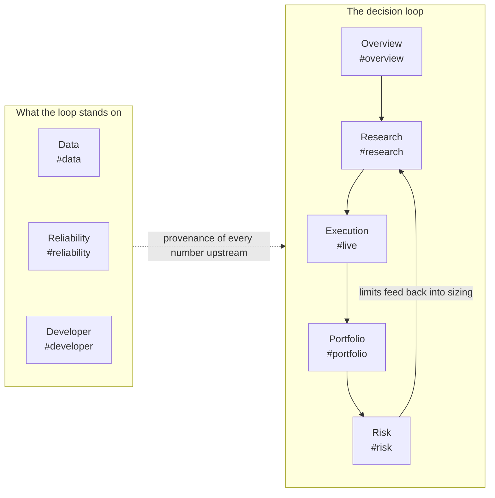
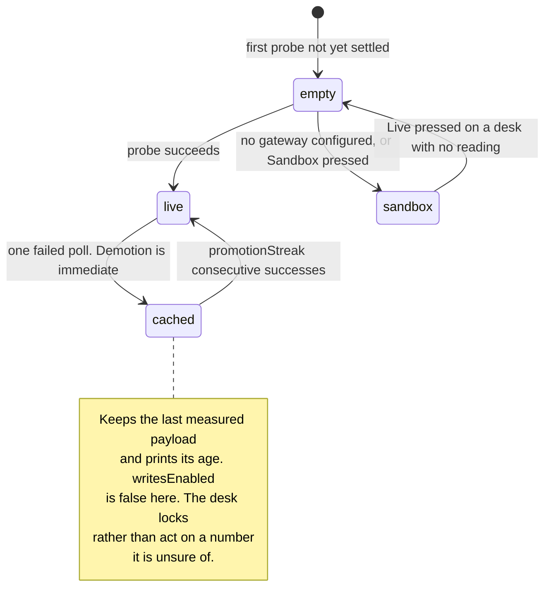

# AlphaEngine — the product guide

*As of 2026-08-22. This is the what-and-why of the desk workspace: what each tab
is for, what a number on screen is allowed to be, and what a click is allowed to
change. For the guided demo script — the presets to fire, the moments worth
showing, the live URLs — use [`docs/product/FEATURE_TOUR.md`](FEATURE_TOUR.md); this
guide deliberately does not repeat it. For the architecture behind the product,
[`Part2_Infrastructure/README.md`](../../Part2_Infrastructure/README.md) is
authoritative.*

## What AlphaEngine is for

AlphaEngine is a paper-trading quant desk: one workspace in which a strategy is
researched, priced, sent through a pre-trade risk gate, accounted for and
audited — with every role that touches that loop given a surface that answers
its own question. It is a Next.js workspace over a FastAPI risk gateway and a
stateless research service, sharing one append-only audit log; the maths exists
in Python (the reference), TypeScript (the browser) and C++ (the compiled
decision core), pinned against each other by parity fixtures rather than by
promise (README [§12](../../Part2_Infrastructure/README.md)).

The product's thesis is honesty about provenance. Every number on screen is
either measured, cached with its age, or generated and labelled — and only a
measured-now number can back a write. The rest of this guide is that thesis
applied surface by surface.

## One workspace, eight tabs

The tabs are the decision loop made navigable, in the order a desk makes
decisions: research flows to execution only through a risk gate, and the last
three tabs interrogate the ground the first five stand on. `Alt+1` through
`Alt+8` switch tabs; `⌘K` opens a command palette that fuzzy-matches every tab,
every rail section, all 46 strategy models and every research symbol.

Three URL ids deliberately disagree with their labels, because deep links came
first and ids never change: view `live` renders **Execution**, section `codex`
renders **Strategies**, section `activity` renders **Blotter**
(`web/lib/sections.ts`). One whole tab id is legacy the same way: the console
used to have a **Systems** tab, and `#systems` still resolves — to Reliability,
the half that answers "is it up", which is the question someone following a
saved systems link is most likely asking (`web/lib/workspace-hash.ts`).

The rails below name each tab's sections. They are transcribed from
`web/lib/sections.ts` — the single definition the rails, the palette, the hash
whitelist and "Copy link to this view" all read, 47 sections across the eight
tabs — so if this file and the app ever disagree, `sections.ts` is right.

### 1 · Overview — `#overview`

**The question:** what is the state of the whole desk, right now, in one screen?

**Rail:** Decision loop → Desk roles → Audit trail. The KPI deck reads the same
book snapshots every other tab uses; the pipeline diagram is the loop above with
each stage a link; the audit trail is every paper order, accounted.

**Writes it gates:** none of its own. The header — identical on all eight tabs —
carries the two controls that follow you everywhere: the kill switch
(operator-gated, reversible) and the Telegram **Connect** chip.

### 2 · Research — `#research`

**The question:** is this strategy evidence, or noise that survived a search?

**Rail:** Summary → Parameters → Walk-forward → Attribution → Lineage →
Decision → Runs → Fitted models → Strategies. A sweep auto-runs on load
(BTCUSDT daily — the zero-config tier); Summary opens with the reproducibility
capsule and the PASS/MARGINAL/FAIL verdict; Decision holds the six-veto
promotion gate, DSR among them, with a Promote button that stays dead until
every veto clears. Strategies is the catalogue: 46 models in seven families,
each card carrying the first sentence of *when it fails*, browsable before any
run exists.

**Writes it gates:** research jobs, never desk state. `⌘Enter` submits a sweep
(`POST /api/backtest`) and Fitted models fits supervised runs
(`POST /api/research/ml/fit`) — compute on the gateway's jobs engine, not a
change to the book. The experiment trail is recorded in this browser only,
capped at 60, and auto-runs are deliberately not recorded: the trail is an
honest count of hypotheses, not keystrokes.

### 3 · Execution — `#live`

**The question:** what would it cost to trade this, and what stops a bad order?

**Rail:** Trade → Liquidity → Routing & TCA → Fill quality → Blotter. The order
ticket's three presets demonstrate the gate battery; Liquidity is the
consolidated Binance+Bybit L2 book; Fill quality closes the loop — realised cost
against the cost the model predicted, the only honest test of a TCA number.

**Writes it gates:** the desk's one first-class write. `POST /api/orders`
submits a paper order through the pre-trade battery —
[17 gates defined, 15 reachable by any crypto order](FEATURE_TOUR.md)
(`modules/risk_proxy/gates.py`; the two others, `paper_execution_model` and
`reference_freshness`, exist only for the paper-equity path) — plus cancel and
replace on the resting book. A rejection comes back with the failing gate
named, decided in tens of microseconds
([`docs/architecture/LATENCY_BUDGET.md`](../architecture/LATENCY_BUDGET.md)).

### 4 · Portfolio — `#portfolio`

**The question:** what does the book hold, and which sleeve earned the P&L?

**Rail:** Overview → Equity & P&L → Positions → Allocation → Performance. The
session curve is drawn against the start-of-day mark and the drawdown-breaker
level; the waterfall says which sleeve earned it; the book snapshot is the same
one Risk reads, and the intro card says so. Positions link back to Research and
Execution with the symbol kept in context.

**Writes it gates:** none. Portfolio is deliberately read-only — it is the
accounting of what Execution did, and an accounting surface that could also
mutate the book would be marking its own homework.

### 5 · Risk — `#risk`

**The question:** how much can we lose, and who can stop the desk?

**Rail:** Limits → VaR & model → Risk drivers → Monte Carlo → Oracle VaR →
Stress tests → Controls. The VaR carries its own backtest score; Oracle VaR
asks the same question a second way, inside Oracle 23ai, because loss estimates
that disagree are signal about method, not error; stress tests are forward
shocks applied by hand.

**Writes it gates:** the desk's authority controls, all operator-gated and all
reversible: the kill switch (`POST /api/risk/kill`, `/api/risk/resume`),
reduce-only mode (`POST /api/risk/reduce-only`) and the paper-book reset
(`POST /api/risk/reset`).

### 6 · Data — `#data`

**The question:** can the numbers upstream of every other tab be trusted?

**Rail:** Trust Summary → Feeds & Contracts → Quality → Incidents → Lineage &
Payloads → Providers & Capacity → Work Queue. Freshness, contract validation,
reconciliation, quarantine, per-request provenance down to the vendor's raw
JSON, and provider failover with quota reserve.

**Writes it gates:** the data-operations surface. Replay re-runs one capability
through the validated path and backfill merges contract-checked bars into the
gateway's bar cache (`POST /api/data/replay`, `/api/data/backfill`); quality
escalations are acknowledged
(`POST /api/data-quality/escalations/{id}/ack`); and the Work Queue is
persisted on the gateway — versioned rows, audit-logged edits, a PATCH that
must quote the row version it read — with a pill that says so, or says "edits
held locally" when the gateway cannot be reached. The backend behind it is
documented in [`docs/architecture/DATA_OPS_BACKEND.md`](../architecture/DATA_OPS_BACKEND.md).

### 7 · Reliability — `#reliability`

**The question:** is the platform up, and what degraded first?

**Rail:** Attention & SLIs → Dependencies → Services & Circuits → Logs &
Traces → Remediation. Triage first, telemetry second; the dependency topology
drawn so that a dead gateway reads as *one transport down*, with everything
behind it honestly `unknown` — never `down`, because you cannot read a
component's health through a dead transport. This tab is also where the three
latency planes are kept apart: the decision in microseconds, the compiled core
in nanoseconds, the network in milliseconds
([`docs/architecture/LATENCY_BUDGET.md`](../architecture/LATENCY_BUDGET.md)).

**Writes it gates:** remediation, bounded and reversible by construction. The
eight operator actions (`web/lib/operator-actions.ts`) — `purge_cache`,
`reset_breaker`, `simulate_outage`, `clear_outage`, `reset_quota`,
`probe_provider`, `reload_providers`, `clear_telemetry` — go through
`POST /api/system/actions`; simulated outages carry a clamped TTL and expire on
their own even if nobody clears them.

### 8 · Developer — `#developer`

**The question:** how is this built, and does the running system match the repo?

**Rail:** Topology → Readiness → CI / CD → API & Schema → Code & Diffs → Task
Queue. Readiness is deliberately separate from CI / CD: a green pipeline says
the code compiles and the tests pass, which is not the same claim as "this is
safe to ship". API & Schema compares a committed digest of the gateway's
OpenAPI against the live one; the test counts the desk quotes are read from
`web/lib/test-counts.generated.ts`, never from prose — re-run the suites rather
than trust any sentence, this one included.

**Writes it gates:** none against the desk. The Task Queue is labelled sample
data and keeps its edits in the current browser session
(`web/lib/developer-work.ts`) — unlike the Data tab's Work Queue, nothing here
is persisted, and the label says so.

## Live and sandbox — what a number on screen is

The desk distinguishes three tiers of data, defined in
`web/lib/data-tier.ts` and driven by one state machine in
`web/lib/desk-source.ts`:

| Tier | What it is | Badge |
|---|---|---|
| `live` | a payload the backend returned just now | `●` Live data — gateway answering |
| `cached` | a payload the backend returned earlier, carried with its age | `●` Live data — last good *N*s ago |
| `sandbox` | a payload this browser generated: seeded, self-consistent, labelled | `◇` Sandbox — simulated (or `△` during a gateway incident) |

Two rules carry the whole model, and both are the conservative direction:

- **Measured data is never replaced by generated data.** Once a probe has
  succeeded even once, failure demotes `live` to `cached` and stops there — real
  numbers from forty seconds ago beat invented ones, as long as the screen says
  how old they are. The sandbox is reachable only from a desk that has never had
  a reading, or by someone pressing Sandbox on purpose.
- **Demotion is immediate; promotion is not.** One failed poll drops the tier;
  returning to `live` waits for a streak of consecutive successes. A gateway you
  can only reach half the time settles at `cached`, which is also the honest
  description of it — without the streak, the badge and the writes lock would
  flap on the poll cadence.

The safety property is not the label — labels are advisory. It is that
**`writesEnabled(tier)` is true only on `live`**: in any other tier the order
ticket, the kill switch and the operator actions report themselves disabled,
because a button that submits an order against a book this browser invented is a
different class of wrong from a stale number. The tier badge in the header is
where that floor is stated once, for everything below it, rather than as
twenty-six per-panel claims a reader would have to collate. There is
deliberately no `"unavailable"` tier: it existed, every component that could
construct one grew a dead-end branch that rendered a sentence instead of a
panel, and removing it from the union made those branches a compile error
rather than a thing to remember.

On top of the tier sits the operator guard (`web/lib/operator-guard.ts`,
re-exported through `web/lib/operator.ts`), with four modes: `locked`
(production default — every mutating surface explains itself but stays dead),
`token` (paste `ALPHAENGINE_OPERATOR_TOKEN` once in the header), `open-demo`
(everything works for anyone, survivable only because every operator action is
paper, capped, reversible or self-expiring) and `open-dev` (the same openness,
outside production only). The
[feature tour](FEATURE_TOUR.md) walks the capability tiers — zero-config,
keyed, gateway-backed, operator-gated — in full.

## Progressive disclosure — folds that name what is inside

The desk reads long at rest, and its answer is the `
` fold — with one
rule and one floor, both enforced by test
(`web/tests/disclosure-execution.test.ts`, the pattern itself in
`web/app/globals/13-warm-bright-pass.css`):

- **The rule:** a fold's summary *states what is inside* rather than saying
  "details", so a reader can decide without opening it. What goes in one:
  derivations, methodology, static documentation of what the system does.
- **The floor:** some sentences may never be folded, whatever it costs in
  height — an empty state (a "nothing to show" behind a fold is a panel that
  looks broken), a null explanation that is a panel's only content, a safety
  statement (orders are paper, the desk is a sandbox), the reason a visible
  control is dimmed, and any figure a reader acts on. The test for which side a
  sentence falls on: does hiding it change what someone believes about the
  desk? A formula does not; a limit does.

## Honesty as behaviour you can see

The repo's oldest doctrine — null is never coerced to zero, because zero is a
measurement and absence is not — is not a style rule; it is what the screen
does, and tests hold each behaviour in place:

- **A dash with a reason, never a fake zero.** A beta the stress test could not
  compute renders `β —`, not `0.00` — a zero there invents an exposure. An
  unmeasured latency says "currently not measured", not `0 ms` — the fastest
  possible response is a claim, not a default (`web/tests/null-honesty.test.ts`).
- **Empty states say so.** A panel with nothing to show reports that, rather
  than rendering as though it were still loading — and per the disclosure
  floor, that sentence is never folded away.
- **Small samples refuse to headline.** The header's decision chip reads
  "collecting" rather than quoting a p99 until twenty decisions exist
  (`LATENCY_MIN_SAMPLES` in `web/lib/overview-latency.ts`) — a p99 of one
  sample is a maximum wearing a decimal point.
- **`unknown` is not `down`.** When the gateway stops answering, every
  component behind it reads `unknown` on the Reliability topology — reporting
  what cannot be seen as failed would be the same defect as reporting an absent
  measurement as zero, pointed the other way.
- **Absent capability is reported, not simulated.** The optional dependencies
  degrade by design, and each names its absence: with no `GEMINI_API_KEY`,
  research answers report `verdict: refused` with the reason rather than
  generating ungrounded prose; with no `RERANK_MODEL_PATH`, the RRF retrieval
  order stands un-re-ranked; with no Neo4j credentials, the graph read model is
  simply not projected, and the two graph report routes compute the partition
  and the ranking in process instead, saying which source answered — Postgres
  remains authoritative either way, and no request path depends on the graph
  being up (`modules/research_generate.py`, `modules/research_rerank.py`,
  `modules/research_graph_projection.py`,
  `modules/research_graph_read_model.py`).
- **A refusal that means "the desk is over its budget" is not a refusal that
  means "the evidence is too weak".** The research answer route carries both,
  and they never share a shape: a rate or spend refusal is an HTTP 429 with a
  named state and a `Retry-After`, where every verdict the pipeline itself
  reaches — `refused`, `corpus_silent`, `unavailable` — arrives with a 200 and
  means the request *was* served (`modules/research_quota.py`). An auto-stopped Oracle Always-Free
  database makes the VaR panel say "unavailable", and the
  [tour](FEATURE_TOUR.md) documents that sharp edge rather than hiding it.
- **No invented availability.** The Reliability tab publishes no uptime
  percentage anywhere — what it shows is one snapshot of a live poll, and it
  says so.

## The Telegram companion, in brief

Not a ninth tab: a phone-sized read of the same desk, and one deliberately
narrow write path. The companion registers **135 commands** from one registry
(`modules/telegram/registry.py`; README [§6](../../Part2_Infrastructure/README.md)
is generated from it, so the tables cannot drift), 99 of them pushed to
Telegram's `/` menu, with inline keyboards, in-place card refreshes, sixteen
matplotlib chart generators and eight tab commands mirroring the tabs above.
The header's **Connect** chip binds a chat to the web desk identity you already
hold — and a binding grants *read parity with a desk pass, nothing more*. The
six Controls-category commands — `/halt`, `/resume`, `/flatten`,
`/reduceonly`, `/resetbook`, `/replay` — answer to a second, narrower
allow-list that is empty by default, plus a single-use confirmation code; there
is intentionally no `/order` command, so the bot can stop the desk but never
open a position. Setup and the fail-closed defaults:
[`SETUP.md`](../../SETUP.md).

## Not built, and said plainly

The product stops where honesty about paper trading requires it to. There is
**no real-money execution** — every order is paper, decided and audited as if
real. **No role separation**: signing in stores preferences and unlocks no
capability; the only authority distinctions are the gateway token, the operator
guard and the Telegram allow-lists. **No partial fills or queue position** — the
L2 feeds carry ladders, not trade prints, so a partial-fill model would report
an assumption as measured execution. **No margin, financing or liquidation
modelling** on an unlevered cash book, and **no shared experiment registry** —
research history is per browser, the gateway's `backtest_runs` table the
durable record. Each gap, with where it bites and why it is not here, is argued
in README
[§What is deliberately missing](../../Part2_Infrastructure/README.md).

## Where to go next

- [`docs/product/FEATURE_TOUR.md`](FEATURE_TOUR.md) — the demo script: presets,
  moments worth showing, live URLs, the thirteen E2E probes.
- [`Part2_Infrastructure/README.md`](../../Part2_Infrastructure/README.md) —
  architecture, the three deployment units, the gate table, the parity
  argument.
- [`docs/architecture/LATENCY_BUDGET.md`](../architecture/LATENCY_BUDGET.md) — the three latency planes
  and the measured tables.
- [`docs/architecture/DATA_OPS_BACKEND.md`](../architecture/DATA_OPS_BACKEND.md) — what persists the Data
  tab's queue and ledger.
- [`docs/engineering/TLS_FLIP.md`](../engineering/TLS_FLIP.md) — how the gateway origin is secured.
- [`SETUP.md`](../../SETUP.md) — running it, keys, Telegram bootstrap.
