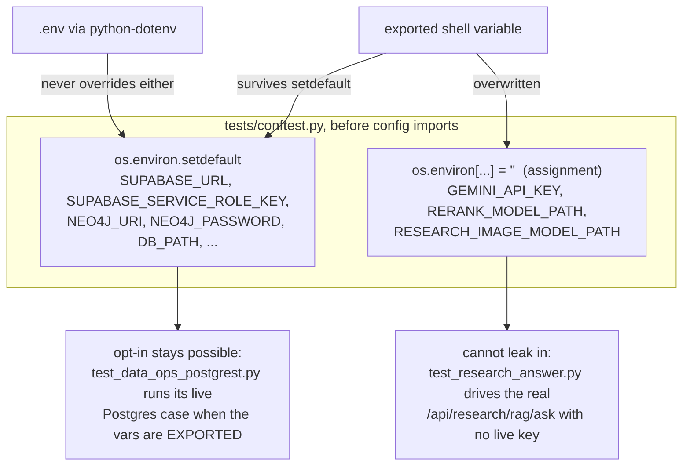
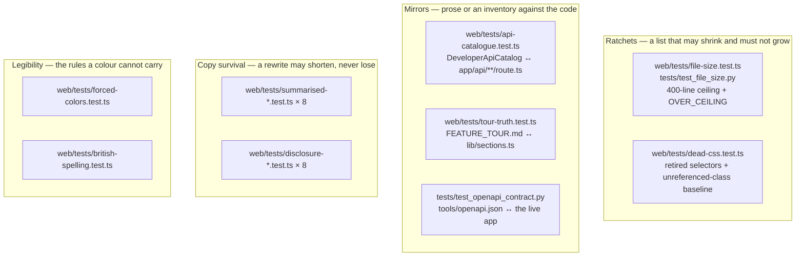
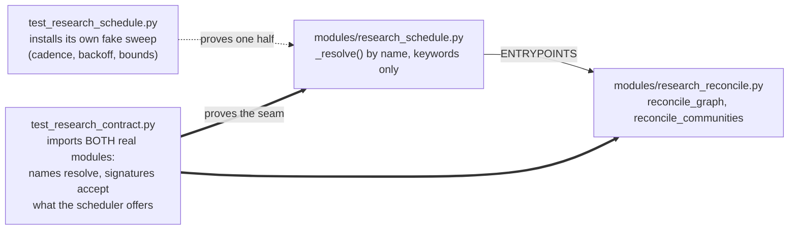

# Testing — the philosophy and the practice

*Current runners, commands and test topology audited against the worktree on
**2 September 2026**. Live release evidence is identified by workflow run;
historical incidents and measured runs keep their original
dates. The per-suite catalogue lives in
[`Part2_Infrastructure/README.md` §10](../../Part2_Infrastructure/README.md#10-testing);
this document is the argument — what each suite **guards**, why the unusual ones
exist, and the habits that keep them honest. The four facts that cost an hour
each are in [`CLAUDE.md`](../../CLAUDE.md); nothing here repeats them at length.*

The short release record for current topology, versions, test totals and the
last successful build is [`CURRENT_STATE.md`](../CURRENT_STATE.md). This page
explains what those checks mean and where their limits are.

---

## What each suite guards

A count tells you a suite ran. It does not tell you what would have shipped
without it. Three primary runners:

| Suite | Runner | What it guards that nothing else does |
|---|---|---|
| **Gateway** — `Part2_Infrastructure/tests/`, 230 `test_*.py` files | `venv/bin/python -m pytest` | The risk decision and its seventeen gates; the audit ledger's two failure contracts; the research plane's refusals; the **API contract** (`test_openapi_contract.py`) and the **container definition** (`test_container_contract.py`) by text analysis; the Python↔C++ parity fixture, bit-exact |
| **Web** — `Part2_Infrastructure/web/tests/`, 489 `*.test.ts` files | `node --import tsx --test tests/*.test.ts` | Everything the browser re-implements, pinned to Python by fixture; structural contracts for file length, CSS, API and navigation truth; plus four opt-in Chromium cases when `ALPHAENGINE_BROWSER_ORIGIN` names a running desk |
| **OpenBB service** — `Part2_Infrastructure/OpenBB_Service/tests/` | `python -m pytest` | The stateless research bridge's own contract, in its own runtime, with its own pinned `requirements.txt` |

The structural half of the web suite is the part worth reading first, because it
is unusual and because it is what stops this repository's *documentation* from
drifting away from its code. Those are set out in "The gates that are not unit
tests" below.

## The counts, and why they are generated

One committed record:
[`web/lib/test-counts.generated.ts`](../../Part2_Infrastructure/web/lib/test-counts.generated.ts)
holds what each runner printed when it was last regenerated on **2026-09-02**.
The release record for that pass is gateway 3,496 total (3,495 passed, 1
skipped), web 6,846 total across 1,461 suites (6,840 passed, 6 skipped), and
service 24 passed. Its own header explains why it exists: the
counts were once three hand-copied integers in a component, and they drifted
three separate times, the last time inside a single afternoon.

**Only one of those three lines is checked by CI, and knowing which is the whole
point of the file.** `web/scripts/check-test-counts.mjs` accepts `suite === "web"`
and nothing else — it regexes `web: { total: (\d+),` out of the generated module
and compares it against the runner's own summary line, teed to a log by the CI
step above it. The **gateway** and **service** lines are a dated record that
nothing gates. Cite them as such or not at all.

Measured on this tree on **2026-09-02**:

| Suite | Measured | Against the record |
|---|---|---|
| Gateway, local refresh shape | **3,495 passed, 1 skipped** | 3,496 total. This is a dated local record, not a CI gate; the generated file does not retain the skip reason or optional-capability environment. |
| Web | **6,840 passed, 0 failed, 6 skipped, 1,461 suites** | 6,840 + 6 = **6,846**. The skips are explicit browser/live opt-ins; read the runner reasons rather than inferring them from this total. |
| OpenBB service | **24 passed** | matches |

**The gateway figure has a condition attached, and it is not a discrepancy.**
The generated line is whatever environment ran the refresh; CI does not check
it, and the file does not preserve the skip reason. One known source of
collection-shape drift is worth naming rather than hiding:
`tests/test_research_rerank_real.py` calls `pytest.skip(reason,
allow_module_level=True)` when `RERANK_TEST_MODEL_PATH` is unset, its directory
is missing, or fastembed will not import. A module-level skip is not five
skipped tests — it is **one skip and eight tests never collected** (five
synchronous, three `async def`). So the same tree without the weights collects
eight fewer cases and reports one more skip, and both readings are correct. A
document that picked one of the two would be wrong for half its readers.

**And the shape can flip without anybody choosing it.** `conftest.py`
deliberately does **not** touch `RERANK_TEST_MODEL_PATH`, because that variable
*is* the opt-in — while `config.py` hands `Part2_Infrastructure/.env` to
python-dotenv at import without `override`. So a developer whose `.env` names
that path gets the seeded shape with nothing exported and no flag passed, which
is exactly how two people re-measure the same tree and print different numbers.
Before reporting a gateway count, either
`grep RERANK_TEST_MODEL_PATH Part2_Infrastructure/.env` or force the CI shape
with `RERANK_TEST_MODEL_PATH= venv/bin/python -m pytest` — one variable on one
command line, which is also the rule the `set -a` trap below states.

The web total has a property worth naming: **it cannot be asserted from inside
the suite**, because a test that checks the count changes the count. So the
figure is generated (`npm run counts:refresh`), and CI checks it from *outside*
the suite. The rejected alternative was pinning it the way the OpenAPI digest is
pinned; the refresh script's header names why that cannot work here. The value
is a measurement with a date, not a contract.

**The week the record did not agree is worth more than the corrected number.**
Through mid-August the record read web 4,008 while the runner read 4,124, then
4,422, because three changes — the Remediation pane split, the numerics custody
chain and the Developer diagram work — each landed with new suites and nobody
re-ran the script. The fix is `npm run counts:refresh -- --suite=web` and a
commit of the regenerated module. Editing either number by hand is not — the
file says so in its first line, and hand-editing it is the original defect the
generator was written to end.

The same discipline applies to prose. README §10 opens by counting its suites
with `ls`, not memory — and its figures have still drifted (it describes 38
suite files as of 2026-08-17; `find tests -maxdepth 1 -name 'test_*.py' | wc -l`
answers **213** on 2026-08-29, and this document itself said 102, then 130, then
185. That drift is the argument, not an embarrassment: **never quote a count
from a document, including this one**. Run the suite, or read the generated
file, or — best — describe the gate instead of the number.

## Network-free by construction

Every suite — gateway, web, service — runs offline with no keys, on any
machine, and this is arranged rather than hoped for.
[`tests/conftest.py`](../../Part2_Infrastructure/tests/conftest.py) sets the
environment *before* `config` is imported, precisely so it wins over a local
`.env`: python-dotenv does not override variables that already exist, so a
developer's deployment file cannot decide whether the suite passes.

The interesting part is *which* mechanism each variable gets, because the two
mechanisms encode two different policies:



- **`setdefault` is a policy of consent.** `SUPABASE_URL` and
  `SUPABASE_SERVICE_ROLE_KEY` are blanked only if absent, because
  `tests/test_data_ops_postgrest.py` is a documented opt-in: exporting the
  variables for a run is a choice somebody made, rather than one a deployment
  file made for them. That opt-in also requires an explicit
  `SUPABASE_DESK_ID`; `config.py` supplies no fixed desk fallback.
  `NEO4J_URI`/`NEO4J_PASSWORD` are blanked the same way —
  without it, `research_reconcile.run_reconcile` builds its corpus client from
  `settings`, *reaches a live Supabase*, reports `reachable: True`, and the test
  that exists to distinguish "could not sweep" from "nothing to sweep" fails
  while the suite quietly makes a network call. The rejected alternative —
  patching inside that one test — fixes the assertion and leaves every other
  suite reading a developer's live corpus, which is the condition, not the
  symptom.
- **Assignment is a policy of refusal, and the difference is the whole claim.**
  `GEMINI_API_KEY` is *assigned* `""`, not `setdefault`-ed, because `setdefault`
  only wins over a `.env` — an **exported** variable is already in `os.environ`,
  survives untouched, and reaches `settings.gemini_api_key`.
  `tests/test_research_answer.py` drives the real `/api/research/rag/ask` route
  and patches nothing; it relies on this one line. With `setdefault`, a shell
  that exports a real key would spend a live model call per test while the file
  said that could not happen — the conftest records that this was *measured*,
  not deduced. Nothing legitimate is lost: no test calls the extra for real (the
  generation seam installs a fake provider at `research_generate._sdk`, and the
  re-rank seam a fake encoder at `research_rerank._import_cross_encoder`; both
  are patched onto the module and ignore the environment).

**The third assignment landed, and this document is the reason it is worth
recording.** Until 2026-08-23 `RESEARCH_IMAGE_MODEL_PATH` — the CLIP pair behind
the image retrieval arm — was neither assigned nor `setdefault`-ed, and *this
page said so in prose while `modules/research_image.py` said so in a comment,
and neither closed it*. It is now assigned `""` at `conftest.py:80`, alongside
`GEMINI_API_KEY` and `RERANK_MODEL_PATH`, and the conftest's own note names this
file as the record that failed to be a fix. Two details in that note are the
interesting part:

- **It had to be blanked in the conftest, not in the image suites.** Each of the
  arm's four files patched `research_image.IMAGE_MODEL_PATH` in an autouse
  fixture, so those four were safe and nothing else was — while any suite
  driving `/api/research/rag/search` reaches `research_image_arm`. The constant
  is read off `os.environ` in a module-level assignment **at import**, so before
  the first test module imports is the last moment the value is settable. A
  per-file fixture is structurally too late for every file but its own.
- **The opt-in was not taken away.** `test_research_rerank_real.py` opts in
  through its own separate `RERANK_TEST_MODEL_PATH`, deliberately left alone,
  and `tools/bench_image_retrieval_models.py` assigns the variable itself before
  importing the module. Blanking the shared name costs nothing anyone was using.

**The trap on the other side of that mechanism, and it costs an hour every time.**
`REQUIRE_AUTH` is a `setdefault` — the *consent* column above — and
`Part2_Infrastructure/.env` sets it. Sourcing that file the obvious way exports
it:

```bash
set -a && . ./.env       # ← never do this before a test run
```

`setdefault` cannot override an exported variable, so the app comes up requiring
auth and **about eighty tests fail with 401**. Nothing is broken; the shell
decided the suite's policy. Pass only the scoped values needed by that opt-in —
`SUPABASE_URL=… SUPABASE_SERVICE_ROLE_KEY=… SUPABASE_DESK_ID=…
venv/bin/python -m pytest tests/test_data_ops_postgrest.py` — which is also the
shape the Postgres opt-in expects.

## Reading the skips

The skip line is a report, not noise. On Python 3.12 with the native core
built, **zero, one or two skips can be correct**, and the shape is decided by
which live Postgres and real-model checks you explicitly opted into rather than
by the tree's health:

| Skip | Why it fires | When it does not |
|---|---|---|
| `tests/test_data_ops_postgrest.py::TestAgainstTheRealProject` | no `SUPABASE_URL` / `SUPABASE_SERVICE_ROLE_KEY` / `SUPABASE_DESK_ID` in the environment, so the Postgres backend was *not* exercised. The remaining cases run against `httpx.MockTransport` | export all three only for this command, see the trap above, then read the fresh result rather than relying on a copied total |
| `tests/test_research_rerank_real.py` (whole module) | `RERANK_TEST_MODEL_PATH` unset, its directory missing, or fastembed not importable — three reasons, printed separately, in the order a reader would fix them | seed with `python tools/bench_rerank.py --seed --model-path DIR` (1.05 GiB) and its **eight** tests are collected and run against the real cross-encoder |

So a bare laptop and CI read one more skip and eight fewer collected cases than
a machine with the weights seeded. **Neither is "the" healthy number** — what is
healthy is that each skip *says what it did not exercise*, which is the house
habit of reporting absence applied to the suite itself.

- **This section has been wrong twice, in opposite directions**, and that is the
  argument for reading rather than counting. It said "exactly one skipped, and a
  second skip is the alarm" until the opt-in re-ranker test made two correct; it
  then said "exactly two" until those weights were seeded locally and one became
  correct again. The count is not the signal.
- **An UNEXPECTED skip is a diagnosis**: on Python 3.14, `tests/test_backtester.py`
  skips ("vectorbt not installed", because numba has no 3.14 wheel) and the
  summary still reads green, one engine lighter. That is the alarm at any count.
- **A skip that disappears deserves the same attention.**
  `test_data_ops_postgrest.py` going quiet means Supabase credentials reached the
  test environment — quite possibly by the `set -a` route described above.
- **A missing native core is a failure, never a skip.**
  `tests/test_decision_core_native.py` treats an unimportable
  `modules/_decision_core` as a red build unless `DECISION_CORE=python` was set
  on purpose — a quiet fall-back to Python is exactly what CI must catch.
- Run with `-rs` (`venv/bin/python -m pytest -rs`) to print each skip's stated
  reason; `pytest.ini` defaults to `-q --tb=short`, which hides them.

### The release run's two code-debt skips are closed

The complete 2026-08-29 run recorded six skips: four opt-in browser cases that
need a running origin, plus two cross-ownership source-stability debts. The two
debts became ordinary passing tests on 2026-08-30; do not keep describing them
as current skips or manually edit the generated count before the next full run.

| Closed test | Resolution now pinned by the test |
|---|---|
| `data-stability.test.ts` — "lib/use-data-work-queue routes its source decision through the machine" | The queue now uses `useDeskSource`: failure demotes immediately, promotion waits for `PROMOTION_STREAK`, and the polling tick returns `pollingFailure`, so `maxBackoffMs` is reachable. The initial load is owned by the immediate polling tick rather than an unobserved mount fetch. |
| `risk-stability.test.ts` — "is enforced where the handoff executes, not only claimed in the banner" | `ExecutionHandoff` now receives staleness from both Risk and Portfolio, clears a previously typed confirmation when the book goes stale, folds staleness into the action predicate and input state, and guards the handler itself. |

The remaining skipped cases are browser opt-ins, not unimplemented source
behaviour. Run them against a ready origin as their own test descriptions direct.

---

## The gates that are not unit tests

This is the part of the suite that is unusual, and the part worth reading if you
are only going to read one. None of these tests a function. Each pins a
**property of the tree** that would otherwise be held by a convention, a
comment, or somebody's memory — and every one of them was written after that
convention had already failed.



### The file-size ratchet, on both sides of the tree

There is no ESLint here — no dependency, no config, no lint script — and ruff
has no file-length rule, so a 300–400-line convention had nothing holding it.
Both suites open by naming the file that proved it:
`app/dashboard/page.tsx` reached **2,205 lines with a single 2,000-line function
inside it**, and the file that was once `modules/telegram.py` reached nearly
**7,000 lines with a single class holding 84 % of them** before it was split
into the current `modules/telegram/` package.

[`web/tests/file-size.test.ts`](../../Part2_Infrastructure/web/tests/file-size.test.ts)
and [`tests/test_file_size.py`](../../Part2_Infrastructure/tests/test_file_size.py)
are the same shape, deliberately, and both carry `CEILING = 400`:

1. a file **not** on the `OVER_CEILING` allow-list may not cross 400 lines at all;
2. a file **already** on the list may not get *longer* — the ratchet that stops
   "I will split it later" becoming "it grew while I waited";
3. a file on the list that has dropped under the ceiling **must be removed from
   it** (`test_the_list_holds_no_file_that_is_already_under_the_ceiling`) — a
   stale entry is a ceiling not being enforced on a file that has earned it, and
   this is how the list empties.

A flat `assert every file < 400` was the rejected alternative: red on the day it
is written, therefore ignored. **Every entry is a debt, not an exemption**, and
the comment log is where the argument lives. Two entries are worth reading
because they are the honest cases:

- `config.py` (407) is the documented un-splittable file: one flat `Settings`
  dataclass whose ~200 fields are read as `settings.x` from almost every module,
  so nesting them into sub-dataclasses is a correct refactor *and* a breaking
  one. It came **off** the list on 2026-08-21 at 396 and returned when the
  `NEO4J_*`, `GEMINI_*` and `RERANK_*` settings landed. The honest choice was
  between four configurable settings and a line count; the settings won.
- `tests/test_session_rollover.py` is the one entry **raised** (857 → 871),
  deliberately visible rather than shaved to fit: its `clock` fixture had gone
  *vacuous* when `risk_proxy` became a package — it patched the package attribute
  while every submodule binds `_utcnow` directly, so it silently stopped moving
  time. Fixing it, and writing down why, cost those lines. The split it owes
  needs its fixtures in a conftest, which reaches every other suite.

The web ledger records the ratchet closing rather than only the debt:
`page.tsx` left the list on 2026-08-21 at 304 lines, and each of its successors
is named with its own length so the debt cannot be laundered by moving it —
`WorkspacePanels.tsx` (370), `lazy-panels.tsx` (44), `workspace-insights.ts`
(119), `use-workspace-shortcuts.ts` (60), every one under the ceiling.

### `dead-css.test.ts` — the same shape, for rules nothing renders

`globals.css` is ~13k lines and once carried a comment claiming six page headers
had been retired and that their rules survived "only because deleting rules that
nothing renders is not worth the risk of missing a caller". Measuring showed the
claim was **wrong in both directions**: four of the six were still being
rendered, and there were separately retired console and utility blocks the
comment never mentioned. Prose about what is dead drifts; this measures.

Two rules, and a third test that guards the measurement itself:

1. a named set of **retired selectors stays gone** — `.console-statusbar`
   hard-coded `top: 63px` against a header measured precisely because its height
   is not knowable at authoring time, so re-adding one should be a deliberate
   act rather than a paste;
2. the **unreferenced-class count does not grow** — a baseline rather than zero,
   because driving it to zero in one pass means deleting ~600 lines across
   surfaces that cannot all be hand-verified in one sitting;
3. `it("the dynamic-classname guard is actually finding template literals")` —
   because the guard that treats `` className={`console-${tone}`} `` as live is
   the one thing that could silently disarm the whole file.

The subtlety worth carrying elsewhere: the reference check is a **whole-token**
match, not `sources.includes(name)`. It was the latter, which counts a class as
live whenever its name appears anywhere in the source text *including inside a
longer class name* — `.console-stat` had no render site at all and scored as
referenced because `console-status-cell` contains it, so eight dead rule blocks
sat under a comment asserting they were "still live and stay". `.cols` and
`.eyebrow` were hidden the same way.

### `api-catalogue.test.ts` — an inventory that cannot go stale

`DeveloperApiCatalog` is the panel a reviewer opens to ask what this app's
surface **is**. It was hand-maintained and had fallen nine routes behind: "26
web API operations · 23 route handlers" against 32 route files, with every auth
surface, both Oracle backends, the research RAG proxy, favourites and the
Telegram connect mint missing entirely.

The counts were not wrong about the list — **the list was wrong about the app**,
which is the harder version of a stale inventory because the arithmetic is
self-consistent and nothing looks broken. So the test does not check the
numbers. It diffs the array against the filesystem **in both directions**: a new
`route.ts` fails here until it is catalogued, and a catalogued path that no
longer exists fails too. Two further tests close the escape hatches — every
method each route actually exports must be declared, and
`it("lets no hand-typed route count sit beside the derived one")` forbids
re-introducing the arithmetic that was self-consistent and wrong.

### `tour-truth.test.ts` — the web suite fails when a *document* is wrong

The most unusual gate in the tree, and the one this documentation pass is
directly downstream of.
[`docs/product/FEATURE_TOUR.md`](../product/FEATURE_TOUR.md) walks a reader
through every workspace and names the sections in each rail. Those lists were
hand-mirrored from the app, and **every one of the eight then-existing tabs had
drifted**: seven whole sections were missing (Lineage, Fill quality, Equity &
P&L, Monte Carlo, Feeds & Contracts, Dependencies, Readiness), three tabs named
the wrong opening section, and two renames had never reached the document.

Rewriting fixed that day. The test fixes the next one. It reads
`web/lib/sections.ts` — the single source the rails, the command palette and the
hash whitelist all read — and asserts, for all **eleven** workspaces
(`OVERVIEW … MARKETS, COHERENCE, DIFFUSION` — the last three are the constant
names; their rail labels read "Markets", "Proofs" and "Diffusion"):

- every rail label appears in the tour;
- the **total** is 70 *and* the tour states a "70 section" figure in its prose.
  The 2026-08-24/25 restructuring history remains in the test; three current
  places quote the final total: the tour,
  `scripts/desk-sweep-plan.mjs` and this assertion;
- no **retired** label (`Codex`, `Activity`, `Telemetry & SLIs`, `VaR & model`)
  is quoted as a rail entry — the direction a rewrite gets wrong, since a
  plausible invented label reads perfectly;
- the two ids frozen mid-rename (`codex`, `activity`) are still explained,
  because they are public deep links and are exactly what a later reader tidies
  up without the note;
- the tour uses the **17-defined / 15-on-every-path** gate framing rather than
  the retired "14 gates", and mentions Telegram and `TELEGRAM_CONTROL_USER_IDS`
  at all — a whole transport a reviewer would otherwise never find.

Its closing block does the same for the **in-app** tour built in
`web/lib/workspace-tour.ts`: eleven stops, each linking into the section it names.

> A tour is read by people who cannot yet tell it is lying. That sentence is in
> the test file, and it is the reason this gate exists rather than a review
> checklist.

### The OpenAPI contract test, and the three-artefact cascade

[`tests/test_openapi_contract.py`](../../Part2_Infrastructure/tests/test_openapi_contract.py)
exists because two independently-deployed clients — the Next.js workspace and
the Telegram companion — call the gateway across a network boundary, so
**nothing catches a breaking change at build time**. It imports
`tools/export_openapi.py` and asserts `tools/openapi.json` is byte-identical to
what the live app renders, that every client-facing route is published, that
responses are typed rather than free-form, and that backtest parameters carry
their bounds. CI runs the same check as a step: `python tools/export_openapi.py --check`.

That is the first link in a chain worth knowing before you add a field to any
`modules/schemas_*.py` model, because it cascades to **three committed generated
artefacts** and two of them are gates:

1. `Part2_Infrastructure/tools/openapi.json` — regenerate with
   `python tools/export_openapi.py`. Gated by the suite *and* by CI's
   `--check` step.
2. `web/lib/gateway-openapi-digest.generated.ts` — a sha256 over **canonical
   JSON with sorted keys**, not a file hash. Gated by `npm run build`'s
   `prebuild`, via `scripts/check-gateway-openapi-digest.mjs`.
3. `web/lib/gateway-contract.generated.ts` — regenerate with
   `node --import tsx scripts/generate-gateway-client.ts`. Not gated; it is the
   typed client the workspace compiles against, so `npm run typecheck` is what
   catches its absence.

The other prebuild gate is `scripts/generate-codebase-manifest.mjs --check`,
which compares `git ls-files --cached --others --exclude-standard` against the
**file list** in `lib/repository-manifest.generated.json` — deliberately only
the list, since `generatedAt` and `commit` change every commit and gating on
them would fail every push. It skips cleanly when git is unavailable, so a
tarball build still works. **`npm run build` refuses until `npm run
catalog:refresh` has run**; that is the sentence to quote, not a file count.

### `forced-colors.test.ts` and `british-spelling.test.ts`

Two legibility gates, and one of them is new enough that the standards document
was still calling it a convention.

**Forced colours.** Windows High Contrast replaces every colour, so anything a
colour says must also be said by a mark, a label or a border. The suite pins one
authoritative `forced-colors` media block, requires meaning-bearing washes to
become system-colour borders, requires ordinary chart strokes to use
`currentColor`, and permits authored colour to survive in exactly two places —
the heatmap and the ladder's depth field — where the colour *is* the data. A
second describe block holds the corollary at the component level: the heatmap's
five kinds each define a **glyph**, the glyphs are distinct from one another
rather than merely the colours being distinct, and the glyph renders beside the
label.

**British spelling.** `CLAUDE.md` has opened with "British spelling throughout"
for a long time, and until 2026-08-21 that was the only house rule with nothing
behind it. It drifted exactly as an unenforced convention does: the Overview tab
shipped a kicker reading "AlphaEngine command center" in a file whose own
comment eight lines earlier said "the command centre band", and `KpiDeck`
rendered "modeled cost" while the rest of the tree wrote "modelled" in eight
places — at which point `copy-audit.test.ts` was pinning `/modeled cost/` with a
failure message that said "modelled". **The guard was arguing with itself.**

The scope is deliberately narrow, and the narrowness is the design: only text a
reader sees — JSX text nodes, and string values of the props that render as
words (`kicker`, `label`, `title`, `description`, `aria-label`, …) — in `.tsx`
files under `components/` and `app/`. **Not identifiers, not comments, not CSS,
not Python, not markdown.** CSS is why this cannot be a naive grep: `color`,
`color-mix()`, `prefers-color-scheme` and `text-align: center` are spelled the
American way *by specification*, so a value that looks like CSS is skipped and
the word list omits nothing-but-CSS words rather than excepting them case by
case. It is a word list, not a dictionary — it holds the American forms that
have actually appeared here or are one slip away — and it "should never need a
suppression list, because anything it flags is either a real violation or a sign
the entry was too broad to keep".

It also guards its own walk: `it("scans a meaningful number of files, so a
broken walk cannot pass silently")` asserts more than 100 files were read,
because a scan that finds nothing because it looked nowhere reads exactly like a
clean bill of health.

## The copy guards: `summarised-*` and `disclosure-*`

Eighteen web suites. Eight decision-loop tabs (data, developer, execution,
overview, portfolio, reliability, research and risk) each have one
`summarised-` and one `disclosure-` file. Markets and Proofs add
`summarised-markets.test.ts` and `summarised-coherence.test.ts`; they do not yet
have whole-copy disclosure twins, and Diffusion has neither. The quantitative
tabs additionally use targeted claim, view-coverage and containment suites,
but those do not hold every folded sentence byte for byte. They exist because copy edits
have a failure mode no diff review catches: a shortened sentence that reads
fluently and no longer carries a number, a negation, or the reason a measurement
is missing.

**The rule these encode is fact-loss, not brevity, and the distinction is the
whole design.** `summarised-research.test.ts`'s header states it in as many
words, and it is worth quoting because a reader who mistakes these for length
caps will draw exactly the wrong lesson from them:

> WHAT THIS FILE DELIBERATELY IS NOT is a length cap. `copy-audit.test.ts` opens
> by refusing to cap length for the reason that applies here too: a test that
> cannot tell "detailed" from "wordy" pushes the desk toward saying less than it
> knows, which is the failure this pass exists downstream of. **Nothing below
> rewards brevity. Everything below punishes loss.**

The pass these files guard was the *third* over the same copy, and the header
distinguishes all three, because they are three different operations that look
identical in a diff: pass one **deleted** sentences that restated a neighbour;
pass two **folded** prose behind a `<details>` byte-identical, so the words moved
and nothing changed; pass three **rewrites** — the same fact, in fewer words.
`summarised-overview.test.ts` names the commit that made this necessary
(`8d091a3`, "Cut 610 words from the frontend, then put 16 facts back": a
shortening pass cut hard, lost sixteen facts, had to restore them, and four of
six areas swept failed a fact-loss verifier on the way).

Each rewrite is pinned **in both directions**, because either direction alone is
a test that passes on a file where nothing happened:

1. the **new wording is present**;
2. the **old wording is gone** — otherwise the rewrite could be pasted in
   *beside* the sentence it was meant to replace and the test would still pass;
3. every **fact token** the original carried — numbers, units, thresholds, named
   entities, negations, qualifiers — is still somewhere in the file, enumerated
   one by one before the rewrite was written. "A rewrite that reads beautifully
   and drops *only*, *at least*, *rather than* or a route path has lost a fact,
   and this file is what says so."

Two mechanical decisions in these files are load-bearing and are the sort of
thing a reimplementation gets wrong:

- **Comments are blanked before scanning.** A comment explaining a rewrite is
  not on screen, and must never be able to satisfy a test about what the reader
  can still see — "the exact hole a fact-loss verifier has to be built without".
- **The scan reads the JSX text nodes *and* the source they sit in**, unioned.
  Stripping tags alone loses every rendered attribute: `<[^>]*>` runs from
  `<StatTile` to the first `>` after it, which on a multi-line element is the
  closing slash — and the `explain={{ plainEnglish: "…" }}` gloss inside goes
  with it. Adjacent string literals are rejoined first, because a `+` wrap is
  the formatter speaking rather than a change of wording.

The `disclosure-*` files hold the complementary line, and their failure mode is
the sharper of the two because it is silent: **a sweep that DELETED a sentence
looks identical to a sweep that folded it, because both make the pane shorter.**
So every fact a disclosure sweep moved is asserted **present**, byte for byte,
*and separately* asserted to be **inside a fold**. A deletion fails the first; a
fold that never happened fails the second.

The other direction matters more, and `disclosure-data.test.ts` enumerates it as
four kinds of sentence that **may never be folded on this desk, because hiding
them changes what a reader believes**:

1. an **empty state** — "Nothing has been submitted" behind a fold is a panel
   that looks broken, and a reader must never open a disclosure to learn that
   nothing was captured;
2. a **null explanation that is the panel's only content** — fold it and a
   heading sits over a blank card;
3. **the reason a control the reader can see is dimmed** — a fold is the same
   dead end as a tooltip: unreachable by touch, invisible to anyone who never
   thinks to look;
4. **a figure a reader acts on.**

Each is listed by its exact wording and asserted to sit outside every
`<details>` in its file — "that list is the honesty floor, not a style
preference, so it is spelled out rather than inferred" — and a second, looser
assertion states the same rule as a *property*, for the pane nobody has written
yet. Every file is checked non-empty before it is scanned, because
`doesNotMatch` over an empty string passes and proves nothing, "which is how a
source-scanning suite goes quietly vacuous".

The `summarised-*` side carries the word ratchet where one is warranted —
`summarised-overview.test.ts` pins `WORD_CEILING = 427` and
`summarised-data.test.ts` asserts the count actually *fell*, so an "edit" that
changed nothing fails — but **the count is never the only watcher**, for the
reason `copy-audit.test.ts` opens with and `summarised-overview.test.ts` repeats:
a word count improves whether a sentence was tightened or amputated. The
`disclosure-*` files carry no ceiling at all; their whole business is that the
words stay.

### The cost these suites charge, and why it is still worth paying

A sentence pinned byte for byte is also a sentence **frozen with whatever is
wrong in it**, and that bill comes due whenever a copy sweep finds a real
defect. The current example, found on 2026-08-22 and **still standing on
2026-08-29**: `components/DataConsole.tsx:366` advertises the Reliability tab as
"Breaker timelines, latency **SLOs**, failure drills and remediation controls."
No SLO exists anywhere in the tree — the rail is labelled "Attention & SLIs"
(`lib/sections.ts`), `ReliabilityConsole` draws a latency p99 with a tone rule
and a sample floor (an indicator, not an objective), `deriveTrustSlis` says in
its own reasoning that "no SLA target is defined anywhere", and
`lib/data-work-queue.ts` seeds "Define an SLO for cross-source spread" as
**open** work. One letter is wrong, and the same string is a `MUST_STAY` needle
at `tests/disclosure-data.test.ts:241`.

The correct move is not to edit the needle alone — that is editing a guard to
match the thing it guards, which is how a suite stops guarding. **Copy and
needle move together, in one commit, by whoever owns both.** Until then the
defect is written down here rather than silently tolerated, which is the same
doctrine the suites themselves enforce: a gap is named, not rounded off.

A second, smaller instance of the same cost, also re-verified 2026-08-29 and left
alone: `components/overview/RoleCards.tsx:72` reads "Circuit breakers, latency
percentiles **&** incident triage" where the card's four siblings read
"…, … and …", and that string is pinned in `summarised-overview.test.ts:263`. A
one-character inconsistency is not worth editing another suite's fact list to
fix, and the argument for leaving it is exactly the one that suite's own header
records.

---

## Seams versus stand-ins: the `research_schedule` scar

The suite's sharpest lesson is recorded in the docstring of
[`tests/test_research_contract.py`](../../Part2_Infrastructure/tests/test_research_contract.py).
Two modules were written in parallel — `modules/research_schedule.py` (when a
sweep runs) and `modules/research_reconcile.py` (what a sweep does) — and they
did not meet: the scheduler resolved an entry point by name and called it with
filtered keywords; the sweep exported different names and took a positional
dict. Resolution failed, reconciliation never ran, **and the full suite stayed
green** — because `tests/test_research_schedule.py` monkeypatches
`modules.research_reconcile` with a stand-in whose members the test itself
chooses. The defect, named precisely: not that the modules disagreed, but that
*both sides tested against a fiction of the other*. A mocked collaborator
cannot fail a contract.



The resolution is not "never mock". `test_research_schedule.py` keeps its
stand-ins — cadence, backoff and boundedness are untestable by waiting, and the
module under test may legitimately outlive its sibling. What was added is a
suite whose only job is the seam: every scheduled scope must resolve to a real
callable on the real module, and `inspect.signature` must show the resolved
entry point accepts exactly what the scheduler offers — because renaming alone
would not have fixed the original break. The same doctrine governs
`tests/research_seam.py`: everything faked there is the outside world (the
corpus, the ONNX cross-encoder, the Gemini SDK), at exactly the boundaries
those modules document as their own test seams, so the real fallback, real
fences and real prompt run. Faking one step higher would prove nothing, which
is the whole argument of the contract file.

### The same doctrine, applied to the newer research suites

The research plane grew a batch of suites written under the rule above — fake
the outside world at the boundary the module documents, and nothing else. Four
are worth naming because each one had to resist an easier test that would have
proved less:

- **The ingest drain** (`tests/test_research_ingest_drain.py`) runs a real
  `ResearchRag`, a real queue, a real drain, the real `deliver()` and the real
  `Backoff`; only the corpus is faked, at the HTTP boundary. The retry curve is
  shortened by moving the delivery module's own constants, **not** by injecting
  a sleeper — an injected clock would have tested a seam that does not exist in
  production. The distinction the suite exists to hold: a 503-then-201 must
  *actually recover*, because a retry that merely delays the funeral passes any
  test that only counts attempts.
- **The execution-summary producer** (`tests/test_research_ingest_session.py`)
  seeds a real `AuditLog` on disk through the gateway's own writers
  (`record_session_rollover`, `record_order`, `record_equity_snapshot`), because
  the claim under test is precisely that the figures *already exist*. Every card
  number is checked against a hand-computed value.
- **The stage widths** (`tests/test_research_stage_widths.py`) are measured **at
  the corpus** on the real path — the fake corpus records the width it was asked
  for — rather than asserted against the arithmetic that produced them. An
  assertion on `wide(20) == 60` alone would survive the width never reaching the
  RPC, which is the defect that made this change necessary.
- **The auth matrix** (`tests/test_research_security_auth.py`) reads its route
  list from `main.app.openapi()`, so a research route nobody wrote a case for
  fails the suite. Walking `app.routes` was the rejected reader: this FastAPI
  version wraps included routers in objects whose `path` is `None`, so that walk
  returns an empty set and passes every comparison made against it — a guard
  that cannot fail, which is the tautology the mutation section below exists to
  catch.

Two constraints these suites work under, both load-bearing and neither
negotiable: **the real re-ranker weights never run in the default suite** (they
would need a download, so `RERANK_MODEL_PATH` is blanked and the ONNX path is
exercised through a fake cross-encoder at the import seam), and **the `/ask`
spend bound is inert without `GEMINI_API_KEY`** — which is what stops a cap
written for a deployment that spends from rate-limiting an offline suite that
cannot. The first is a statement about the default run, not about the model
being untestable here: seed the weights and the opt-in file exercises the real
cross-encoder, as the skips table above says.

## What `test_diffusion_skill.py` pins

[`tests/test_diffusion_skill.py`](../../Part2_Infrastructure/tests/test_diffusion_skill.py)
is **21 test functions** over
`modules/coherence/diffusion/skill.py`, and its docstring states the standard the
whole file is built to: *"Every test here is about a way the OLD estimator could
be fooled. A test that only checked 'does it return a number' would pass on the
version this replaces."*

That matters because the estimator it replaced produced a verdict from the
largest of eight **in-sample** univariate |t| values against `half_life_s` — a
quantity that is only fitted where the terminal move cleared two sigma, i.e. **26
of 62** release meetings. Three properties carry the replacement, and each has
tests whose *failure* would restore the old defect:

**1. The target needs no signal gate.** `residence_time` is the area above the
absorption curve, `∫₀³⁰ (1 − absorbed(t)) dt`, anchored at `absorbed(0) = 0` and
joined piecewise-linearly — a **path integral, not a fit**, so it is defined for
every measured path: 62 of 62 per stage.
`test_it_needs_no_signal_where_the_old_half_life_needed_one` drives a path whose
whole move is `1e-8` — "well under any noise floor" — and asserts a residence
time still comes back, with the docstring naming the count it repairs.
`test_it_recovers_the_time_constant_of_an_exponential` checks the claim the
module makes rather than restating it: for `1 − exp(−t/k)` the area over
`[0, ∞)` is `k`, and over the 30-minute window `k(1 − exp(−30/k))`. Four more
pin the refusals — a path that never reaches the terminal horizon, a zero
terminal move (refused rather than divided by), an overshoot (clamped into the
window it was measured in), and an `unavailable` horizon (**skipped, not read as
zero** — the house null-honesty rule inside an estimator).

**2. Folding by MEETING rather than by ROW is what stops leakage**, because both
stages share a statement.
`test_holding_out_the_meeting_not_the_row_is_what_stops_leakage` is constructed
so the leak is *visible rather than statistical*: one meeting is worth 100 and
every other is worth 0, and the lone predictor is that meeting's indicator. It
asserts **both** directions in one test — `by_row > 0.9` ("row folding should
look like near-perfect skill") and `by_meeting < 0.0` ("meeting folding should
expose it as none"). A test that only asserted the correct half would pass on an
estimator that folds either way.

**3. The verdict distinguishes an unpredictable TARGET from a text null**, which
the previous two-outcome verdict could not — `skill.verdict` reports **four**
outcomes (`predicts`, `does_not_predict`, `target_unpredictable`,
`not_assessable`), and `skill_baseline_r2` must be read before `skill_gain`.
Two tests hold the distinction by outcome string and by reason text:

| Inputs | `outcome` | Why it is a different fact |
|---|---|---|
| `gain −0.02`, `baseline_r2 −0.3` | `target_unpredictable` | the reason must contain "no null measured against it is evidence" — if the clock itself cannot be predicted, the text's failure to help says nothing |
| `gain −0.6`, `baseline_r2 0.14` | `does_not_predict` | the reason must contain "IS predictable" — the clock has structure and the text is not part of it |

Plus a floor and a drop: `test_below_the_meeting_floor_it_refuses_rather_than_reporting_noise`
(under `MIN_MEETINGS` the state is `too_few` and the outcome
`not_assessable`), and `test_a_meeting_with_no_rate_move_is_dropped_rather_than_read_as_a_hold`
— a missing `move_bp` reduces the meeting count rather than being coerced to
zero, which would silently invent a policy decision.

**The result the module produces, stated as the code and the study state it, and
not softened:** the absorption clock **is** predictable — out-of-sample
**R² +0.144** from stage and rate move alone, with the press conference about
**7.0 minutes slower** than the statement — but adding the text changes that by
**−0.343** (shuffled **p 0.875**), and over a declared **3×3 grid** of
specifications the gain was negative in **all nine cells**, including the one
with the largest in-sample |t| of 2.85. The headline is a **null**, and a
stronger one than the version it replaced: the clock has real structure, and the
statement's information spectrum is not part of it. The suite's job is to make
that conclusion *falsifiable* rather than persuasive, which is why
`test_it_finds_a_predictor_that_is_really_there` exists beside
`test_it_refuses_a_predictor_that_is_not` — an estimator that only ever said
"no" would pass half this file.

## Mutation testing, as practised here

There is no mutation-testing framework in the tree, and that is deliberate: a
mutmut/Stryker run over three runtimes is a CI budget this project spends on
parity fixtures instead. What is practised is manual and targeted —
**break, run, revert**:

1. before trusting a guard test, break the specific thing it guards (flip a
   comparison, drop a seed, delete the line);
2. run the suite and watch it go **red** — a guard that stays green just failed
   its own audit;
3. revert, and verify the restore byte for byte (an `md5` of the file before
   the mutation and after the revert; "it looks the same" is how a stray edit
   ships inside a verification exercise).

The tree records what this practice catches. The docstring of
`tests/test_research_communities.py::test_the_determinism_fixture_is_one_the_seed_can_actually_change`
is the canonical scar: the Louvain determinism test originally asserted over
`TRIANGLES` — two disjoint triangles, a graph with exactly one sensible
partition that every seed finds — so replacing `seed=seed` with a random
integer left the whole suite green. **A determinism test on an unambiguous
input proves nothing.** The fix was a fixture the seed can actually move
(`AMBIGUOUS`: twelve triangles in a ring, Louvain's resolution-limit case —
measured at seventeen distinct partitions across forty seeds), plus a second
test that guards the guard: if a future edit shrinks the fixture back to
something unambiguous, the suite fails *there*, with a message saying why,
rather than silently disarming its neighbour. That is the mutation lesson made
permanent — where a break-run-revert found a tautology, the tree keeps a test
that re-runs the audit for ever.

Three more guards-of-guards exist for the same reason and are worth knowing by
name, because each one closes a way its own suite could pass while scanning
nothing: `dead-css.test.ts`'s dynamic-classname check, `british-spelling.test.ts`'s
`files.length > 100` assertion, and `test_data_quality_rollup.py`'s "no query
text at all was recovered" assertion.

## Parity fixtures: one reference, three runtimes

The maths exists twice because neither runtime can call the other — Python for
the gateway and the Telegram companion, TypeScript for the browser — and the
pre-trade arithmetic a third time in C++
(`native/decision_core/decision_core.cpp`). Python is the reference; committed
fixtures pin the others to it. Change a formula on one side and the other side
fails: that is the design, so **regenerate the fixture deliberately, never
loosen the tolerance**.


Each edge's standard is chosen, not defaulted:

- **Python ↔ TypeScript engine** (`parity.test.ts`): real Binance bars replayed
  through `lib/engine`, compared with a relative-closeness helper — `1e-6`
  relative on the return statistics, `1e-9` on quantities that count things
  (exposure, turnover, win rate), with an absolute floor so near-zero values do
  not blow up. Floating point across two languages earns a tolerance; nothing
  else does.
- **Python ↔ TypeScript risk** (`risk-parity.test.ts`): `1e-4` on target
  weights, because the failure mode is the worst kind — a trader reads one VaR
  on their phone and a different one on the screen, and neither is flagged as
  suspect.
- **Python ↔ C++** (`test_gate_parity.py` + `test_decision_core_native.py`):
  **bit-exact**, no tolerance. Both engines must decide all twenty
  `gate-parity.json` scenarios with the same accept/reject, the same gate
  order, the same observed and limit floats — down to `depth_usd`'s
  Neumaier-compensated sum and the cross-venue price ties whose fold order
  decides the last bit of `slippage_bps`. A break in either suite is a real
  parity failure, never a tolerance to loosen.
- **The web's `gate-parity.test.ts` deliberately asserts less**: gate names and
  order only, because the browser sandbox has no ladder and synthesises its
  slippage — asserting its numbers against the gateway's would be a looser test
  wearing a stricter name. The header says so, which is the house way of
  narrowing scope.
- Two structural cousins: `venues-parity.test.ts` reads *both sides' source* —
  the `lib/venues/` package and every module in `modules/tca_engine/`,
  concatenated, because reading one named file went green scanning nothing when
  the module became a package — and fails unless `FILL_TOLERANCE` is the same
  literal on both sides (as of 2026-08-29, `lib/venues/fill-tolerance.ts:41` and
  `modules/tca_engine/tolerance.py:32`, both `1e-9`); `mc-parity.test.ts` pins
  three Monte Carlo runtimes to one committed reference, byte for byte, by
  executing the worker's own stringified source under Node.

### Two things the risk fixture cannot currently see

Stated because the two-implementations-plus-a-fixture arrangement is only worth
its cost if its blind spots are written down. Both were found by reading the
tree on 2026-08-22, both are real, and neither is a defect in a test that is
failing — they are cases the committed fixture never presents.

**The covariance sample floors disagree, and no scenario exercises the gap.**
`web/lib/portfolio-risk/covariance.ts` requires **20** observations per symbol
*and* 20 in the common window, returning `null` otherwise;
`build_covariance` in `modules/quant_risk/covariance.py` requires **2**. A book
with short history therefore gets a typed refusal in the browser and a
two-observation covariance from the gateway — one screen saying "not enough
history" beside another quoting a number. `tools/make_risk_fixture.py` generates
220 observations (120 for the allocation scenarios) over a 60-bar window, so no
committed scenario is short enough for the floors to disagree. This is exactly
the class of divergence the arrangement exists to catch, and it is invisible to
it. Closing it means a scenario with a series between 2 and 19 observations
long, and a decision about which floor is right — not a tolerance change.

**The ES95 multiplier literals differ, and the tolerance is three orders of
magnitude looser than the gap.** `modules/quant_risk/_common.py` has
`2.0627128027825736`; `web/lib/portfolio-risk/risk.ts` has
`2.0627128054846826`. The exact double-precision value of φ(z₉₅)/0.05 is
`2.0627128075074253`, so **neither is right** and they differ from each other by
about 1.3e-9 relative. The consequence is bounded and far below cent resolution
at any book size — but `parity.test.ts` compares at `1e-6` relative, so what
keeps the two stacks agreeing here is the fixture's tolerance, not the
constants. Recorded rather than quietly corrected: picking one value is a
one-line change, and the change that makes it *stay* picked is a cross-stack
fixture assertion on the constant itself, which is a different piece of work.

## What a source-scanning guard cannot see

Most of the web suite reads component source with `readFileSync` and asserts
against the text (CLAUDE.md, fact 6 — there is no DOM). That buys a great deal
and it has one property worth stating once, because three sessions hit it from
three different sides on 2026-08-25/26 and it is one property, not three bugs.

**A guard that scans source is fooled by prose, in both directions, on a tree
where the comments are as long as the code.**

*False positives — the comment explaining a rule trips the rule.* Three in one
sweep, each on a comment written minutes earlier to explain the very assertion
being checked: a partial's banner saying "only its `@import` line in
globals.css" failed `globals-manifest`'s no-nested-imports scan; a header
arguing "these figures do NOT go through `<Plot>`" failed a
`doesNotMatch(/\bPlot\b/)` in the same commit; and `type-scale`'s inline
`fontSize` ratchet counts the literal wherever it appears, so a note about the
budget spends it. **Explaining why a thing is absent makes it look present.**

*False negatives — the comment keeps a dead thing alive.* `dead-css` cannot see
an orphaned rule whose class name survives in a comment; `.coh-universe__controls`
had no render site for hours while three header comments discussed removing it.
And `cssRules` in `tests/globals-rules.ts` takes everything between the previous
`}` and the `{` as the selector, comments included — so a rule preceded by a
comment naming another selector is found by an `.includes()` lookup for it. Two
assertions in `engine-head-state.test.ts` were silently matching the wrong
rule's body.

*And the quieter one — a guard that SKIPS what it does not recognise reports
green for "checked and fine" and for "never looked", with nothing to tell them
apart.* `coherence-figure-margins.test.ts` scores in-plot labels against a
`RUNG` map and, for anything drawn away from `MARGIN.top - k`, silently scores
an unknown class as nothing. Teaching it `coh-svg-label` turned up nine
previously unchecked labels.

**Two fixes, and they are cheap.** Blank `/* */` and `//` before matching,
keeping newlines so reported line numbers stay true —
`coherence-proof-claims.test.ts` is the model. And make the unknown case FAIL
rather than skip. Before adding a source-scanning assertion, write a comment
containing the exact literal it looks for and confirm the guard still behaves;
if it does not, fix the guard, not the prose.

## Running the suites

`/verify` (the repo's own skill) runs everything below and reports the real
measured numbers. By hand, from `Part2_Infrastructure/`:

| Suite | Command | Prerequisites, and what green means |
|---|---|---|
| Gateway | `venv/bin/python -m pytest` (add `-rs` to see skip reasons) | venv named exactly `venv`, Python 3.12, `requirements-dev.txt`, `requirements-native.txt` and the built core (`python native/decision_core/setup.py build_ext --inplace --build-temp build/native`). Main CI on 2026-09-02 reported 3,482 passed and 3 skipped; read `-rs`, not the count. |
| Web | `cd web && npm test` | Node 22, `npm ci`. The default runner is `node --import tsx --test tests/*.test.ts` over 489 files. The 2026-09-02 refresh reported 6,840 passed, 0 failed and 6 skipped across 1,461 suites. |
| Web types | `cd web && npm run typecheck` | There is **no `lint` script** in `web/` — `npm run lint` fails as a missing script, not a broken linter. |
| Python lint | `venv/bin/python -m ruff check .` | Configured in `pyproject.toml`, installed by `requirements-dev.txt`. |
| OpenBB service | `cd OpenBB_Service && python -m pytest` | Its own `requirements-dev.txt`; stateless, offline. The 2026-09-02 run reported 24 passed. |
| API contract | `python tools/export_openapi.py --check` | Run by CI and, as an assertion, by `tests/test_openapi_contract.py`. Fails when a schema changed and `tools/openapi.json` was not regenerated. |
| Money path | `python tools/synthetic_probe.py` | The end-to-end order path against a synthetic book; prints `N/N steps passed`. CI runs it in the `gateway` job. |
| Counts contract | `cd web && npm run counts:refresh -- --suite=web`, then commit `lib/test-counts.generated.ts` | CI's `check-test-counts.mjs` step fails when the committed **web** figure drifts from the run it just made. `--suite=web` re-runs only the web suite and keeps the committed Python figures, which is what you want unless the gateway or service suite also moved. |
| Build gates | `cd web && npm run build` | `prebuild` runs the OpenAPI canonical-JSON digest check and the repository-manifest file-list check first. It **refuses** until `npm run catalog:refresh` has run after files were added or removed. |
| Rendered layout | `cd web && npm run audit:layout -- --url=http://localhost:3000` | A ready desk and installed Chromium are required. The default sweep covers 109 addressable states at eight viewports; this command is manual and is not a push-gating CI step. The 2026-08-29 release run passed **872/872** combinations with zero geometry failures and zero console errors. |

CI runs five deterministic jobs on every event — `gateway`,
`native-sanitizers`, `openbb-service`, `web`, `repo-audit` — plus two release
jobs on every `main` push and explicit dispatch: `live-smoke`, which requires
the four Oracle/Supabase secrets and fails if they are absent, and
`rerank-real`. Pull requests omit live services and run the real model only
with a `rerank` label. The `rerank-real` job amends the network-free rule,
and it amends it precisely: a **build-time** fetch of the weights, cached, never
a test-time one. It then asserts the opposite of the usual thing — it **fails if
that suite skips**, and a follow-up step asserts the default suite is still
weight-free.

All three suites are deterministic and require no external network: market data
is disabled, the backtester falls back to its NumPy engine, and every fixture is
committed.

## Not built, on purpose

- **No mutation-testing framework** — the break-run-revert discipline above,
  plus guards-of-guards where it found tautologies, is the practice.
- **No ESLint, Jest or Vitest in `web/`.** Node's built-in runner and structural
  tests (`house-rules`, `file-size`, `dead-css`, `api-catalogue`, `tour-truth`)
  remain the default. Playwright is now a pinned development dependency, not a
  runtime dependency. `@axe-core/playwright` is also pinned but no source file
  imports it as of 2026-08-29, so there is no automated axe gate to claim.
- **No whole-copy disclosure suite for the three quantitative tabs.** Markets
  and Proofs now have `summarised-markets.test.ts` and
  `summarised-coherence.test.ts`, and all 64 Markets/Proofs/Diffusion views are
  in the addressable registry and sweep plan. There is still no
  `disclosure-markets`, `disclosure-coherence` or `disclosure-diffusion` suite
  pinning every folded sentence byte-for-byte. General rules, targeted claim
  suites and `coherence-disclosure-table-containment.test.ts` cover less than
  that stronger guarantee; the distinction is deliberate.
- **The default Node run is still primarily source-level, but rendered geometry
  is now available as an explicit opt-in.** Four Chromium cases in
  `focus-browser-interaction`, `header-browser-containment` and
  `responsive-header-and-density-followup` run only when
  `ALPHAENGINE_BROWSER_ORIGIN` names a ready desk; otherwise they are four of
  the six honest skips. `npm run audit:layout` is the broader release tool: 109
  addressable states across eight viewport sizes, checking local ownership,
  named scrollports, sibling intersections, sticky obstruction, framework
  overlays and console errors. The 2026-08-29 invocation completed all 872
  combinations with zero failures and zero console errors.

  Neither path runs in the push-gating `web` job as of 2026-08-29. A green default suite
  therefore proves the source contracts and explicitly reports the rendered
  cases it did not run; it does not prove pixels. Only the output of an actual
  Chromium run against a stated origin and viewport set may be called geometry
  verification. `@axe-core/playwright` being installed does not change that
  boundary until an axe invocation and gate exist.
- **No coverage gate** — the suites pin behaviour and contracts, not line
  percentages; nothing in CI computes coverage.
- **CI never builds the container image** — `tests/test_container_contract.py`
  holds the committed definition to its promises by text analysis, on purpose,
  because CI is network-free.
- **The cross-encoder's real ONNX weights stay out of the default suite** —
  `BAAI/bge-reranker-base` requires a setup download. What the default suite proves is the wiring, the widening
  arithmetic, the bulkhead and the grader's handling of a score; not the model's
  quality. Stated as a limit rather than dropped, because "the re-ranker is
  tested" would be the wrong sentence to leave standing — and equally, "the
  re-ranker cannot be tested" would now be wrong the other way, since the seeded
  isolated job runs eight cases against the real model on every `main` push and
  explicit dispatch, or on a PR carrying the `rerank` label.
- **The image retrieval arm's bench is not in CI** —
  `tools/bench_image_retrieval.py` measures the CLIP arm against the description
  arm (nDCG@3, MRR, recall@3 over seven charts and nine queries) and its corpus,
  answer key, metrics and degrade paths are under test, but nothing runs it on a
  push. `.github/workflows/ci.yml` already caches weights for
  `tools/bench_rerank.py` and wants the same job here; **nobody has added it**
  (re-verified 2026-09-02: `bench_image_retrieval` appears nowhere in `ci.yml`).
- **No end-to-end multimodal generation test against the real model** — the two
  measured calls (20.6 s and 29.9 s, `thinking_budget=0`) were run by hand
  against the real key. The suite exercises the attachment logic, the named
  absence states and the `[chart:<id>]` fence with the SDK faked at
  `research_generate._sdk`, which is the same seam the text path uses.
- **No live Neo4j, and therefore no assertion of the exact Cypher.** The graph
  read model is exercised against a fake driver — the real module, a fake
  transport — so the queries are pinned by fragment matching only. A syntax
  error in one of them would surface as a *named fallback reason* rather than a
  red test: the safe direction, and not proof.
- **No live-Postgres comparison of the two quality aggregates.**
  `tests/test_data_quality_rollup.py` pins `_AGGREGATE` and `data_quality_rollup`
  to the same six column names; comparing *results* needs a Postgres in the job.
  See [`DATA_OPS_BACKEND.md`](../architecture/DATA_OPS_BACKEND.md).

- **No completeness guard on the figure `RUNG` map.** UNCLAIMED, and recorded
  rather than dropped. `coherence-figure-margins.test.ts` fails on a class it
  does not know only for text drawn at `y={MARGIN.top - k}`; anything drawn
  elsewhere is scored as nothing and passes. The fix is to assert that every
  class the figures actually render is IN the map, so a new one fails there
  instead of going unchecked — but that reaches every figure under
  `components/coherence/`, not one tab, and wants its own slice with a
  proven-red first. Two sessions looked at it on 2026-08-26 and both declined to
  half-do it at the end of a round.
- **Nothing times the venue round trip on the episode path.** The desk draws
  `round_trip_s` from `/coherence/episodes`, and that field is a query
  parameter's default — `modules/api/coherence_history.py:154`,
  `Query(default="0.240")` — which the desk never passes, so the gateway echoes
  its own default back. `EpisodeWatch` labels it an ASSUMPTION for that reason.
  Making it a measurement needs the recorder to stamp one per poll and the
  episode to carry it, which is a gateway slice rather than a figure fix.

*Related: [`FEATURE_TOUR.md`](../product/FEATURE_TOUR.md) for what the tested system
does — and which `tour-truth.test.ts` holds to the code;
[`CODING_STANDARDS.md`](../engineering/CODING_STANDARDS.md) for the rules these
suites enforce; [`LATENCY_BUDGET.md`](../architecture/LATENCY_BUDGET.md) for the
measurement doctrine the latency tests enforce;
[`DATA_OPS_BACKEND.md`](../architecture/DATA_OPS_BACKEND.md) for the data-ops
plane the `test_data_*` suites cover.*
