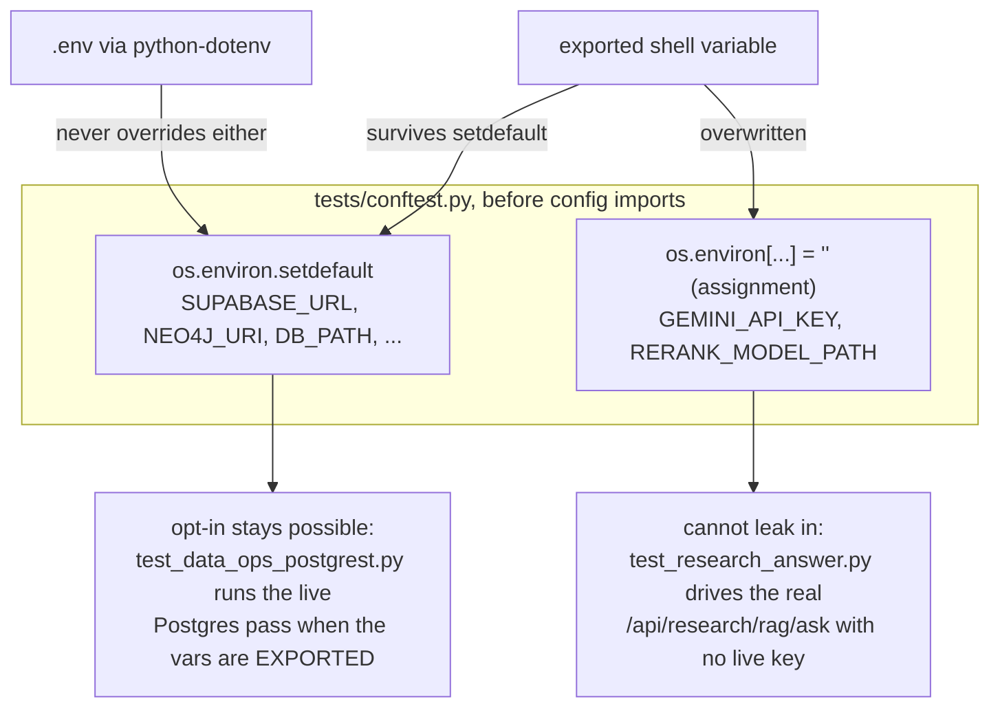
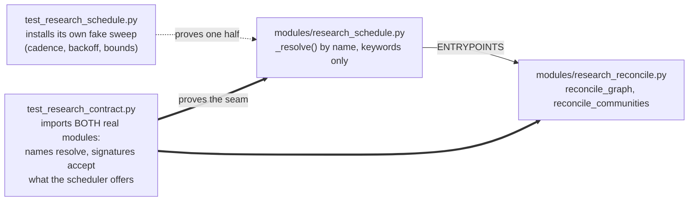
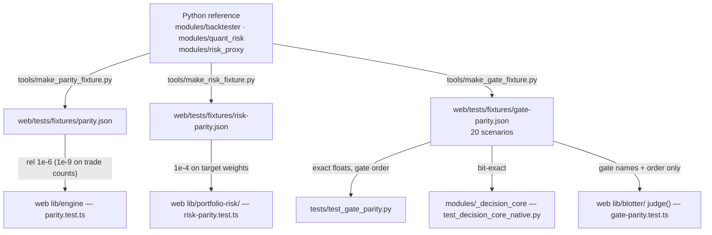

# Testing — the philosophy and the practice

*As of 22 August 2026. The per-suite catalogue lives in
[`Part2_Infrastructure/README.md` §10](../../Part2_Infrastructure/README.md#10-testing);
this document is the argument — why the suites are shaped the way they are, and
the habits that keep them honest. The four facts that cost an hour each are in
[`CLAUDE.md`](../../CLAUDE.md); nothing here repeats them at length.*

---

## The counts, and why they are generated

Three suites, three runners, one committed record:
[`web/lib/test-counts.generated.ts`](../../Part2_Infrastructure/web/lib/test-counts.generated.ts)
holds what each runner printed when it was last regenerated on 2026-08-22 —
**gateway 2,037 collected (2,036 passed, 1 skipped)**, **web 4,008 tests across
871 suites**, **service 14** — and its own header explains why it exists: the
counts were once three hand-copied integers in a component, and they drifted
three separate times, the last time inside a single afternoon.

**That record is behind the tree as this is written, and the gap is worth more
than a corrected number.** Three changes landed after the last refresh — the
Remediation pane split, the numerics custody chain and the Developer diagram
work, each with its own new suites — and `npm test` now prints **4,124 tests
across 899 suites: 4,122 passed, 0 failed, 2 skipped** (measured 2026-08-22,
`node --import tsx --test tests/*.test.ts`, 279 files in `web/tests/`). So the
committed web line reads 4,008 and the runner reads 4,124.

Nothing is broken, and nothing here should be patched to paper over it. The
generated file is a **measurement with a date**, not a contract, and it goes
stale by design the moment a suite is added — which is exactly why the check
lives outside it. What follows from the gap is concrete and belongs in a
release note rather than a shrug: CI's "Committed test counts match the suite"
step (`scripts/check-test-counts.mjs web`) compares the two integers and exits
1, so **this tree fails that step until somebody runs
`npm run counts:refresh -- --suite=web` and commits the regenerated module**.
The refresh is the fix. Editing either number by hand is not — the file says so
in its first line, and hand-editing it is the original defect the generator was
written to end.

**The gateway figure has a condition attached, and it is not a discrepancy.**
That run had the cross-encoder weights seeded on disk. The same tree in CI,
which has none, prints **2,028 passed and 2 skipped** — seven fewer collected,
eight fewer passed, one more skip. Both numbers are correct. The whole
difference is one opt-in: `tests/test_research_rerank_real.py` collects and
passes its eight cases only when `RERANK_TEST_MODEL_PATH` points at real
weights, and skips with its reason printed otherwise. A document that picked one
of the two would be wrong for half its readers, so this one states the pair and
the condition — and it is the sharpest possible illustration of the section
below: the pass count moved by eight without anything being fixed or broken.

The web total has a property worth naming: **it cannot be asserted from inside
the suite**, because a test that checks the count changes the count. So the
figure is generated (`npm run counts:refresh`), and CI checks it from *outside*
the suite — `web/scripts/check-test-counts.mjs` compares the runner's own
summary line against the committed figure. The rejected alternative was pinning
it the way the OpenAPI digest is pinned; the refresh script's header names why
that cannot work here. The value is a measurement with a date, not a contract.

The same discipline applies to prose. README §10 opens by counting its suites
with `ls`, not memory — and its figures have still drifted (it describes 38
suite files as of 2026-08-17; `ls tests/test_*.py | wc -l` answers **130**
today, and this document itself said 102 until 2026-08-22).
That drift is the argument, not an embarrassment: **never quote a count from a
document, including this one**. Run the suite, or read the generated file.

## Network-free by construction

Every suite — gateway, web, service — runs offline with no keys, on any
machine, and this is arranged rather than hoped for.
[`tests/conftest.py`](../../Part2_Infrastructure/tests/conftest.py) sets the
environment *before* `config` is imported, precisely so it wins over a local
`.env`: python-dotenv does not override variables that already exist, so a
developer's deployment file cannot decide whether the suite passes.

The interesting part is *which* mechanism each variable gets, because the two
mechanisms encode two different policies:



- **`setdefault` is a policy of consent.** `SUPABASE_URL` and
  `SUPABASE_SERVICE_ROLE_KEY` are blanked only if absent, because
  `tests/test_data_ops_postgrest.py` is a documented opt-in: exporting the
  variables for a run is a choice somebody made, rather than one a deployment
  file made for them. `NEO4J_URI`/`NEO4J_PASSWORD` are blanked the same way —
  without it, `research_reconcile.run_reconcile` builds its corpus client from
  `settings`, *reaches a live Supabase*, reports `reachable: True`, and the test
  that exists to distinguish "could not sweep" from "nothing to sweep" fails
  while the suite quietly makes a network call. The rejected alternative —
  patching inside that one test — fixes the assertion and leaves every other
  suite reading a developer's live corpus, which is the condition, not the
  symptom.
- **Assignment is a policy of refusal, and the difference is the whole claim.**
  `GEMINI_API_KEY` is *assigned* `""`, not `setdefault`-ed, because `setdefault`
  only wins over a `.env` — an **exported** variable is already in `os.environ`,
  survives untouched, and reaches `settings.gemini_api_key`.
  `tests/test_research_answer.py` drives the real `/api/research/rag/ask` route
  and patches nothing; it relies on this one line. With `setdefault`, a shell
  that exports a real key would spend a live model call per test while the file
  said that could not happen — the conftest records that this was *measured*,
  not deduced. Nothing legitimate is lost: no test calls the extra for real (the
  generation seam installs a fake provider at `research_generate._sdk`, which
  ignores the environment). `RERANK_MODEL_PATH` goes the same way, so a seeded
  fastembed cache cannot make "no model downloaded" tests load ~110M parameters
  off disk.

**The trap on the other side of that mechanism, and it costs an hour every time.**
`REQUIRE_AUTH` is a `setdefault` — the *consent* column above — and
`Part2_Infrastructure/.env` sets it. Sourcing that file the obvious way exports
it:

```bash
set -a && . ./.env       # ← never do this before a test run
```

`setdefault` cannot override an exported variable, so the app comes up requiring
auth and **about eighty tests fail with 401**. Nothing is broken; the shell
decided the suite's policy. Pass one variable per run instead —
`SUPABASE_URL=… SUPABASE_SERVICE_ROLE_KEY=… venv/bin/python -m pytest tests/test_data_ops_postgrest.py`
— which is also the shape the two opt-in passes want.

**One variable does not yet get the refusal treatment, and it should.**
`RESEARCH_IMAGE_MODEL_PATH` — the CLIP pair behind the image retrieval arm — is
neither assigned nor `setdefault`-ed in the conftest. A developer who has seeded
that ~0.6 GB directory and exported the path can have unrelated suites load it
through `search`, which is precisely the condition `RERANK_MODEL_PATH`'s
assignment exists to prevent. `tools/bench_image_retrieval.py`'s own suite blanks
it in an autouse fixture, so that file is safe either way; the conftest line is
owed and is recorded in [`PLAN.md` §2.11](../planning/PLAN.md).

## Reading the skips

The skip line is a report, not noise. On Python 3.12 with the native core
built, **either one or two skips is correct**, and which of the two you should
see is decided by what you have opted into rather than by the tree's health:

| Skip | Why it fires | When it does not |
|---|---|---|
| `tests/test_data_ops_postgrest.py` | no `SUPABASE_URL` / `SUPABASE_SERVICE_ROLE_KEY` in the environment, so the Postgres backend was *not* exercised | export both — one variable per command, see the trap above — and its live pass runs **eleven tests green** against a real Supabase project |
| `tests/test_research_rerank_real.py` | `RERANK_TEST_MODEL_PATH` unset, so no cross-encoder weights were offered and the real ONNX path was *not* exercised | seed with `python tools/bench_rerank.py --seed --model-path DIR` (1.05 GiB) and it runs **eight tests green** against the real cross-encoder |

So a bare laptop and CI both read 2,028 passed with two skips; a machine with the
weights seeded reads 2,036 passed with one. **Neither is "the" healthy number** —
what is healthy is that each skip *says what it did not exercise*, which is the
house habit of reporting absence applied to the suite itself.

- **This section has been wrong twice, in opposite directions**, and that is the
  argument for reading rather than counting. It said "exactly one skipped, and a
  second skip is the alarm" until the opt-in re-ranker test made two correct; it
  then said "exactly two" until those weights were seeded locally and one became
  correct again. The count is not the signal.
- **An UNEXPECTED skip is a diagnosis**: on Python 3.14, `tests/test_backtester.py`
  skips ("vectorbt not installed", because numba has no 3.14 wheel) and the
  summary still reads green, one engine lighter. That is the alarm at any count.
- **A skip that disappears deserves the same attention.**
  `test_data_ops_postgrest.py` going quiet means Supabase credentials reached the
  test environment — quite possibly by the `set -a` route described above.
- **A missing native core is a failure, never a skip.**
  `tests/test_decision_core_native.py` treats an unimportable
  `modules/_decision_core` as a red build unless `DECISION_CORE=python` was set
  on purpose — a quiet fall-back to Python is exactly what CI must catch.
- Run with `-rs` (`venv/bin/python -m pytest -rs`) to print each skip's stated
  reason; `pytest.ini` defaults to `-q --tb=short`, which hides them.

### The web suite skips two, and they mean something different

`npm test` prints `skipped 2`, and neither is an opt-in. Both are `it.skip`
with a paragraph above them, and both exist for the same reason: **the
assertion is correct and the fix is in a file the sweep that found it was not
allowed to edit.** They are cross-ownership debts written as a failing test
that has been switched off rather than as a comment someone might not find.

| Skipped test | What it asserts, and what it is waiting for |
|---|---|
| `data-stability.test.ts` — "lib/use-data-work-queue routes its source decision through the machine" | The Work Queue hook promotes back to "gateway" on **one** successful load, where every other source decision on the desk waits for `PROMOTION_STREAK`. A gateway answering every other 60 s poll therefore flips the pill, the scope paragraph and the Persistence tile once a minute — the twitch `DeskSourceMachine` exists to stop. The same paragraph records a second finding: `reload` never rejects, so the hook's configured `maxBackoffMs: 300_000` is unreachable and an unreachable gateway is re-asked at full cadence for ever. Both need `lib/use-data-work-queue.ts`, shared wiring. |
| `risk-stability.test.ts` — "is enforced where the handoff executes, not only claimed in the banner" | `BookChrome`'s stale banner promises "Execution handoffs are disabled until the gateway reconnects". `WorkingOrders` keeps that promise; `ExecutionHandoff` — the component behind the Risk tab's Flatten and Halt — takes no staleness input at all, fetching its gateway guard once on mount, so the fire button stays armed under a banner saying it is not. The server still refuses, so **nothing executes on a stale book**: the defect is the unkept promise, not a live risk path. The fix is a `stale` prop threaded from three call sites, two of them Portfolio-owned. |

This is the honest shape for a defect found across an ownership line, and it is
worth defending as a practice. The alternatives are both worse: deleting the
test loses the finding entirely, and asserting it anyway leaves a red suite
that trains everyone to ignore red. A skip with the fix written out is a
finding that survives, names its own blocker, and turns green the day the
blocker moves — the same doctrine as the `OVER_CEILING` ledger, applied to a
defect instead of a line count. What it must never become is a parking space:
each of these names the file that closes it, so "unskip when it lands" is a
checkable instruction rather than a hope.

## The guard suites: `summarised-*` and `disclosure-*`

Sixteen web suites — one `summarised-` and one `disclosure-` file per tab —
exist because copy edits have a failure mode no diff review catches: a
shortened sentence that reads fluently and no longer carries a number, a
negation, or the reason a measurement is missing.
`summarised-overview.test.ts` names the commit it exists because of
(`8d091a3`, "Cut 610 words from the frontend, then put 16 facts back": four of
six areas swept failed a fact-loss verifier).

Each rewrite is pinned **in both directions**, because either direction alone
is a test that passes on a file where nothing happened:

1. the **new wording is present**;
2. the **old wording is gone** — otherwise the rewrite could be pasted in
   *beside* the sentence it was meant to replace and the test would still pass;
3. every **fact token** the original carried — numbers, units, named entities,
   negations, qualifiers — is still somewhere in the file, enumerated one by
   one before the rewrite was written.

The `disclosure-*` files hold the complementary line: a disclosure sweep may
*fold* a caveat behind `<details>`, byte for byte, but may not *delete* it —
two operations that look identical in a diff and are opposites in the product.
They assert survival for every sentence, and visibility for the subset that may
never be folded at all: empty states, null explanations, safety statements, the
figures a reader acts on. Both families ratchet the tab's rendered word count
(down freely, never back up) and both refuse to let the count be the only
watcher, for the reason `summarised-overview.test.ts` states in its header: a
word count improves whether a sentence was tightened or amputated.

### The cost these suites charge, and why it is still worth paying

A sentence pinned byte for byte is also a sentence **frozen with whatever is
wrong in it**, and that bill comes due whenever a copy sweep finds a real
defect. The current example, found on 2026-08-22 and left in place deliberately:
`components/DataConsole.tsx:361` advertises the Reliability tab as "Breaker
timelines, latency **SLOs**, failure drills and remediation controls." No SLO
exists anywhere in the tree — the rail is labelled "Attention & SLIs"
(`lib/sections.ts`), `ReliabilityConsole` draws a latency p99 with a tone rule
and a sample floor (an indicator, not an objective), `deriveTrustSlis` says in
its own reasoning that "no SLA target is defined anywhere", and
`lib/data-work-queue.ts:99` seeds "Define an SLO for cross-source spread" as
**open** work. One letter is wrong, and the same string is a `MUST_STAY` needle
in `tests/disclosure-data.test.ts:241`.

The correct move is not to edit the needle alone — that is editing a guard to
match the thing it guards, which is how a suite stops guarding. **Copy and
needle move together, in one commit, by whoever owns both.** Until then the
defect is written down here rather than silently tolerated, which is the same
doctrine the suites themselves enforce: a gap is named, not rounded off.

A second, smaller instance of the same cost, recorded for the next sweep rather
than acted on: `RoleCards`' five status lines read "…, … and …" four times and
"Circuit breakers, latency percentiles **&** incident triage" once, and that
string is pinned in `summarised-overview.test.ts`'s FACTS list. A one-character
inconsistency is not worth editing another suite's fact list to fix, and the
argument for leaving it is exactly the one that suite's own header records.

## Seams versus stand-ins: the `research_schedule` scar

The suite's sharpest lesson is recorded in the docstring of
[`tests/test_research_contract.py`](../../Part2_Infrastructure/tests/test_research_contract.py).
Two modules were written in parallel — `modules/research_schedule.py` (when a
sweep runs) and `modules/research_reconcile.py` (what a sweep does) — and they
did not meet: the scheduler resolved an entry point by name and called it with
filtered keywords; the sweep exported different names and took a positional
dict. Resolution failed, reconciliation never ran, **and the full suite stayed
green** — because `tests/test_research_schedule.py` monkeypatches
`modules.research_reconcile` with a stand-in whose members the test itself
chooses. The defect, named precisely: not that the modules disagreed, but that
*both sides tested against a fiction of the other*. A mocked collaborator
cannot fail a contract.



The resolution is not "never mock". `test_research_schedule.py` keeps its
stand-ins — cadence, backoff and boundedness are untestable by waiting, and the
module under test may legitimately outlive its sibling. What was added is a
suite whose only job is the seam: every scheduled scope must resolve to a real
callable on the real module, and `inspect.signature` must show the resolved
entry point accepts exactly what the scheduler offers — because renaming alone
would not have fixed the original break. The same doctrine governs
`tests/research_seam.py`: everything faked there is the outside world (the
corpus, the ONNX cross-encoder, the Gemini SDK), at exactly the boundaries
those modules document as their own test seams, so the real fallback, real
fences and real prompt run. Faking one step higher would prove nothing, which
is the whole argument of the contract file.

### The same doctrine, applied to the newer research suites

The research plane grew a batch of suites written under the rule above — fake
the outside world at the boundary the module documents, and nothing else. Four
are worth naming because each one had to resist an easier test that would have
proved less:

- **The ingest drain** (`tests/test_research_ingest_drain.py`) runs a real
  `ResearchRag`, a real queue, a real drain, the real `deliver()` and the real
  `Backoff`; only the corpus is faked, at the HTTP boundary. The retry curve is
  shortened by moving the delivery module's own constants, **not** by injecting
  a sleeper — an injected clock would have tested a seam that does not exist in
  production. The distinction the suite exists to hold: a 503-then-201 must
  *actually recover*, because a retry that merely delays the funeral passes any
  test that only counts attempts.
- **The execution-summary producer** (`tests/test_research_ingest_session.py`)
  seeds a real `AuditLog` on disk through the gateway's own writers
  (`record_session_rollover`, `record_order`, `record_equity_snapshot`), because
  the claim under test is precisely that the figures *already exist*. Every card
  number is checked against a hand-computed value, and the last test in the file
  is the wiring one: the backfill tool's own function rendering and storing two
  documents from that log.
- **The stage widths** (`tests/test_research_stage_widths.py`) are measured **at
  the corpus** on the real path — the fake corpus records the width it was asked
  for — rather than asserted against the arithmetic that produced them. An
  assertion on `wide(20) == 60` alone would survive the width never reaching the
  RPC, which is the defect that made this change necessary.
- **The auth matrix** (`tests/test_research_security_auth.py`) reads its route
  list from `main.app.openapi()`, so a research route nobody wrote a case for
  fails the suite. Walking `app.routes` was the rejected reader: this FastAPI
  version wraps included routers in objects whose `path` is `None`, so that walk
  returns an empty set and passes every comparison made against it — a guard
  that cannot fail, which is the tautology the mutation section below exists to
  catch.

Two constraints these suites work under, both load-bearing and neither
negotiable: **the real re-ranker weights never run in the default suite** (they
would need a download, so `RERANK_MODEL_PATH` is blanked and the ONNX path is
exercised through a fake cross-encoder at the import seam), and **the `/ask`
spend bound is inert without `GEMINI_API_KEY`** — which is what stops a cap
written for a deployment that spends from rate-limiting an offline suite that
cannot. The first is a statement about the default run, not about the model
being untestable here: seed the weights and the opt-in file exercises the real
cross-encoder, as the skips table above says.

## Mutation testing, as practised here

There is no mutation-testing framework in the tree, and that is deliberate: a
mutmut/Stryker run over three runtimes is a CI budget this project spends on
parity fixtures instead. What is practised is manual and targeted —
**break, run, revert**:

1. before trusting a guard test, break the specific thing it guards (flip a
   comparison, drop a seed, delete the line);
2. run the suite and watch it go **red** — a guard that stays green just failed
   its own audit;
3. revert, and verify the restore byte for byte (an `md5` of the file before
   the mutation and after the revert; "it looks the same" is how a stray edit
   ships inside a verification exercise).

The tree records what this practice catches. The docstring of
`tests/test_research_communities.py::test_the_determinism_fixture_is_one_the_seed_can_actually_change`
is the canonical scar: the Louvain determinism test originally asserted over
`TRIANGLES` — two disjoint triangles, a graph with exactly one sensible
partition that every seed finds — so replacing `seed=seed` with a random
integer left the whole suite green. **A determinism test on an unambiguous
input proves nothing.** The fix was a fixture the seed can actually move
(`AMBIGUOUS`: twelve triangles in a ring, Louvain's resolution-limit case —
measured at seventeen distinct partitions across forty seeds), plus a second
test that guards the guard: if a future edit shrinks the fixture back to
something unambiguous, the suite fails *there*, with a message saying why,
rather than silently disarming its neighbour. That is the mutation lesson made
permanent — where a break-run-revert found a tautology, the tree keeps a test
that re-runs the audit for ever.

## Parity fixtures: one reference, three runtimes

The maths exists twice because neither runtime can call the other — Python for
the gateway and the Telegram companion, TypeScript for the browser — and the
pre-trade arithmetic a third time in C++
(`native/decision_core/decision_core.cpp`). Python is the reference; committed
fixtures pin the others to it. Change a formula on one side and the other side
fails: that is the design, so **regenerate the fixture deliberately, never
loosen the tolerance**.



Each edge's standard is chosen, not defaulted:

- **Python ↔ TypeScript engine** (`parity.test.ts`): real Binance bars replayed
  through `lib/engine`, compared with a relative-closeness helper — `1e-6`
  relative on the return statistics, `1e-9` on quantities that count things
  (exposure, turnover, win rate), with an absolute floor so near-zero values do
  not blow up. Floating point across two languages earns a tolerance; nothing
  else does.
- **Python ↔ TypeScript risk** (`risk-parity.test.ts`): `1e-4` on target
  weights, because the failure mode is the worst kind — a trader reads one VaR
  on their phone and a different one on the screen, and neither is flagged as
  suspect.
- **Python ↔ C++** (`test_gate_parity.py` + `test_decision_core_native.py`):
  **bit-exact**, no tolerance. Both engines must decide all twenty
  `gate-parity.json` scenarios with the same accept/reject, the same gate
  order, the same observed and limit floats — down to `depth_usd`'s
  Neumaier-compensated sum and the cross-venue price ties whose fold order
  decides the last bit of `slippage_bps`. A break in either suite is a real
  parity failure, never a tolerance to loosen.
- **The web's `gate-parity.test.ts` deliberately asserts less**: gate names and
  order only, because the browser sandbox has no ladder and synthesises its
  slippage — asserting its numbers against the gateway's would be a looser test
  wearing a stricter name. The header says so, which is the house way of
  narrowing scope.
- Two structural cousins: `venues-parity.test.ts` reads *both sides' source* —
  the `lib/venues/` package and every module in `modules/tca_engine/`,
  concatenated, because reading one named file went green scanning nothing when
  the module became a package — and fails unless `FILL_TOLERANCE` is the same
  literal on both sides (today `lib/venues/fill-tolerance.ts` and
  `modules/tca_engine/tolerance.py`); `mc-parity.test.ts` pins three Monte Carlo
  runtimes to one committed reference, byte for byte, by executing the worker's
  own stringified source under Node.

### Two things the risk fixture cannot currently see

Stated because the two-implementations-plus-a-fixture arrangement is only worth
its cost if its blind spots are written down. Both were found by reading the
tree on 2026-08-22, both are real, and neither is a defect in a test that is
failing — they are cases the committed fixture never presents.

**The covariance sample floors disagree, and no scenario exercises the gap.**
`web/lib/portfolio-risk/covariance.ts` requires **20** observations per symbol
*and* 20 in the common window, returning `null` otherwise;
`build_covariance` in `modules/quant_risk/covariance.py` requires **2**. A book
with short history therefore gets a typed refusal in the browser and a
two-observation covariance from the gateway — one screen saying "not enough
history" beside another quoting a number. `tools/make_risk_fixture.py` generates
220 observations (120 for the allocation scenarios) over a 60-bar window, so no
committed scenario is short enough for the floors to disagree. This is exactly
the class of divergence the arrangement exists to catch, and it is invisible to
it. Closing it means a scenario with a series between 2 and 19 observations
long, and a decision about which floor is right — not a tolerance change.

**The ES95 multiplier literals differ, and the tolerance is three orders of
magnitude looser than the gap.** `modules/quant_risk/_common.py` has
`2.0627128027825736`; `web/lib/portfolio-risk/risk.ts` has
`2.0627128054846826`. The exact double-precision value of φ(z₉₅)/0.05 is
`2.0627128075074253`, so **neither is right** and they differ from each other by
about 1.3e-9 relative. The consequence is bounded and far below cent resolution
at any book size — but `parity.test.ts` compares at `1e-6` relative, so what
keeps the two stacks agreeing here is the fixture's tolerance, not the
constants. Recorded rather than quietly corrected: picking one value is a
one-line change, and the change that makes it *stay* picked is a cross-stack
fixture assertion on the constant itself, which is a different piece of work.

## The file-size ratchet is a test

There is no ESLint here — no dependency, no config, no lint script — and ruff
has no file-length rule, so a 300–400-line convention had nothing holding it;
`app/dashboard/page.tsx` reached 2,205 lines with a single 2,000-line function
inside it. [`web/tests/file-size.test.ts`](../../Part2_Infrastructure/web/tests/file-size.test.ts)
replaces the convention with two rules: a file not on the `OVER_CEILING`
allow-list may not cross 400 lines at all, and a file already on the list may
not get *longer* — the ratchet that stops "I will split it later" becoming "it
grew while I waited". Every entry is a debt, not an exemption: the number may
go down freely and the entry is deleted when the file drops under the ceiling.
The comment log shows the ratchet closing — `page.tsx` left the list on
2026-08-21 at 304 lines, every successor under the ceiling. A flat
`assert every file < 400` was the rejected alternative: red on the day it is
written, therefore ignored. `dead-css.test.ts` has the same shape for the same
reason.

## Running the suites

`/verify` (the repo's own skill) runs everything below and reports the real
measured numbers. By hand, from `Part2_Infrastructure/`:

| Suite | Command | Prerequisites and what green means |
|---|---|---|
| Gateway (2,037 collected with weights seeded; 2,030 without) | `venv/bin/python -m pytest` (add `-rs` to see skip reasons) | venv named exactly `venv`, Python 3.12, `requirements-dev.txt`, `requirements-native.txt` and the built core (`python native/decision_core/setup.py build_ext --inplace --build-temp build/native`). Expect one skip with the cross-encoder weights seeded and two without; read the reasons, not the count — see "Reading the skips". |
| Web (4,124 / 899 suites, 2 skipped — measured 2026-08-22; the committed record still reads 4,008) | `cd web && npm test` | Node 22, `npm ci`. Runner is `node --import tsx --test tests/*.test.ts` — Node's own runner over 279 files, no Jest/Vitest, consistent with the no-new-dependencies rule. Both skips are cross-ownership debts, not opt-ins; see "The web suite skips two". |
| Web types | `cd web && npm run typecheck` | There is **no `lint` script** in `web/` — `npm run lint` fails as a missing script, not a broken linter. |
| Python lint | `venv/bin/python -m ruff check .` | Configured in `pyproject.toml`, installed by `requirements-dev.txt`. |
| OpenBB service (14) | `cd OpenBB_Service && python -m pytest` | Its own `requirements-dev.txt` (pytest 9.1.1, httpx); stateless, offline. |
| Counts contract | `cd web && npm run counts:refresh -- --suite=web`, then commit the regenerated `lib/test-counts.generated.ts` | CI's `check-test-counts.mjs` step fails when the committed figure drifts from the run it just made — **which it currently does**, 4,008 committed against 4,124 measured. `--suite=web` re-runs only the web suite and keeps the committed Python figures, which is what you want unless the gateway or service suite also moved. |

All three suites are deterministic and require no external network: market data
is disabled, the backtester falls back to its NumPy engine, and every fixture
is committed (README §10's closing paragraph, and the conftest above, are the
enforcement).

## Not built, on purpose

- **No mutation-testing framework** — the break-run-revert discipline above,
  plus guards-of-guards where it found tautologies, is the practice.
- **No ESLint, Jest, Vitest or Playwright in `web/`** — Node's built-in runner
  and hand-written structural tests (`house-rules`, `file-size`, `dead-css`)
  carry the load; adding a framework would change the argument the project
  makes about itself.
- **No DOM, and therefore no layout — every geometry claim is derived, never
  observed.** This is the largest standing limit on the web suite and it is
  easy to miss, because the suites that assert geometry read entirely
  convincing. There is no jsdom, no happy-dom and no headless browser in
  `web/`; not one test file even renders through `react-dom/server`. What the
  suite reads is **source text and stylesheet text** — `tests/globals-css.ts`
  concatenates the partials in import order so a rule is judged against the
  cascade the browser would apply, rather than against whichever partial
  declared it last.

  That reads the same rules the browser reads, which is genuinely strong for
  the class of defect it was built for: `developer-diagram-layout.test.ts`
  exists because one diagram's bracket had drifted 3.2px off the node centres
  it pointed at, and it now pins the bracket span as *arithmetic over the same
  gutter the node columns use* rather than as a remembered pixel value — a
  copied constant being how the drift happened. `accent-budget`,
  `tab-chrome-metrics`, `seg-metrics` and `forced-colors` all work this way.

  What none of them can do is **run the layout**. A rule that is present and
  correct in the cascade can still wrap, overlap or overflow at a width nobody
  tried, and no test in this tree would notice. Three surfaces landed on
  2026-08-22 whose geometry is argued rather than measured, and all three are
  named here rather than assumed fine: the mutation blast-radius map on
  Reliability → Remediation → Mutations (a hand-checked 560×266 `viewBox`, and
  a 6px vertical gap between seven store boxes that is the tightest measurement
  in it), the eight-column mutation matrix beside it (it scrolls inside its own
  `.table-wrap`, so the page must not scroll sideways — that is the property to
  check), and the numerics custody chain's two 64-character digest rows on
  Developer → API & Schema → Numerics, whose wrap point is argued from a
  ch-derived width. `grid-template-rows: subgrid`, which the Developer topology
  card now uses, is a fourth: where it is unsupported the declaration is simply
  dropped and the card falls back to a plain five-row auto grid, so the failure
  mode is the previous layout rather than a broken one.

  The fix is not a browser-driver dependency — that is the rule above, and it
  is not being traded away for this. It is that **a geometry change is walked
  by a human at ~1000px and ~1400px before it ships**, which the feature tour's
  closing paragraph already names as the manual verification pass. Written down
  because a suite that is silent about a whole class of defect will otherwise
  be read as having cleared it.
- **No coverage gate** — the suites pin behaviour and contracts, not line
  percentages; nothing in CI computes coverage.
- **CI never builds the container image** — `tests/test_container_contract.py`
  holds the committed definition to its promises by text analysis, on purpose,
  because CI is network-free.
- **The cross-encoder's real ONNX weights never run *in CI*** —
  `BAAI/bge-reranker-base` would have to be downloaded, and the network-free
  rule outranks it. What the default suite proves is the wiring, the widening
  arithmetic, the bulkhead and the grader's handling of a score; not the model's
  quality. Stated as a limit rather than dropped, because "the re-ranker is
  tested" would be the wrong sentence to leave standing — and equally, "the
  re-ranker cannot be tested" would now be wrong the other way, since the seeded
  opt-in runs eight cases against the real model.
- **The image retrieval arm's bench is not in CI either** —
  `tools/bench_image_retrieval.py` measures the CLIP arm against the description
  arm (nDCG@3, MRR, recall@3 over seven charts and nine queries) and its corpus,
  answer key, metrics and degrade paths are under test, but nothing runs it on a
  push. `.github/workflows/ci.yml` already caches weights for
  `tools/bench_rerank.py` and wants the same job here; nobody has added it.
- **No end-to-end multimodal generation test against the real model** — the two
  measured calls (20.6 s and 29.9 s, `thinking_budget=0`) were run by hand
  against the real key. The suite exercises the attachment logic, the named
  absence states and the `[chart:<id>]` fence with the SDK faked at
  `research_generate._sdk`, which is the same seam the text path uses.
- **No live Neo4j, and therefore no assertion of the exact Cypher.** The graph
  read model is exercised against a fake driver — the real module, a fake
  transport — so the queries are pinned by fragment matching only. A syntax
  error in one of them would surface as a *named fallback reason* rather than a
  red test: the safe direction, and not proof.

*Related: [`FEATURE_TOUR.md`](../product/FEATURE_TOUR.md) for what the tested system
does; [`LATENCY_BUDGET.md`](../architecture/LATENCY_BUDGET.md) for the measurement doctrine
the latency tests enforce; [`DATA_OPS_BACKEND.md`](../architecture/DATA_OPS_BACKEND.md) for
the data-ops plane the `test_data_*` suites cover.*
