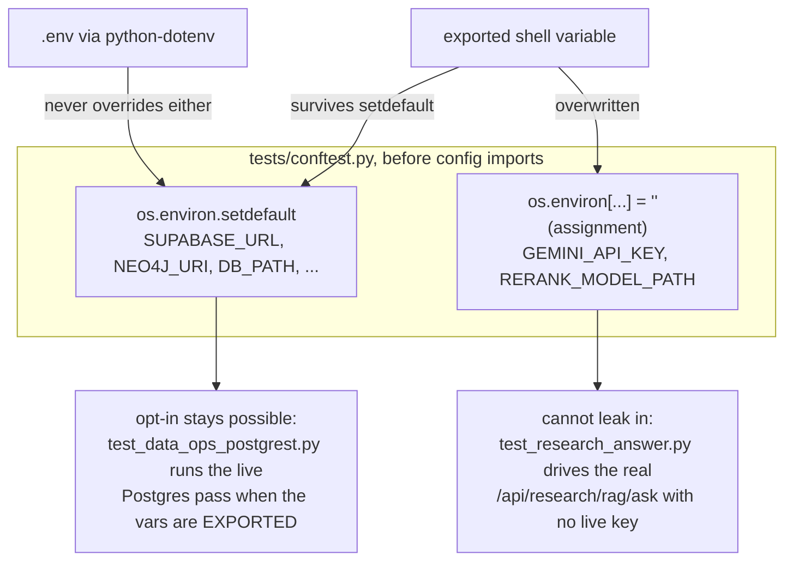
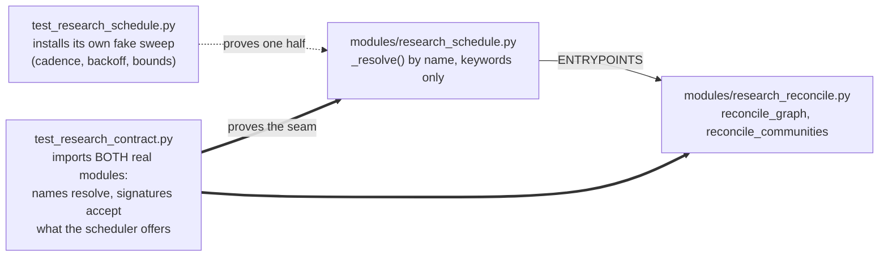
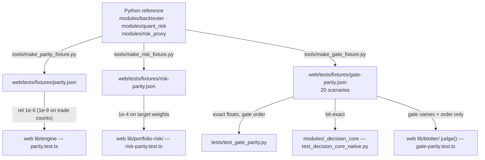

# Testing — the philosophy and the practice

*As of 22 August 2026. The per-suite catalogue lives in
[`Part2_Infrastructure/README.md` §10](../../Part2_Infrastructure/README.md#10-testing);
this document is the argument — why the suites are shaped the way they are, and
the habits that keep them honest. The four facts that cost an hour each are in
[`CLAUDE.md`](../../CLAUDE.md); nothing here repeats them at length.*

---

## The counts, and why they are generated

Three suites, three runners, one committed record:
[`web/lib/test-counts.generated.ts`](../../Part2_Infrastructure/web/lib/test-counts.generated.ts)
holds what each runner printed on 2026-08-22 — **gateway 1,718 collected (1,717
passed, 1 skipped)**, **web 3,883 tests across 838 suites**, **service 14** —
and its own header explains why it exists: the counts were once three
hand-copied integers in a component, and they drifted three separate times, the
last time inside a single afternoon.

The web total has a property worth naming: **it cannot be asserted from inside
the suite**, because a test that checks the count changes the count. So the
figure is generated (`npm run counts:refresh`), and CI checks it from *outside*
the suite — `web/scripts/check-test-counts.mjs` compares the runner's own
summary line against the committed figure. The rejected alternative was pinning
it the way the OpenAPI digest is pinned; the refresh script's header names why
that cannot work here. The value is a measurement with a date, not a contract.

The same discipline applies to prose. README §10 opens by counting its suites
with `ls`, not memory — and its figures have still drifted (it describes 38
suite files as of 2026-08-17; `ls tests/test_*.py | wc -l` answers 102 today).
That drift is the argument, not an embarrassment: **never quote a count from a
document, including this one**. Run the suite, or read the generated file.

## Network-free by construction

Every suite — gateway, web, service — runs offline with no keys, on any
machine, and this is arranged rather than hoped for.
[`tests/conftest.py`](../../Part2_Infrastructure/tests/conftest.py) sets the
environment *before* `config` is imported, precisely so it wins over a local
`.env`: python-dotenv does not override variables that already exist, so a
developer's deployment file cannot decide whether the suite passes.

The interesting part is *which* mechanism each variable gets, because the two
mechanisms encode two different policies:

- **`setdefault` is a policy of consent.** `SUPABASE_URL` and
  `SUPABASE_SERVICE_ROLE_KEY` are blanked only if absent, because
  `tests/test_data_ops_postgrest.py` is a documented opt-in: exporting the
  variables for a run is a choice somebody made, rather than one a deployment
  file made for them. `NEO4J_URI`/`NEO4J_PASSWORD` are blanked the same way —
  without it, `research_reconcile.run_reconcile` builds its corpus client from
  `settings`, *reaches a live Supabase*, reports `reachable: True`, and the test
  that exists to distinguish "could not sweep" from "nothing to sweep" fails
  while the suite quietly makes a network call. The rejected alternative —
  patching inside that one test — fixes the assertion and leaves every other
  suite reading a developer's live corpus, which is the condition, not the
  symptom.
- **Assignment is a policy of refusal, and the difference is the whole claim.**
  `GEMINI_API_KEY` is *assigned* `""`, not `setdefault`-ed, because `setdefault`
  only wins over a `.env` — an **exported** variable is already in `os.environ`,
  survives untouched, and reaches `settings.gemini_api_key`.
  `tests/test_research_answer.py` drives the real `/api/research/rag/ask` route
  and patches nothing; it relies on this one line. With `setdefault`, a shell
  that exports a real key would spend a live model call per test while the file
  said that could not happen — the conftest records that this was *measured*,
  not deduced. Nothing legitimate is lost: no test calls the extra for real (the
  generation seam installs a fake provider at `research_generate._sdk`, which
  ignores the environment). `RERANK_MODEL_PATH` goes the same way, so a seeded
  fastembed cache cannot make "no model downloaded" tests load ~110M parameters
  off disk.

## Reading the skips

The skip line is a report, not noise. On Python 3.12 with the native core
built, the gateway suite is 1,717 passed and **exactly one** skipped:
`tests/test_data_ops_postgrest.py`, whose skip reason states in full that no
`SUPABASE_URL`/`SUPABASE_SERVICE_ROLE_KEY` was in the environment, so the
Postgres backend was *not* exercised. That is the house habit of reporting
absence instead of papering over it, applied to the suite itself.

- **A second skip is a diagnosis**: on Python 3.14, `tests/test_backtester.py`
  skips ("vectorbt not installed", because numba has no 3.14 wheel) and the
  summary still reads green, one engine lighter. Count the skips, not the
  passes.
- **A missing native core is a failure, never a skip.**
  `tests/test_decision_core_native.py` treats an unimportable
  `modules/_decision_core` as a red build unless `DECISION_CORE=python` was set
  on purpose — a quiet fall-back to Python is exactly what CI must catch.
- Run with `-rs` (`venv/bin/python -m pytest -rs`) to print each skip's stated
  reason; `pytest.ini` defaults to `-q --tb=short`, which hides them.

## The guard suites: `summarised-*` and `disclosure-*`

Sixteen web suites — one `summarised-` and one `disclosure-` file per tab —
exist because copy edits have a failure mode no diff review catches: a
shortened sentence that reads fluently and no longer carries a number, a
negation, or the reason a measurement is missing.
`summarised-overview.test.ts` names the commit it exists because of
(`8d091a3`, "Cut 610 words from the frontend, then put 16 facts back": four of
six areas swept failed a fact-loss verifier).

Each rewrite is pinned **in both directions**, because either direction alone
is a test that passes on a file where nothing happened:

1. the **new wording is present**;
2. the **old wording is gone** — otherwise the rewrite could be pasted in
   *beside* the sentence it was meant to replace and the test would still pass;
3. every **fact token** the original carried — numbers, units, named entities,
   negations, qualifiers — is still somewhere in the file, enumerated one by
   one before the rewrite was written.

The `disclosure-*` files hold the complementary line: a disclosure sweep may
*fold* a caveat behind `
`, byte for byte, but may not *delete* it —
two operations that look identical in a diff and are opposites in the product.
They assert survival for every sentence, and visibility for the subset that may
never be folded at all: empty states, null explanations, safety statements, the
figures a reader acts on. Both families ratchet the tab's rendered word count
(down freely, never back up) and both refuse to let the count be the only
watcher, for the reason `summarised-overview.test.ts` states in its header: a
word count improves whether a sentence was tightened or amputated.

## Seams versus stand-ins: the `research_schedule` scar

The suite's sharpest lesson is recorded in the docstring of
[`tests/test_research_contract.py`](../../Part2_Infrastructure/tests/test_research_contract.py).
Two modules were written in parallel — `modules/research_schedule.py` (when a
sweep runs) and `modules/research_reconcile.py` (what a sweep does) — and they
did not meet: the scheduler resolved an entry point by name and called it with
filtered keywords; the sweep exported different names and took a positional
dict. Resolution failed, reconciliation never ran, **and the full suite stayed
green** — because `tests/test_research_schedule.py` monkeypatches
`modules.research_reconcile` with a stand-in whose members the test itself
chooses. The defect, named precisely: not that the modules disagreed, but that
*both sides tested against a fiction of the other*. A mocked collaborator
cannot fail a contract.

The resolution is not "never mock". `test_research_schedule.py` keeps its
stand-ins — cadence, backoff and boundedness are untestable by waiting, and the
module under test may legitimately outlive its sibling. What was added is a
suite whose only job is the seam: every scheduled scope must resolve to a real
callable on the real module, and `inspect.signature` must show the resolved
entry point accepts exactly what the scheduler offers — because renaming alone
would not have fixed the original break. The same doctrine governs
`tests/research_seam.py`: everything faked there is the outside world (the
corpus, the ONNX cross-encoder, the Gemini SDK), at exactly the boundaries
those modules document as their own test seams, so the real fallback, real
fences and real prompt run. Faking one step higher would prove nothing, which
is the whole argument of the contract file.

## Mutation testing, as practised here

There is no mutation-testing framework in the tree, and that is deliberate: a
mutmut/Stryker run over three runtimes is a CI budget this project spends on
parity fixtures instead. What is practised is manual and targeted —
**break, run, revert**:

1. before trusting a guard test, break the specific thing it guards (flip a
   comparison, drop a seed, delete the line);
2. run the suite and watch it go **red** — a guard that stays green just failed
   its own audit;
3. revert, and verify the restore byte for byte (an `md5` of the file before
   the mutation and after the revert; "it looks the same" is how a stray edit
   ships inside a verification exercise).

The tree records what this practice catches. The docstring of
`tests/test_research_communities.py::test_the_determinism_fixture_is_one_the_seed_can_actually_change`
is the canonical scar: the Louvain determinism test originally asserted over
`TRIANGLES` — two disjoint triangles, a graph with exactly one sensible
partition that every seed finds — so replacing `seed=seed` with a random
integer left the whole suite green. **A determinism test on an unambiguous
input proves nothing.** The fix was a fixture the seed can actually move
(`AMBIGUOUS`: twelve triangles in a ring, Louvain's resolution-limit case —
measured at seventeen distinct partitions across forty seeds), plus a second
test that guards the guard: if a future edit shrinks the fixture back to
something unambiguous, the suite fails *there*, with a message saying why,
rather than silently disarming its neighbour. That is the mutation lesson made
permanent — where a break-run-revert found a tautology, the tree keeps a test
that re-runs the audit for ever.

## Parity fixtures: one reference, three runtimes

The maths exists twice because neither runtime can call the other — Python for
the gateway and the Telegram companion, TypeScript for the browser — and the
pre-trade arithmetic a third time in C++
(`native/decision_core/decision_core.cpp`). Python is the reference; committed
fixtures pin the others to it. Change a formula on one side and the other side
fails: that is the design, so **regenerate the fixture deliberately, never
loosen the tolerance**.

Each edge's standard is chosen, not defaulted:

- **Python ↔ TypeScript engine** (`parity.test.ts`): real Binance bars replayed
  through `lib/engine`, compared with a relative-closeness helper — `1e-6`
  relative on the return statistics, `1e-9` on quantities that count things
  (exposure, turnover, win rate), with an absolute floor so near-zero values do
  not blow up. Floating point across two languages earns a tolerance; nothing
  else does.
- **Python ↔ TypeScript risk** (`risk-parity.test.ts`): `1e-4` on target
  weights, because the failure mode is the worst kind — a trader reads one VaR
  on their phone and a different one on the screen, and neither is flagged as
  suspect.
- **Python ↔ C++** (`test_gate_parity.py` + `test_decision_core_native.py`):
  **bit-exact**, no tolerance. Both engines must decide all twenty
  `gate-parity.json` scenarios with the same accept/reject, the same gate
  order, the same observed and limit floats — down to `depth_usd`'s
  Neumaier-compensated sum and the cross-venue price ties whose fold order
  decides the last bit of `slippage_bps`. A break in either suite is a real
  parity failure, never a tolerance to loosen.
- **The web's `gate-parity.test.ts` deliberately asserts less**: gate names and
  order only, because the browser sandbox has no ladder and synthesises its
  slippage — asserting its numbers against the gateway's would be a looser test
  wearing a stricter name. The header says so, which is the house way of
  narrowing scope.
- Two structural cousins: `venues-parity.test.ts` reads *both sides' source* —
  the `lib/venues/` package and every module in `modules/tca_engine/`,
  concatenated, because reading one named file went green scanning nothing when
  the module became a package — and fails unless `FILL_TOLERANCE` is the same
  literal on both sides (today `lib/venues/fill-tolerance.ts` and
  `modules/tca_engine/tolerance.py`); `mc-parity.test.ts` pins three Monte Carlo
  runtimes to one committed reference, byte for byte, by executing the worker's
  own stringified source under Node.

## The file-size ratchet is a test

There is no ESLint here — no dependency, no config, no lint script — and ruff
has no file-length rule, so a 300–400-line convention had nothing holding it;
`app/dashboard/page.tsx` reached 2,205 lines with a single 2,000-line function
inside it. [`web/tests/file-size.test.ts`](../../Part2_Infrastructure/web/tests/file-size.test.ts)
replaces the convention with two rules: a file not on the `OVER_CEILING`
allow-list may not cross 400 lines at all, and a file already on the list may
not get *longer* — the ratchet that stops "I will split it later" becoming "it
grew while I waited". Every entry is a debt, not an exemption: the number may
go down freely and the entry is deleted when the file drops under the ceiling.
The comment log shows the ratchet closing — `page.tsx` left the list on
2026-08-21 at 304 lines, every successor under the ceiling. A flat
`assert every file < 400` was the rejected alternative: red on the day it is
written, therefore ignored. `dead-css.test.ts` has the same shape for the same
reason.

## Running the suites

`/verify` (the repo's own skill) runs everything below and reports the real
measured numbers. By hand, from `Part2_Infrastructure/`:

| Suite | Command | Prerequisites and what green means |
|---|---|---|
| Gateway (1,718) | `venv/bin/python -m pytest` (add `-rs` to see skip reasons) | venv named exactly `venv`, Python 3.12, `requirements-dev.txt`, `requirements-native.txt` and the built core (`python native/decision_core/setup.py build_ext --inplace --build-temp build/native`). Expect exactly one skip; see "Reading the skips". |
| Web (3,883 / 838 suites) | `cd web && npm test` | Node 22, `npm ci`. Runner is `node --import tsx --test tests/*.test.ts` — Node's own runner, no Jest/Vitest, consistent with the no-new-dependencies rule. |
| Web types | `cd web && npm run typecheck` | There is **no `lint` script** in `web/` — `npm run lint` fails as a missing script, not a broken linter. |
| Python lint | `venv/bin/python -m ruff check .` | Configured in `pyproject.toml`, installed by `requirements-dev.txt`. |
| OpenBB service (14) | `cd OpenBB_Service && python -m pytest` | Its own `requirements-dev.txt` (pytest 9.1.1, httpx); stateless, offline. |
| Counts contract | `cd web && npm run counts:refresh`, then commit the regenerated `lib/test-counts.generated.ts` | CI's `check-test-counts.mjs` step fails when the committed figure drifts from the run it just made. |

All three suites are deterministic and require no external network: market data
is disabled, the backtester falls back to its NumPy engine, and every fixture
is committed (README §10's closing paragraph, and the conftest above, are the
enforcement).

## Not built, on purpose

- **No mutation-testing framework** — the break-run-revert discipline above,
  plus guards-of-guards where it found tautologies, is the practice.
- **No ESLint, Jest, Vitest or Playwright in `web/`** — Node's built-in runner
  and hand-written structural tests (`house-rules`, `file-size`, `dead-css`)
  carry the load; adding a framework would change the argument the project
  makes about itself.
- **No coverage gate** — the suites pin behaviour and contracts, not line
  percentages; nothing in CI computes coverage.
- **CI never builds the container image** — `tests/test_container_contract.py`
  holds the committed definition to its promises by text analysis, on purpose,
  because CI is network-free.

*Related: [`FEATURE_TOUR.md`](../product/FEATURE_TOUR.md) for what the tested system
does; [`LATENCY_BUDGET.md`](../architecture/LATENCY_BUDGET.md) for the measurement doctrine
the latency tests enforce; [`DATA_OPS_BACKEND.md`](../architecture/DATA_OPS_BACKEND.md) for
the data-ops plane the `test_data_*` suites cover.*
